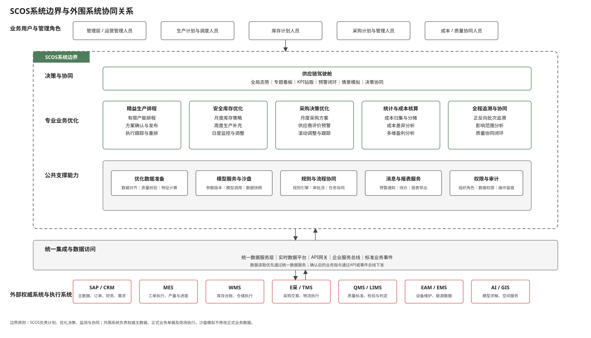
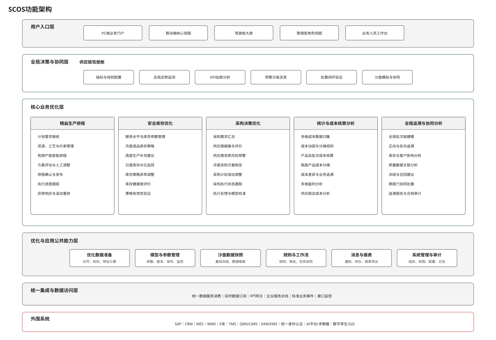

# SCOS系统边界与功能架构

> 编制依据：《SCOS全局供应链优化与协同系统技术要求》、采购优化模块技术方案、库存优化模块技术方案、驾驶舱模块技术方案及已完成的关键业务流程。本文件参照《中粮太仓项目研发模块蓝图方案》和《中粮太仓项目车辆物流管理模块蓝图方案》的编制结构，分别说明SCOS与外围系统的职责边界，以及SCOS内部功能分层。功能及接口编号为建议编码，最终以项目统一编码规则为准。

## 2.2 系统边界与分工

SCOS定位为供应链计划、优化决策与协同管理平台。SCOS通过统一数据服务层和实时数据平台获取业务数据，形成生产排程、库存策略、采购方案、成本分析、追溯分析、供应链态势及协同建议。SAP、MES、WMS、E采、TMS、QMS/LIMS等外围系统继续承担各自领域的权威主数据、正式业务单据和现场执行。SCOS生成的优化建议经业务确认或审批后，通过标准接口或业务事件下发，并接收执行结果形成闭环。

| 系统 | SCOS职责 | 外部系统职责 | 协同方式 |
|---|---|---|---|
| 统一数据服务层 | 调用标准API获取主数据、交易数据及聚合分析数据；提出优化就绪数据需求；不建设重复的数据采集与数据中台能力 | 汇聚各源系统数据，执行统一数据模型、主数据和数据服务治理，提供标准、完整、一致的数据服务 | 统一数据服务层 → SCOS：标准API；原则上作为SCOS批量及聚合业务数据的统一入口 |
| 实时数据平台 | 订阅储罐液位、产线状态、库存变化、车辆位置等实时指标与事件，用于滚动优化、态势监测和预警 | 汇聚并发布生产、仓储、物流等实时状态和业务事件，保障实时数据时效性 | 实时数据平台 → SCOS：消息订阅、实时查询；SCOS不直接控制PLC/DCS |
| SAP | 使用物料、供应商、客户、订单、采购、库存、价格、成本及财务数据；向SAP提供经确认的计划或结果数据 | 维护企业级权威主数据、正式业务单据、财务数据和会计结果 | SAP ↔ SCOS：通过统一数据服务层、API或中间件；财务及价格数据以SAP为权威来源 |
| CRM | 接收客户需求、销售计划、需求变化、客户订单及投诉等信息，作为计划优化输入 | 维护客户、商机、销售预测、客户需求和客户服务过程 | CRM → SCOS：企业服务总线事件及标准API；SCOS不承担客户关系管理 |
| MES | 形成并发布经确认的生产排程，接收生产工单实际开始/结束、产量、合格率、设备状态等执行反馈 | 将已确认计划转化为现场生产工单并组织执行，记录工序、产量、工时、设备及现场状态 | SCOS → MES：计划指令或业务事件；MES → SCOS：实时进度和执行结果；SCOS负责计划优化，MES负责生产执行 |
| WMS | 使用实时库存、库龄、批次、仓储能力等数据；输出库存策略、生产补充建议、库存预警及追溯冻结建议 | 维护库存实物台账，执行入库、出库、移库、盘点、批次冻结和仓储作业 | WMS → SCOS：库存与批次状态；SCOS → WMS：经确认的建议或标准指令；SCOS不直接修改库存实物账 |
| E采/采购执行系统 | 输出经审批的采购方案、供应商分配、数量和建议到货安排；跟踪采购执行状态和偏差 | 承担招采、合同、正式采购订单及采购执行过程 | SCOS → E采：经确认采购执行依据；E采 → SCOS：订单、合同、发货和执行状态；正式交易由E采/SAP承载 |
| TMS/物流系统 | 使用运输进度、预计到达时间和运输成本；在驾驶舱展示物流态势并识别对计划的影响 | 承担运输委托、车辆调度、预约、装卸、在途跟踪和物流执行 | TMS → SCOS：运输状态、时效、成本及异常；SCOS暂不替代TMS进行车辆路径和现场物流调度 |
| QMS | 使用质量标准、质量事件、检验判定和供应商质量结果，作为采购评价、排程约束、预警和追溯依据 | 维护质量标准，承担质量检验判定、质量问题处置和质量管理 | QMS → SCOS：质量标准、判定和质量事件；SCOS → QMS：追溯协同或待处理事项；质量判定以QMS为准 |
| LIMS | 发起或关联必要的检验需求，使用实验室检验结果支持采购、生产和追溯分析 | 承担实验室检验执行、仪器数据采集和检验结果管理 | LIMS ↔ SCOS：标准API或事件；SCOS不替代实验室检测过程 |
| EAM | 获取设备可用性、维护计划和故障事件，并将其作为排程约束和异常重排触发条件 | 维护设备台账、检维修计划并组织设备维护执行 | EAM → SCOS：设备日历、维护计划和故障事件；SCOS不承担设备维修管理 |
| EMS | 获取能耗、能源价格和能效指标，用于排程成本、成本核算和驾驶舱环保/能源专题分析 | 采集并维护能源消耗、能源介质和能效数据 | EMS → SCOS：能源数据API或实时事件；SCOS负责优化使用和分析，不负责能源采集 |
| 统一身份认证 | 对接统一登录，基于同步的用户、组织和角色配置SCOS功能及数据权限 | 提供企业统一账号、身份认证、组织和单点登录服务 | 统一身份认证 → SCOS：身份与组织信息；SCOS维护系统内功能、操作及行列级数据权限 |
| AI平台/数学优化求解器 | 准备模型输入、设置业务参数、发起计算、校验和解释结果，管理计算记录及业务采纳过程 | 提供优化求解、预测、智能分析等模型服务及计算资源 | SCOS ↔ 模型服务：同步/异步模型API；业务人员确认结果，模型不得直接修改正式业务数据 |
| 数字孪生/GIS/地图服务 | 提供供应链业务节点、业务状态和态势数据，调用空间展示或仿真能力 | 提供空间元数据、底图、定位、三维展示和仿真服务 | 双向API或实时态势流；SCOS不重复建设空间和三维基础平台 |

### 2.2.1 系统边界控制原则

- SCOS负责计划、优化决策、监测分析和跨模块协同；外围系统负责权威主数据、正式业务单据与现场执行。
- 优化所需批量及聚合数据优先通过统一数据服务层获取，实时状态通过实时数据平台订阅；确需直连时须单独论证并纳入API治理。
- 生产排程、库存策略和采购方案属于SCOS的决策结果；生产工单、库存实物账、采购订单、运输任务和质量判定仍由相应执行系统承载。
- 优化建议须经业务人员确认或审批后才能形成正式下发指令，不由模型自动采纳。
- 外围系统须回传执行状态和实际结果，SCOS据此进行态势监测、偏差分析、滚动调整和模型校准。
- 驾驶舱负责统一展示、预警和决策协同，不重复实现采购、库存、排程、成本或追溯模块的专业业务逻辑。
- 情景模拟在隔离的数据快照中运行，不修改正式业务数据；采纳后只发起相关业务模块的正式调整流程。
- SQL Server、MySQL、IIS、缓存和对象存储等技术组件属于技术架构和部署架构，不纳入业务功能架构。

## 2.3 功能架构

SCOS功能架构按照“用户入口—全局决策与协同—核心业务优化—公共支撑—统一集成”的方式分层。各专业模块保持高内聚、松耦合，通过统一数据服务和标准业务事件完成业务协同。

| 一级功能模块 | 二级功能模块 | 功能编号 | 功能描述 | 输入数据来源 | 输出结果去向 | 协同系统 |
|---|---|---|---|---|---|---|
| 供应链驾驶舱 | 指标口径与预警规则 | F-ZLTC-SCOS-JSC-001 | 配置指标公式、数据来源、更新频率、健康度阈值、预警级别及可见范围，经过校验、评审和审批后发布 | 业务管理要求、数据字典、指标需求 | 已发布指标、阈值和预警规则 | 统一数据服务层、各业务模块 |
| 供应链驾驶舱 | 角色视图与专题看板 | F-ZLTC-SCOS-JSC-002 | 按角色配置全局总览及产销、储运、环保、资金等专题视图，控制敏感数据展示范围 | 已发布指标、组织角色、权限规则 | PC端、移动端和大屏角色视图 | 统一身份认证 |
| 供应链驾驶舱 | 全局供应链态势监测 | F-ZLTC-SCOS-JSC-003 | 汇总核心KPI、地图节点状态及跨模块结果，形成全局供应链健康状态 | 实时数据、业务模块结果、指标规则 | 全局总览、专题态势和报告 | 实时数据平台、数字孪生/GIS、各业务模块 |
| 供应链驾驶舱 | KPI钻取与根因分析 | F-ZLTC-SCOS-JSC-004 | 支持从KPI总览钻取到专题、明细、源单据及专业模块分析结果 | 异常KPI、预警事件、业务明细 | 根因结论、影响范围和处理建议 | SAP、MES、WMS及各专业模块 |
| 供应链驾驶舱 | 预警事件接入与派发 | F-ZLTC-SCOS-JSC-005 | 聚合业务预警和指标越界事件，完成去重、分级、影响识别和责任人派发 | 指标越界、业务模块预警 | 分级预警和待处置任务 | 各业务模块、消息服务 |
| 供应链驾驶舱 | 预警处置闭环 | F-ZLTC-SCOS-JSC-006 | 跟踪处置进度、超时升级及指标恢复情况，经业务验证后关闭预警 | 已派发预警、处置反馈、最新指标 | 闭环记录、处置时长和恢复结果 | 采购、库存、排程、追溯等模块 |
| 供应链驾驶舱 | 情景模拟与影响评估 | F-ZLTC-SCOS-JSC-007 | 在隔离快照中调用专业模型，比较基线与情景对成本、交付、服务及风险的影响 | 当前基线、模拟参数、模型服务 | 情景对比、风险提示和备选方案 | 模型服务、采购、库存、排程、成本模块 |
| 供应链驾驶舱 | 模拟方案采纳与协同 | F-ZLTC-SCOS-JSC-008 | 记录管理决策，将采纳建议转化为相关专业模块的正式调整任务并跟踪状态 | 已审阅模拟结果、采纳结论 | 决策记录和业务协同任务 | 各专业业务模块 |
| 精益生产排程 | 计划需求接收 | F-ZLTC-SCOS-SCPD-001 | 接收销售需求、订单、库存补充建议和采购供应信息，形成排程需求范围 | CRM/SAP、库存优化、采购优化 | 待排产需求和交期要求 | CRM、SAP、库存优化、采购优化 |
| 精益生产排程 | 资源、工艺与约束管理 | F-ZLTC-SCOS-SCPD-002 | 配置产线、设备、工序、切换、物料、班组、维护日历及硬软约束 | MES、EAM、工艺及业务规则 | 有效资源模型和约束版本 | MES、EAM、QMS |
| 精益生产排程 | 有限产能智能排程 | F-ZLTC-SCOS-SCPD-003 | 在有限产能、物料和工艺约束下，按交付、成本、效率和周期目标生成排程方案 | 排程需求、资源模型、库存和物料状态 | 推荐排程方案和备选方案 | 优化模型服务、WMS |
| 精益生产排程 | 排程评估与人工调整 | F-ZLTC-SCOS-SCPD-004 | 通过甘特图、资源负荷和交付影响比较方案，支持人工调整并实时校验可行性 | 推荐方案、资源负荷、业务优先级 | 拟定排程方案、调整记录 | 驾驶舱 |
| 精益生产排程 | 排程确认与发布 | F-ZLTC-SCOS-SCPD-005 | 对排程方案进行确认或审批，发布有效版本并向MES提供执行依据 | 拟定排程方案、评审意见 | 已发布排程及版本 | MES、企业服务总线 |
| 精益生产排程 | 执行进度跟踪 | F-ZLTC-SCOS-SCPD-006 | 获取工单实际开始、结束、产量、质量和停机状态，对比计划与实际 | 已发布排程、MES执行数据 | 进度偏差、延迟和瓶颈提示 | MES、QMS、驾驶舱 |
| 精益生产排程 | 异常响应与滚动重排 | F-ZLTC-SCOS-SCPD-007 | 对插单、设备故障、物料延迟、质量事件等影响进行评估，仅调整受影响的未执行计划 | 异常事件、原排程、执行状态 | 新版排程、影响说明和变更记录 | MES、EAM、采购优化、库存优化 |
| 精益生产排程 | 计划绩效分析 | F-ZLTC-SCOS-SCPD-008 | 分析计划达成率、订单准时率、设备利用率、切换和停机偏差，用于持续改进 | 计划版本、实际执行数据 | 排程绩效报告和模型校准数据 | 驾驶舱、模型服务 |
| 安全库存优化 | 服务水平与库存参数 | F-ZLTC-SCOS-KCYH-001 | 按品类设置服务水平、策略参数、成本参数及适用范围 | 管理目标、物料分类、业务规则 | 有效库存参数版本 | SAP、统一数据服务层 |
| 安全库存优化 | 月度成品库存策略 | F-ZLTC-SCOS-KCYH-002 | 综合月度出货计划、订单、库存、计划入库及服务目标，形成分成品库存策略 | SAP/CRM、WMS、生产计划 | 安全库存、目标库存及月度策略 | 生产排程、驾驶舱 |
| 安全库存优化 | 周度生产补充建议 | F-ZLTC-SCOS-KCYH-003 | 承接月度剩余量，结合未来7天出货、库存、已有排程和储罐能力形成周度补充建议 | 月度策略、WMS库存、排程结果 | 周度计划流入、流出和生产补充量 | 生产排程 |
| 安全库存优化 | 日度库存监控与校验 | F-ZLTC-SCOS-KCYH-004 | 按日监控库存水位、计划消耗和预计入库，校验策略执行及短缺、积压风险 | WMS、MES、销售发运信息 | 库存预警和策略偏差 | 驾驶舱、生产排程 |
| 安全库存优化 | 库存策略异常调整 | F-ZLTC-SCOS-KCYH-005 | 对需求、生产、库存和供应变化进行影响评估，调整受影响的库存策略 | 异常事件、原策略、最新业务状态 | 新版库存策略和调整记录 | 采购优化、生产排程 |
| 安全库存优化 | 库存健康度与策略改进 | F-ZLTC-SCOS-KCYH-006 | 评价周转、服务达成、滞销呆滞及策略有效性，形成改进建议 | 库存策略、实际库存和出货结果 | 库存健康度报告和改进建议 | 驾驶舱、成本分析 |
| 采购决策优化 | 采购需求汇总 | F-ZLTC-SCOS-CGYH-001 | 根据已发布原材料需求计划和有效采购承诺形成分物料、分期采购需求 | 上游原材料需求计划、E采/SAP未完成订单 | 待采购需求及要求到货日期 | 生产排程、E采/SAP |
| 采购决策优化 | 供应商评价与资质预警 | F-ZLTC-SCOS-CGYH-002 | 汇总价格、交付、质量、资质和风险数据，形成供应商画像、评分及准入预警 | SAP、E采、QMS及外部风险数据 | 供应商评价、状态和预警 | 驾驶舱、QMS |
| 采购决策优化 | 月度采购方案制定 | F-ZLTC-SCOS-CGYH-003 | 综合采购需求、供应商能力、报价、运费、账期和资金成本，形成推荐与备选方案 | 待采购需求、供应商数据、价格和成本数据 | 已确认月度采购方案 | E采/SAP、成本分析 |
| 采购决策优化 | 采购计划滚动调整 | F-ZLTC-SCOS-CGYH-004 | 对需求或执行变化进行影响判断，仅重新计算受影响的未执行采购安排 | 最新需求、原方案、采购执行状态 | 新版采购方案和差异记录 | E采/SAP、TMS |
| 采购决策优化 | 采购执行跟踪 | F-ZLTC-SCOS-CGYH-005 | 汇总订单、发货、在途、到货和质检状态，识别执行偏差并触发调整 | E采/SAP、TMS、WMS、QMS/LIMS | 执行进度、采购承诺和偏差 | 驾驶舱、库存优化 |
| 统计与成本核算分析 | 多维成本数据归集 | F-ZLTC-SCOS-CBHS-001 | 归集原料、生产、仓储、运输、包装和财务费用，并保留业务来源 | SAP、采购、MES、WMS、TMS、EMS | 可核算成本数据集 | 统一数据服务层 |
| 统计与成本核算分析 | 成本动因与分摊规则 | F-ZLTC-SCOS-CBHS-002 | 管理作业成本动因、标准成本BOM及多级分摊规则版本 | SAP财务规则、业务管理规则 | 已发布成本动因和分摊规则 | SAP |
| 统计与成本核算分析 | 产品及批次成本核算 | F-ZLTC-SCOS-CBHS-003 | 按产品、批次、订单等对象核算直接材料、人工、制造及间接费用 | 成本数据集、分摊规则、生产批次 | 产品、批次和订单成本 | SAP、驾驶舱 |
| 统计与成本核算分析 | 联副产品成本分摊 | F-ZLTC-SCOS-CBHS-004 | 按市场价值、固定比例或净值等方法分摊联产品、副产品和废弃物成本 | 生产产出、市场价格、处理费用 | 联副产品成本结果 | SAP、MES |
| 统计与成本核算分析 | 成本差异与业务追溯 | F-ZLTC-SCOS-CBHS-005 | 比较标准与实际成本，分解价格、用量和效率差异并钻取业务来源 | 标准成本、实际成本、采购和生产数据 | 差异结论、业务根因和改进建议 | SAP、采购、生产排程、MES |
| 统计与成本核算分析 | 多维盈利与供应链总成本 | F-ZLTC-SCOS-CBHS-006 | 按产品、客户、订单、渠道及区域分析利润，并形成供应链总成本和现金周期报告 | 成本结果、收入、订单和财务数据 | 盈利分析及管理决策报告 | SAP、驾驶舱 |
| 全程追溯与协同分析 | 全局批次链建模 | F-ZLTC-SCOS-QZSL-001 | 关联供应商、原料入库、生产、产成品、发货和客户收货批次 | SAP、采购、MES、WMS、LIMS | 全局批次关系图谱 | 统一数据服务层 |
| 全程追溯与协同分析 | 反向追溯 | F-ZLTC-SCOS-QZSL-002 | 从客户、订单或产成品批次定位生产批次、原料批次、供应商及关键工艺环节 | 客户投诉、产品批次 | 问题来源链路和根因线索 | CRM、MES、WMS、LIMS |
| 全程追溯与协同分析 | 正向追溯与影响分析 | F-ZLTC-SCOS-QZSL-003 | 从问题原料批次识别受影响成品、库存位置、在途车辆和客户订单 | 问题原料批次、批次图谱 | 库存、在途和客户影响清单 | WMS、TMS、CRM |
| 全程追溯与协同分析 | 质量数据关联分析 | F-ZLTC-SCOS-QZSL-004 | 在批次链中关联检验报告、质量判定和关键工艺参数，支持质量根因分析 | QMS/LIMS结果、MES工艺参数 | 质量关联分析结果 | QMS、LIMS、MES |
| 全程追溯与协同分析 | 冻结召回与协同处置 | F-ZLTC-SCOS-QZSL-005 | 根据影响范围形成库存冻结、召回建议和跨部门任务，跟踪处置闭环 | 影响清单、处置规则 | 冻结/召回建议和协同任务 | WMS、CRM、采购、驾驶舱 |
| 全程追溯与协同分析 | 追溯报告与持续改进 | F-ZLTC-SCOS-QZSL-006 | 生成审计追溯报告，分析历史问题模式及高发供应商、产线和季节 | 追溯过程、处置结果和历史事件 | 合规报告、模式预警和改进建议 | 驾驶舱、采购优化 |
| 优化与应用公共能力 | 优化就绪数据准备 | F-ZLTC-SCOS-MXSY-001 | 根据业务模型要求完成数据对齐、格式转换、聚合和特征计算，形成就绪数据包 | 统一数据服务层、实时数据平台 | 模型输入数据包 | 各优化模块 |
| 优化与应用公共能力 | 数据质量异常复核 | F-ZLTC-SCOS-MXSY-002 | 按业务规则识别缺失、冲突和异常数据，提供复核、修订和重新准备能力 | 优化输入数据、质量规则 | 数据质量结果和有效数据版本 | 数据管理员、业务专家 |
| 优化与应用公共能力 | 模型参数与版本管理 | F-ZLTC-SCOS-MXSY-003 | 配置目标权重、惩罚系数和约束边界，管理模型、参数版本及发布过程 | 业务参数需求、模型包 | 已发布模型及参数版本 | 业务专家、模型服务 |
| 优化与应用公共能力 | 沙盘数据快照 | F-ZLTC-SCOS-MXSY-004 | 为情景模拟冻结同一时点的完整数据、模型和参数版本，与正式业务数据隔离 | 当前正式数据、模型参数 | 沙盘基线和模拟数据集 | 驾驶舱、模型服务 |
| 优化与应用公共能力 | 模型运行监控与校准 | F-ZLTC-SCOS-MXSY-005 | 记录每次计算的数据快照、版本、耗时和结果，与实际执行比较并形成校准依据 | 模型运行记录、实际执行结果 | 性能监控、偏差和校准数据 | 各优化模块、运维平台 |
| 优化与应用公共能力 | 规则、流程与任务协同 | F-ZLTC-SCOS-GGFW-001 | 提供规则配置、审批、任务派发、消息通知和处置跟踪等公共服务 | 业务规则、组织角色和流程配置 | 规则结果、审批记录、待办和通知 | 各业务模块、统一身份认证 |
| 优化与应用公共能力 | 报表与导出服务 | F-ZLTC-SCOS-GGFW-002 | 统一提供业务报表、分析结果导出及按权限发布能力 | 各业务模块结果、报表模板 | 业务报表和导出文件 | 驾驶舱、各业务模块 |
| 优化与应用公共能力 | 系统管理与安全审计 | F-ZLTC-SCOS-GGFW-003 | 管理组织、角色、菜单、操作、数据权限、系统参数和不可篡改审计日志 | 统一身份信息、系统配置 | 有效权限、配置及审计记录 | 统一身份认证、日志平台 |
| 统一集成与数据访问 | 标准数据服务消费 | F-ZLTC-SCOS-JCGL-001 | 通过统一数据服务层访问标准数据，记录来源API、数据时间和数据版本 | 统一数据服务API | 标准业务数据 | 统一数据服务层 |
| 统一集成与数据访问 | 实时事件订阅与发布 | F-ZLTC-SCOS-JCGL-002 | 订阅生产、库存、质量、物流等实时事件，并发布经确认的优化业务事件 | 实时数据平台、业务确认结果 | 实时状态和标准业务事件 | 实时数据平台、企业服务总线 |
| 统一集成与数据访问 | 接口监控与异常处理 | F-ZLTC-SCOS-JCGL-003 | 监控接口调用、消息积压、失败重试和数据时效，必要时使用缓存数据降级运行 | API和消息运行日志 | 接口告警、重试及降级记录 | API网关、运维平台 |

### 2.3.1 功能架构设计说明

- 用户入口层按使用场景提供PC端、移动端、大屏和角色工作台，不在本层表达服务器、数据库等技术组件。
- 供应链驾驶舱位于全局决策与协同层，统一消费各专业模块结果，但不替代专业模块完成优化计算和业务执行。
- 核心业务优化层以精益生产排程、安全库存优化、采购决策优化、统计与成本核算、全程追溯与协同分析构成完整业务链。
- 采购、库存和驾驶舱的关键业务流程已经形成蓝图；精益生产排程、成本核算和全程追溯的流程及功能颗粒度需在后续蓝图中进一步确认。
- 优化数据准备、模型服务、规则、流程、消息、报表、权限和审计作为公共能力复用，避免各专业模块重复建设。
- 集成与数据访问层是SCOS唯一的系统交互入口，不表示SCOS自建统一数据平台；数据治理、源数据采集和主数据权威仍属于外部平台或源系统。
- 技术选型、数据库、中间件、服务器、缓存、对象存储和部署拓扑应在技术架构及部署架构中单独说明。
