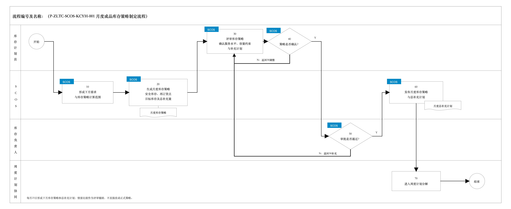
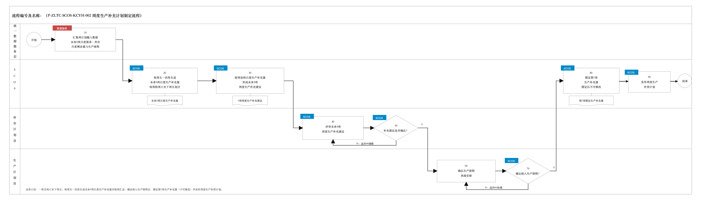
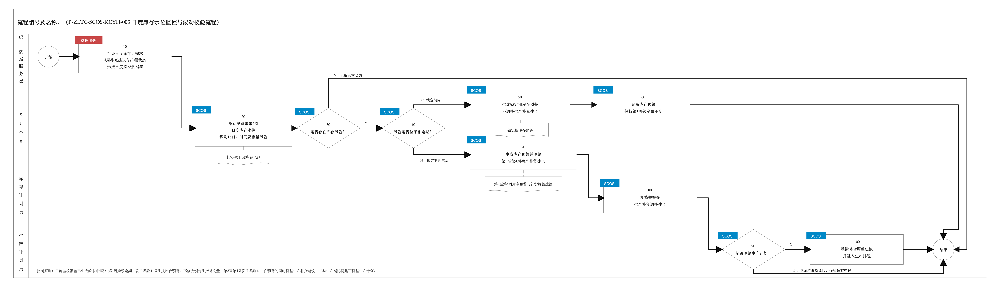
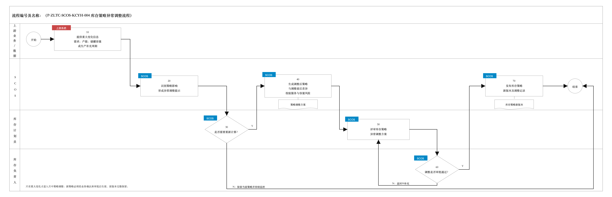
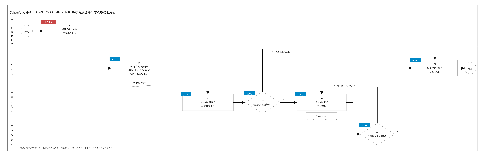

# 库存优化模块关键业务流程说明

> 编制依据：《SCOS全局供应链优化与协同系统技术要求》和《成品库存优化模块技术方案》。本文件参照《SCOS_中粮太仓项目研发模块蓝图方案v0.1》2.2节的业务梳理方式，并与《采购优化模块关键业务流程》保持图表风格一致。流程仅保留业务决策、责任交接和状态变化节点；默认数据获取和内部计算步骤放入“处理说明”，不单独拆分。流程及规则编号为建议编码。

## 2.2 关键业务流程说明

### 2.2.1 月度成品库存策略制定流程

| 节点编号 | 节点名称 | 执行角色 | 输入/输出 | 处理说明 | 异常/分支 | 关联规则 |
|---|---|---|---|---|---|---|
| 开始 | 开始 | — | — | 每月25日进入下月成品库存策略和总补充计划制定周期。 | — | — |
| 10 | 形成下月需求与库存策略计算范围 | SCOS系统自动 | 输入：下月分成品出货计划、已明确销售订单、当前库存、计划生产入库和待发运信息；输出：分成品日度计划需求和策略计算范围 | 对月度出货总量进行日度分解；已有明确订单的日期优先使用订单量，其余数量分摊至未有明确订单的日期。本节点形成正式计算口径，不建设独立需求预测。 | 数据缺失或状态异常时，暂不进入正式计算并提示库存计划员处理。 | P-ZLTC-SCOS-KCYH-001-10-001 |
| 20 | 生成月度库存策略 | SCOS系统自动 | 输入：日度计划需求、历史出库波动、生产补充周期、服务水平、成品—储罐映射及有效容量；输出：安全库存、再订货点、目标库存、下月总补充量及建议入库节奏 | 按成品运行动态 \(R,s,S\) 模型，计算“存多少、何时补、补多少”。目标库存和总补充量需经有效储罐容量、保质期和最大库存天数校验。 | 目标库存超过成品有效容量时，按当前可执行容量给出结果并标记服务水平风险。 | P-ZLTC-SCOS-KCYH-001-20-001 |
| 30 | 评审库存策略 | 库存计划员 | 输入：月度库存策略、总补充计划、计算依据及风险提示；输出：拟定成品库存策略 | 复核服务水平、生产补充周期、容量约束和月度补充总量。可对候选服务水平或补充周期进行辅助情景比较，比较结果不直接修改正式策略。 | 参数或业务条件需要修改时，可返回20重新计算。 | P-ZLTC-SCOS-KCYH-001-30-001 |
| 40 | 确认月度库存策略 | 库存计划员、SCOS系统自动 | 输入：拟定库存策略；输出：确认结论 | 系统校验必要参数、容量和补充量范围，由库存计划员确认提交。 | N：返回30调整；Y：进入50。 | P-ZLTC-SCOS-KCYH-001-40-001 |
| 50 | 审批月度库存策略 | 库存负责人 | 输入：拟定库存策略和总补充计划；输出：审批意见 | 审核服务水平、库存风险、容量约束、资金占用影响和生产补充计划的合理性。 | N：退回30补充或修改；Y：进入60。 | P-ZLTC-SCOS-KCYH-001-50-001 |
| 60 | 发布月度库存策略与总补充计划 | SCOS系统自动 | 输入：审批通过的策略；输出：已发布的安全库存、再订货点、目标库存、月度总补充计划及版本 | 策略发布后在月内作为日度库存监控基准，并保存数据快照、模型参数、人工调整和审批轨迹。 | 发布失败时保留待发布状态并支持重试。 | P-ZLTC-SCOS-KCYH-001-60-001 |
| 70 | 进入周度计划分解 | 库存计划员、SCOS系统自动 | 输入：已发布的月度总补充量及建议入库节奏；输出：周度计划分解基准 | 将月度总补充量作为总量控制口径，进入后续周度生产补充计划制定。月度流程不直接确定每周、每日的生产数量。 | 月度策略或总量未发布时，不得作为正式周计划基准。 | P-ZLTC-SCOS-KCYH-001-70-001 |
| 结束 | 结束 | — | 输出：已发布月度成品库存策略及总补充计划 | 月度库存策略制定完成。 | — | — |

### 2.2.2 周度生产补充计划制定流程

| 节点编号 | 节点名称 | 执行角色 | 输入/输出 | 处理说明 | 异常/分支 | 关联规则 |
|---|---|---|---|---|---|---|
| 开始 | 开始 | — | — | 每周五进入周度生产补充计划制定周期，一次性面向未来4周进行计算。每周均按“周六至下周五”定义，其中第1周为本次计算日次日（周六）至下周五。 | — | — |
| 10 | 汇集周计划输入数据 | 统一数据服务层 | 输入：已发布月度总补充计划、月度剩余待生产量、未来4周日度计划需求、当前可用库存、已有生产排程、计划入库及储罐容量；输出：未来4周生产补充计算数据集 | 通过统一数据服务层提供本次计算所需的最新业务数据。月度剩余待生产量需扣除已完工量和已排程未完工量，并统一数据时点与版本。 | 数据缺失、过期或状态冲突时，暂不生成正式建议并提示人工核实。 | P-ZLTC-SCOS-KCYH-002-10-001 |
| 20 | 生成未来4周日度生产补充量 | SCOS系统自动 | 输入：未来4周生产补充计算数据集、当月已发布库存策略；输出：分成品未来4周日度生产补充量 | 每周五一次性向后计算4周，按日结合计划需求、可用库存、已有计划入库和库存策略生成日度生产补充量；周界严格采用周六至下周五。已排程未完工的计划生产入库必须扣除，避免重复补充。 | 某日无需新增补充时，日度生产补充量可为0；受库存容量或月度剩余量限制时，输出可执行数量并标记风险。 | P-ZLTC-SCOS-KCYH-002-20-001 |
| 30 | 汇总4周周度生产补充建议 | SCOS系统自动 | 输入：未来4周日度生产补充量；输出：未来4周分成品周度生产补充建议 | 对每个“周六至下周五”周期内的日度生产补充量进行加和，分别得到第1周至第4周的周度生产补充建议，并保留周度结果与日度明细的对应关系。 | 日度结果缺失或周期归属异常时，不生成对应周的正式汇总结果并提示校验。 | P-ZLTC-SCOS-KCYH-002-30-001 |
| 40 | 评审4周周度生产补充建议 | 库存计划员 | 输入：未来4周周度生产补充建议、日度明细、月度剩余量及库存/容量风险；输出：拟定4周周度生产补充建议 | 复核4周周度总量、各周分配、日度构成、月度剩余量、已有排程和储罐容量，确认建议是否具备提交生产计划员承接的条件。 | 业务条件或建议数量需要修改时，可返回20重新计算日度生产补充量。 | P-ZLTC-SCOS-KCYH-002-40-001 |
| 50 | 确认周度生产补充建议 | 库存计划员、SCOS系统自动 | 输入：拟定4周周度生产补充建议；输出：库存侧确认结论 | 系统校验4周汇总结果与日度明细一致、不重复计入已排程量且不超过月度剩余待生产量，由库存计划员确认提交生产计划员。 | N：返回40调整；Y：进入60。 | P-ZLTC-SCOS-KCYH-002-50-001 |
| 60 | 确认生产排程承接安排 | 生产计划员 | 输入：库存侧已确认的4周周度生产补充建议及日度明细；输出：生产排程承接意见 | 结合产能、设备、原料、工艺和已确认生产任务，确认周度生产补充建议能否纳入生产排程，并明确相关排程约束。 | 无法承接时，应明确受影响周次、可承接数量及约束原因。 | P-ZLTC-SCOS-KCYH-002-60-001 |
| 70 | 确认纳入生产排程 | 生产计划员、SCOS系统自动 | 输入：4周周度生产补充建议和生产排程承接意见；输出：纳入生产排程的确认结论 | 判断并确认周度生产补充建议是否纳入生产排程。 | N：返回60协调承接安排；Y：进入80。 | P-ZLTC-SCOS-KCYH-002-70-001 |
| 80 | 锁定第1周生产补充量 | SCOS系统自动 | 输入：已确认纳入生产排程的4周周度生产补充建议；输出：锁定的第1周生产补充量及锁定状态 | 对第1周（本次计算日次日周六至下周五）的生产补充量进行锁定。锁定后不可修改；第2周至第4周保留为后续滚动评审建议，不作为本次锁定范围。 | 锁定失败时不进入发布，并保留待锁定状态及失败原因。 | P-ZLTC-SCOS-KCYH-002-80-001 |
| 90 | 发布周度生产补货计划 | SCOS系统自动 | 输入：锁定的第1周生产补充量、排程确认结论；输出：已发布的第1周周度生产补货计划、锁定状态及版本 | 发布第1周周度生产补货计划，作为生产排程执行与日度滚动校验的正式基准，同时保留本次未来4周建议及评审、排程确认轨迹。 | 发布或下发失败时保留待发布状态，已锁定的第1周生产补充量不得修改。 | P-ZLTC-SCOS-KCYH-002-90-001 |
| 结束 | 结束 | — | 输出：已发布且第1周生产补充量已锁定的周度生产补货计划 | 本周周度生产补充计划制定完成；下一周五重新向后滚动生成未来4周日度生产补充量和周度建议。 | — | — |

### 2.2.3 日度库存水位监控与滚动校验流程

| 节点编号 | 节点名称 | 执行角色 | 输入/输出 | 处理说明 | 异常/分支 | 关联规则 |
|---|---|---|---|---|---|---|
| 开始 | 开始 | — | — | 系统每日定时运行；成品库存、订单、生产排程、计划入库或储罐可用状态发生关键变化时也可触发。本流程滚动监控周度流程已生成的未来4周。 | — | — |
| 10 | 汇集日度库存、需求、4周补充建议与排程状态 | 统一数据服务层 | 输入：已发布且第1周已锁定的周度生产补货计划、第2至第4周生产补货建议、SAP/WMS成品库存及出库状态、日度计划需求、生产排程及计划入库、QMS/LIMS质检状态和储罐可用状态；输出：未来4周日度库存监控数据集 | 通过统一数据服务层统一获取库存、需求、4周生产补货建议和生产排程状态。成品可用库存需扣除已分配、冻结和质量异常库存；计划生产量仅在预计生产完成、质检放行并形成可用库存的日期计入。 | 数据缺失、过期或状态冲突时标记数据风险，提示人工核实，不自动改变已锁定或未锁定的生产补货建议。 | P-ZLTC-SCOS-KCYH-003-10-001 |
| 20 | 滚动测算未来4周日度库存水位 | SCOS系统自动 | 输入：未来4周日度库存监控数据集、当月已发布库存策略；输出：未来4周日度库存轨迹、风险日期、数量缺口和容量风险 | 按日更新实际可用库存、计划需求和预计可用的计划生产入库，形成覆盖第1周锁定期及第2至第4周非锁定期的库存轨迹。计算时扣除已有计划生产入库，避免重复补充。 | 数据不足以形成可靠测算时，输出数据风险和受影响日期，不生成误导性的库存结论。 | P-ZLTC-SCOS-KCYH-003-20-001 |
| 30 | 判断是否存在库存风险 | SCOS系统自动 | 输入：未来4周日度库存轨迹和已发布库存策略阈值；输出：库存风险判断 | 判断未来4周内是否存在低于安全库存、再订货点或危险水位的风险，以及计划生产入库是否超过成品对应储罐的有效剩余容量。 | N：记录正常状态后进入结束；Y：进入40。 | P-ZLTC-SCOS-KCYH-003-30-001 |
| 40 | 判断风险是否位于锁定期 | SCOS系统自动 | 输入：库存风险日期、第1周锁定期起止日期；输出：风险所属期间 | 依据周度流程确定的期间判断风险是否发生在第1周锁定期内。第1周为周六至下周五；第2至第4周为锁定期外。 | Y：锁定期内，进入50；N：锁定期外三周，进入70。 | P-ZLTC-SCOS-KCYH-003-40-001 |
| 50 | 生成锁定期库存预警 | SCOS系统自动 | 输入：锁定期库存轨迹、风险日期、数量缺口和容量风险；输出：锁定期库存预警 | 对第1周锁定期内的库存风险生成预警，说明风险成品、日期、数量及原因。本节点只生成库存预警，不生成或修改锁定期内的生产补货建议。 | 即使风险持续或扩大，也不得通过日度监控直接修改第1周锁定生产补充量。 | P-ZLTC-SCOS-KCYH-003-50-001 |
| 60 | 记录库存预警并保持第1周锁定量不变 | SCOS系统自动 | 输入：锁定期库存预警、已锁定第1周生产补充量；输出：库存预警记录、锁定状态确认 | 保存库存预警、风险依据和处理状态，并确认第1周生产补充量继续保持锁定且不可修改。 | 预警处理不解除锁定；如需处置，由相关业务人员在线下或其他授权流程中协调，本流程不改变锁定计划。完成后进入结束。 | P-ZLTC-SCOS-KCYH-003-60-001 |
| 70 | 生成库存预警并调整第2至第4周生产补货建议 | SCOS系统自动 | 输入：锁定期外三周库存轨迹、风险日期、数量缺口、原生产补货建议及已有计划生产入库；输出：第2至第4周库存预警和调整后的生产补货建议 | 对第2至第4周发生的库存风险生成预警，同时调整对应日期和周次的生产补货建议。调整计算必须扣除已有计划生产入库，并保持第1周锁定生产补充量不变。 | 受月度剩余量、产能或储罐容量限制时，输出可执行建议及仍无法消除的风险。 | P-ZLTC-SCOS-KCYH-003-70-001 |
| 80 | 复核并提交生产补货调整建议 | 库存计划员、SCOS系统自动 | 输入：第2至第4周库存预警、原建议与调整后建议、库存及容量风险；输出：库存侧复核意见和待生产端确认的调整建议 | 库存计划员复核调整原因、受影响周次、建议数量及风险，确认后提交生产端协同。系统保留调整前后差异和复核记录。 | 数据或建议不合理时，返回源数据核实并重新测算；未通过库存侧复核时不提交生产端。 | P-ZLTC-SCOS-KCYH-003-80-001 |
| 90 | 判断是否调整生产计划 | 生产计划员 | 输入：经库存侧复核的第2至第4周生产补货调整建议、当前生产排程及约束；输出：生产计划调整结论 | 生产计划员结合产能、设备、原料、工艺和既有排程，判断是否调整锁定期外三周的生产计划。库存优化模块不直接改写生产计划。 | N：记录不调整原因并保留调整建议后进入结束；Y：进入100。 | P-ZLTC-SCOS-KCYH-003-90-001 |
| 100 | 反馈补货调整建议并进入生产排程 | 生产计划员、生产排程模块 | 输入：确认采纳的第2至第4周生产补货调整建议；输出：生产排程调整任务、计划生产数量和预计可用入库日期 | 将确认采纳的调整建议交给生产排程处理，并将排程反馈用于下一轮日度库存水位测算。第1周锁定生产补充量仍保持不变。 | 排程无法满足建议日期或数量时，更新未消除的库存风险并继续协同。完成后进入结束。 | P-ZLTC-SCOS-KCYH-003-100-001 |
| 结束 | 结束 | — | 输出：日度库存监控结果、库存预警、第1周锁定状态、第2至第4周补货建议调整及生产协同记录 | 本轮日度库存水位监控与滚动校验完成。无风险、锁定期只预警以及锁定期外调整三类结果均汇入本节点，相关预警和处理状态同步至供应链驾驶舱。 | 未关闭风险进入后续日度监控。 | — |

### 2.2.4 库存策略异常调整流程

| 节点编号 | 节点名称 | 执行角色 | 输入/输出 | 处理说明 | 异常/分支 | 关联规则 |
|---|---|---|---|---|---|---|
| 开始 | 开始 | — | — | 需求计划重大变化、大客户订单变化、产线长期停机、储罐检修/不可用或生产补充周期明显延长时触发。 | — | — |
| 10 | 提供重大变化信息 | 上游业务系统、统一数据服务层 | 输入：需求、产能、储罐容量或生产补充周期变化；输出：重大变化事件 | 上游系统通过标准服务或业务事件提供变化信息。库存优化只评估对已发布成品库存策略的影响，不替代上游业务处理。 | 事件数据不完整时标记待核实，不自动改变正式策略。 | P-ZLTC-SCOS-KCYH-004-10-001 |
| 20 | 识别策略影响 | SCOS系统自动 | 输入：重大变化事件、当前库存策略和未来库存轨迹；输出：影响范围、风险和异常调整提示 | 识别受影响的成品、时间范围、服务水平、库存和容量风险，判断现行安全库存、再订货点和目标库存是否可能失效。 | 无法量化影响时，输出定性风险并提示人工复核。 | P-ZLTC-SCOS-KCYH-004-20-001 |
| 30 | 判断是否需要重新计算 | 库存计划员 | 输入：影响范围和风险；输出：重新计算结论 | 核实业务变化是否足以在月中改变已发布库存策略。普通库存波动只进入日度监控，不进入策略重算。 | N：保留当前策略并持续监控；Y：进入40。 | P-ZLTC-SCOS-KCYH-004-30-001 |
| 40 | 生成调整后库存策略 | SCOS系统自动 | 输入：经确认的变化条件、当前策略和模型参数；输出：调整后的安全库存、再订货点、目标库存、补充建议及调整前后差异 | 仅对受影响成品和时间范围重新计算，比较服务水平、库存水平、容量和可选成本变化。 | 新策略受容量限制或仍无法满足目标服务水平时，明确标记不可完全消除的风险。 | P-ZLTC-SCOS-KCYH-004-40-001 |
| 50 | 评审库存策略异常调整方案 | 库存计划员 | 输入：调整前后差异、参数和风险；输出：拟定策略调整方案 | 确认调整原因、生效时间、受影响成品、参数变化和对生产补充计划的影响。 | 依据不足时返回10补充或保留当前策略。 | P-ZLTC-SCOS-KCYH-004-50-001 |
| 60 | 审批策略异常调整 | 库存负责人 | 输入：拟定策略调整方案；输出：审批意见 | 审批月中改变库存策略的必要性、影响和生效范围。 | N：退回50补充说明；Y：进入70。 | P-ZLTC-SCOS-KCYH-004-60-001 |
| 70 | 发布库存策略新版本 | SCOS系统自动 | 输入：审批通过的调整方案；输出：库存策略新版本、调整记录及相关生产补充影响 | 发布新版本并保留原策略、输入数据、参数、计算结果、人工意见和审批轨迹。将受影响的生产补充信息交给生产排程处理。 | 发布失败时保留待发布状态，原有效版本继续生效。 | P-ZLTC-SCOS-KCYH-004-70-001 |
| 结束 | 结束 | — | 输出：新版本或保留原策略的处理结论 | 本次库存策略异常调整完成。 | — | — |

### 2.2.5 库存健康度评价与策略改进流程

| 节点编号 | 节点名称 | 执行角色 | 输入/输出 | 处理说明 | 异常/分支 | 关联规则 |
|---|---|---|---|---|---|---|
| 开始 | 开始 | — | — | 系统按月或按管理周期发起库存健康度和策略有效性评价。 | — | — |
| 10 | 提供策略与实际库存执行数据 | 统一数据服务层 | 输入：已发布库存策略、实际出入库、订单满足、缺货、生产补充、库龄及库存占用数据；输出：库存绩效分析数据集 | 通过统一数据服务层汇总已发布的策略目标和对应周期的实际执行结果。 | 数据不完整时标记本期评价口径和不可评价指标。 | P-ZLTC-SCOS-KCYH-005-10-001 |
| 20 | 生成库存健康度评价 | SCOS系统自动 | 输入：库存绩效分析数据集；输出：库存健康度报告和策略有效性分析 | 统计成品库存周转率、订单满足率、服务水平达成情况、缺货、滞销、呆滞和临期库存，并对比目标服务水平与实际达成率。 | 口径或数据周期不可比时，不输出误导性趋势结论。 | P-ZLTC-SCOS-KCYH-005-20-001 |
| 30 | 复核库存健康度与策略有效性 | 库存计划员 | 输入：库存健康度报告、目标与实际差异；输出：复核结论 | 核实差异是否由库存参数、需求变化、生产补充执行、质量冻结或容量限制导致，区分策略问题与执行问题。 | 数据异常时返回源系统核实；执行问题转相应业务流程处理。 | P-ZLTC-SCOS-KCYH-005-30-001 |
| 40 | 判断是否需要改进策略 | 库存计划员 | 输入：复核结论；输出：策略改进判断 | 判断是否需要调整服务水平、安全系数、生产补充周期、复核周期或成本参数。 | N：无参数改进建议，进入70发布评价结论；Y：进入50。 | P-ZLTC-SCOS-KCYH-005-40-001 |
| 50 | 形成库存策略改进建议 | 库存计划员 | 输入：策略问题和影响分析；输出：参数或策略改进建议 | 说明建议调整的对象、参数、原因、预期影响和建议生效周期。系统分析结果作为参考，不自动改写正式库存策略。 | 无法确定建议参数时，只形成待进一步验证的问题清单。 | P-ZLTC-SCOS-KCYH-005-50-001 |
| 60 | 判断是否纳入策略调整 | 库存负责人 | 输入：库存策略改进建议；输出：改进处理意见 | 确认建议是否在下一月度策略制定中吸收，或因风险重大进入库存策略异常调整流程。 | N：保留改进建议待后续复核；Y：形成策略调整任务。 | P-ZLTC-SCOS-KCYH-005-60-001 |
| 70 | 发布库存健康度报告与改进结论 | SCOS系统自动 | 输入：健康度评价、复核意见和改进处理意见；输出：已发布库存健康度报告、改进结论和待跟踪任务 | 发布本期评价结果并向供应链驾驶舱提供成品库存健康度指标。已确认的改进建议进入后续月度策略制定或异常调整。 | 发布失败时保留待发布状态并支持重试。 | P-ZLTC-SCOS-KCYH-005-70-001 |
| 结束 | 结束 | — | 输出：库存健康度报告及策略改进闭环记录 | 本期库存策略效果评价完成。 | — | — |

## 2.3 业务边界与控制原则

- 本期库存优化仅面向成品库存，不包含原料、辅料、在制品、副产品、包装材料及备品备件库存。
- 库存优化核心输出为成品安全库存、再订货点、目标库存、月度总补充量、日度新增补充建议和期望可用入库时间。
- 库存优化不负责销售预测；月度出货计划由上游提供，已有明确订单的日期优先使用订单量，其余月度计划仅进行日度分解。
- 成品可用库存需扣除已分配、冻结和质量异常库存；尚未生产完成或未具备入库条件的计划生产量不得提前视为可用库存。
- 月度库存策略参数原则上按月重新计算和发布，月内普通库存变化只触发预警和生产补充建议，不自动修改 \(s\) 和 \(S\)。
- 计划按“月—周—日”三级衔接：月度总补充量是总量控制口径，周生产补充计划是生产衔接口径，日度滚动是校验和调整口径。
- 周计划和日度计算均必须扣除已排程未完工的计划生产入库，避免月、周、日重复计算补充量。
- 实际完工或已排程量变化时，需同步更新月度和周度剩余待生产量；日度校验发现偏差时，可提示调整本周或后续周计划。
- 成品—储罐映射和有效容量用于约束目标库存和生产补充上限；库存优化不按生产批次分配具体储罐。
- 库存优化向生产排程提供补充量范围和期望可用入库时间；具体生产日期、产线、设备和入罐安排由生产排程及执行环节确定。
- 库存预警和健康度指标向供应链驾驶舱提供；驾驶舱负责全局展示、事件联动和沙盘推演，库存模块不单独扩展驾驶舱业务流程。
- 调整服务水平或生产补充周期的情景比较是策略评审辅助能力，比较结果不直接修改正式策略。
- 所有库存策略、人工调整和审批意见均保留版本及完整追溯轨迹。
