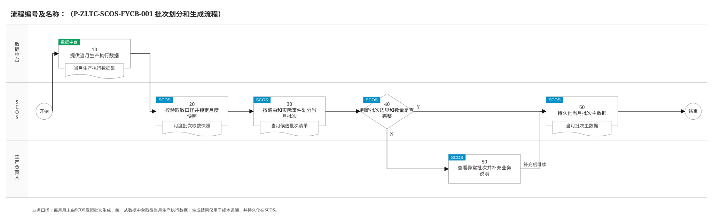
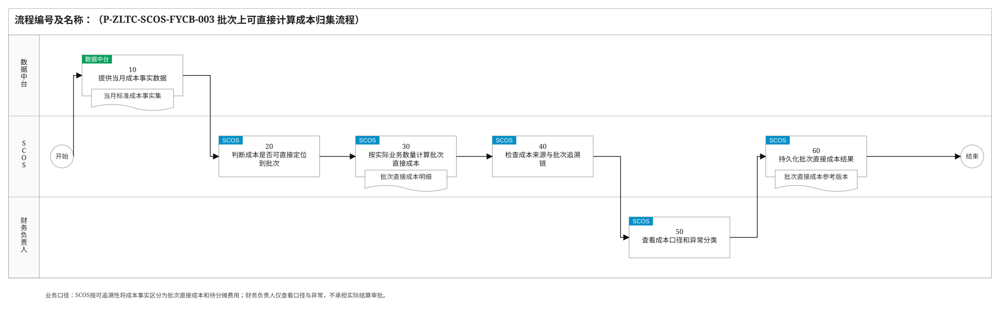
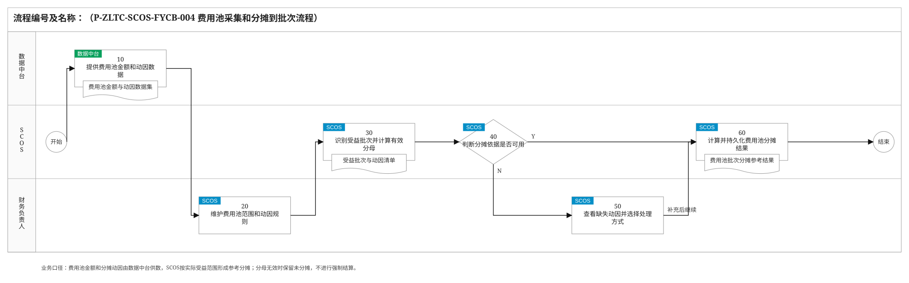
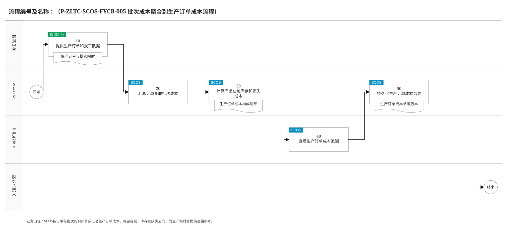
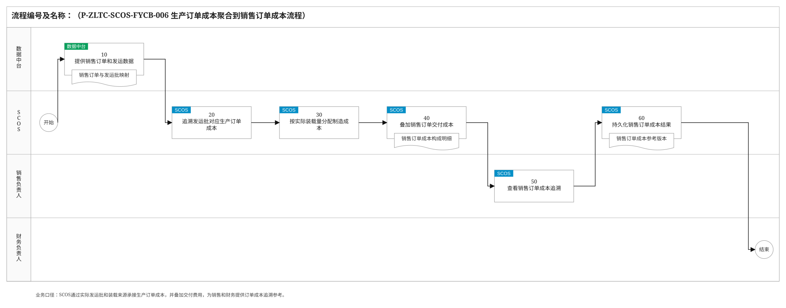
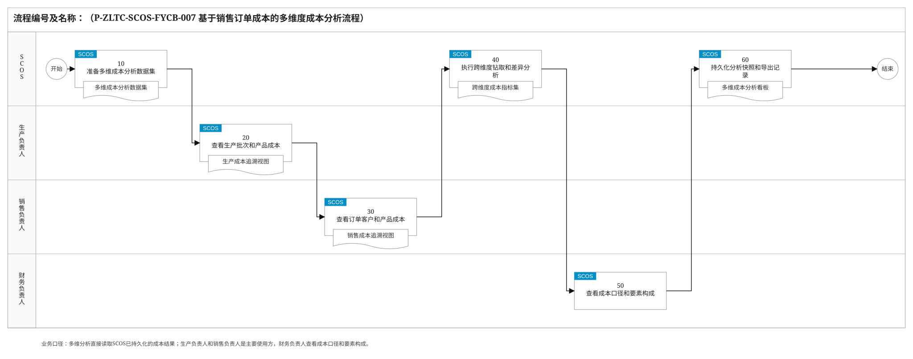
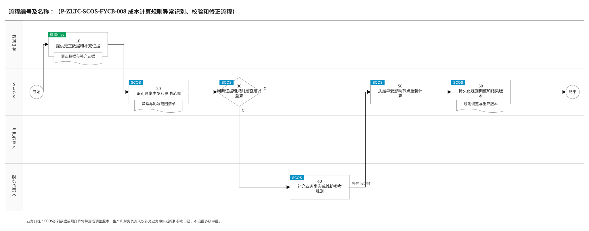
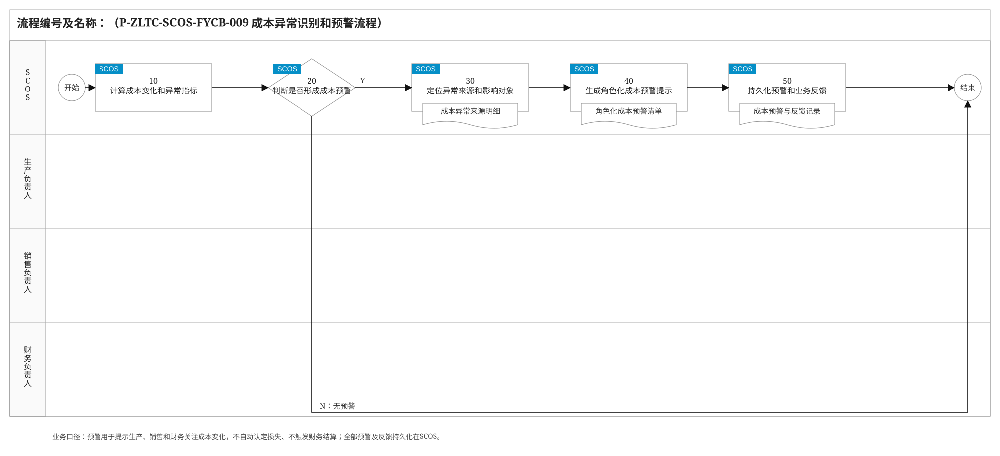

# 成本分摊模块关键业务流程说明

> 编制依据：《通用生产线批次生成与上下游关联业务方案》《通用生产线批次成本计算业务方案》《成本分摊模块关键业务流程和要点》《业务关键流程编制方法与经验总结》及《SVG流程图绘制规范与验收清单》。本版统一采用“数据中台供数、SCOS计算与持久化、生产/销售/财务按职责查看和补充业务说明”的边界。模块输出用于成本追溯和经营分析参考，不替代实际财务核算、对账或业务结算。

## 2.2 关键业务流程说明

### 2.2.1 批次划分和生成流程

| 节点编号 | 节点名称 | 执行角色 | 输入/输出 | 处理说明 | 异常/分支 | 关联规则 |
|---|---|---|---|---|---|---|
| 开始 | 开始 | — | 输入：月末成本追溯任务 | 每月月末由SCOS启动当月生产批次生成。 | — | — |
| 10 | 提供当月生产执行数据 | 数据中台 | 输入：取数请求；输出：工单、收发存、投料、设备、阀门、计量、质检和发运数据 | 数据中台按工厂、自然月和截止时间统一提供各执行系统归集后的标准数据，并携带来源时间、单位和数据版本。 | 缺失字段或来源冲突随数据质量标识返回，不直接按零处理。 | P-ZLTC-SCOS-FYCB-001-10-001 |
| 20 | 校验取数口径并锁定月度快照 | SCOS | 输入：当月生产执行数据集；输出：月度取数快照 | SCOS校验产线、路线、设备、物料、时间、单位和必要事件是否完整，锁定本轮计算使用的数据版本。 | 迟到或更正数据进入后续调整版本，不覆盖已使用快照。 | P-ZLTC-SCOS-FYCB-001-20-001 |
| 30 | 按路由和实际事件划分当月批次 | SCOS | 输入：月度快照、有效路由和批次规则；输出：候选批次 | 按节点对象类型生成物流批、连续时间窗口批、设备周期批、配方/工单活动批、实体罐批、库存批和发运批；短路线不补建不存在的层级。 | 连续段按真实切换、停机和动态到达时间划窗；共享设备按路线和物料隔离。 | P-ZLTC-SCOS-FYCB-001-30-001 |
| 40 | 判断批次边界和数量是否完整 | SCOS | 输入：候选批次、两端计量和业务事件；输出：完整性检查结果 | 检查批次起止时间、投入/产出/合格质量、设备占用、容量、质量状态、编码唯一性和期初在制衔接。 | N：进入50查看异常；Y：进入60。 | P-ZLTC-SCOS-FYCB-001-40-001 |
| 50 | 查看异常批次并补充业务说明 | 生产负责人 | 输入：断档、重叠、低可信度或边界异常批次；输出：事实说明和处理口径 | 生产负责人在SCOS查看停机、旁路、清洗、切换、罐底和返工注入等异常，补充业务事实或确认暂按低可信度保留。 | 补充后返回30重算；无依据的批次标记为待确认，不参与正式参考结果。 | P-ZLTC-SCOS-FYCB-001-50-001 |
| 60 | 持久化当月批次主数据 | SCOS | 输入：完整批次结果；输出：当月批次主数据版本 | SCOS保存批次编码、对象类型、边界、数量、规则版本、证据和可信度，供谱系关联与成本追溯使用。 | 更正时创建新版本并保留旧版本关联，不原地覆盖。 | P-ZLTC-SCOS-FYCB-001-60-001 |
| 结束 | 结束 | — | 输出：当月全量生产批次 | 批次生成完成。 | — | — |

### 2.2.2 上下游批次关联流程

| 节点编号 | 节点名称 | 执行角色 | 输入/输出 | 处理说明 | 异常/分支 | 关联规则 |
|---|---|---|---|---|---|---|
| 开始 | 开始 | — | 输入：当月批次主数据 | 批次生成完成后由SCOS自动发起当月谱系关联。 | — | — |
| 10 | 提供路由和批次关联证据 | 数据中台 | 输入：取数请求；输出：有效路由、阀门、转罐、物流、称重和两端计量数据 | 数据中台按月度快照提供关联所需数据，保持与批次生成相同的时间、单位和版本口径。 | 时钟漂移、计量复位和数据缺口随质量标识返回。 | P-ZLTC-SCOS-FYCB-002-10-001 |
| 20 | 计算到达区间并筛选候选关系 | SCOS | 输入：上游批次、动态过程时间、下游接收区间；输出：候选上下游关系 | SCOS先校验有效路由边、物料兼容和阀门/物流连通，再依据动态到达区间与接收区间重叠筛选候选。 | 时间重叠仅表示可能关联，不直接作为数量归属。 | P-ZLTC-SCOS-FYCB-002-20-001 |
| 30 | 计算关系数量占比和转化率 | SCOS | 输入：独立质量计量、罐差、称重和业务单据；输出：转出量、接收量、去向占比、来源占比和转化率 | 优先采用独立支路或接收点质量累计量；只有总量时按同期实测流量占比分配，保留方法和可信度。 | 不以标准配方或固定收率改写实际谱系。 | P-ZLTC-SCOS-FYCB-002-30-001 |
| 40 | 判断谱系关系是否满足追溯要求 | SCOS | 输入：定量关系；输出：路线、重量、容量、配方和质量检查结果 | 检查分流支路合计、汇流来源合计、共享设备占用、QC放行、返工路径及成品罐禁止返流规则。 | N：进入50查看异常；Y：进入60。 | P-ZLTC-SCOS-FYCB-002-40-001 |
| 50 | 查看异常关系并补充业务事实 | 生产负责人 | 输入：断档、不守恒、非法路线或低可信度关系；输出：旁路、停机、切换、返工等事实说明 | 生产负责人在SCOS查看异常上下游关系并补充实际操作事实；SCOS据此重新计算。 | 补充后返回20；无可靠依据的关系保持候选状态。 | P-ZLTC-SCOS-FYCB-002-50-001 |
| 60 | 持久化当月批次谱系 | SCOS | 输入：满足追溯要求的关系；输出：月度批次谱系版本 | SCOS保存每条关系的上下游批次、数量、占比、转化率、方法、证据和可信度，支持双向追溯。 | 迟到或更正数据形成替代版本，并标记受影响后代。 | P-ZLTC-SCOS-FYCB-002-60-001 |
| 结束 | 结束 | — | 输出：可供成本计算的当月批次谱系 | 批次关联完成。 | — | — |

### 2.2.3 批次上可直接计算成本归集流程

| 节点编号 | 节点名称 | 执行角色 | 输入/输出 | 处理说明 | 异常/分支 | 关联规则 |
|---|---|---|---|---|---|---|
| 开始 | 开始 | — | 输入：当月批次谱系 | 谱系可用后由SCOS发起直接成本归集。 | — | — |
| 10 | 提供当月成本事实数据 | 数据中台 | 输入：取数请求；输出：采购、领料、能源、维修、检验、包装和运输成本事实 | 数据中台统一提供来源业务键、发生时间、数量、单价、金额、税额和暂估/实际标识。 | 缺失或重复记录携带数据质量标识。 | P-ZLTC-SCOS-FYCB-003-10-001 |
| 20 | 判断成本是否可直接定位到批次 | SCOS | 输入：成本事实、当月批次谱系；输出：直接成本/待分摊费用分类 | SCOS检查唯一业务键、产线和节点定位、明确批次集合、数量金额完整性及重复归集；满足条件的成本进入直接计批。 | 不可直接定位的成本进入待分摊费用，不强行平均到批次。 | P-ZLTC-SCOS-FYCB-003-20-001 |
| 30 | 按实际业务数量计算批次直接成本 | SCOS | 输入：领料、实测消耗、设备活动、样品、装载量或吨公里；输出：批次直接成本 | 按实际领料、计量、活动或运输数量拆分金额，计入成本实际发生的批次节点，并保留成本要素与来源单据。 | 主要原料发票未到时保留采购批暂估，实际到达后形成差异版本。 | P-ZLTC-SCOS-FYCB-003-30-001 |
| 40 | 检查成本来源与批次追溯链 | SCOS | 输入：批次直接成本、待分摊费用和来源总额；输出：完整性检查结果 | SCOS检查每笔直接成本可回到来源记录、每笔待分摊费用有明确分类，且同一业务键未重复进入两类结果。 | 无法解释的差异标记为待处理，不影响其他可追溯记录。 | P-ZLTC-SCOS-FYCB-003-40-001 |
| 50 | 查看成本口径和异常分类 | 财务负责人 | 输入：直接成本、待分摊费用和异常明细；输出：财务口径说明 | 财务负责人在SCOS查看成本要素、含税/不含税、暂估标识和分类原因，必要时修正成本映射规则。 | 修正规则后由SCOS重新执行20—40。 | P-ZLTC-SCOS-FYCB-003-50-001 |
| 60 | 持久化批次直接成本结果 | SCOS | 输入：可追溯直接成本和待分摊费用；输出：批次直接成本参考版本 | SCOS保存来源记录、批次、成本要素、金额、计算规则和版本，供费用池与下游成本追溯使用。 | 结果仅作经营分析参考，不替代财务实际核算。 | P-ZLTC-SCOS-FYCB-003-60-001 |
| 结束 | 结束 | — | 输出：批次直接成本和待分摊费用 | 直接成本归集完成。 | — | — |

### 2.2.4 费用池采集和分摊到批次流程

| 节点编号 | 节点名称 | 执行角色 | 输入/输出 | 处理说明 | 异常/分支 | 关联规则 |
|---|---|---|---|---|---|---|
| 开始 | 开始 | — | 输入：当月待分摊费用 | 直接成本分类完成后由SCOS发起费用池分摊。 | — | — |
| 10 | 提供费用池金额和动因数据 | 数据中台 | 输入：取数请求；输出：期间费用、班组工时、设备占用、能耗、处理量、绝干量和发运数据 | 数据中台按费用类型和月度期间提供总额、已直计金额、排除项及可用动因。 | 数据缺失时明确缺失范围，不自动补零。 | P-ZLTC-SCOS-FYCB-004-10-001 |
| 20 | 维护费用池范围和动因规则 | 财务负责人 | 输入：费用类型、成本要素和可用动因；输出：受益范围、首选和备选动因 | 财务负责人在SCOS维护人工、折旧、公共能源、维修、污水、保险和销售物流等费用的适用设备、产线、节点、期间及动因优先级。 | 共享设备按实际占用或处理量定义受益范围，不按名义归属。 | P-ZLTC-SCOS-FYCB-004-20-001 |
| 30 | 识别受益批次并计算有效分母 | SCOS | 输入：费用池范围、动因规则和当月批次；输出：受益批次、批次动因量和分母 | SCOS按期间和服务边界筛选受益批次，优先采用实测消耗、设备/批次工时、处理量、绝干量或吨公里。 | 首选动因缺失时仅使用已维护的备选动因。 | P-ZLTC-SCOS-FYCB-004-30-001 |
| 40 | 判断分摊依据是否可用 | SCOS | 输入：费用池金额、受益批次和分母；输出：可分摊判断 | 检查分母大于零、动因口径一致且受益范围不为空。 | N：进入50；Y：进入60。 | P-ZLTC-SCOS-FYCB-004-40-001 |
| 50 | 查看缺失动因并选择处理方式 | 财务负责人 | 输入：无效分母或缺失动因；输出：备选动因、停工/闲置或未分摊说明 | 财务负责人在SCOS查看缺口，可选择已配置备选动因；确无受益批次的维持费用标记停工/闲置，其他情况保持未分摊。 | 处理后返回30；不得强制分给正常批次。 | P-ZLTC-SCOS-FYCB-004-50-001 |
| 60 | 计算并持久化费用池分摊结果 | SCOS | 输入：可分摊金额和有效动因；输出：分摊率、批次金额、尾差和未分摊项 | SCOS按动因量计算批次参考分摊，尾差单列，费用进入实际受益节点并随谱系向下传导。 | 结果仅用于成本追溯和经营分析，不生成实际财务结算凭证。 | P-ZLTC-SCOS-FYCB-004-60-001 |
| 结束 | 结束 | — | 输出：批次费用池成本参考结果 | 费用池分摊完成。 | — | — |

### 2.2.5 批次成本聚合到生产订单成本流程

| 节点编号 | 节点名称 | 执行角色 | 输入/输出 | 处理说明 | 异常/分支 | 关联规则 |
|---|---|---|---|---|---|---|
| 开始 | 开始 | — | 输入：批次直接成本和费用池成本 | 批次成本更新后由SCOS发起生产订单聚合。 | — | — |
| 10 | 提供生产订单和报工数据 | 数据中台 | 输入：取数请求；输出：工单、产品、路线、投料、产出、报工和状态数据 | 数据中台提供生产订单与实际批次、投料和产出的映射数据。 | 映射缺失时标记待补充，不用计划量替代实际。 | P-ZLTC-SCOS-FYCB-005-10-001 |
| 20 | 汇总订单关联批次成本 | SCOS | 输入：订单批次映射、批次成本和谱系；输出：订单传入、直接、费用池和调整成本 | SCOS沿实际批次关系汇总订单范围内各成本要素，并保留从订单到批次和来源记录的穿透路径。 | 候选或待确认关系单独标识，不混合为已确认参考成本。 | P-ZLTC-SCOS-FYCB-005-20-001 |
| 30 | 计算产出在制库存和损失成本 | SCOS | 输入：实际转出量、在制/库存余额和损失记录；输出：完工产出、在制、库存、正常损耗和异常损失成本 | 已转出成本按实际关系数量进入产出；未转出成本留在在制或库存；正常损耗由合格产出承担，异常损失单列。 | 不为月末展示将未转出余额全部计入完工产出。 | P-ZLTC-SCOS-FYCB-005-30-001 |
| 40 | 查看生产订单成本追溯 | 生产负责人 | 输入：订单成本构成和单位成本；输出：生产业务说明 | 生产负责人在SCOS查看原料、能耗、辅料、损耗、费用池和各批次贡献，补充停机、返工或工艺差异说明。 | 说明用于成本分析参考，不直接改变底层计算结果。 | P-ZLTC-SCOS-FYCB-005-40-001 |
| 50 | 持久化生产订单成本结果 | SCOS | 输入：订单成本和业务说明；输出：生产订单成本参考版本 | SCOS保存生产订单总成本、湿基/绝干单位成本、在制余额、损失及批次穿透明细。 | 分母为空或为零时单位成本显示不可用。 | P-ZLTC-SCOS-FYCB-005-50-001 |
| 结束 | 结束 | — | 输出：可追溯生产订单成本 | 生产订单成本可供销售订单聚合和分析。 | — | — |

### 2.2.6 生产订单成本聚合到销售订单成本流程

| 节点编号 | 节点名称 | 执行角色 | 输入/输出 | 处理说明 | 异常/分支 | 关联规则 |
|---|---|---|---|---|---|---|
| 开始 | 开始 | — | 输入：生产订单成本参考版本 | 生产订单成本可用后由SCOS发起销售订单聚合。 | — | — |
| 10 | 提供销售订单和发运数据 | 数据中台 | 输入：取数请求；输出：销售单、客户、发运批、来源库存批、车辆、装载量和交付费用 | 数据中台提供销售订单与实际发运、装载来源、过磅、运输和签收数据。 | 订单、车次或来源批缺失时标记待补充。 | P-ZLTC-SCOS-FYCB-006-10-001 |
| 20 | 追溯发运批对应生产订单成本 | SCOS | 输入：销售订单发运映射、批次谱系和生产订单成本；输出：来源生产批和成本贡献 | SCOS从发运批反向追溯库存批、生产批和生产订单，取得对应制造成本。 | 无已确认谱系时不使用全月平均成本掩盖来源缺失。 | P-ZLTC-SCOS-FYCB-006-20-001 |
| 30 | 按实际装载量分配制造成本 | SCOS | 输入：来源批可分配成本和销售订单装载量；输出：各销售订单承接制造成本 | 同一来源批服务多订单时按实际装载质量拆分；未发运数量和成本继续保留在库存批。 | 退货、补发或更正通过独立业务事件形成调整版本。 | P-ZLTC-SCOS-FYCB-006-30-001 |
| 40 | 叠加销售订单交付成本 | SCOS | 输入：包装、装车、车辆/容器租赁、运输和保险费用；输出：制造成本、交付成本和完整成本参考 | 能定位订单和车次的费用直接计入；不可定位的销售物流费用采用已维护的费用池规则。 | 经营期间费用只在完整成本视图展示，不回写生产工序成本。 | P-ZLTC-SCOS-FYCB-006-40-001 |
| 50 | 查看销售订单成本追溯 | 销售负责人 | 输入：订单成本、客户、产品和来源批次；输出：销售业务说明 | 销售负责人在SCOS查看订单、客户、产品、制造成本、交付成本和来源生产批，补充订单或运输差异说明。 | 说明用于经营分析参考，不替代实际销售结算。 | P-ZLTC-SCOS-FYCB-006-50-001 |
| 60 | 持久化销售订单成本结果 | SCOS | 输入：销售订单成本和业务说明；输出：销售订单成本参考版本 | SCOS保存销售订单成本、单位成本、成本视图和生产订单/批次/车次穿透明细。 | 底层批次或生产订单成本更新时生成新的参考版本。 | P-ZLTC-SCOS-FYCB-006-60-001 |
| 结束 | 结束 | — | 输出：可追溯销售订单成本 | 销售订单成本可供多维分析。 | — | — |

### 2.2.7 基于销售订单成本的多维度成本分析流程

| 节点编号 | 节点名称 | 执行角色 | 输入/输出 | 处理说明 | 异常/分支 | 关联规则 |
|---|---|---|---|---|---|---|
| 开始 | 开始 | — | 输入：多维成本分析请求 | SCOS按用户查询或月度更新准备分析。 | — | — |
| 10 | 准备多维成本分析数据集 | SCOS | 输入：SCOS中的批次、生产订单、销售订单成本及维度主数据；输出：分析数据集 | SCOS按时间范围和版本汇集订单、客户、供应商、产品、批次和成本要素，区分制造成本与完整成本、湿基与绝干口径。 | 维度映射缺失时单列待映射，不归入其他对象。 | P-ZLTC-SCOS-FYCB-007-10-001 |
| 20 | 查看生产批次和产品成本 | 生产负责人 | 输入：分析数据集；输出：产品、生产订单、批次、原料、能耗和损耗分析 | 生产负责人在SCOS选择时间范围、产品、产线和生产订单，查看成本结构、趋势和批次穿透。 | 单位成本分母为空时显示不可用。 | P-ZLTC-SCOS-FYCB-007-20-001 |
| 30 | 查看订单客户和产品成本 | 销售负责人 | 输入：分析数据集；输出：销售订单、客户、产品、交付和来源生产成本分析 | 销售负责人在SCOS选择时间范围、订单、客户和产品，查看制造成本、交付成本、成本贡献及来源批次。 | 退货或跨期订单按有效业务事件和版本展示。 | P-ZLTC-SCOS-FYCB-007-30-001 |
| 40 | 执行跨维度钻取和差异分析 | SCOS | 输入：生产与销售分析条件；输出：订单—客户—供应商—产品组合指标 | SCOS支持维度组合、时间筛选、成本要素拆分和从销售订单向上游原料批次的反向追溯。 | 供应商贡献按实际批次来源计算，不按默认供应商替代。 | P-ZLTC-SCOS-FYCB-007-40-001 |
| 50 | 查看成本口径和要素构成 | 财务负责人 | 输入：多维指标和计算规则；输出：成本口径说明 | 财务负责人在SCOS查看成本要素映射、暂估/实际标识、直接成本与费用池构成，为生产和销售解释指标口径。 | 只提供口径解释，不作为实际财务对账或结算。 | P-ZLTC-SCOS-FYCB-007-50-001 |
| 60 | 持久化分析快照和导出记录 | SCOS | 输入：分析条件和指标结果；输出：分析快照、看板和导出记录 | SCOS保存常用分析条件、数据版本和结果快照，供生产、销售和财务持续追溯。 | 底层成本更新后生成新快照并保留历史引用。 | P-ZLTC-SCOS-FYCB-007-60-001 |
| 结束 | 结束 | — | 输出：多维成本分析结果 | 本次分析完成。 | — | — |

### 2.2.8 成本计算规则异常识别、校验和修正流程

| 节点编号 | 节点名称 | 执行角色 | 输入/输出 | 处理说明 | 异常/分支 | 关联规则 |
|---|---|---|---|---|---|---|
| 开始 | 开始 | — | 输入：成本计算异常或迟到/更正数据 | SCOS在批次、谱系或成本计算中发现异常时启动。 | — | — |
| 10 | 提供更正数据和补充证据 | 数据中台 | 输入：异常取数请求；输出：更正后的事件、计量、主数据或成本事实 | 数据中台按原数据版本返回更正记录、来源时间和替代关系，不覆盖原始数据。 | 无法补充时明确缺失范围和数据质量。 | P-ZLTC-SCOS-FYCB-008-10-001 |
| 20 | 识别异常类型和影响范围 | SCOS | 输入：原结果、更正数据和规则；输出：异常批次、关系、费用池、订单及后代范围 | SCOS区分时间、路线、计量、批次、动因、重复成本和成本映射异常，定位需要重算的最早节点。 | 未受影响结果继续可用，异常范围标记为待更新。 | P-ZLTC-SCOS-FYCB-008-20-001 |
| 30 | 判断证据和规则是否足以重算 | SCOS | 输入：异常记录、补充证据和现行规则；输出：可重算判断 | 按独立计量、称重/转罐、罐差、体积密度和已维护备选规则的优先级判断。 | N：进入40补充口径；Y：进入50。 | P-ZLTC-SCOS-FYCB-008-30-001 |
| 40 | 补充业务事实或维护参考规则 | 财务负责人 | 输入：证据不足或规则缺失事项；输出：成本口径、备选动因或继续待确认说明 | 财务负责人在SCOS维护成本映射、费用池动因或参考口径；涉及生产事件时引用生产负责人补充的业务说明。 | 补充后返回20；仍不足时保持待确认，不强行计算。 | P-ZLTC-SCOS-FYCB-008-40-001 |
| 50 | 从最早受影响节点重新计算 | SCOS | 输入：补充证据和修正规则；输出：新批次、谱系、成本和订单结果 | SCOS保留原版本，从最早受影响节点重建关系并逐级刷新批次、生产订单、销售订单和分析结果。 | 重算失败时保留上一可用版本并记录失败原因。 | P-ZLTC-SCOS-FYCB-008-50-001 |
| 60 | 持久化规则调整和结果版本 | SCOS | 输入：重算结果和差异说明；输出：规则调整、替代关系和成本参考版本 | SCOS保存调整前后规则、影响范围、差异、业务说明和新版本，供后续追溯。 | 不生成实际财务调整凭证。 | P-ZLTC-SCOS-FYCB-008-60-001 |
| 结束 | 结束 | — | 输出：可追溯的修正结果 | 异常修正完成。 | — | — |

### 2.2.9 成本异常识别和预警流程

| 节点编号 | 节点名称 | 执行角色 | 输入/输出 | 处理说明 | 异常/分支 | 关联规则 |
|---|---|---|---|---|---|---|
| 开始 | 开始 | — | 输入：新成本参考版本或周期监测任务 | SCOS在成本结果更新后运行异常识别。 | — | — |
| 10 | 计算成本变化和异常指标 | SCOS | 输入：批次、生产订单、销售订单和费用池成本；输出：价格、用量、收率、能耗、单位成本和分摊变化 | SCOS按产线、产品、订单、客户和时间比较当前结果与规则阈值、历史趋势及参考基准。 | 阈值未维护时只展示变化，不自动判定异常。 | P-ZLTC-SCOS-FYCB-009-10-001 |
| 20 | 判断是否形成成本预警 | SCOS | 输入：异常指标及数据可信度；输出：预警判断 | 识别明显突变、未分摊费用、低可信度关系、单位成本不可用及成本结构异常。 | N：记录监测结果并结束；Y：进入30。 | P-ZLTC-SCOS-FYCB-009-20-001 |
| 30 | 定位异常来源和影响对象 | SCOS | 输入：预警指标、批次谱系和订单成本；输出：异常来源、受影响批次、产品、订单和客户 | SCOS沿谱系分解原料价格、用量、收率、能耗、共享设备、费用池、损失和交付费用贡献。 | 无法定位时标记待分析，不输出确定性责任结论。 | P-ZLTC-SCOS-FYCB-009-30-001 |
| 40 | 生成角色化成本预警提示 | SCOS | 输入：异常来源和影响对象；输出：生产、销售和财务预警清单 | SCOS按异常对象形成生产成本、销售订单成本和成本口径三类提示，并关联对应追溯路径。 | 同一异常可面向多个角色展示，但只保留一个预警主记录。 | P-ZLTC-SCOS-FYCB-009-40-001 |
| 50 | 持久化预警和业务反馈 | SCOS | 输入：预警清单及生产、销售、财务查看反馈；输出：预警状态、说明和更新时间 | SCOS保存预警等级、对象、成本版本、查看状态和业务说明，供持续跟踪。 | 未处理预警保持开放；关闭仅表示已查看或已说明，不等同于损失认定。 | P-ZLTC-SCOS-FYCB-009-50-001 |
| 结束 | 结束 | — | 输出：成本预警及追溯入口 | 本轮异常识别完成。 | — | — |

## 2.3 统一业务边界与控制原则

- 角色仅包括数据中台、SCOS、生产负责人、财务负责人和销售负责人。
- 各执行系统的原始数据统一汇入数据中台；凡需获取原始生产、物流、质量、计量、订单或成本数据的流程，均由SCOS向数据中台取数。
- SCOS负责批次生成、谱系关联、成本计算、参考分摊、追溯分析、异常识别和数据持久化；所有需要长期保存的结果均持久化在SCOS。
- 生产负责人、销售负责人和财务负责人在SCOS查看各自关注的成本追溯结果，并按需补充业务说明或维护参考口径，不设置多级审批。
- 成本分摊结果用于生产、销售和财务的经营分析参考，不替代财务总账、实际成本核算、法定对账、开票或结算。
- 每月月末由SCOS基于数据中台提供的当月数据生成批次和上下游谱系，再计算直接成本、费用池参考分摊、生产订单和销售订单成本。
- 连续时间窗口是可审计的管理近似；时间用于筛选候选关系，实际计量负责数量归属。
- 无可靠数据或分摊动因时保持待确认或未分摊状态，不强行生成看似完整的成本。
- 更正数据和规则调整形成新版本并保留历史关系，不原地覆盖已持久化结果。

## 2.4 关键数据产出对照

| 流程 | 关键数据产出 | 持久化位置 |
|---|---|---|
| 批次划分和生成流程 | 当月生产执行数据集、月度批次取数快照、当月候选批次清单、当月批次主数据 | SCOS |
| 上下游批次关联流程 | 月度批次关联证据集、候选上下游关系清单、定量批次关系明细、当月批次谱系 | SCOS |
| 批次上可直接计算成本归集流程 | 当月标准成本事实集、批次直接成本明细、批次直接成本参考版本 | SCOS |
| 费用池采集和分摊到批次流程 | 费用池金额与动因数据集、受益批次与动因清单、费用池批次分摊参考结果 | SCOS |
| 批次成本聚合到生产订单成本流程 | 生产订单与批次映射、生产订单成本构成明细、生产订单成本参考版本 | SCOS |
| 生产订单成本聚合到销售订单成本流程 | 销售订单与发运批映射、销售订单成本构成明细、销售订单成本参考版本 | SCOS |
| 基于销售订单成本的多维度成本分析流程 | 多维成本分析数据集、生产成本追溯视图、销售成本追溯视图、跨维度成本指标集、多维成本分析看板 | SCOS |
| 成本计算规则异常识别、校验和修正流程 | 更正数据与补充证据、异常与影响范围清单、规则调整与重算版本 | SCOS |
| 成本异常识别和预警流程 | 成本异常来源明细、角色化成本预警清单、成本预警与反馈记录 | SCOS |
