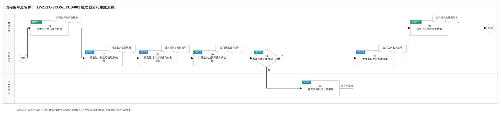
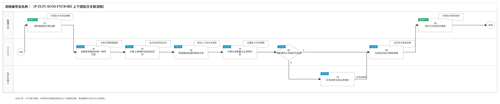
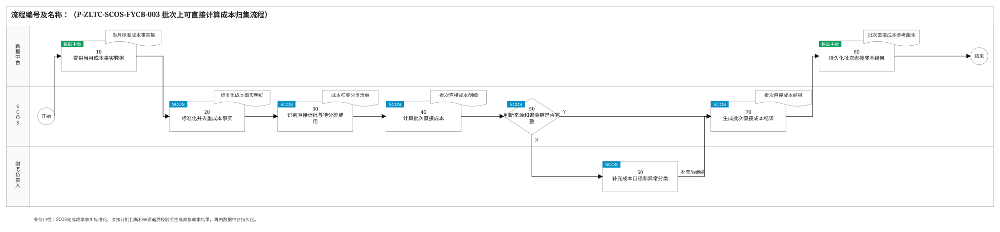
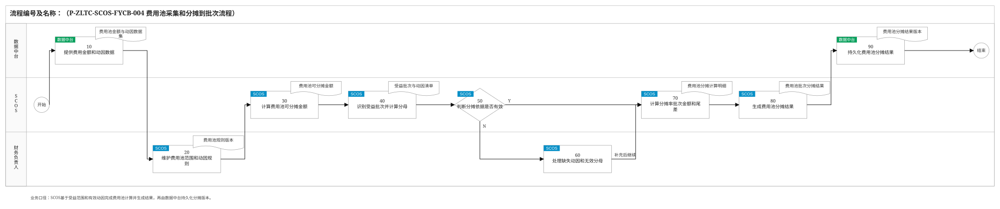
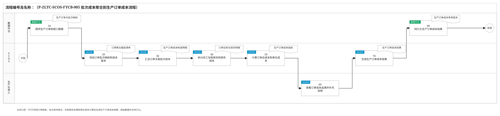
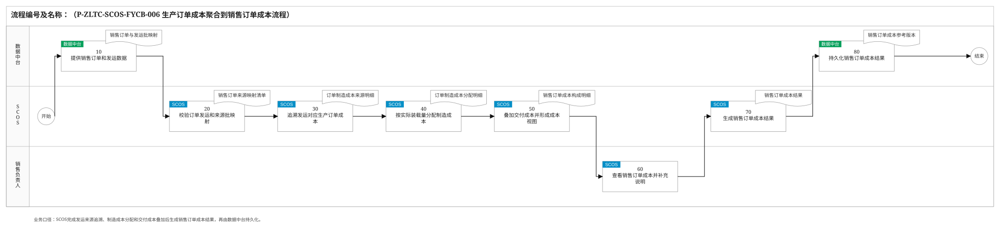
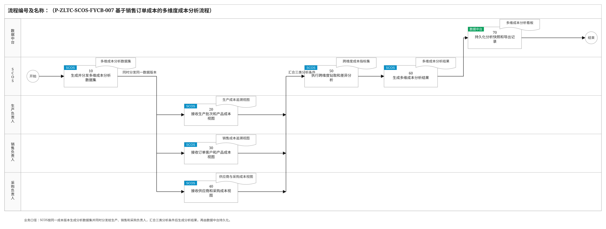
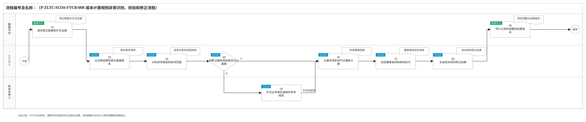
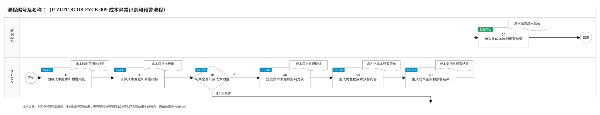

# 成本分摊模块关键业务流程说明

> 编制依据：《通用生产线批次生成与上下游关联业务方案》《通用生产线批次成本计算业务方案》《成本分摊模块关键业务流程和要点》《业务关键流程编制方法与经验总结》及《SVG流程图绘制规范与验收清单》。本版统一采用“数据中台供数与持久化、SCOS计算并先生成业务结果、生产/销售/采购/财务按职责查看和补充业务说明”的边界。模块输出用于成本追溯和经营分析参考，不替代实际财务核算、对账或业务结算。

## 2.2 关键业务流程说明

### 2.2.1 批次划分和生成流程

| 节点编号 | 节点名称 | 执行角色 | 输入/输出 | 处理说明 | 异常/分支 | 关联规则 |
|---|---|---|---|---|---|---|
| 开始 | 开始 | — | 输入：月末成本追溯任务 | 每月月末由SCOS启动当月生产批次生成。 | — | — |
| 10 | 提供生产执行和主数据 | 数据中台 | 输入：SCOS月度取数请求；输出：工单、收发存、投料、设备、阀门、计量、质检、发运、路线和批次规则 | 数据中台按工厂、自然月和截止时间提供标准数据，携带来源时间、单位、质量码和数据版本。 | 缺失字段、计量复位或来源冲突随数据质量标识返回，不按零处理。 | P-ZLTC-SCOS-FYCB-001-10-001 |
| 20 | 标准化并锁定月度取数快照 | SCOS | 输入：生产执行和主数据；输出：月度取数快照 | SCOS统一时区、单位、事件序号和主数据版本，校验重复事件后锁定本轮计算快照。 | 迟到或更正数据形成后续调整版本，不覆盖本轮快照。 | P-ZLTC-SCOS-FYCB-001-20-001 |
| 30 | 识别路线节点和批次对象类型 | SCOS | 输入：月度快照、有效路由和批次规则；输出：节点级批次对象清单 | SCOS按有效路线识别外部来源批、物流批、连续窗口批、设备周期批、工单活动批、实体罐批、库存批和发运批。 | 短路线不补建不存在的层级；共享设备按路线和物料隔离。 | P-ZLTC-SCOS-FYCB-001-30-001 |
| 40 | 计算批次边界和投入产出量 | SCOS | 输入：批次对象、边界事件和两端计量；输出：候选批次边界、投入量、产出量和合格量 | 连续段按切换、停机和动态到达时间划窗；罐批按进料、满罐、处理和出空闭环；入口与出口质量独立计算。 | 停流不累计；估算边界和数量时记录方法、参数与可信度。 | P-ZLTC-SCOS-FYCB-001-40-001 |
| 50 | 判断批次完整性和一致性 | SCOS | 输入：候选批次、路线、设备、计量和质量状态；输出：完整性检查结果 | SCOS检查编码唯一性、时间连续性、设备占用、容量、数量平衡、QC状态和期初在制衔接。 | N：进入60补充事实；Y：进入70生成结果。 | P-ZLTC-SCOS-FYCB-001-50-001 |
| 60 | 补充异常批次业务事实 | 生产负责人 | 输入：断档、重叠、低可信度或边界异常；输出：停机、旁路、清洗、切换、罐底或返工注入说明 | 生产负责人在SCOS查看证据并补充实际业务事实，确认可重算范围或保留待确认状态。 | 无可靠依据的批次保持待确认，不进入正式参考结果。 | P-ZLTC-SCOS-FYCB-001-60-001 |
| 70 | 生成当月生产批次结果 | SCOS | 输入：通过校验或已补充说明的候选批次；输出：当月生产批次结果 | SCOS汇总批次编码、类型、边界、数量、状态、规则版本、证据和可信度，形成可供谱系关联的结果版本。 | 低可信度但允许保留的批次单独标识，不与已确认批次混淆。 | P-ZLTC-SCOS-FYCB-001-70-001 |
| 80 | 持久化当月批次主数据 | 数据中台 | 输入：SCOS生成的当月生产批次结果；输出：当月批次主数据版本 | 数据中台保存批次结果及版本关系，提供给谱系关联和成本追溯使用。 | 更正时新增替代版本并保留旧版本引用。 | P-ZLTC-SCOS-FYCB-001-80-001 |
| 结束 | 结束 | — | 输出：已持久化的当月全量生产批次 | 批次生成流程完成。 | — | — |

### 2.2.2 上下游批次关联流程

| 节点编号 | 节点名称 | 执行角色 | 输入/输出 | 处理说明 | 异常/分支 | 关联规则 |
|---|---|---|---|---|---|---|
| 开始 | 开始 | — | 输入：当月批次主数据 | 批次生成完成后由SCOS启动当月谱系关联。 | — | — |
| 10 | 提供路由和关联证据 | 数据中台 | 输入：SCOS关联取数请求；输出：有效路由、阀门、转罐、物流、称重、计量和QC数据 | 数据中台按与批次生成一致的时间、单位和版本口径提供关联证据。 | 时钟漂移、计量复位和数据缺口随质量标识返回。 | P-ZLTC-SCOS-FYCB-002-10-001 |
| 20 | 加载有效路由并统一事件口径 | SCOS | 输入：批次主数据和关联证据；输出：事件时点有效路由及标准化事件 | SCOS按事件时间加载路由版本，统一时区、单位和事件顺序，排除重复或失效事件。 | 跨版本事件不直接相连，先标记异常。 | P-ZLTC-SCOS-FYCB-002-20-001 |
| 30 | 计算上游物料动态到达区间 | SCOS | 输入：上游边界、路径有效容积和实际流量；输出：各路由边到达区间 | 连续段采用实际流量积分传递边界；物流、罐式和设备周期节点采用实际收发及进出料事件。 | 固定时长仅作已维护的降级估算并降低可信度。 | P-ZLTC-SCOS-FYCB-002-30-001 |
| 40 | 筛选路线连通的候选关系 | SCOS | 输入：到达区间、下游接收区间、物料、设备和阀门状态；输出：候选上下游关系 | 仅保留有效路由、物料兼容、设备占用和时间重叠同时成立的关系。 | 时间重叠仅筛选候选，不直接代表数量归属。 | P-ZLTC-SCOS-FYCB-002-40-001 |
| 50 | 计算关系数量占比和转化率 | SCOS | 输入：独立质量计量、罐差、称重和业务单据；输出：转出量、接收量、去向占比、来源占比和转化率 | 优先按支路和接收点实测质量定量；只有总量时按同期实测流量积分占比分配。 | 不以标准配方或固定收率改写实际谱系。 | P-ZLTC-SCOS-FYCB-002-50-001 |
| 60 | 判断谱系关系是否可追溯 | SCOS | 输入：定量关系；输出：路线、重量、容量、顺序、配方、QC和返工校验结果 | SCOS校验分流与汇流合计、共享设备占用、QC放行、返工来源及成品罐禁止返流规则。 | N：进入70补充事实；Y：进入80生成结果。 | P-ZLTC-SCOS-FYCB-002-60-001 |
| 70 | 补充异常关系业务事实 | 生产负责人 | 输入：断档、不守恒、非法路线或低可信度关系；输出：旁路、停机、切换、返工和实际操作说明 | 生产负责人在SCOS核对异常关系并补充现场事实，供SCOS重新定量。 | 无可靠依据的关系保持候选状态。 | P-ZLTC-SCOS-FYCB-002-70-001 |
| 80 | 生成当月批次谱系结果 | SCOS | 输入：通过校验或已补充说明的关系；输出：当月批次谱系结果 | SCOS形成上下游批次、数量、占比、转化率、方法、证据、可信度和状态完整的双向谱系。 | 候选、确认和低可信度关系分状态输出。 | P-ZLTC-SCOS-FYCB-002-80-001 |
| 90 | 持久化当月批次谱系 | 数据中台 | 输入：SCOS生成的批次谱系结果；输出：月度批次谱系版本 | 数据中台保存关系结果和受影响后代索引，支持成本计算与双向追溯。 | 迟到或更正数据形成替代版本，不覆盖历史。 | P-ZLTC-SCOS-FYCB-002-90-001 |
| 结束 | 结束 | — | 输出：已持久化的当月批次谱系 | 上下游批次关联完成。 | — | — |

### 2.2.3 批次上可直接计算成本归集流程

| 节点编号 | 节点名称 | 执行角色 | 输入/输出 | 处理说明 | 异常/分支 | 关联规则 |
|---|---|---|---|---|---|---|
| 开始 | 开始 | — | 输入：当月批次谱系 | 谱系可用后由SCOS启动直接成本归集。 | — | — |
| 10 | 提供当月成本事实数据 | 数据中台 | 输入：SCOS成本取数请求；输出：采购、领料、能源、维修、检验、包装和运输成本事实 | 数据中台提供来源业务键、发生时间、数量、单价、金额、税额和暂估或实际标识。 | 缺失、重复或期间外记录携带数据质量标识。 | P-ZLTC-SCOS-FYCB-003-10-001 |
| 20 | 标准化并去重成本事实 | SCOS | 输入：成本事实；输出：标准化且唯一的成本记录 | SCOS统一期间、币种、税口径、数量单位和成本要素，以来源系统、凭证、行号和业务对象建立唯一键。 | 重复记录拒绝进入后续计算；暂估与实际保留关联。 | P-ZLTC-SCOS-FYCB-003-20-001 |
| 30 | 识别直接计批与待分摊费用 | SCOS | 输入：标准成本记录、批次谱系和成本BOM；输出：可直接计批记录和候选费用池记录 | SCOS检查产线节点定位、明确批次集合、数量金额完整性和费用池去重条件。 | 不能可靠定位的成本进入候选费用池，不强行平均。 | P-ZLTC-SCOS-FYCB-003-30-001 |
| 40 | 计算批次直接成本 | SCOS | 输入：领料、实测消耗、设备活动、样品、装载量或吨公里；输出：批次直接成本明细 | SCOS按实际业务数量拆分金额，计入成本实际发生节点，保留来源单据、成本要素和计算方法。 | 发票未到时保留采购批暂估，实际到达后形成差异版本。 | P-ZLTC-SCOS-FYCB-003-40-001 |
| 50 | 判断来源和追溯链是否完整 | SCOS | 输入：直接成本、候选费用池和来源总额；输出：来源唯一性、分类完整性和追溯链检查结果 | SCOS确认每笔成本可回到来源记录、只进入一种归集结果，并能沿批次谱系追溯。 | N：进入60补充成本口径；Y：进入70生成结果。 | P-ZLTC-SCOS-FYCB-003-50-001 |
| 60 | 补充成本口径和异常分类 | 财务负责人 | 输入：成本映射、税口径、暂估或分类异常；输出：成本要素映射和分类说明 | 财务负责人在SCOS核对业务事实并维护参考映射或说明，不执行实际对账。 | 修正后由SCOS重新分类和计算；无依据记录保持待处理。 | P-ZLTC-SCOS-FYCB-003-60-001 |
| 70 | 生成批次直接成本结果 | SCOS | 输入：通过校验的直接成本和候选费用池；输出：批次直接成本结果 | SCOS形成来源记录、批次、成本要素、数量、金额、规则、暂估状态、可信度和版本完整的结果。 | 待处理差异单列，不阻断其他可追溯成本。 | P-ZLTC-SCOS-FYCB-003-70-001 |
| 80 | 持久化批次直接成本结果 | 数据中台 | 输入：SCOS生成的批次直接成本结果；输出：批次直接成本参考版本 | 数据中台保存直接成本、候选费用池和来源引用，供费用池分摊及下游成本传导使用。 | 结果用于经营分析参考，不替代财务实际核算。 | P-ZLTC-SCOS-FYCB-003-80-001 |
| 结束 | 结束 | — | 输出：已持久化的批次直接成本和待分摊费用 | 直接成本归集完成。 | — | — |

### 2.2.4 费用池采集和分摊到批次流程

| 节点编号 | 节点名称 | 执行角色 | 输入/输出 | 处理说明 | 异常/分支 | 关联规则 |
|---|---|---|---|---|---|---|
| 开始 | 开始 | — | 输入：当月待分摊费用 | 直接成本分类完成后由SCOS启动费用池分摊。 | — | — |
| 10 | 提供费用金额和动因数据 | 数据中台 | 输入：SCOS费用池取数请求；输出：期间费用、工时、设备占用、能耗、处理量、绝干量和发运数据 | 数据中台按费用类型和期间提供来源总额、已直计金额、排除项及可用动因。 | 数据缺失时明确缺失范围，不自动补零。 | P-ZLTC-SCOS-FYCB-004-10-001 |
| 20 | 维护费用池范围和动因规则 | 财务负责人 | 输入：费用类型、成本要素和可用动因；输出：受益范围、首选和备选动因 | 财务负责人在SCOS维护人工、折旧、公共能源、维修、污水、保险和销售物流等费用的适用范围及动因优先级。 | 共享设备按实际占用或处理量定义受益范围。 | P-ZLTC-SCOS-FYCB-004-20-001 |
| 30 | 计算费用池可分摊金额 | SCOS | 输入：来源总额、已直计、非受益、资本化和调整项；输出：费用池可分摊金额 | SCOS按期间、成本中心、成本要素和费用池计算可分摊净额，并检查来源唯一性。 | 重复来源或扣减项不清时保持待处理。 | P-ZLTC-SCOS-FYCB-004-30-001 |
| 40 | 识别受益批次并计算分母 | SCOS | 输入：费用池范围、动因规则和当月批次；输出：受益批次、批次动因量和有效分母 | SCOS按期间和服务边界筛选受益批次，优先使用实测消耗、设备工时、处理量、绝干量或吨公里。 | 首选动因缺失时仅使用已维护的备选动因。 | P-ZLTC-SCOS-FYCB-004-40-001 |
| 50 | 判断分摊依据是否有效 | SCOS | 输入：可分摊金额、受益批次和分母；输出：动因可用性判断 | SCOS检查分母大于零、动因口径一致、受益范围非空且期间匹配。 | N：进入60选择处理方式；Y：进入70计算分摊。 | P-ZLTC-SCOS-FYCB-004-50-001 |
| 60 | 处理缺失动因和无效分母 | 财务负责人 | 输入：无效分母或缺失动因；输出：备选动因、停工闲置或未分摊说明 | 财务负责人在SCOS选择已配置备选动因；确无受益批次的维持费用标记停工或闲置，其他情况保持未分摊。 | 不得强制分给正常批次。 | P-ZLTC-SCOS-FYCB-004-60-001 |
| 70 | 计算分摊率批次金额和尾差 | SCOS | 输入：可分摊金额和有效动因；输出：分摊率、批次金额、尾差和未分摊项 | SCOS按动因量计算各批次参考金额，尾差独立处理并记录未分摊原因。 | 无可靠动因的数据保持未分摊。 | P-ZLTC-SCOS-FYCB-004-70-001 |
| 80 | 生成费用池分摊结果 | SCOS | 输入：分摊计算明细；输出：费用池分摊结果 | SCOS汇总费用池、受益范围、批次、动因量、分母、分摊率、金额、尾差、状态和版本。 | 结果仅用于成本追溯和经营分析。 | P-ZLTC-SCOS-FYCB-004-80-001 |
| 90 | 持久化费用池分摊结果 | 数据中台 | 输入：SCOS生成的费用池分摊结果；输出：费用池分摊结果版本 | 数据中台保存分摊结果及计算依据，供批次成本和订单成本计算使用。 | 不生成实际财务结算凭证。 | P-ZLTC-SCOS-FYCB-004-90-001 |
| 结束 | 结束 | — | 输出：已持久化的批次费用池成本 | 费用池分摊完成。 | — | — |

### 2.2.5 批次成本聚合到生产订单成本流程

| 节点编号 | 节点名称 | 执行角色 | 输入/输出 | 处理说明 | 异常/分支 | 关联规则 |
|---|---|---|---|---|---|---|
| 开始 | 开始 | — | 输入：批次直接成本和费用池成本 | 批次成本更新后由SCOS启动生产订单聚合。 | — | — |
| 10 | 提供生产订单和报工数据 | 数据中台 | 输入：SCOS取数请求；输出：工单、产品、路线、投料、产出、报工和状态数据 | 数据中台提供生产订单与实际批次、投料和产出的映射数据。 | 映射缺失时标记待补充，不用计划量替代实际。 | P-ZLTC-SCOS-FYCB-005-10-001 |
| 20 | 校验订单批次映射和成本版本 | SCOS | 输入：生产订单、批次映射、谱系和批次成本版本；输出：可聚合订单范围 | SCOS检查订单路线、批次状态、映射数量、成本版本和谱系版本一致性。 | 版本不一致或候选关系单独标识，不混入已确认结果。 | P-ZLTC-SCOS-FYCB-005-20-001 |
| 30 | 汇总订单关联批次成本 | SCOS | 输入：可聚合订单、批次直接成本和费用池成本；输出：订单传入、直接、费用池和调整成本 | SCOS沿实际批次关系按成本要素汇总，并保留订单到批次和来源记录的穿透路径。 | 重复批次成本通过版本和唯一键排除。 | P-ZLTC-SCOS-FYCB-005-30-001 |
| 40 | 拆分完工在制库存和损失成本 | SCOS | 输入：实际转出量、在制库存余额和损失记录；输出：完工、在制、库存、正常损耗和异常损失成本 | 已转出成本按实际关系量进入产出；未转出成本留在在制或库存；正常损耗由合格产出承担，异常损失单列。 | 不为月末展示将未转出余额全部计入完工产出。 | P-ZLTC-SCOS-FYCB-005-40-001 |
| 50 | 计算订单总成本和单位成本 | SCOS | 输入：订单成本构成、完工量和绝干量；输出：总成本、湿基单位成本和绝干单位成本 | SCOS按订单有效产出计算单位成本，同时保留原料、能耗、费用池和损失构成。 | 分母为空或为零时单位成本显示不可用。 | P-ZLTC-SCOS-FYCB-005-50-001 |
| 60 | 查看订单成本追溯并补充说明 | 生产负责人 | 输入：订单成本构成、单位成本和批次贡献；输出：停机、返工、工艺或收率差异说明 | 生产负责人在SCOS查看批次贡献和成本变化，补充业务事实供结果解释。 | 说明不直接改写底层计算；需修正数据时进入新版本。 | P-ZLTC-SCOS-FYCB-005-60-001 |
| 70 | 生成生产订单成本结果 | SCOS | 输入：订单成本指标和生产说明；输出：生产订单成本结果 | SCOS形成订单总成本、单位成本、在制余额、损失、批次穿透、业务说明和版本完整的结果。 | 待确认关系和不可用指标保留状态标识。 | P-ZLTC-SCOS-FYCB-005-70-001 |
| 80 | 持久化生产订单成本结果 | 数据中台 | 输入：SCOS生成的生产订单成本结果；输出：生产订单成本参考版本 | 数据中台保存订单结果及批次穿透明细，供销售订单聚合和多维分析使用。 | 底层批次成本更新时生成替代版本。 | P-ZLTC-SCOS-FYCB-005-80-001 |
| 结束 | 结束 | — | 输出：已持久化的生产订单成本 | 生产订单成本聚合完成。 | — | — |

### 2.2.6 生产订单成本聚合到销售订单成本流程

| 节点编号 | 节点名称 | 执行角色 | 输入/输出 | 处理说明 | 异常/分支 | 关联规则 |
|---|---|---|---|---|---|---|
| 开始 | 开始 | — | 输入：生产订单成本参考版本 | 生产订单成本可用后由SCOS启动销售订单聚合。 | — | — |
| 10 | 提供销售订单和发运数据 | 数据中台 | 输入：SCOS取数请求；输出：销售单、客户、发运批、来源库存批、车辆、装载量、签收和交付费用 | 数据中台提供销售订单与实际发运、装载来源、过磅、运输和签收数据。 | 订单、车次或来源批缺失时标记待补充。 | P-ZLTC-SCOS-FYCB-006-10-001 |
| 20 | 校验订单发运和来源批映射 | SCOS | 输入：销售订单、车次、发运批、来源库存批和装载量；输出：可计算销售订单范围 | SCOS检查一单多车、一车多批、来源库存批及装载量关系，统一退货、补发和跨期事件口径。 | 来源缺失时不使用全月平均成本替代。 | P-ZLTC-SCOS-FYCB-006-20-001 |
| 30 | 追溯发运对应生产订单成本 | SCOS | 输入：发运来源映射、批次谱系和生产订单成本；输出：来源生产批和制造成本贡献 | SCOS从发运批反向追溯库存批、生产批和生产订单，取得当前有效制造成本版本。 | 候选谱系和低可信度来源单独标识。 | P-ZLTC-SCOS-FYCB-006-30-001 |
| 40 | 按实际装载量分配制造成本 | SCOS | 输入：来源批可分配成本和订单装载量；输出：销售订单承接制造成本 | 同一来源批服务多订单时按实际装载质量拆分，未发运数量和成本继续保留在库存批。 | 退货、补发或更正形成独立调整版本。 | P-ZLTC-SCOS-FYCB-006-40-001 |
| 50 | 叠加交付成本并形成成本视图 | SCOS | 输入：包装、装车、车辆容器租赁、运输和保险费用；输出：制造成本、交付成本和完整成本视图 | 可定位订单和车次的费用直接计入；不可定位销售物流费用采用已维护的费用池规则。 | 经营期间费用只在完整成本视图展示，不回写生产工序成本。 | P-ZLTC-SCOS-FYCB-006-50-001 |
| 60 | 查看销售订单成本并补充说明 | 销售负责人 | 输入：订单、客户、产品、来源批次和成本视图；输出：订单或运输差异说明 | 销售负责人在SCOS查看制造成本、交付成本、单位成本和来源生产批，补充订单或运输业务事实。 | 说明用于经营分析，不替代实际销售结算。 | P-ZLTC-SCOS-FYCB-006-60-001 |
| 70 | 生成销售订单成本结果 | SCOS | 输入：销售订单成本视图和业务说明；输出：销售订单成本结果 | SCOS形成订单成本、单位成本、成本视图、来源生产订单、批次、车次、说明和版本完整的结果。 | 底层成本或发运数据更正时生成新版本。 | P-ZLTC-SCOS-FYCB-006-70-001 |
| 80 | 持久化销售订单成本结果 | 数据中台 | 输入：SCOS生成的销售订单成本结果；输出：销售订单成本参考版本 | 数据中台保存销售订单结果和穿透明细，供多维成本分析使用。 | 历史版本保留，不原地覆盖。 | P-ZLTC-SCOS-FYCB-006-80-001 |
| 结束 | 结束 | — | 输出：已持久化的销售订单成本 | 销售订单成本聚合完成。 | — | — |

### 2.2.7 基于销售订单成本的多维度成本分析流程

| 节点编号 | 节点名称 | 执行角色 | 输入/输出 | 处理说明 | 异常/分支 | 关联规则 |
|---|---|---|---|---|---|---|
| 开始 | 开始 | — | 输入：多维成本分析请求 | SCOS按用户查询或月度更新启动多维分析。 | — | — |
| 10 | 生成并分发多维成本分析数据集 | SCOS | 输入：数据中台中的批次、生产订单、销售订单成本及维度主数据；输出：统一多维成本分析数据集 | SCOS按同一时间范围、成本版本和维度口径汇集数据，并同时分发给生产、销售和采购负责人。 | 维度映射缺失时单列待映射；三个角色接收的数据版本一致。 | P-ZLTC-SCOS-FYCB-007-10-001 |
| 20 | 接收生产批次和产品成本视图 | 生产负责人 | 输入：统一多维成本分析数据集；输出：产品、生产订单、批次、原料、能耗和损耗分析条件 | 生产负责人在SCOS选择产品、产线、生产订单和批次，查看成本结构、趋势及穿透关系。 | 单位成本分母为空时显示不可用。 | P-ZLTC-SCOS-FYCB-007-20-001 |
| 30 | 接收订单客户和产品成本视图 | 销售负责人 | 输入：统一多维成本分析数据集；输出：销售订单、客户、产品、交付和来源生产成本分析条件 | 销售负责人在SCOS查看订单、客户和产品的制造成本、交付成本、成本贡献及来源批次。 | 退货或跨期订单按有效事件和版本展示。 | P-ZLTC-SCOS-FYCB-007-30-001 |
| 40 | 接收供应商和采购成本视图 | 采购负责人 | 输入：统一多维成本分析数据集；输出：供应商、原料、采购批次、采购价格和成本贡献分析条件 | 采购负责人在SCOS查看供应商和采购批次对生产批次及销售订单的原料成本贡献、价格差异和用量差异。 | 供应商贡献按实际采购批次和谱系计算。 | P-ZLTC-SCOS-FYCB-007-40-001 |
| 50 | 执行跨维度钻取和差异分析 | SCOS | 输入：生产、销售和采购三类分析条件；输出：订单、客户、供应商、产品和成本要素组合指标 | SCOS汇合三个角色的分析条件，执行维度组合、时间筛选、要素拆分及销售订单至采购批次的反向追溯。 | 筛选条件只改变展示范围，不改变底层成本结果。 | P-ZLTC-SCOS-FYCB-007-50-001 |
| 60 | 生成多维成本分析结果 | SCOS | 输入：跨维度指标和三类角色视图；输出：多维成本分析结果 | SCOS生成生产、销售、采购角色视图、追溯路径、差异指标、成本版本和数据完整性状态。 | 待映射维度与不可用指标单独展示。 | P-ZLTC-SCOS-FYCB-007-60-001 |
| 70 | 持久化分析快照和导出记录 | 数据中台 | 输入：SCOS生成的多维成本分析结果；输出：分析快照、看板和导出记录 | 数据中台保存分析条件、数据版本、指标结果和导出记录，供三个角色持续追溯。 | 底层成本更新后生成新快照并保留历史引用。 | P-ZLTC-SCOS-FYCB-007-70-001 |
| 结束 | 结束 | — | 输出：已持久化的多维成本分析结果 | 本次分析完成。 | — | — |

### 2.2.8 成本计算规则异常识别、校验和修正流程

| 节点编号 | 节点名称 | 执行角色 | 输入/输出 | 处理说明 | 异常/分支 | 关联规则 |
|---|---|---|---|---|---|---|
| 开始 | 开始 | — | 输入：成本计算异常或迟到更正数据 | SCOS在批次、谱系或成本计算中发现异常时启动。 | — | — |
| 10 | 提供更正数据和补充证据 | 数据中台 | 输入：SCOS异常取数请求；输出：更正事件、计量、主数据或成本事实 | 数据中台按原数据版本返回更正记录、来源时间和替代关系，不覆盖原始数据。 | 无法补充时明确缺失范围和数据质量。 | P-ZLTC-SCOS-FYCB-008-10-001 |
| 20 | 比对原结果和更正数据版本 | SCOS | 输入：原结果、原始快照和更正数据；输出：字段差异、时间边界差异和版本关系 | SCOS核对事件、计量、主数据、成本事实和规则的变更项，识别真正需要重算的差异。 | 无实质变化的数据不触发全链重算。 | P-ZLTC-SCOS-FYCB-008-20-001 |
| 30 | 识别异常类型和影响范围 | SCOS | 输入：版本差异、批次谱系和成本规则；输出：异常批次、关系、费用池、订单和受影响后代 | SCOS区分时间、路线、计量、批次、动因、重复成本和成本映射异常，定位最早受影响节点。 | 未受影响结果继续可用，异常范围标记待更新。 | P-ZLTC-SCOS-FYCB-008-30-001 |
| 40 | 判断证据和规则是否足以重算 | SCOS | 输入：异常记录、补充证据和现行规则；输出：可重算判断及证据优先级 | 依次判断独立计量、称重转罐、罐差、体积密度及已维护备选规则是否可用。 | N：进入50补充口径；Y：进入60重算。 | P-ZLTC-SCOS-FYCB-008-40-001 |
| 50 | 补充业务事实或维护参考规则 | 财务负责人 | 输入：证据不足或规则缺失事项；输出：成本映射、备选动因或继续待确认说明 | 财务负责人在SCOS维护成本映射和费用池参考口径，并引用已记录的生产业务事实。 | 仍不足时保持待确认，不强行计算。 | P-ZLTC-SCOS-FYCB-008-50-001 |
| 60 | 从最早受影响节点重新计算 | SCOS | 输入：补充证据和修正规则；输出：新批次、谱系、批次成本和订单成本 | SCOS保留原版本，从最早受影响节点重建关系并逐级刷新全部下游后代。 | 重算失败时保留上一可用版本并记录失败原因。 | P-ZLTC-SCOS-FYCB-008-60-001 |
| 70 | 校验重算差异和影响后代 | SCOS | 输入：新旧结果和影响范围；输出：数量差异、成本差异、状态变化和后代覆盖检查 | SCOS确认重算范围完整、数量与成本变化可解释、未受影响对象未被改写。 | 超出预期范围时返回30重新定位。 | P-ZLTC-SCOS-FYCB-008-70-001 |
| 80 | 生成成本规则修正结果 | SCOS | 输入：通过校验的重算结果和差异说明；输出：规则调整、替代关系和成本修正结果 | SCOS形成调整前后规则、影响范围、差异、业务说明、新结果版本和历史引用。 | 不生成实际财务调整凭证。 | P-ZLTC-SCOS-FYCB-008-80-001 |
| 90 | 持久化规则调整和结果版本 | 数据中台 | 输入：SCOS生成的成本规则修正结果；输出：规则调整和成本参考版本 | 数据中台保存修正结果、新旧版本关系及受影响对象索引。 | 历史结果只读保留，不原地覆盖。 | P-ZLTC-SCOS-FYCB-008-90-001 |
| 结束 | 结束 | — | 输出：已持久化的可追溯修正结果 | 异常修正完成。 | — | — |

### 2.2.9 成本异常识别和预警流程

| 节点编号 | 节点名称 | 执行角色 | 输入/输出 | 处理说明 | 异常/分支 | 关联规则 |
|---|---|---|---|---|---|---|
| 开始 | 开始 | — | 输入：新成本参考版本或周期监测任务 | SCOS在成本结果更新或周期任务触发时启动异常识别。 | — | — |
| 10 | 加载成本版本和预警规则 | SCOS | 输入：批次、生产订单、销售订单、费用池成本和阈值版本；输出：监测范围与基准 | SCOS锁定本次监测使用的成本版本、时间范围、对象范围、比较基准和规则阈值。 | 阈值未维护时只计算变化，不自动判定异常。 | P-ZLTC-SCOS-FYCB-009-10-001 |
| 20 | 计算成本变化和异常指标 | SCOS | 输入：监测范围与基准；输出：价格、用量、收率、能耗、单位成本和分摊变化 | SCOS按产线、产品、订单、客户、供应商和时间比较当前结果与规则阈值及历史趋势。 | 低可信度关系和不可用单位成本单独标识。 | P-ZLTC-SCOS-FYCB-009-20-001 |
| 30 | 判断是否形成成本预警 | SCOS | 输入：异常指标、阈值和数据可信度；输出：预警判断和初始等级 | SCOS识别明显突变、未分摊费用、低可信度关系、单位成本不可用和成本结构异常。 | Y：进入40定位异常；N：直接进入60生成无预警监测结果。 | P-ZLTC-SCOS-FYCB-009-30-001 |
| 40 | 定位异常来源和影响对象 | SCOS | 输入：预警指标、批次谱系和订单成本；输出：异常来源、受影响批次、产品、订单、客户和供应商 | SCOS沿谱系分解原料价格、用量、收率、能耗、共享设备、费用池、损失和交付费用贡献。 | 无法定位时标记待分析，不输出确定性责任结论。 | P-ZLTC-SCOS-FYCB-009-40-001 |
| 50 | 生成角色化成本预警内容 | SCOS | 输入：异常来源、影响对象和等级；输出：生产、销售、采购和财务关注的预警内容及追溯入口 | SCOS按异常对象生成角色化提示，同一异常保留一个主记录并配置多个查看视图。 | 提示只用于关注和追溯，不自动认定损失。 | P-ZLTC-SCOS-FYCB-009-50-001 |
| 60 | 生成成本监测和预警结果 | SCOS | 输入：预警内容或无预警判断；输出：本轮监测结果、预警状态和追溯入口 | SCOS统一生成监测批次、指标快照、预警等级、异常对象、角色视图、开放状态和更新时间。 | 无预警时保存正常监测结果，有预警时保存开放预警。 | P-ZLTC-SCOS-FYCB-009-60-001 |
| 70 | 持久化成本监测预警结果 | 数据中台 | 输入：SCOS生成的成本监测和预警结果；输出：监测结果及预警版本 | 数据中台保存指标快照、预警主记录、角色视图、状态和历史变化。 | 状态变化形成新记录，不覆盖历史结果。 | P-ZLTC-SCOS-FYCB-009-70-001 |
| 结束 | 结束 | — | 输出：已持久化的成本监测预警及追溯入口 | 本轮异常识别完成。 | — | — |

## 2.3 统一业务边界与控制原则

- 角色仅包括数据中台、SCOS、生产负责人、财务负责人、销售负责人和采购负责人；每张流程图只保留实际承担流程节点的角色泳道。
- 各执行系统的原始数据统一汇入数据中台；凡需获取原始生产、物流、质量、计量、订单或成本数据的流程，均由SCOS向数据中台取数。
- SCOS负责批次生成、谱系关联、成本计算、参考分摊、追溯分析和异常识别；每个流程均由SCOS先形成完整业务结果，再交由数据中台持久化。
- 数据中台只负责统一供数和结果持久化，不承担批次生成、谱系判断、成本计算或业务复核。
- 生产负责人、销售负责人、采购负责人和财务负责人在SCOS查看各自关注的成本追溯结果，并按需补充业务说明或维护参考口径，不设置多级审批。
- 成本分摊结果用于生产、销售、采购和财务的经营分析参考，不替代财务总账、实际成本核算、法定对账、开票或结算。
- 每月月末由SCOS基于数据中台提供的当月数据生成批次和上下游谱系，再计算直接成本、费用池参考分摊、生产订单和销售订单成本。
- 连续时间窗口是可审计的管理近似；时间用于筛选候选关系，实际计量负责数量归属。
- 无可靠数据或分摊动因时保持待确认或未分摊状态，不强行生成看似完整的成本。
- 更正数据和规则调整形成新版本并保留历史关系，不原地覆盖已持久化结果。

## 2.4 关键数据产出对照

| 流程 | 关键数据产出 | 持久化位置 |
|---|---|---|
| 批次划分和生成流程 | 当月生产执行数据集、月度批次取数快照、批次对象与规则清单、当月候选批次清单、当月生产批次结果、当月批次主数据版本 | 数据中台 |
| 上下游批次关联流程 | 月度批次关联证据集、关联计算基础数据、批次动态到达区间、候选上下游关系清单、定量批次关系明细、当月批次谱系结果、月度批次谱系版本 | 数据中台 |
| 批次上可直接计算成本归集流程 | 当月标准成本事实集、标准化成本事实明细、成本归集分类清单、批次直接成本明细、批次直接成本结果、批次直接成本参考版本 | 数据中台 |
| 费用池采集和分摊到批次流程 | 费用池金额与动因数据集、费用池规则版本、费用池可分摊金额、受益批次与动因清单、费用池分摊计算明细、费用池批次分摊结果、费用池分摊结果版本 | 数据中台 |
| 批次成本聚合到生产订单成本流程 | 生产订单与批次映射、订单聚合基础清单、生产订单成本构成明细、订单在制与损失明细、生产订单成本指标、生产订单成本结果、生产订单成本参考版本 | 数据中台 |
| 生产订单成本聚合到销售订单成本流程 | 销售订单与发运批映射、销售订单来源映射清单、订单制造成本来源明细、订单制造成本分配明细、销售订单成本构成明细、销售订单成本结果、销售订单成本参考版本 | 数据中台 |
| 基于销售订单成本的多维度成本分析流程 | 多维成本分析数据集、生产成本追溯视图、销售成本追溯视图、供应商与采购成本视图、跨维度成本指标集、多维成本分析结果、多维成本分析看板 | 数据中台 |
| 成本计算规则异常识别、校验和修正流程 | 更正数据与补充证据、版本差异清单、异常与影响范围清单、异常重算结果、重算差异校验清单、成本规则修正结果、规则调整与结果版本 | 数据中台 |
| 成本异常识别和预警流程 | 成本监测范围与规则、成本异常指标集、成本异常来源明细、角色化成本预警清单、成本监测与预警结果、成本预警结果记录 | 数据中台 |
