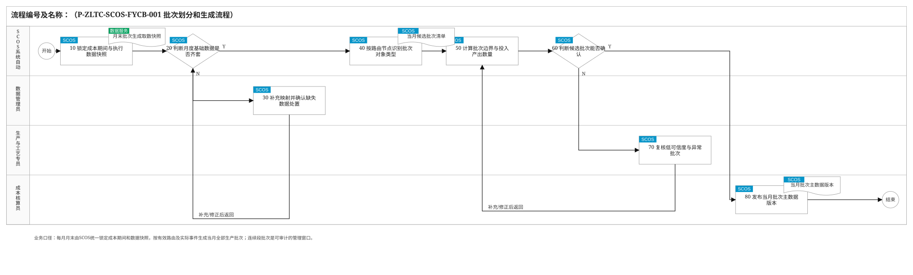
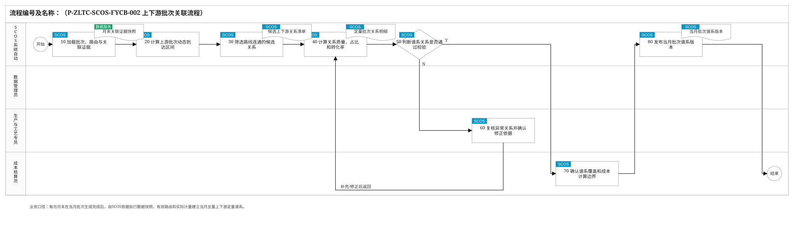
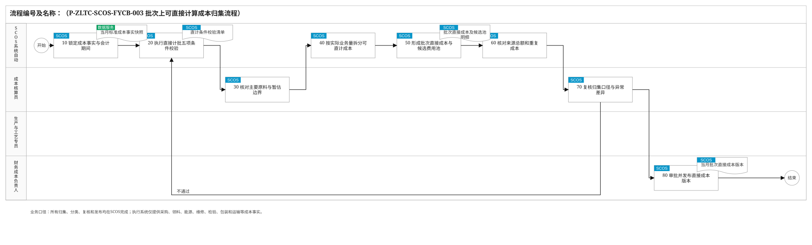
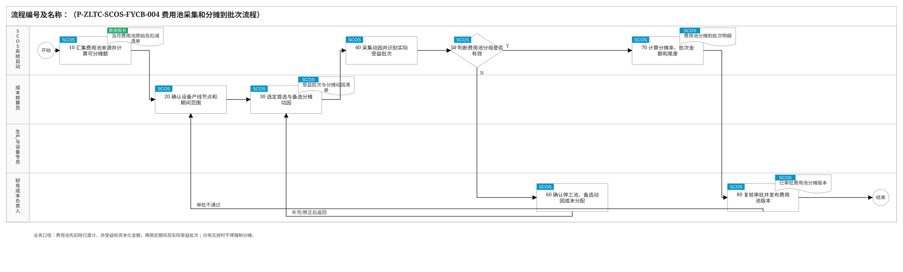
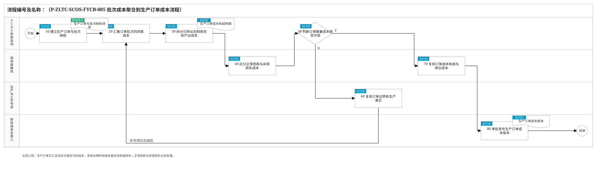
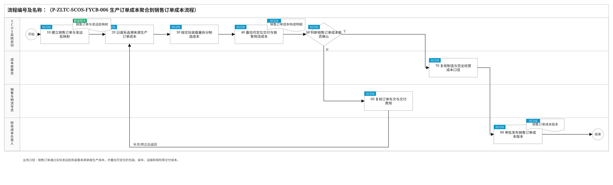
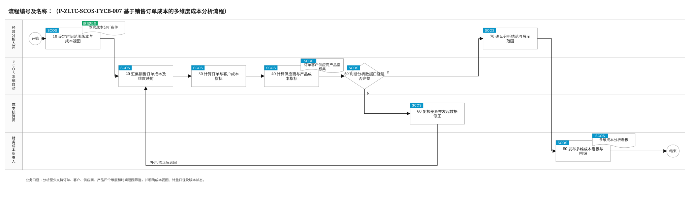
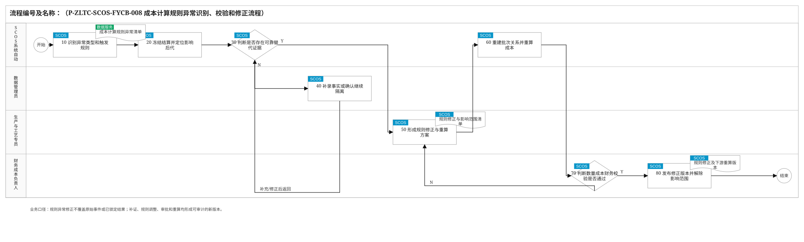
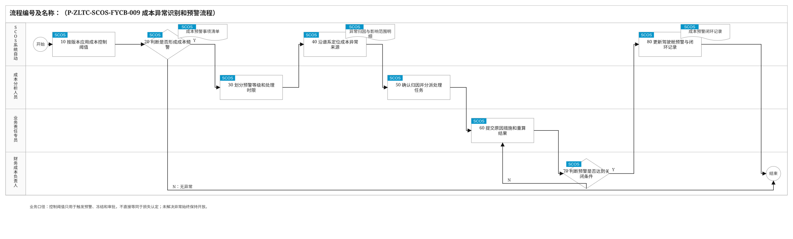

# 成本分摊模块关键业务流程说明

> 编制依据：《通用生产线批次生成与上下游关联业务方案》《通用生产线批次成本计算业务方案》《成本分摊模块关键业务流程和要点》《业务关键流程编制方法与经验总结》及《SVG流程图绘制规范与验收清单》。本版统一采用“执行系统供数、SCOS完成全部计算与复核、角色按环节承担责任”的业务边界；批次生成和上下游关联均由SCOS在每月月末成本分摊时基于锁定的数据快照自动发起。

## 2.2 关键业务流程说明

### 2.2.1 批次划分和生成流程

| 节点编号 | 节点名称 | 执行角色 | 输入/输出 | 处理说明 | 异常/分支 | 关联规则 |
|---|---|---|---|---|---|---|
| 开始 | 开始 | — | 输入：月末批次生成任务 | SCOS在每月月末成本分摊任务中自动发起当月批次生成。 | — | — |
| 10 | 锁定成本期间与执行数据快照 | SCOS系统自动 | 输入：期间日历、各执行系统生产/物流/质量/计量数据；输出：月末取数快照 | 按工厂、自然月、截止时间锁定MES、WMS、DCS/PLC、QMS/LIMS、地磅等数据版本，记录来源时间和增量批次。 | 截止后迟到数据不覆盖快照，进入差异版本处理。 | P-ZLTC-SCOS-FYCB-001-10-001 |
| 20 | 判断月度基础数据是否齐套 | SCOS系统自动 | 输入：取数快照、必需字段清单；输出：完整性校验结果 | 逐产线校验有效路由、设备/容器、批次规则、入口出口计量、工单、阀门、罐次、质检和发运事件是否覆盖当月。 | N：进入30补充或确认；Y：进入40。 | P-ZLTC-SCOS-FYCB-001-20-001 |
| 30 | 补充映射并确认缺失数据处置 | 数据管理员 | 输入：缺失项和来源差异；输出：补充映射、替代证据或隔离结论 | 数据管理员在SCOS中补齐主数据映射、说明迟到/冲突原因，并指定经批准的替代计量；不能补齐的范围保持隔离。 | 补齐后返回20；不得把缺失数量直接按零处理。 | P-ZLTC-SCOS-FYCB-001-30-001 |
| 40 | 按路由节点识别批次对象类型 | SCOS系统自动 | 输入：有效路由、实际事件；输出：当月候选批次对象 | 按节点配置识别外部来源批、物流批、连续窗口批、设备周期批、配方/工单活动批、实体罐批、库存批和发运批。 | 短流程不存在的节点不生成虚假批次；共享设备按来源路线和物料隔离。 | P-ZLTC-SCOS-FYCB-001-40-001 |
| 50 | 计算批次边界与投入产出数量 | SCOS系统自动 | 输入：边界事件、两端计量、动态过程时间；输出：批次起止时间、投入/产出/合格质量 | 连续段按真实切批、停机、产品/配方切换和动态到达时间划窗；罐批按进料、满罐、处理、出空闭环；入口和出口质量独立计算。 | 停流不累计；仅用体积密度或时间估算时降低可信度。 | P-ZLTC-SCOS-FYCB-001-50-001 |
| 60 | 判断候选批次能否确认 | SCOS系统自动 | 输入：候选批次及规则证据；输出：路线、容量、时间、质量、编码校验 | 检查全局ID、边界连续性、设备占用、罐容量、计量质量码、质量状态及期初在制衔接。 | N：进入70复核；Y：进入80。 | P-ZLTC-SCOS-FYCB-001-60-001 |
| 70 | 复核低可信度与异常批次 | 生产与工艺专员 | 输入：低可信度或异常候选；输出：业务确认、补录或隔离意见 | 生产与工艺专员在SCOS中核对停机、旁路、清洗、切换、罐底、返工注入和人工操作事实。 | 有可靠依据时返回50重算；无依据时保持候选/隔离并阻止正式结算。 | P-ZLTC-SCOS-FYCB-001-70-001 |
| 80 | 发布当月批次主数据版本 | 成本核算员 | 输入：校验通过批次；输出：已确认当月批次版本 | 成本核算员在SCOS中确认覆盖范围后发布批次编码、对象类型、边界、数量、证据、可信度和规则版本。 | 已冻结批次不原地修改；迟到事件创建新版本并标记影响范围。 | P-ZLTC-SCOS-FYCB-001-80-001 |
| 结束 | 结束 | — | 输出：可用于谱系关联的当月全量批次 | 批次生成完成，进入上下游批次关联。 | — | — |

### 2.2.2 上下游批次关联流程

| 节点编号 | 节点名称 | 执行角色 | 输入/输出 | 处理说明 | 异常/分支 | 关联规则 |
|---|---|---|---|---|---|---|
| 开始 | 开始 | — | 输入：当月批次主数据版本、月末取数快照 | SCOS在当月全量批次生成完成后自动发起谱系关联。 | — | — |
| 10 | 加载批次、路由与关联证据 | SCOS系统自动 | 输入：当月批次、有效路由边、阀门/物流/转罐/称重事件；输出：关联计算数据集 | 按事件发生时点加载对应路由和规则版本，统一时区、单位及事件序号。 | 版本不一致、时钟漂移或重复事件先标记异常，不跨版本误连。 | P-ZLTC-SCOS-FYCB-002-10-001 |
| 20 | 计算上游批次动态到达区间 | SCOS系统自动 | 输入：上游边界、路径有效容积、实际流量；输出：各路由边到达区间 | 连续段按实际流量积分传递边界；物流、罐式和设备周期节点使用实际收发、进出料事件。 | 固定时长只可作为批准的降级估算，须记录参数版本。 | P-ZLTC-SCOS-FYCB-002-20-001 |
| 30 | 筛选路线连通的候选关系 | SCOS系统自动 | 输入：到达区间、下游接收区间、物料/设备/阀门；输出：候选上下游关系 | 仅保留有效路由边、物料兼容、设备占用与时间重叠同时成立且未被高优先级证据排除的关系。 | 时间重叠只用于筛选，不直接代表质量归属。 | P-ZLTC-SCOS-FYCB-002-30-001 |
| 40 | 计算关系质量、占比和转化率 | SCOS系统自动 | 输入：独立质量计量、罐差、称重及业务单据；输出：转出量、接收量、去向占比、来源占比、转化率 | 优先按支路和接收点质量累计量定量；多来源共用总量时按同期实测流量积分占比分配。 | 不以标准配方或固定收率改写实际谱系；低优先级证据降低可信度。 | P-ZLTC-SCOS-FYCB-002-40-001 |
| 50 | 判断谱系关系是否通过校验 | SCOS系统自动 | 输入：定量关系；输出：重量、容量、路线、顺序、配方和质量校验 | 校验分流支路合计、汇流来源合计、共享设备占用、QC放行及返工路径。 | N：进入60复核；Y：进入70。 | P-ZLTC-SCOS-FYCB-002-50-001 |
| 60 | 复核异常关系并确认修正依据 | 生产与工艺专员 | 输入：断档、重叠、不守恒、非法路线或低可信度关系；输出：替代证据、补录或隔离意见 | 生产与工艺专员在SCOS中核对旁路、手工阀门、计量复位、停机切换、清洗和QC返工审批。 | 补证后返回40重算；成品罐返流、无不合格结论或无审批返工直接判非法。 | P-ZLTC-SCOS-FYCB-002-60-001 |
| 70 | 确认谱系覆盖和成本计算边界 | 成本核算员 | 输入：校验通过关系及未决异常；输出：月度谱系确认结论 | 成本核算员在SCOS中核对每个发运批可反追全部原料、每个原料批可正追全部去向，并确认隔离范围不参与正式结算。 | 覆盖不完整时返回30；仅候选或D级关系不得进入财务锁定成本。 | P-ZLTC-SCOS-FYCB-002-70-001 |
| 80 | 发布当月批次谱系版本 | SCOS系统自动 | 输入：确认结论；输出：已确认/已冻结关系版本和受影响后代清单 | SCOS保存每条关系的质量、占比、转化率、方法、证据、可信度及版本，形成双向可追溯谱系。 | 迟到或更正事件发布替代版本，从最早受影响节点触发成本重算。 | P-ZLTC-SCOS-FYCB-002-80-001 |
| 结束 | 结束 | — | 输出：供成本分摊使用的当月批次谱系 | 谱系关联完成，进入直接成本和费用池处理。 | — | — |

### 2.2.3 批次上可直接计算成本归集流程

| 节点编号 | 节点名称 | 执行角色 | 输入/输出 | 处理说明 | 异常/分支 | 关联规则 |
|---|---|---|---|---|---|---|
| 开始 | 开始 | — | 输入：当月已确认批次谱系、成本事实快照 | 当月谱系可用后，SCOS自动发起直接成本归集。 | — | — |
| 10 | 锁定成本事实与会计期间 | SCOS系统自动 | 输入：ERP、MES、能源、EAM、QMS、物流等成本数据；输出：标准成本事实快照 | 按来源系统、凭证号、行号、业务对象和发生时间建立唯一键，统一数量、单位、不含税金额、税额及暂估/实际标识。 | 期间外、字段缺失或重复数据进入异常清单。 | P-ZLTC-SCOS-FYCB-003-10-001 |
| 20 | 执行直接计批五项条件校验 | SCOS系统自动 | 输入：成本事实、批次谱系；输出：可直计/候选费用池分类 | 校验唯一业务键、产线/节点/活动定位、明确批次集合、数量金额完整及费用池去重五项条件。 | 任一条件不满足不得直接计批。 | P-ZLTC-SCOS-FYCB-003-20-001 |
| 30 | 核对主要原料与暂估边界 | 成本核算员 | 输入：采购、收货、供应商批、发票及价差；输出：原料批暂估/实际成本 | 成本核算员在SCOS中将主要原料成本定位到供应商或入厂原料批；发票未到按采购批暂估，实际到达形成价差版本。 | 主要原料不可定位时仍按采购批暂估，不进入公共生产费用池。 | P-ZLTC-SCOS-FYCB-003-30-001 |
| 40 | 按实际业务量拆分可直计成本 | SCOS系统自动 | 输入：领料/投加、分表能源、维修工单、检验单、装车和运输记录；输出：批次拆分比例和金额 | 按实际领料、实测消耗、设备活动、样品数、装载质量或吨公里将记录拆分到一个或一组明确批次。 | 标准比例仅用于经批准的备选规则，并降低可信度。 | P-ZLTC-SCOS-FYCB-003-40-001 |
| 50 | 形成批次直接成本与候选费用池 | SCOS系统自动 | 输入：分类及拆分结果；输出：批次直接成本明细、候选费用池明细 | 直计金额计入成本实际发生节点；不可直计的人工、公共能耗、折旧、维修等按期间和受益边界进入候选池。 | 同一来源金额只能进入一个结果，禁止重复归集。 | P-ZLTC-SCOS-FYCB-003-50-001 |
| 60 | 核对来源总额和重复成本 | SCOS系统自动 | 输入：源系统总额、直计金额、候选池金额、排除项；输出：勾稽差异 | 按来源和成本要素核对“源总额=直计+候选池+排除/资本化+待处理差异”。 | 差异未解释或重复唯一键存在时不得发布。 | P-ZLTC-SCOS-FYCB-003-60-001 |
| 70 | 复核归集口径与异常差异 | 成本核算员 | 输入：归集结果和勾稽差异；输出：复核意见及修正要求 | 成本核算员在SCOS中核对成本要素、税口径、发生节点、暂估标识和不可直计原因。 | 不通过返回20重新分类或40重新拆分。 | P-ZLTC-SCOS-FYCB-003-70-001 |
| 80 | 审批并发布直接成本版本 | 财务成本负责人 | 输入：复核通过结果；输出：当月批次直接成本版本 | 财务成本负责人在SCOS中审批后发布，触发批次成本逐级传导；保留来源单据到批次的穿透关系。 | 已锁定版本调整须冲销原记录并发布差异版本。 | P-ZLTC-SCOS-FYCB-003-80-001 |
| 结束 | 结束 | — | 输出：已发布直接成本及待分摊费用池 | 直接成本归集完成。 | — | — |

### 2.2.4 费用池采集和分摊到批次流程

| 节点编号 | 节点名称 | 执行角色 | 输入/输出 | 处理说明 | 异常/分支 | 关联规则 |
|---|---|---|---|---|---|---|
| 开始 | 开始 | — | 输入：当月候选费用池及期间结算任务 | 直接成本归集完成后，SCOS自动发起费用池处理。 | — | — |
| 10 | 汇集费用池来源并计算可分摊额 | SCOS系统自动 | 输入：会计凭证、候选池、直计金额、排除/资本化及调整；输出：费用池可分摊金额 | 按费用池、期间、成本中心和成本要素计算“来源总额-已直计-非受益-资本化+审批调整”。 | 来源不全、重复或调整未审批时保持草稿。 | P-ZLTC-SCOS-FYCB-004-10-001 |
| 20 | 确认设备产线节点和期间范围 | 成本核算员 | 输入：费用池及服务边界；输出：受益范围规则 | 成本核算员在SCOS中按费用实际发生位置限定设备、班组、产线、工艺节点和有效期间。 | 共享设备不得按名义归属全额分给单一产线。 | P-ZLTC-SCOS-FYCB-004-20-001 |
| 30 | 选定首选与备选分摊动因 | 成本核算员 | 输入：费用池类型和可用计量；输出：动因规则 | 依次优先采用实测消耗、设备/批次有效工时、处理量/绝干量/吨公里、合格产量或标准工时；收入仅用于完全经营成本视图。 | 备选动因必须预先配置并经审批，不能临时改变口径。 | P-ZLTC-SCOS-FYCB-004-30-001 |
| 40 | 采集动因并识别实际受益批次 | SCOS系统自动 | 输入：表计、设备占用、处理量、班组工时和发运数据；输出：批次动因量及分母 | SCOS按受益范围筛选当月批次；共享设备按实际占用小时与批准权重计算动因。 | 无占用事件、期间错配或批次状态不合格时不得进入分母。 | P-ZLTC-SCOS-FYCB-004-40-001 |
| 50 | 判断费用池分母是否有效 | SCOS系统自动 | 输入：可分摊额、受益批次和动因分母；输出：可分摊判断 | 确认分母大于零、受益批次完整、动因口径一致且可信度满足结算要求。 | N：进入60；Y：进入70。 | P-ZLTC-SCOS-FYCB-004-50-001 |
| 60 | 确认停工池、备选动因或未分配 | 财务成本负责人 | 输入：无效分母费用池；输出：停工/闲置、备选动因审批或未分配结论 | 财务成本负责人在SCOS中确认：无受益批次的维持成本转停工池；首选缺失可批准备选；均不可用则保持未分配。 | 未分配费用池阻止期间结算，不得摊给下一期正常产品。 | P-ZLTC-SCOS-FYCB-004-60-001 |
| 70 | 计算分摊率、批次金额和尾差 | SCOS系统自动 | 输入：有效费用池和动因；输出：分摊率、批次分摊额、尾差 | 按可分摊额/总动因计算分摊率，逐批次计算金额；舍入尾差单列并计入动因量最大的受益批次。 | 分摊合计必须等于可分摊额，否则不得提交审批。 | P-ZLTC-SCOS-FYCB-004-70-001 |
| 80 | 复核审批并发布费用池版本 | 财务成本负责人 | 输入：分摊明细、未分配项和勾稽结果；输出：已审批费用池版本及重算任务 | 财务成本负责人在SCOS中核对受益边界、动因、尾差和总额后发布，费用进入实际发生节点批次并触发全部下游重算。 | 不通过返回20修正范围或30修正动因。 | P-ZLTC-SCOS-FYCB-004-80-001 |
| 结束 | 结束 | — | 输出：批次费用池成本及下游重算任务 | 费用池分摊完成。 | — | — |

### 2.2.5 批次成本聚合到生产订单成本流程

| 节点编号 | 节点名称 | 执行角色 | 输入/输出 | 处理说明 | 异常/分支 | 关联规则 |
|---|---|---|---|---|---|---|
| 开始 | 开始 | — | 输入：批次直接成本、费用池成本及订单结算任务 | 费用池发布或批次成本版本更新后由SCOS自动发起。 | — | — |
| 10 | 建立生产订单与批次映射 | SCOS系统自动 | 输入：MES工单、路线、报工、投料、产出及批次谱系；输出：订单—投入批—产出批映射 | 按实际工单活动和批次关系确定订单消耗、在制和产出范围，不使用计划量替代实际批次。 | 映射缺失时进入异常处理，不允许手工金额绕过谱系。 | P-ZLTC-SCOS-FYCB-005-10-001 |
| 20 | 汇集订单批次的四类成本 | SCOS系统自动 | 输入：上游传入、节点直接、费用池、调整成本；输出：逐批次逐要素成本 | SCOS沿已确认谱系汇集订单范围内每个批次的传入成本、本节点直计、费用池和经审批调整。 | 候选、隔离或D级关系携带的成本不得进入财务锁定结果。 | P-ZLTC-SCOS-FYCB-005-20-001 |
| 30 | 拆分已转出在制库存和产出成本 | SCOS系统自动 | 输入：批次可分配成本、实际转出量及库存余额；输出：订单在制、库存和完工产出成本 | 按实际关系质量将上游成本分给已转出批次；未转出成本保留在当前在制/库存批。 | 不得为完成月结将余额全部摊给已完工产出。 | P-ZLTC-SCOS-FYCB-005-30-001 |
| 40 | 区分正常损耗与异常损失成本 | 成本核算员 | 输入：物料平衡、质量结论和损失审批；输出：正常承担与异常损失对象 | 正常损耗已发生成本由合格产出承担；经生产、质量和财务确认的报废、泄漏等按携带成本转独立异常损失对象。 | 无审批的差异不得直接认定异常损失。 | P-ZLTC-SCOS-FYCB-005-40-001 |
| 50 | 判断订单数量成本是否守恒 | SCOS系统自动 | 输入：期初、投入、转出、期末、损失和订单成本；输出：数量/成本对账结果 | 校验数量“期初+投入=转出+期末+正常+异常”和成本“期初+新增=转出+期末+异常”。 | N：进入60；Y：进入70。 | P-ZLTC-SCOS-FYCB-005-50-001 |
| 60 | 复核订单边界和生产事实 | 生产与工艺专员 | 输入：订单不守恒、缺失映射或异常差异；输出：报工/投料/损失修正意见 | 生产与工艺专员在SCOS中核对工单边界、批次归属、报工、返工、罐底和损失事实，成本核算员同步核对金额口径。 | 补充后返回20重算；未解决时保持实时暂估并阻止订单结算。 | P-ZLTC-SCOS-FYCB-005-60-001 |
| 70 | 复核订单成本构成与单位成本 | 成本核算员 | 输入：守恒的订单成本；输出：制造成本、湿基/绝干单位成本和复核意见 | 成本核算员在SCOS中核对成本要素、在制余额、异常损失、合格产量及单位成本分母。 | 分母为空或为零时显示不可用，不显示零成本。 | P-ZLTC-SCOS-FYCB-005-70-001 |
| 80 | 审批发布生产订单成本版本 | 财务成本负责人 | 输入：复核通过订单成本；输出：实时暂估/期间结算/财务锁定版本 | 财务成本负责人在SCOS中审批并发布，保留订单到批次、关系和成本单据的穿透明细。 | 已锁定结果变更须冲销并发布差异版本。 | P-ZLTC-SCOS-FYCB-005-80-001 |
| 结束 | 结束 | — | 输出：可追溯生产订单成本 | 进入销售订单成本聚合。 | — | — |

### 2.2.6 生产订单成本聚合到销售订单成本流程

| 节点编号 | 节点名称 | 执行角色 | 输入/输出 | 处理说明 | 异常/分支 | 关联规则 |
|---|---|---|---|---|---|---|
| 开始 | 开始 | — | 输入：生产订单成本版本、销售交付数据快照 | 生产订单成本可用且当月销售交付数据锁定后由SCOS自动发起。 | — | — |
| 10 | 建立销售订单与发运批映射 | SCOS系统自动 | 输入：销售单、客户、车辆、发运批、来源库存批、装载量；输出：销售单—发运批—来源批映射 | 按实际装载和过磅记录确定每个销售订单的发运来源，保留一单多车、一车多批和批次服务多订单关系。 | 订单、车次或装载来源缺失时不得形成正式销售订单成本。 | P-ZLTC-SCOS-FYCB-006-10-001 |
| 20 | 沿谱系追溯来源生产订单成本 | SCOS系统自动 | 输入：发运批及来源库存批；输出：对应生产批/生产订单成本贡献 | SCOS从发运批反向穿透库存批、成品批、生产批和生产订单，取得当前有效成本版本。 | 无已确认谱系时不得用全月平均成本掩盖来源缺失。 | P-ZLTC-SCOS-FYCB-006-20-001 |
| 30 | 按实际装载量拆分制造成本 | SCOS系统自动 | 输入：来源批可分配成本、装载质量；输出：各销售订单承接制造成本 | 同一来源批服务多订单时按各订单实际装载质量拆分；未发运数量及成本继续保留在库存批。 | 退货、更正和补发以独立业务事件和新版本处理。 | P-ZLTC-SCOS-FYCB-006-30-001 |
| 40 | 叠加可定位交付与销售物流成本 | SCOS系统自动 | 输入：包装、装车、车辆/容器租赁、运输、保险及其他交付费用；输出：订单交付成本 | 能定位销售单和车次的费用直接计入发运批/销售订单；不可定位的销售物流费用按批准费用池规则分摊。 | 管理、销售、财务期间费用只进入完全经营成本视图，不回写生产工序消耗。 | P-ZLTC-SCOS-FYCB-006-40-001 |
| 50 | 判断销售订单成本能否确认 | SCOS系统自动 | 输入：制造成本、交付成本、订单映射及对账；输出：确认条件 | 校验订单、客户、发运量、来源谱系、成本版本、重复金额和未分配费用。 | N：进入60；Y：进入70。 | P-ZLTC-SCOS-FYCB-006-50-001 |
| 60 | 复核订单车次与交付费用 | 销售与物流专员 | 输入：映射或成本异常；输出：装载来源、里程、运费及客户订单修正 | 销售与物流专员在SCOS中核对订单、车次、装载批次、过磅、签收、运输结算和退货事实。 | 补充后返回20重算；未解决时保持暂估并阻止正式确认。 | P-ZLTC-SCOS-FYCB-006-60-001 |
| 70 | 复核制造与完全经营成本口径 | 成本核算员 | 输入：校验通过订单成本；输出：制造、交付和完全经营成本复核意见 | 成本核算员在SCOS中核对生产成本承接、交付费用、经营费用视图及湿基单位成本。 | 不同成本视图必须分层展示，不得混为一个生产成本金额。 | P-ZLTC-SCOS-FYCB-006-70-001 |
| 80 | 审批发布销售订单成本版本 | 财务成本负责人 | 输入：复核通过结果；输出：销售订单成本及穿透明细 | 财务成本负责人在SCOS中审批发布，保存至生产订单、批次、车次和费用单据的追溯链。 | 已锁定版本不覆盖；更正发布差异版本并刷新分析。 | P-ZLTC-SCOS-FYCB-006-80-001 |
| 结束 | 结束 | — | 输出：可追溯销售订单成本 | 进入多维成本分析。 | — | — |

### 2.2.7 基于销售订单成本的多维度成本分析流程

| 节点编号 | 节点名称 | 执行角色 | 输入/输出 | 处理说明 | 异常/分支 | 关联规则 |
|---|---|---|---|---|---|---|
| 开始 | 开始 | — | 输入：经营分析需求或周期分析任务 | 经营分析人员在SCOS发起查询，或系统按月度任务自动运行。 | — | — |
| 10 | 设定时间范围版本与成本视图 | 经营分析人员 | 输入：起止日期、组织、产品范围、版本状态；输出：分析条件 | 在SCOS中明确制造成本/完全经营成本、湿基/绝干、实时暂估/期间结算/财务锁定等口径。 | 不同口径不得在同一指标中混算。 | P-ZLTC-SCOS-FYCB-007-10-001 |
| 20 | 汇集销售订单成本及维度映射 | SCOS系统自动 | 输入：销售订单成本、客户/产品/供应商主数据和批次谱系；输出：带维度成本数据集 | SCOS沿销售订单—发运批—生产批—原料批关系补充订单、客户、产品、供应商、成本要素和期间属性。 | 映射缺失单列“待映射”，不并入其他对象。 | P-ZLTC-SCOS-FYCB-007-20-001 |
| 30 | 计算订单与客户成本指标 | SCOS系统自动 | 输入：带维度数据集；输出：订单/客户总成本、单位成本、结构和贡献 | 按订单及客户汇总制造成本、交付成本和完全经营成本，支持按时间趋势和成本要素钻取。 | 取消、退货或跨期订单按有效业务事件和版本口径展示。 | P-ZLTC-SCOS-FYCB-007-30-001 |
| 40 | 计算供应商与产品成本指标 | SCOS系统自动 | 输入：上游原料贡献和产品产出；输出：供应商/产品成本、价差、用量、收率及成本贡献 | 沿批次谱系计算供应商原料对销售订单的成本贡献，并按产品分析原料、能耗、费用池、损耗和交付费用。 | 供应商贡献按实际批次来源计算，不按默认供应商替代。 | P-ZLTC-SCOS-FYCB-007-40-001 |
| 50 | 判断分析数据口径是否完整 | SCOS系统自动 | 输入：指标集、版本和映射状态；输出：完整性结论 | 校验时间边界、销售发运量、维度映射、单位成本分母、未分配费用池和未关闭异常。 | N：进入60；Y：进入70。 | P-ZLTC-SCOS-FYCB-007-50-001 |
| 60 | 复核差异并发起数据修正 | 成本核算员 | 输入：缺失映射或异常指标；输出：价格、用量、收率、能耗、费用池、暂估转实际等差异解释 | 成本核算员在SCOS中确认差异来源；需改底层数据时发起规则修正或成本重算。 | 不得在分析报表中手工覆盖底层成本结果；修正后返回20刷新。 | P-ZLTC-SCOS-FYCB-007-60-001 |
| 70 | 确认分析结论与展示范围 | 经营分析人员 | 输入：完整指标及差异解释；输出：分析结论和权限范围 | 经营分析人员在SCOS中确认重点订单、客户、供应商、产品及异常说明，并设置可见范围。 | 未确认的推断只标为待分析，不作为责任结论。 | P-ZLTC-SCOS-FYCB-007-70-001 |
| 80 | 发布多维成本看板与明细 | 财务成本负责人 | 输入：确认结论；输出：趋势、结构、贡献、钻取明细及导出结果 | 财务成本负责人在SCOS中发布，保留分析条件、数据时间和成本版本。 | 底层版本更新时刷新看板并保留上一发布版本。 | P-ZLTC-SCOS-FYCB-007-80-001 |
| 结束 | 结束 | — | 输出：指定时间范围的多维成本分析 | 本次分析完成。 | — | — |

### 2.2.8 成本计算规则异常识别、校验和修正流程

| 节点编号 | 节点名称 | 执行角色 | 输入/输出 | 处理说明 | 异常/分支 | 关联规则 |
|---|---|---|---|---|---|---|
| 开始 | 开始 | — | 输入：实时校验、月末计算或对账发现的规则异常 | SCOS发现时间、路线、计量、动因或成本规则异常时自动发起。 | — | — |
| 10 | 识别异常类型和触发规则 | SCOS系统自动 | 输入：数据质量、批次、谱系、费用池和对账结果；输出：规则异常事项 | 区分时钟漂移、计量复位、路线冲突、批次断档、质量不守恒、共享设备串线、动因缺失、重复成本和财务差异。 | 按产线、节点和规则版本应用阈值，不使用全厂固定比例。 | P-ZLTC-SCOS-FYCB-008-10-001 |
| 20 | 冻结结算并定位影响后代 | SCOS系统自动 | 输入：异常事项、批次谱系和成本版本；输出：冻结范围及影响清单 | 冻结受影响候选关系、费用池或成本版本，定位相关批次、库存、生产订单、销售订单和分析结果。 | 未受影响范围可继续计算；冻结记录不原地覆盖。 | P-ZLTC-SCOS-FYCB-008-20-001 |
| 30 | 判断是否存在可靠替代证据 | SCOS系统自动 | 输入：原始事件及可用证据；输出：证据可用性和优先级 | 依次判断独立质量计量/称重/完整转罐、单侧计量+罐差、体积密度、批准标准流量及人工估计。 | N：进入40；Y：进入50。 | P-ZLTC-SCOS-FYCB-008-30-001 |
| 40 | 补录事实或确认继续隔离 | 数据管理员 | 输入：无可靠证据异常；输出：主数据补录、维修/业务任务或隔离结论 | 数据管理员在SCOS中补充时间、设备、阀门、计量、凭证或动因映射；生产与工艺专员确认停机、旁路、清洗等事实。 | 补录后返回30；仍无证据则降低可信度并保持隔离/未分配。 | P-ZLTC-SCOS-FYCB-008-40-001 |
| 50 | 形成规则修正与重算方案 | 生产与工艺专员 | 输入：替代/补充证据、原规则；输出：新规则参数、适用范围、生效时间和影响后代 | 生产与工艺专员在SCOS中提出路线、边界、计量、容差或动因修正，并明确只从最早受影响节点生效。 | 禁止用手工成本金额绕过缺失谱系。 | P-ZLTC-SCOS-FYCB-008-50-001 |
| 60 | 重建批次关系并重算成本 | SCOS系统自动 | 输入：修正方案；输出：新候选批次/关系/分摊/订单成本 | SCOS保留原事件和旧版本，按新规则重建候选关系，从最早受影响节点重算全部下游。 | 重算失败保留上一有效版本并生成技术/数据异常。 | P-ZLTC-SCOS-FYCB-008-60-001 |
| 70 | 判断数量成本财务校验是否通过 | 财务成本负责人 | 输入：新计算结果和差异报告；输出：审批结论 | 财务成本负责人在SCOS中校验数量守恒、成本守恒、费用池余额、替代计量占比和总账差异。 | N：返回50调整方案；Y：进入80。 | P-ZLTC-SCOS-FYCB-008-70-001 |
| 80 | 发布修正版本并解除影响范围 | 财务成本负责人 | 输入：审批通过结果；输出：规则、批次、谱系和成本替代版本 | 发布新版本、替代关系和差异原因，刷新库存、订单和分析结果；仅对验证通过范围解除冻结。 | 已锁定成本采用冲销及差异版本，完整记录操作人和审批人。 | P-ZLTC-SCOS-FYCB-008-80-001 |
| 结束 | 结束 | — | 输出：可审计规则修正及重算结果 | 本次规则异常处理完成。 | — | — |

### 2.2.9 成本异常识别和预警流程

| 节点编号 | 节点名称 | 执行角色 | 输入/输出 | 处理说明 | 异常/分支 | 关联规则 |
|---|---|---|---|---|---|---|
| 开始 | 开始 | — | 输入：新成本版本或周期监测任务 | SCOS在实时、班结、周结和月结后自动运行成本异常监测。 | — | — |
| 10 | 按版本应用成本控制阈值 | SCOS系统自动 | 输入：单位成本、价格、用量、收率、能耗、费用池、替代计量和财务差异；输出：指标偏差 | 按工厂、产线、节点、产品、期间和规则版本比较预算/标准/历史及审批阈值。 | 阈值缺失或失效时生成规则维护事项，不自行采用经验比例。 | P-ZLTC-SCOS-FYCB-009-10-001 |
| 20 | 判断是否形成成本预警 | SCOS系统自动 | 输入：指标偏差及数据可信度；输出：预警判断和初始等级 | 识别超阈值、突变、未分配费用池、重复成本、替代计量过高、订单单位成本不可用和财务对账差异。 | N：记录监测结果后结束；Y：进入30。 | P-ZLTC-SCOS-FYCB-009-20-001 |
| 30 | 划分预警等级和处理时限 | 成本分析人员 | 输入：预警事项、金额和影响范围；输出：等级、责任角色、时限 | 成本分析人员在SCOS中结合金额、持续时间、受影响批次/订单和结算状态确认等级及处理优先级。 | 数据错误转规则异常流程；经营偏差继续归因分析。 | P-ZLTC-SCOS-FYCB-009-30-001 |
| 40 | 沿谱系定位成本异常来源 | SCOS系统自动 | 输入：预警事项、批次谱系和订单成本；输出：异常来源及影响清单 | SCOS分解原料价格/用量、收率、能耗、共享设备、费用池、暂估转实际、损失和交付费用的贡献。 | 无法定位时标记待调查，不输出确定性责任结论。 | P-ZLTC-SCOS-FYCB-009-40-001 |
| 50 | 确认归因并分派处理任务 | 成本分析人员 | 输入：归因明细和证据；输出：责任专员、处理要求、截止时间 | 成本分析人员在SCOS中复核成本版本和业务事实，分派给生产、质量、设备、采购、物流或财务责任专员。 | 误报须记录原因；涉及损失认定按审批流程处理。 | P-ZLTC-SCOS-FYCB-009-50-001 |
| 60 | 提交原因措施和重算结果 | 业务责任专员 | 输入：责任任务；输出：根因、纠正措施、证据、预计/实际影响 | 业务责任专员在SCOS中反馈业务处置、数据修正或规则修正结果，并关联新的成本重算版本。 | 只提交说明但未验证影响的，不视为完成。 | P-ZLTC-SCOS-FYCB-009-60-001 |
| 70 | 判断预警是否达到关闭条件 | 财务成本负责人 | 输入：原因、措施、重算及复核结果；输出：关闭判断 | 财务成本负责人在SCOS中确认根因明确、措施完成、重算通过、财务影响记录且审计证据齐全。 | N：返回60继续处理并保持开放；Y：进入80。 | P-ZLTC-SCOS-FYCB-009-70-001 |
| 80 | 更新驾驶舱预警与闭环记录 | SCOS系统自动 | 输入：关闭或持续开放结论；输出：预警状态、处理轨迹和管理看板 | SCOS同步等级、责任人、时限、影响金额、版本、措施和关闭时间；历史状态不可覆盖。 | 未消除风险继续展示并按时限升级，不以流程结束替代风险消除。 | P-ZLTC-SCOS-FYCB-009-80-001 |
| 结束 | 结束 | — | 输出：已更新成本预警及审计记录 | 本轮监测处理完成。 | — | — |

## 2.3 统一业务边界与控制原则

- 各执行系统只负责提供批次生成、批次关联和成本分摊所需的生产、物流、质量、计量、工单、凭证和发运数据，不在本模块流程中承担计算、判断、复核或审批动作。
- 所有批次生成、谱系关联、成本归集、费用池分摊、订单聚合、分析、异常复核和版本发布均在SCOS中完成；泳道仅表示承担该SCOS操作的业务角色。
- 每月月末由SCOS锁定成本期间及执行数据快照，先生成当月全部批次，再建立当月上下游定量谱系，然后依次处理直接成本、费用池、生产订单、销售订单和分析。
- 连续时间窗口是基于实际事件、动态过程时间和计量的可审计管理近似；时间只筛选候选关系，实际质量负责定量归属。
- 成本沿已确认谱系按实际质量传导；正常损耗由合格产出承担，异常损失须经审批转入独立对象。
- 可唯一定位的成本直接计批；其余成本进入规定期间和实际受益范围的费用池，且同一来源金额不得重复归集。
- 费用池分母无效时转停工/闲置、采用已批准备选动因或保持未分配，不得强制摊给正常产品。
- 生产订单和销售订单成本均按实际批次、发运及装载关系聚合；未转出成本保留在在制或库存。
- 多维分析至少支持订单、客户、供应商、产品和时间范围，并明确成本视图、计量口径和版本状态。
- 已冻结或财务锁定数据不得原地覆盖；迟到、更正和规则修正均创建新版本并重算受影响后代。
- 控制阈值只用于触发预警、冻结和审批，不直接等同于损失认定；未解决异常保持开放。

## 2.4 关键数据产出对照

| 流程 | 关键数据产出 | 后续用途 |
|---|---|---|
| 批次划分和生成流程 | 月末批次生成取数快照、当月候选批次清单、当月批次主数据版本 | 可用于谱系关联的当月全量批次 |
| 上下游批次关联流程 | 月末关联证据快照、候选上下游关系清单、定量批次关系明细、当月批次谱系版本 | 供成本分摊使用的当月批次谱系 |
| 批次上可直接计算成本归集流程 | 当月标准成本事实快照、直计条件校验清单、批次直接成本及候选池明细、当月批次直接成本版本 | 已发布直接成本及待分摊费用池 |
| 费用池采集和分摊到批次流程 | 当月费用池原始及扣减清单、受益批次与分摊动因清单、费用池分摊到批次明细、已审批费用池分摊版本 | 批次费用池成本及下游重算任务 |
| 批次成本聚合到生产订单成本流程 | 生产订单与批次映射清单、生产订单成本构成明细、生产订单成本版本 | 可追溯生产订单成本 |
| 生产订单成本聚合到销售订单成本流程 | 销售订单与发运批映射、销售订单成本构成明细、销售订单成本版本 | 可追溯销售订单成本 |
| 基于销售订单成本的多维度成本分析流程 | 本次成本分析条件、订单客户供应商产品指标集、多维成本分析看板 | 指定时间范围的多维成本分析 |
| 成本计算规则异常识别、校验和修正流程 | 成本计算规则异常清单、规则修正与影响范围清单、规则修正及下游重算版本 | 可审计规则修正及重算结果 |
| 成本异常识别和预警流程 | 成本预警事项清单、异常归因与影响范围明细、成本预警闭环记录 | 已更新成本预警及审计记录 |
