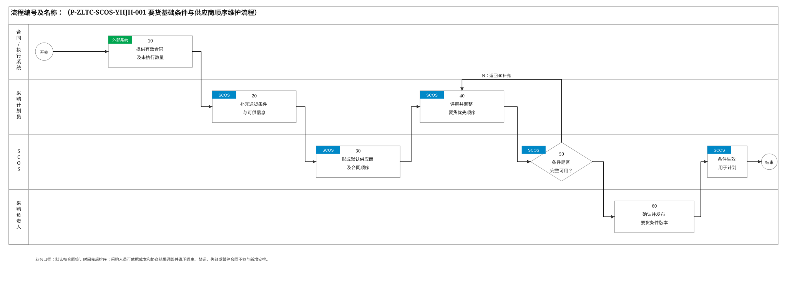
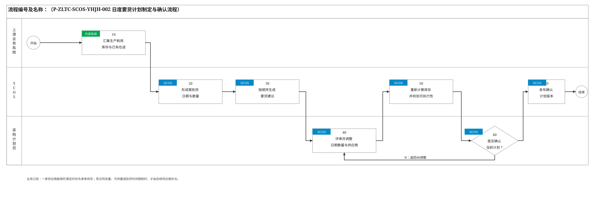
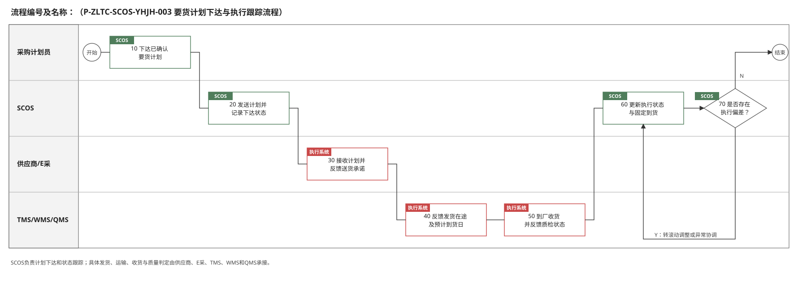
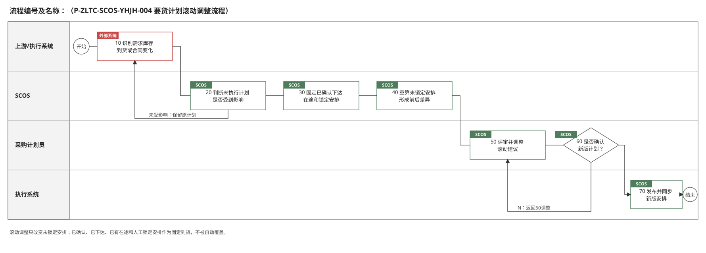
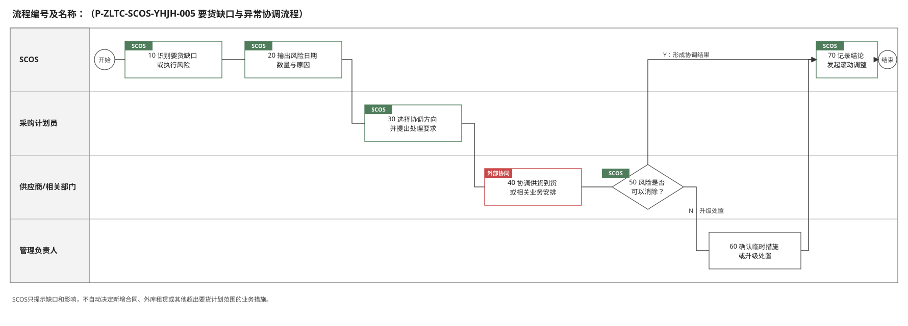
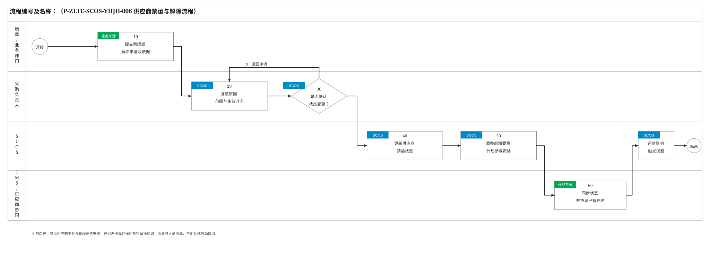

# 要货计划模块关键业务流程说明

> 编制依据：《要货计划模块技术方案》《20260904-要货计划现状确认》及《原材料要货计划演示》。本文件参照《SCOS_中粮太仓项目研发模块蓝图方案v0.1》2.2节的业务梳理方式，仅保留影响业务决策、责任交接和流程状态的关键节点。系统默认获取的数据及内部计算步骤在“处理说明”中描述，不拆成独立流程节点。流程及规则编号为建议编码。

## 2.2 关键业务流程说明

### 2.2.1 要货基础条件与供应商顺序维护流程

| 节点编号 | 节点名称 | 执行角色 | 输入/输出 | 处理说明 | 异常/分支 | 关联规则 |
|---|---|---|---|---|---|---|
| 开始 | 开始 | — | 输入：合同或送货条件变化、定期维护任务 | 有效采购合同新增、合同剩余量变化、供应商送货条件变化或业务人员发起维护时启动。 | — | — |
| 10 | 提供有效合同及未执行数量 | 合同管理系统、E采/SAP | 输入：已签采购合同、采购订单及执行状态；输出：有效合同、关联订单、签订日期、有效期、最晚交期及可安排余量 | 仅提供已签订且处于有效状态的合同和订单，合同未执行量是可安排送货额度，不作为库存。 | 合同失效、暂停或无可安排余量时，不进入新增要货范围。 | P-ZLTC-SCOS-YHJH-001-10-001 |
| 20 | 补充送货条件与可供信息 | 采购计划员 | 输入：有效合同及供应商信息；输出：供应商存放地点、运输提前期、最早可到货日、日期可供量、合同执行顺序等 | 对暂无稳定系统来源的送货条件进行维护，并明确同一供应商多份合同的执行先后。 | 必要信息缺失时标记“待补充”，不得形成缺乏依据的确定性安排。 | P-ZLTC-SCOS-YHJH-001-20-001 |
| 30 | 形成默认供应商及合同顺序 | SCOS系统自动 | 输入：合同签订时间、有效状态及可安排余量；输出：默认要货优先顺序 | 默认按合同签订时间先后排序，先签合同优先；禁运供应商及失效、暂停合同不参与新增安排。 | 同一签订时间或顺序无法确定时提示采购计划员确认。 | P-ZLTC-SCOS-YHJH-001-30-001 |
| 40 | 评审并调整要货优先顺序 | 采购计划员 | 输入：默认顺序、合同成本及实际协商结果；输出：业务确认的供应商及合同顺序、调整理由 | 采购计划员可依据成本和实际协商结果调整顺序，系统保留调整前后值及理由。供应商绩效与风险信息仅供参考，不作为默认排序依据。 | 未填写调整理由时不允许提交人工调整顺序。 | P-ZLTC-SCOS-YHJH-001-40-001 |
| 50 | 判断条件是否完整可用 | SCOS系统自动 | 输入：合同、送货条件、供应商顺序及禁运状态；输出：完整性与可用性校验结果 | 检查合同有效性、可安排余量、最晚交期、运输提前期、最早可到货日、可供能力和禁运状态。 | N：返回40补充或调整；Y：进入60。 | P-ZLTC-SCOS-YHJH-001-50-001 |
| 60 | 确认并发布要货条件版本 | 采购负责人 | 输入：校验通过的送货条件和优先顺序；输出：确认结论及条件版本 | 对要货基础条件和人工调整顺序进行业务确认，发布可用于计划计算的版本。 | 不确认时返回20或40补充完善。 | P-ZLTC-SCOS-YHJH-001-60-001 |
| 70 | 条件生效用于计划 | SCOS系统自动 | 输入：已确认条件版本；输出：生效的要货计算条件 | 生效版本供日度要货计划制定和滚动调整使用，并保留版本、操作人、时间及理由。 | 发布失败时保留待发布状态并支持重试。 | P-ZLTC-SCOS-YHJH-001-70-001 |
| 结束 | 结束 | — | 输出：生效的要货条件及供应商顺序 | 本轮基础条件维护完成。 | — | — |

### 2.2.2 日度要货计划制定与确认流程

| 节点编号 | 节点名称 | 执行角色 | 输入/输出 | 处理说明 | 异常/分支 | 关联规则 |
|---|---|---|---|---|---|---|
| 开始 | 开始 | — | 输入：日度计划运行周期或人工发起请求 | 系统每日定时运行，采购计划员也可按业务需要人工发起。 | — | — |
| 10 | 汇集生产耗用、库存与已有在途 | APS、WMS、SAP、E采、TMS | 输入：已发布日度原材料需求、可用库存、已确认/已下达/在途到货及预计到货日；输出：要货计算数据集 | 优先使用已发布的日度原材料需求；只有成品计划时才按有效BOM和得率换算，二者不重复。库存仅计质检合格且未冻结的实物量；已有在途仅按明确预计到货日计入。 | 需求、必要BOM、库存时间或在途日期缺失时提示补充，不将缺失数据直接按零处理。 | P-ZLTC-SCOS-YHJH-002-10-001 |
| 20 | 形成需到货日期与数量 | SCOS系统自动 | 输入：生产耗用、可用库存、固定到货、安全缓冲；输出：分日需到货量及风险日期 | 按日投影库存，在满足生产耗用和安全缓冲的前提下确定需要补货的日期和数量；计划期末继续读取缓冲天数内的耗用。 | 现有固定到货已满足需求时，该日期不新增要货。 | P-ZLTC-SCOS-YHJH-002-20-001 |
| 30 | 按顺序生成要货建议 | SCOS系统自动 | 输入：需到货量、生效供应商/合同顺序、合同余量、可供量、最早可到货日及收货能力；输出：供应商、合同、到货日、到货数量及必要补位原因 | 按当前顺序优先安排前序供应商。一家能按时满足时由一家供货；受合同余量、可供量、到货时间或交期限制时，才由后续供应商补位。到货尽量接近实际需要日。 | 不能满足时不强行生成虚假可执行计划，输出风险日期、缺口数量和原因。 | P-ZLTC-SCOS-YHJH-002-30-001 |
| 40 | 评审并调整日期、数量与供应商 | 采购计划员 | 输入：系统建议、预计库存、合同余额及校验提示；输出：拟确认要货计划 | 结合供应商协商结果调整顺序、供应商、合同、到货日和数量，可移除或锁定单次安排；必要交叉到货需说明原因。 | 可返回30重新生成系统方案；人工调整和移除均保留记录。 | P-ZLTC-SCOS-YHJH-002-40-001 |
| 50 | 重新计算库存并校验可执行性 | SCOS系统自动 | 输入：拟确认计划及人工锁定结果；输出：库存投影、合同余额及校验结果 | 调整后即时重算预计库存和合同余额，校验安全缓冲、合同余量及期限、最早可到货日、供应商可供量、工厂收货能力和禁运状态。 | 库存低于安全缓冲、合同超量、禁运或到货不可行等阻断性冲突必须返回40处理，不允许下达。 | P-ZLTC-SCOS-YHJH-002-50-001 |
| 60 | 判断是否确认当前计划 | 采购计划员 | 输入：拟确认要货计划及校验结果；输出：确认结论 | 采购计划员核对供应商、合同、日期、数量、补位原因和风险后确认。 | N：返回40调整；Y：进入70。 | P-ZLTC-SCOS-YHJH-002-60-001 |
| 70 | 发布确认计划版本 | SCOS系统自动 | 输入：人工确认的要货计划；输出：已确认要货计划及版本 | 发布确认版本，冻结其中的确认安排，并保存输入版本、系统建议、人工调整、校验结果、操作人和时间。 | 发布失败时保留待发布状态并支持重试。 | P-ZLTC-SCOS-YHJH-002-70-001 |
| 结束 | 结束 | — | 输出：已确认日度要货计划 | 日度要货计划制定完成，进入下达与执行跟踪。 | — | — |

### 2.2.3 要货计划下达与执行跟踪流程

| 节点编号 | 节点名称 | 执行角色 | 输入/输出 | 处理说明 | 异常/分支 | 关联规则 |
|---|---|---|---|---|---|---|
| 开始 | 开始 | — | 输入：已确认要货计划 | 要货计划完成确认并进入执行阶段。 | — | — |
| 10 | 下达已确认要货计划 | 采购计划员 | 输入：已确认要货计划；输出：下达指令 | 核对要货计划版本后发起下达。计划基于既有合同和订单，不在本流程新建采购合同或采购订单。 | 发现确认版本失效或存在阻断性冲突时停止下达，返回计划调整。 | P-ZLTC-SCOS-YHJH-003-10-001 |
| 20 | 发送计划并记录下达状态 | SCOS系统自动 | 输入：下达指令；输出：发送至E采/SAP或供应商协同平台的要货明细、下达状态 | 按供应商、合同/订单、到货日和数量发送已确认计划，并记录接口结果和下达时间。 | 接口失败时保留“待下达”状态，支持重试和人工核对。 | P-ZLTC-SCOS-YHJH-003-20-001 |
| 30 | 接收计划并反馈送货承诺 | 供应商、E采/供应商协同平台 | 输入：要货明细；输出：供应商承诺、反馈意见及计划状态 | 供应商确认能否按计划到货，反馈承诺日期、数量或不可满足原因。 | 不能满足时形成执行偏差，转70判断。 | P-ZLTC-SCOS-YHJH-003-30-001 |
| 40 | 反馈发货、在途及预计到货日 | 供应商、TMS | 输入：已下达要货安排；输出：发货数量、运输节点、在途状态和预计到货日 | 供应商及TMS负责实际发货和运输执行，并持续反馈运输进度；SCOS不安排具体发货和运输过程。 | 预计到货日变化、运输中断或数量差异时标记执行偏差。 | P-ZLTC-SCOS-YHJH-003-40-001 |
| 50 | 到厂收货并反馈质检状态 | WMS、QMS、收货/质量人员 | 输入：到货信息；输出：实收到货量、到货时间、质检及库存状态 | 到货后由执行系统登记收货和质量结果；只有质检合格且未冻结的数量进入后续可用库存。 | 待检、拒收或质量异常按相应业务流程处理，并反馈要货执行影响。 | P-ZLTC-SCOS-YHJH-003-50-001 |
| 60 | 更新执行状态与固定到货 | SCOS系统自动 | 输入：承诺、发货、在途、预计到货、收货及质检反馈；输出：要货执行进度和固定到货 | 汇总计划明细状态。已确认、已下达和已有在途作为固定安排，预计到货日以后续执行反馈为准。 | 多系统数量或状态不一致时提示采购计划员复核。 | P-ZLTC-SCOS-YHJH-003-60-001 |
| 70 | 判断是否存在执行偏差 | SCOS系统自动 | 输入：计划与实际执行差异；输出：偏差判断及影响范围 | 判断延期、数量不足、拒绝承诺、运输或质量异常是否影响生产耗用和安全缓冲。 | N：完成本轮跟踪；Y：转入要货计划滚动调整或要货缺口与异常协调流程。 | P-ZLTC-SCOS-YHJH-003-70-001 |
| 结束 | 结束 | — | 输出：要货执行状态及闭环记录 | 无需调整的执行跟踪完成，状态继续供后续日度计算和驾驶舱使用。 | — | — |

### 2.2.4 要货计划滚动调整流程

| 节点编号 | 节点名称 | 执行角色 | 输入/输出 | 处理说明 | 异常/分支 | 关联规则 |
|---|---|---|---|---|---|---|
| 开始 | 开始 | — | 输入：每日滚动周期或业务变化事件 | 系统每日滚动运行；生产需求、库存、预计到货日、合同、可供能力或禁运状态变化时即时触发影响评估。 | — | — |
| 10 | 提供最新业务变化 | APS、WMS、SAP、E采、TMS及相关业务人员 | 输入：最新需求、库存、执行状态、预计到货日、合同和禁运状态；输出：变更数据集 | 以带版本和时间戳的最新有效数据触发重算，明确变化来源和生效时间。 | 数据迟延或来源冲突时标记待核对，不直接覆盖已确认事实。 | P-ZLTC-SCOS-YHJH-004-10-001 |
| 20 | 判断未执行安排是否受影响 | SCOS系统自动 | 输入：变更数据集、当前计划及执行状态；输出：影响判断与受影响范围 | 比较需求、日期、数量和执行状态，判断未执行安排及预计库存是否发生实质影响。 | N：保留当前计划并结束；Y：进入30。 | P-ZLTC-SCOS-YHJH-004-20-001 |
| 30 | 保留固定与人工锁定安排 | SCOS系统自动 | 输入：受影响计划明细；输出：固定范围和可调整范围 | 已确认、已下达、已有在途及人工锁定安排作为固定到货，不被自动改变；其余未锁定安排进入重算范围。 | 已固定安排本身出现偏差时，仅更新执行信息并将影响传递给可调整部分或异常协调流程。 | P-ZLTC-SCOS-YHJH-004-30-001 |
| 40 | 重算未锁定计划并形成差异 | SCOS系统自动 | 输入：固定安排、最新需求和条件、未锁定计划；输出：调整建议、调整前后差异及风险 | 仅重排受影响的未锁定安排，重新计算供应商、合同、到货日期、数量、预计库存和合同余额。 | 仍有缺口或不可执行时同步输出日期、数量和原因。 | P-ZLTC-SCOS-YHJH-004-40-001 |
| 50 | 评审并调整建议 | 采购计划员 | 输入：调整建议、前后差异及风险；输出：拟确认调整方案 | 核对变化原因和影响范围，可修改或继续锁定安排，并记录人工处理理由。 | 可拒绝系统建议并保留当前未执行安排，但阻断性冲突未解除时不得重新下达。 | P-ZLTC-SCOS-YHJH-004-50-001 |
| 60 | 确认调整后计划 | 采购计划员 | 输入：拟确认调整方案及校验结果；输出：确认结论 | 确认新版要货计划及需要重新下达的明细。 | N：返回50调整或保留原计划；Y：进入70。 | P-ZLTC-SCOS-YHJH-004-60-001 |
| 70 | 发布新版本并同步变化 | SCOS系统自动 | 输入：确认后的调整方案；输出：新版要货计划、变更清单及同步状态 | 发布新版本，仅向执行端同步发生变化且允许调整的明细，完整保留原版本和变更轨迹。 | 同步失败时保留待同步状态并支持重推。 | P-ZLTC-SCOS-YHJH-004-70-001 |
| 结束 | 结束 | — | 输出：滚动调整后的要货计划版本 | 本轮滚动调整完成；存在未消除缺口时同时进入异常协调。 | — | — |

### 2.2.5 要货缺口与异常协调流程

| 节点编号 | 节点名称 | 执行角色 | 输入/输出 | 处理说明 | 异常/分支 | 关联规则 |
|---|---|---|---|---|---|---|
| 开始 | 开始 | — | 输入：计划计算或执行跟踪发现的风险 | 合同余量不足、供应商不能按时供货、预计到货延期或库存低于安全缓冲时启动。 | — | — |
| 10 | 识别要货缺口或执行风险 | SCOS系统自动 | 输入：需求、库存、固定到货、未锁定计划和执行反馈；输出：风险事项 | 按日识别不能覆盖生产耗用或安全缓冲的风险，以及合同、到货和执行不可行事项。 | 无风险时不启动本流程。 | P-ZLTC-SCOS-YHJH-005-10-001 |
| 20 | 输出风险日期、数量与原因 | SCOS系统自动 | 输入：风险事项；输出：受影响物料、日期、缺口量、预计库存及原因 | 将风险定位到具体日期和数量，区分合同不足、可供能力不足、到货延期、禁运或收货限制等原因。 | 原因数据不完整时标记“待核实”，不输出确定性处置结论。 | P-ZLTC-SCOS-YHJH-005-20-001 |
| 30 | 选择协调方向并提出处理要求 | 采购计划员 | 输入：风险明细及可调整范围；输出：协调任务和处理方向 | 可选择与供应商协调到货、调整未锁定安排，或向合同、生产、库存等相关业务环节提出协调要求。 | 涉及新增合同、生产调整或其他跨模块措施时，转对应业务流程决策。 | P-ZLTC-SCOS-YHJH-005-30-001 |
| 40 | 协调供货到货或相关业务安排 | 供应商、采购及相关业务部门 | 输入：协调任务；输出：可执行承诺、业务调整意见或无法解决说明 | 相关责任方对供货数量、可达日期及跨业务影响进行协商，反馈能够执行的协调结果。 | SCOS不自动决定新增合同、外库租赁、生产调整等超出要货计划范围的措施。 | P-ZLTC-SCOS-YHJH-005-40-001 |
| 50 | 判断风险是否可以消除 | SCOS系统自动、采购计划员 | 输入：协调结果；输出：风险复核结论 | 将协调结果代入库存和要货计划重新评估，判断风险是否已被消除。 | Y：进入70记录结论并滚动调整；N：进入60。 | P-ZLTC-SCOS-YHJH-005-50-001 |
| 60 | 确认临时措施或升级处置 | 管理负责人、采购计划员 | 输入：未消除风险及业务影响；输出：临时措施、风险接受或升级事项 | 对无法在要货计划范围内消除的风险，确认临时控制要求或提交相应责任部门进一步处置。 | 未形成结论时保持风险开放，并在驾驶舱持续预警。 | P-ZLTC-SCOS-YHJH-005-60-001 |
| 70 | 记录结论并发起滚动调整 | SCOS系统自动 | 输入：协调结论、临时措施或升级结果；输出：异常闭环记录、滚动调整任务和驾驶舱风险状态 | 记录责任人、处理意见、计划影响和关闭状态；涉及要货安排变化时触发滚动调整，风险同步供应链驾驶舱。 | 调整后仍有缺口时继续保持风险开放，不以流程结束替代风险消除。 | P-ZLTC-SCOS-YHJH-005-70-001 |
| 结束 | 结束 | — | 输出：协调结论、风险状态及计划调整任务 | 本轮协调动作完成。 | — | — |

### 2.2.6 供应商禁运与解除流程

| 节点编号 | 节点名称 | 执行角色 | 输入/输出 | 处理说明 | 异常/分支 | 关联规则 |
|---|---|---|---|---|---|---|
| 开始 | 开始 | — | 输入：质量问题、履约异常、业务限制解除等事件 | 相关部门认为需禁止供应商新增要货或解除已有禁运状态时启动。 | — | — |
| 10 | 提交禁运或解除申请及依据 | 质量部门、采购或其他业务部门 | 输入：异常事实、质量或业务依据；输出：禁运/解除申请、供应商、范围和建议生效时间 | 明确申请类型、供应商、适用物料或合同、原因、证据和期望生效时间。 | 依据或影响范围不清时退回补充。 | P-ZLTC-SCOS-YHJH-006-10-001 |
| 20 | 复核原因、范围与生效时间 | 采购负责人 | 输入：禁运/解除申请；输出：复核意见 | 核对申请依据、受影响合同和计划、在途情况以及状态变更的生效范围。 | 信息不完整时返回10补充；已有在途不作为新增要货处理。 | P-ZLTC-SCOS-YHJH-006-20-001 |
| 30 | 判断是否确认状态变更 | 采购负责人 | 输入：申请及复核意见；输出：确认结论 | 按现行业务授权确认是否执行禁运或解除。 | N：返回20复核或终止申请；Y：进入40。 | P-ZLTC-SCOS-YHJH-006-30-001 |
| 40 | 更新供应商禁运状态 | SCOS系统自动 | 输入：确认结论、原因、范围及生效时间；输出：供应商禁运状态记录 | 更新禁运或解除状态，并记录原因、操作人、生效时间和历史状态。 | 更新失败时保持原状态并提示重试，避免计划参与资格与确认结论不一致。 | P-ZLTC-SCOS-YHJH-006-40-001 |
| 50 | 调整新增要货计划参与资格 | SCOS系统自动 | 输入：最新禁运状态、有效合同；输出：供应商计划参与资格 | 禁运后从新增要货安排中排除相关供应商；解除后仅在合同仍有效且其他条件满足时恢复参与资格。 | 状态变更不自动取消已下达或已有在途安排。 | P-ZLTC-SCOS-YHJH-006-50-001 |
| 60 | 同步状态并协调已有在途 | TMS、供应商协同平台、采购计划员 | 输入：禁运/解除状态及受影响明细；输出：同步结果和已有在途协调意见 | 将状态传递给TMS及供应商协同端；对已有在途单独标识并由业务人员协调，系统不自动取消或退运。 | 接口失败时保留待同步状态；在途处置未明确时保持风险提示。 | P-ZLTC-SCOS-YHJH-006-60-001 |
| 70 | 评估影响并触发调整 | SCOS系统自动 | 输入：状态变化、当前要货计划和执行状态；输出：受影响范围及滚动调整任务 | 识别受影响的未执行、未锁定安排并触发滚动调整；相关风险同步驾驶舱。 | 现有供应商无法补位时转要货缺口与异常协调流程。 | P-ZLTC-SCOS-YHJH-006-70-001 |
| 结束 | 结束 | — | 输出：最新供应商禁运状态、计划调整任务及审计记录 | 本次状态变更处理完成。 | — | — |

## 2.3 业务边界与控制原则

- 要货计划只在有效的已签采购合同和订单范围内安排到货，不承担供应商寻源、询报价、新合同决策或采购订单创建。
- SCOS回答“谁先送、谁后送、送多少、哪天到货”，实际发货、运输、到厂收货和质量判定由供应商及E采/SAP、TMS、WMS、QMS等执行系统承接。
- 生产需求以已发布的日度原材料需求为准；仅在缺少该数据时使用成品计划、有效BOM和得率换算，两种来源不得重复计入。
- 可用库存仅包括质检合格且未冻结的实物量；已有在途仅在预计到货日明确时计入；合同未执行量仅代表可安排额度，不代表库存。
- 默认按合同签订时间先后确定供应商及合同顺序。采购计划员可根据成本和协商结果调整，但必须记录理由；供应商评分和风险仅供人工参考。
- 一家供应商能够按时满足时优先单家供货。只有前序供应商受合同余量、可供量、最早可到货日或合同期限限制时，后续供应商才补位；允许必要的交叉到货，但必须说明原因，不为平均分配主动拆分。
- 最小要货量、整车量和固定送货日等规则只有在业务明确要求时才启用，默认不设置。
- 已确认、已下达、已有在途和人工锁定安排作为固定到货；滚动调整只改变受影响的未锁定安排，历史版本和人工调整记录必须保留。
- 库存低于安全缓冲、合同超量、供应商禁运或到货时间不可行属于阻断性冲突，未解除前不得下达相关安排。
- 禁运供应商不参与新增要货安排；已有在途只做单独标识和业务协调，不由系统自动取消、退运或改变运输任务。
- 缺口与异常流程只提供风险定位、协调任务和计划影响分析，不自动决定新增合同、外库租赁、生产调整或其他跨模块业务措施。
- 已确认计划、执行偏差和未消除风险应同步供应链驾驶舱，作为供应链协同和管理决策依据。
