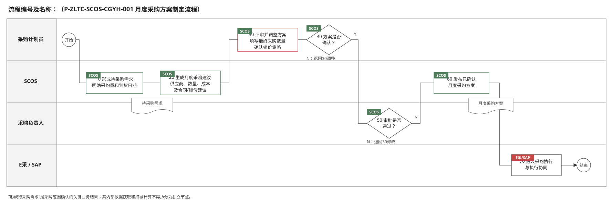
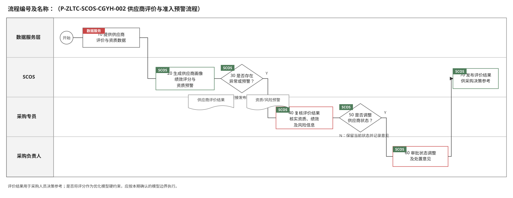
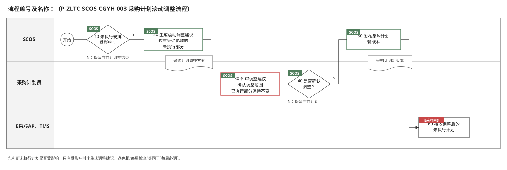
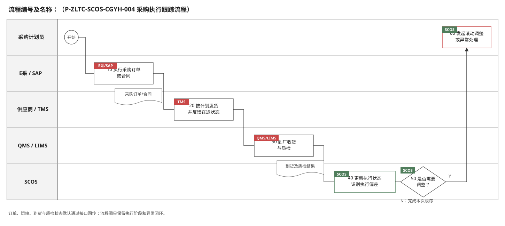

# 采购优化模块关键业务流程说明

> 编制依据：《采购优化模块技术方案》。本文件参照《SCOS_中粮太仓项目研发模块蓝图方案v0.1》2.2节的业务梳理方式，仅保留影响业务决策、责任交接与流程状态的关键节点。系统默认获取的数据和内部计算步骤在“处理说明”中描述，不单独设置流程节点。流程及规则编号为建议编码。

## 2.2 关键业务流程说明

### 2.2.1 月度采购方案制定流程

| 节点编号 | 节点名称 | 执行角色 | 输入/输出 | 处理说明 | 异常/分支 | 关联规则 |
|---|---|---|---|---|---|---|
| 开始 | 开始 | — | — | 系统到达月度采购方案编制周期。 | — | — |
| 10 | 形成待采购需求 | SCOS系统自动 | 输入：已发布原材料需求计划、未完成采购订单；输出：分物料、分期待采购需求及要求到货日期 | 系统按需求日期扣减可按时到货的有效采购承诺，形成采购范围。该节点保留是因为其输出是采购方案的正式业务依据。 | 数据异常时提示采购计划员处理；待采购需求为0时相应物料不进入后续优化。 | P-ZLTC-SCOS-CGYH-001-10-001 |
| 20 | 生成月度采购建议 | SCOS系统自动 | 输入：待采购需求、供应商报价及供货能力、运费、账期、资金成本率和期货价格；输出：推荐方案、备选方案及锁价建议 | 按综合成本较低原则生成供应商推荐数量、建议到货日期、可调整范围及合同/锁价建议；供应商评价供人工参考。 | 供货能力不足或到货时间不可达时输出缺口和原因。 | P-ZLTC-SCOS-CGYH-001-20-001 |
| 30 | 评审并调整采购方案 | 采购计划员 | 输入：待采购需求、推荐/备选方案、供应商评价及锁价建议；输出：拟定月度采购方案 | 比较方案并调整供应商及采购数量，填写最终采购数量并确认合同/锁价策略。 | 可修改采购条件后返回20重新生成建议。 | P-ZLTC-SCOS-CGYH-001-30-001 |
| 40 | 确认采购方案 | 采购计划员、SCOS系统自动 | 输入：拟定方案；输出：确认结论 | 系统校验单一供应商数量不超过最大可供量、采购数量合计不低于待采购需求及必要字段完整性，由采购计划员确认提交。 | N：返回30调整；Y：进入50。 | P-ZLTC-SCOS-CGYH-001-40-001 |
| 50 | 审批月度采购方案 | 采购负责人 | 输入：月度采购总量、供应商分配、综合成本及锁价策略；输出：审批意见 | 审核需求依据、供应商选择、数量分配、成本及合同/锁价策略。 | N：退回30修改；Y：进入60。 | P-ZLTC-SCOS-CGYH-001-50-001 |
| 60 | 发布已确认采购方案 | SCOS系统自动 | 输入：审批通过方案；输出：已确认月度采购方案及版本 | 发布方案并保存推荐值、人工调整值、审批意见、输入数据和计算参数。 | 发布失败时保留待发布状态并支持重试。 | P-ZLTC-SCOS-CGYH-001-60-001 |
| 70 | 进入采购执行 | 采购计划员、E采/SAP | 输入：已确认采购方案；输出：采购执行依据 | 向E采/SAP提供已确认的供应商、采购数量、采购时点和建议到货安排。正式合同、采购订单及具体执行安排由业务人员和执行系统承接。 | 接口失败时保留待下发状态并支持重推。 | P-ZLTC-SCOS-CGYH-001-70-001 |
| 结束 | 结束 | — | 输出：已确认月度采购方案 | 月度采购方案制定完成。 | — | — |

### 2.2.2 供应商评价与准入预警流程

| 节点编号 | 节点名称 | 执行角色 | 输入/输出 | 处理说明 | 异常/分支 | 关联规则 |
|---|---|---|---|---|---|---|
| 开始 | 开始 | — | — | 系统按评价周期运行，或在采购订单执行、质量结果及供应商资质发生变化时触发。 | — | — |
| 10 | 提供供应商评价与资质数据 | 统一数据服务层 | 输入：供应商主数据、交易价格、准时交付率、质量合格率、财务与风险信息、资质证照及有效期；输出：供应商评价数据集 | 通过统一数据服务层汇集供应商评价所需数据，SCOS不替代供应商主数据和资质源系统。 | 数据缺失或接口异常时保留最近有效数据并标记数据时间。 | P-ZLTC-SCOS-CGYH-002-10-001 |
| 20 | 生成供应商画像与预警 | SCOS系统自动 | 输入：供应商评价数据集；输出：供应商画像、绩效评分、资质及风险预警 | 更新历史价格、交付、质量、财务和风险指标，形成供应商评价结果；对资质即将到期、已失效或风险异常进行预警。 | 评分所需数据不足时标记“待补充”，不得给出误导性完整评分。 | P-ZLTC-SCOS-CGYH-002-20-001 |
| 30 | 判断是否存在异常或预警 | SCOS系统自动 | 输入：评价结果、资质及风险预警；输出：判断结论 | 判断是否存在资质到期、绩效明显下降、质量或交付异常、财务或外部风险。 | N：直接进入70发布正常评价结果；Y：进入40。 | P-ZLTC-SCOS-CGYH-002-30-001 |
| 40 | 复核评价结果 | 采购专员 | 输入：供应商画像、评分明细和预警依据；输出：复核意见 | 核实异常数据、资质文件和风险信息，必要时协调质量、财务等相关部门确认。 | 数据有误时返回数据源修正后重新评价。 | P-ZLTC-SCOS-CGYH-002-40-001 |
| 50 | 判断是否调整供应商状态 | 采购专员 | 输入：复核结果；输出：供应商状态调整建议 | 判断是否建议限制选择、暂停合作、恢复合作或维持当前状态。 | N：保留当前状态并进入70；Y：进入60。 | P-ZLTC-SCOS-CGYH-002-50-001 |
| 60 | 审批状态调整 | 采购负责人 | 输入：状态调整建议及依据；输出：审批意见 | 审批供应商状态调整和处置意见。 | N：退回40补充说明；Y：进入70。 | P-ZLTC-SCOS-CGYH-002-60-001 |
| 70 | 发布供应商评价结果 | SCOS系统自动 | 输入：评价、预警及审批结果；输出：有效供应商评价和状态 | 发布评价结果，供月度采购方案制定时查询和决策参考。 | 发布失败时保留待发布状态并支持重试。 | P-ZLTC-SCOS-CGYH-002-70-001 |
| 结束 | 结束 | — | 输出：供应商评价、状态及预警记录 | 本轮评价完成，后续执行数据继续反馈形成周期性闭环。 | — | — |

### 2.2.3 采购计划滚动调整流程

| 节点编号 | 节点名称 | 执行角色 | 输入/输出 | 处理说明 | 异常/分支 | 关联规则 |
|---|---|---|---|---|---|---|
| 开始 | 开始 | — | — | 系统每周定时触发；新版需求计划发布或业务人员人工触发时也可启动。 | — | — |
| 10 | 判断未执行安排是否受影响 | SCOS系统自动 | 输入：最新需求计划、原采购方案及采购执行状态；输出：影响判断 | 系统自动比较需求数量、日期和采购执行变化，判断尚未执行的采购安排是否需要调整。 | N：保留当前方案并结束；Y：进入20。 | P-ZLTC-SCOS-CGYH-003-10-001 |
| 20 | 生成滚动调整建议 | SCOS系统自动 | 输入：受影响范围、已执行量和未执行计划；输出：调整建议及调整前后差异 | 仅重新计算受影响的未执行部分，形成供应商、数量、日期和成本变化；已执行部分保持不变。 | 不可行时输出缺口和原因。 | P-ZLTC-SCOS-CGYH-003-20-001 |
| 30 | 评审调整建议 | 采购计划员 | 输入：影响范围及调整前后差异；输出：拟定调整方案 | 查看需求、数量、日期、成本和供应商变化，确认调整范围；重大变更按制度重新审批。 | 可拒绝调整并记录原因。 | P-ZLTC-SCOS-CGYH-003-30-001 |
| 40 | 确认计划调整 | 采购计划员 | 输入：拟定调整方案；输出：确认结论 | 确认是否采用调整建议。 | N：保留当前计划；Y：进入50。 | P-ZLTC-SCOS-CGYH-003-40-001 |
| 50 | 发布采购方案新版本 | SCOS系统自动 | 输入：确认后的调整方案；输出：新版采购方案及变更记录 | 发布新版本并完整保留原方案、输入数据、计算参数、结果及人工确认轨迹。 | 发布失败时保留待发布状态。 | P-ZLTC-SCOS-CGYH-003-50-001 |
| 60 | 接收调整后的采购安排 | E采/SAP、TMS | 输入：新版未执行采购安排；输出：更新后的执行依据 | 执行系统更新尚未执行的部分，已执行订单和运输任务不被覆盖。 | 接口失败时支持重推和人工核对。 | P-ZLTC-SCOS-CGYH-003-60-001 |
| 结束 | 结束 | — | 输出：滚动调整后的计划版本 | 本轮滚动调整完成。 | — | — |

### 2.2.4 采购执行跟踪流程

| 节点编号 | 节点名称 | 执行角色 | 输入/输出 | 处理说明 | 异常/分支 | 关联规则 |
|---|---|---|---|---|---|---|
| 开始 | 开始 | — | 输入：已确认采购方案及到货安排 | 采购计划进入执行阶段。 | — | — |
| 10 | 执行采购订单或合同 | 采购业务人员、E采/SAP | 输入：采购执行依据；输出：正式采购订单/合同及状态 | 按企业采购制度创建和执行采购订单或合同，并向SCOS回传订单编号、数量、状态及计划到货日期。 | 正式订单和合同不得由SCOS自动创建。 | P-ZLTC-SCOS-CGYH-004-10-001 |
| 20 | 发货与在途跟踪 | 供应商、TMS | 输入：采购订单及到货安排；输出：发货数量、时间及在途状态 | 供应商按采购订单执行发货，TMS持续反馈运输节点和预计到货时间。 | 延迟、数量差异或运输异常标记为执行偏差。 | P-ZLTC-SCOS-CGYH-004-20-001 |
| 30 | 到厂收货与质检 | 收货人员、QMS/LIMS | 输入：到货信息；输出：到货数量、到货时间、待检及质检结果 | 记录到厂和质检状态；到厂待检仍属于未完成采购承诺。 | 质量异常转质量业务流程处理并反馈采购跟踪。 | P-ZLTC-SCOS-CGYH-004-30-001 |
| 40 | 更新执行状态 | SCOS系统自动 | 输入：订单、发货、在途、到货及质检状态；输出：采购执行进度、未完成采购承诺及执行偏差 | 汇总采购全程状态，更新下一轮采购计算使用的采购承诺，并识别影响未执行计划的偏差。 | 多系统数据不一致时提示人工复核。 | P-ZLTC-SCOS-CGYH-004-40-001 |
| 50 | 判断是否需要调整 | SCOS系统自动 | 输入：执行偏差及影响；输出：调整判断 | 判断需求变化、延期、到货不足或质检异常是否需要调整未执行采购/发货计划。 | N：完成本次跟踪；Y：进入60。 | P-ZLTC-SCOS-CGYH-004-50-001 |
| 60 | 发起滚动调整或异常处理 | 采购计划员 | 输入：执行偏差及影响；输出：滚动调整任务或异常处理记录 | 影响采购计划时进入滚动调整流程；运输、质量或合同异常转相应外部业务流程处理。 | 异常未关闭前持续跟踪。 | P-ZLTC-SCOS-CGYH-004-60-001 |
| 结束 | 结束 | — | 输出：采购执行状态及闭环记录 | 执行状态推送供应链驾驶舱，并作为后续采购计算和滚动调整的输入。 | — | — |

## 2.3 业务边界与控制原则

- 采购需求仅来源于上游已发布的原材料需求计划；采购优化不负责需求预测、生产排程解析和库存水位计算。
- 未完成采购订单用于扣减已有采购承诺，避免重复采购，不等同于库存。
- 供应商评价由采购人员参考，优化模型只按采购相关综合成本计算推荐数量。
- 到货时间作业务风险提示，不作为模型硬约束；最终供应商、数量、锁价及风险接受结论均由业务人员确认。
- 正式合同和采购订单由E采/SAP按采购制度执行，SCOS输出建议、计划及跟踪数据。
- 需求或执行状态变化时仅调整未执行部分，所有方案版本、人工调整和审批轨迹均需保留。
