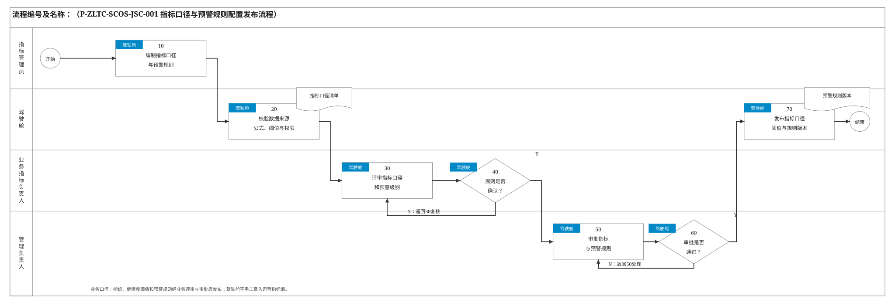
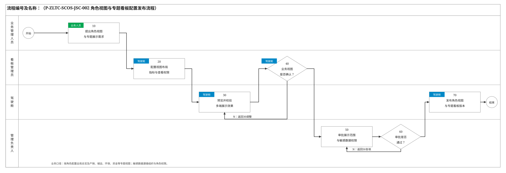
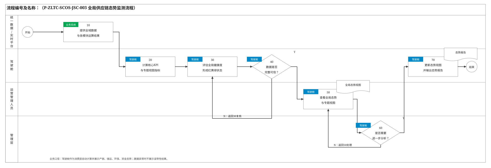
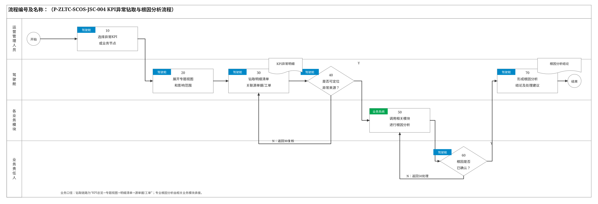
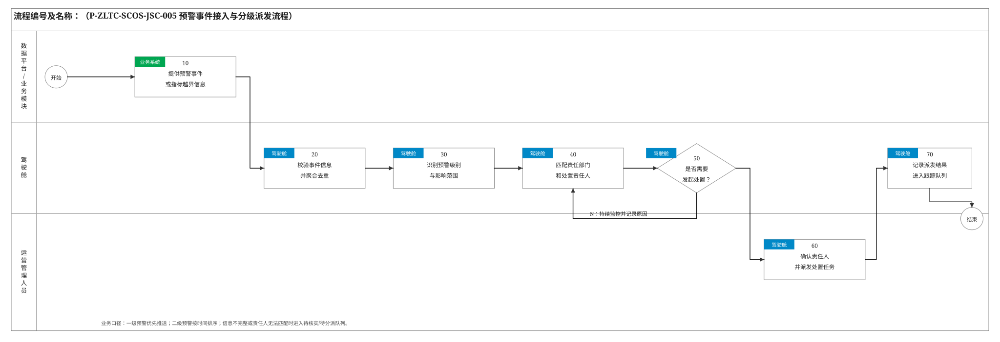
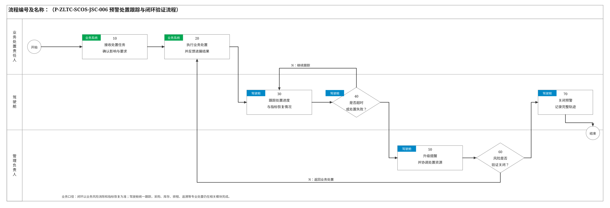
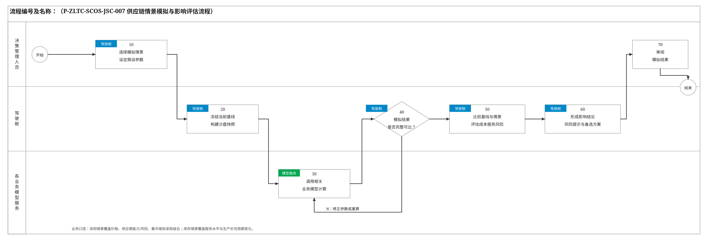
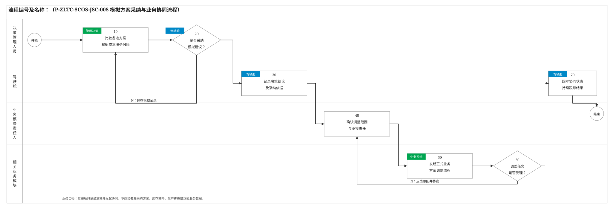

# 驾驶舱模块关键业务流程说明

> 编制依据：《SCOS全局供应链优化与协同系统技术要求》、《驾驶舱模块技术方案》、《采购优化模块关键业务流程》和《库存优化模块关键业务流程》。本文件参照《SCOS_中粮太仓项目研发模块蓝图方案v0.1》2.2节的业务梳理方式，仅保留业务决策、责任交接与状态变化节点。默认数据获取、指标计算和界面渲染步骤统一写入“处理说明”，不单独拆分。流程及规则编号为建议编码。

## 2.2 关键业务流程说明

### 2.2.1 指标口径与预警规则配置发布流程

| 节点编号 | 节点名称 | 执行角色 | 输入/输出 | 处理说明 | 异常/分支 | 关联规则 |
|---|---|---|---|---|---|---|
| 开始 | 开始 | — | 输入：新增或调整指标、健康度阈值、预警规则需求 | 指标口径、业务管理要求或数据源发生变化时启动。 | — | — |
| 10 | 编制指标口径与预警规则 | 指标管理员 | 输入：业务要求、数据字典、已有指标和规则；输出：拟定指标口径、阈值和预警规则 | 定义指标名称、公式、数据源、更新频率、展示单位、红黄绿阈值、一/二级预警条件及可见权限。 | 必须字段或业务依据不完整时保留草稿。 | P-ZLTC-SCOS-JSC-001-10-001 |
| 20 | 校验数据来源、公式、阈值与权限 | 驾驶舱系统自动 | 输入：拟定配置；输出：校验结果和样例试算结果 | 校验数据来源是否可用、公式是否可计算、阈值区间是否冲突、角色权限是否完整，并使用样例数据试算。 | 数据源不可用或规则冲突时返回10修改。 | P-ZLTC-SCOS-JSC-001-20-001 |
| 30 | 评审指标口径和预警级别 | 业务指标负责人 | 输入：指标口径、试算结果、预警条件；输出：业务评审意见 | 确认口径、数据来源、更新频率、健康度区间和预警级别符合业务管理要求。 | 存在歧义时返回10补充口径。 | P-ZLTC-SCOS-JSC-001-30-001 |
| 40 | 判断规则是否确认 | 业务指标负责人 | 输入：业务评审意见；输出：确认结论 | 确认是否提交管理审批。 | N：返回30复核；Y：进入50。 | P-ZLTC-SCOS-JSC-001-40-001 |
| 50 | 审批指标与预警规则 | 管理负责人 | 输入：经业务确认的配置；输出：审批意见 | 审核指标用途、预警严重程度、信息可见范围和对管理决策的影响。 | 不通过时说明修改意见。 | P-ZLTC-SCOS-JSC-001-50-001 |
| 60 | 判断审批是否通过 | 管理负责人 | 输入：审批意见；输出：审批结论 | 判断配置是否可发布。 | N：返回50处理；Y：进入70。 | P-ZLTC-SCOS-JSC-001-60-001 |
| 70 | 发布指标口径、阈值与规则版本 | 驾驶舱系统自动 | 输入：审批通过的配置；输出：已发布指标口径、健康度阈值和预警规则版本 | 发布并保留原版本、生效时间、变更原因、试算结果和审批轨迹。 | 发布失败时原有效版本继续生效。 | P-ZLTC-SCOS-JSC-001-70-001 |
| 结束 | 结束 | — | 输出：已生效指标与预警规则 | 配置发布完成，用于态势监测和预警识别。 | — | — |

### 2.2.2 角色视图与专题看板配置发布流程

| 节点编号 | 节点名称 | 执行角色 | 输入/输出 | 处理说明 | 异常/分支 | 关联规则 |
|---|---|---|---|---|---|---|
| 开始 | 开始 | — | 输入：新增或调整角色视图、专题看板需求 | 角色职责、管理主题或展示范围变化时启动。 | — | — |
| 10 | 提出角色视图与专题展示需求 | 业务管理人员 | 输入：岗位职责、管理主题、使用终端；输出：视图需求 | 明确使用角色、关注指标、专题页签、常用筛选条件以及PC端和移动端核心内容。 | 需求与岗位职责不符时退回补充依据。 | P-ZLTC-SCOS-JSC-002-10-001 |
| 20 | 配置视图布局、指标与查看权限 | 看板管理员 | 输入：视图需求、已发布指标、权限规则；输出：看板草稿 | 从已发布指标中配置全局总览及产销、储运、环保、资金等专题视图，设置组件布局、默认筛选和数据可见范围。 | 指标尚未发布时先转指标配置流程。 | P-ZLTC-SCOS-JSC-002-20-001 |
| 30 | 预览并校验多端展示效果 | 驾驶舱系统自动 | 输入：看板草稿；输出：预览结果和校验清单 | 校验组件数据、布局、钻取链路、PC端和移动端核心视图，以及角色、组织、行列级权限。 | 组件失效、移动端不可用或越权时返回20调整。 | P-ZLTC-SCOS-JSC-002-30-001 |
| 40 | 判断业务视图是否确认 | 业务管理人员 | 输入：预览结果；输出：业务确认结论 | 确认视图是否能够支撑本角色日常监控和决策。 | N：返回30复核；Y：进入50。 | P-ZLTC-SCOS-JSC-002-40-001 |
| 50 | 审批展示范围与敏感数据权限 | 管理负责人 | 输入：已确认视图、权限清单；输出：审批意见 | 审核成本、资金、供应商等敏感内容的角色与组织可见范围。 | 不通过时说明调整意见。 | P-ZLTC-SCOS-JSC-002-50-001 |
| 60 | 判断审批是否通过 | 管理负责人 | 输入：审批意见；输出：审批结论 | 判断角色视图是否可发布。 | N：返回50复核；Y：进入70。 | P-ZLTC-SCOS-JSC-002-60-001 |
| 70 | 发布角色视图与专题看板版本 | 驾驶舱系统自动 | 输入：审批通过的看板配置；输出：已发布视图版本 | 按角色发布并记录版本、生效时间、适用组织和审批轨迹。 | 发布失败时原有效版本继续生效。 | P-ZLTC-SCOS-JSC-002-70-001 |
| 结束 | 结束 | — | 输出：已生效角色视图与专题看板 | 配置发布完成，用于全局态势监测。 | — | — |

### 2.2.3 全局供应链态势监测流程

| 节点编号 | 节点名称 | 执行角色 | 输入/输出 | 处理说明 | 异常/分支 | 关联规则 |
|---|---|---|---|---|---|---|
| 开始 | 开始 | — | — | 实时数据变化、业务模块结果发布或定时刷新任务触发。 | — | — |
| 10 | 提供全域数据与各模块运算结果 | 统一数据服务层、实时数据平台、SAP、各业务模块 | 输入：主数据、交易数据、实时态势、采购/库存/排程/成本/追溯结果；输出：驾驶舱指标计算数据集 | 按标准API或消息订阅提供数据。驾驶舱不直接连接业务数据库，不代替各模块计算专业业务结果。 | 数据延迟、缺失或状态冲突时标记数据时间与可信状态。 | P-ZLTC-SCOS-JSC-003-10-001 |
| 20 | 计算核心KPI与专题视图指标 | 驾驶舱系统自动 | 输入：指标计算数据集、已发布指标口径；输出：核心KPI和产销/储运/环保/资金专题指标 | 自动计算今日产销达成率、成品库存周转天数、OTD、供应链总运营成本和现金循环周期及专题指标。 | 指标所需关键数据不完整时该指标标记“数据异常”，不使用人工值替代。 | P-ZLTC-SCOS-JSC-003-20-001 |
| 30 | 评估全局健康度 | 驾驶舱系统自动 | 输入：已计算指标和已发布健康度阈值；输出：各节点/指标红黄绿状态 | 将指标与健康度阈值比较，形成供应商、工厂、仓库、运输、客户和各专题域的健康状态。 | 阈值版本失效时保留最后有效状态并提示管理员。 | P-ZLTC-SCOS-JSC-003-30-001 |
| 40 | 判断数据是否完整可信 | 驾驶舱系统自动 | 输入：指标结果、数据质量和更新时间；输出：可展示判断 | 确认指标结果是否符合展示和决策使用条件。 | N：显示明确占位、缓存时间和缺失原因；Y：进入50。 | P-ZLTC-SCOS-JSC-003-40-001 |
| 50 | 查看全局态势与专题视图 | 运营管理人员 | 输入：核心KPI、全局地图、红黄绿状态和专题视图；输出：态势查看记录 | 按角色查看全局总览及产销、储运、环保、资金专题视图，并查看库存预警、库存健康度、采购执行状态等跨模块结果。 | 无权查看的成本、资金等敏感数据不予展示。 | P-ZLTC-SCOS-JSC-003-50-001 |
| 60 | 判断是否需要进一步分析 | 管理层、运营管理人员 | 输入：全局态势和异常指标；输出：处理选择 | 判断是否对异常KPI进行钻取、查看预警处置，或启动情景模拟。 | N：继续态势监测；Y：转入相应分析流程。 | P-ZLTC-SCOS-JSC-003-60-001 |
| 70 | 更新态势视图并输出态势报告 | 驾驶舱系统自动 | 输入：当前有效态势数据；输出：最新态势视图和可导出报告 | 按刷新频率更新态势，支持按权限导出当前态势报告。 | 报告生成失败不影响实时监测。 | P-ZLTC-SCOS-JSC-003-70-001 |
| 结束 | 结束 | — | 输出：全局供应链态势 | 态势持续更新，异常指标进入钻取或预警处置。 | — | — |

### 2.2.4 KPI异常钻取与根因分析流程

| 节点编号 | 节点名称 | 执行角色 | 输入/输出 | 处理说明 | 异常/分支 | 关联规则 |
|---|---|---|---|---|---|---|
| 开始 | 开始 | — | 输入：态势总览中的异常KPI、红黄节点或预警事件 | 用户主动点击异常对象启动。 | — | — |
| 10 | 选择异常KPI或业务节点 | 运营管理人员 | 输入：异常对象；输出：钻取请求 | 选择需要分析的指标、组织、仓库、产线、订单、供应商或其他业务节点。 | 无权查看下层数据时停止钻取。 | P-ZLTC-SCOS-JSC-004-10-001 |
| 20 | 展开专题视图和影响范围 | 驾驶舱系统自动 | 输入：钻取请求；输出：专题趋势、对比和关联对象 | 展示异常指标的时间趋势、计划与实际差异、关联业务对象和受影响范围。 | 专题数据不完整时显示可用范围和缺失项。 | P-ZLTC-SCOS-JSC-004-20-001 |
| 30 | 钻取明细清单并关联源单据/工单 | 驾驶舱系统自动 | 输入：专题视图和关联对象；输出：明细清单、源单据/工单链接 | 按“KPI总览→专题视图→明细清单→源单据/工单”逐层钻取。 | 源系统不可用时保留驾驶舱已获取的明细和数据时间。 | P-ZLTC-SCOS-JSC-004-30-001 |
| 40 | 判断是否可定位异常来源 | 运营管理人员 | 输入：明细数据、源单据及关联信息；输出：定位判断 | 判断驾驶舱现有链路是否足以说明异常来源。 | N：进入50调用专业模块；Y：进入60确认结论。 | P-ZLTC-SCOS-JSC-004-40-001 |
| 50 | 调用相关模块进行根因分析 | 采购、库存、生产排程、成本、追溯等模块 | 输入：异常对象和影响范围；输出：专业根因分析结果 | 将异常对象与上下文交给相关模块。驾驶舱不重复实现供应商、库存、排程、成本或质量的专业分析逻辑。 | 相关模块不可用时保留待分析状态。 | P-ZLTC-SCOS-JSC-004-50-001 |
| 60 | 判断根因是否已确认 | 业务责任人 | 输入：驾驶舱钻取结果和专业模块分析结果；输出：根因确认结论 | 业务责任人核实根因、影响范围和后续处理方向。 | N：返回50补充分析；Y：进入70。 | P-ZLTC-SCOS-JSC-004-60-001 |
| 70 | 形成根因分析结论及处理建议 | 驾驶舱系统自动 | 输入：已确认根因；输出：根因结论、影响范围和处理建议 | 归集分析过程和结论，作为预警处置、业务调整或情景模拟的依据。 | 结论发布失败时保留待发布状态。 | P-ZLTC-SCOS-JSC-004-70-001 |
| 结束 | 结束 | — | 输出：KPI异常根因分析记录 | 根因定位完成。 | 未解决问题进入预警处置或业务调整。 | — |

### 2.2.5 预警事件接入与分级派发流程

| 节点编号 | 节点名称 | 执行角色 | 输入/输出 | 处理说明 | 异常/分支 | 关联规则 |
|---|---|---|---|---|---|---|
| 开始 | 开始 | — | 输入：指标越界或业务模块预警事件 | 指标越界，或采购、库存、排程、质量追溯等模块发布预警时触发。 | — | — |
| 10 | 提供预警事件或指标越界信息 | 数据平台、各业务模块 | 输入：指标值、阈值、预警类型、业务对象和影响范围；输出：标准预警事件 | 接收原料供应、供应商资质/风险、库存、订单、产线、运输、质量和能耗等事件。 | 事件字段不完整时进入待核实队列。 | P-ZLTC-SCOS-JSC-005-10-001 |
| 20 | 校验事件信息并聚合去重 | 驾驶舱系统自动 | 输入：标准预警事件；输出：有效事件清单 | 按业务对象、事件类型和时间窗口识别重复或关联事件，避免重复派发。 | 无法识别业务对象时保留待核实状态。 | P-ZLTC-SCOS-JSC-005-20-001 |
| 30 | 识别预警级别与影响范围 | 驾驶舱系统自动 | 输入：有效事件、已发布预警规则；输出：一/二级预警及影响范围 | 一级预警优先置顶并推送，二级预警按时间排序，同时关联受影响的供应商、库存、订单、产线等对象。 | 规则无法匹配时标记“待分级”。 | P-ZLTC-SCOS-JSC-005-30-001 |
| 40 | 匹配责任部门和处置责任人 | 驾驶舱系统自动 | 输入：预警级别、影响对象、组织责任规则；输出：建议责任人和钻取链路 | 按业务域匹配处置责任，并提供进入采购、库存、排程、追溯等模块的链路。 | 无法自动匹配时转运营管理人员人工分派。 | P-ZLTC-SCOS-JSC-005-40-001 |
| 50 | 判断是否需要发起处置 | 运营管理人员 | 输入：预警级别、影响范围和建议责任人；输出：处置判断 | 判断是否创建处置任务，或作为辅助提示持续观察。 | N：持续监控并记录原因；Y：进入60。 | P-ZLTC-SCOS-JSC-005-50-001 |
| 60 | 确认责任人并派发处置任务 | 运营管理人员 | 输入：预警上下文、建议责任人；输出：已派发处置任务 | 核实责任人、时限和处置要求后派发，重大事件按规则同步管理负责人。 | 责任人不接受时返回40重新分派。 | P-ZLTC-SCOS-JSC-005-60-001 |
| 70 | 记录派发结果并进入跟踪队列 | 驾驶舱系统自动 | 输入：派发结果；输出：待处置预警任务 | 保存分级、影响、责任人、时限和派发轨迹，转入预警处置跟踪流程。 | 通知失败不丢失任务，并按规则重试。 | P-ZLTC-SCOS-JSC-005-70-001 |
| 结束 | 结束 | — | 输出：待处置预警任务或持续监控记录 | 预警接入、分级和派发完成。 | — | — |

### 2.2.6 预警处置跟踪与闭环验证流程

| 节点编号 | 节点名称 | 执行角色 | 输入/输出 | 处理说明 | 异常/分支 | 关联规则 |
|---|---|---|---|---|---|---|
| 开始 | 开始 | — | 输入：已派发预警处置任务 | 责任人收到任务后启动。 | — | — |
| 10 | 接收处置任务并确认影响与要求 | 业务处置责任人 | 输入：预警上下文、处置要求和时限；输出：任务接收记录 | 核实异常对象、影响范围、处置要求和承诺完成时间。 | 信息不足时退回运营管理人员补充。 | P-ZLTC-SCOS-JSC-006-10-001 |
| 20 | 执行业务处置并反馈进展结果 | 业务处置责任人 | 输入：处置任务；输出：处置动作、进展、结果和证据 | 在相关业务模块完成采购方案、库存/生产补充、排程、质量追溯等专业处置，并回写进度。 | 处置受阻时说明原因和所需协同资源。 | P-ZLTC-SCOS-JSC-006-20-001 |
| 30 | 跟踪处置进度与指标恢复情况 | 驾驶舱系统自动 | 输入：处置进展、业务状态和最新指标；输出：进度与恢复状态 | 持续比较处置时限、业务对象状态和指标恢复情况。 | 数据延迟时明确标注最近更新时间。 | P-ZLTC-SCOS-JSC-006-30-001 |
| 40 | 判断是否超时或处置失败 | 驾驶舱系统自动 | 输入：任务时限、处置状态；输出：升级判断 | 识别超时、失败或影响扩大的任务。 | N：继续跟踪；Y：进入50。 | P-ZLTC-SCOS-JSC-006-40-001 |
| 50 | 升级提醒并协调处置资源 | 管理负责人、运营管理人员 | 输入：升级事件、受阻原因；输出：升级要求和协调意见 | 按预警级别升级提醒，协调跨部门资源或调整处置责任。 | 无法协调时保持升级状态并持续提醒。 | P-ZLTC-SCOS-JSC-006-50-001 |
| 60 | 判断风险是否验证关闭 | 管理负责人、业务处置责任人 | 输入：处置结果、业务状态、指标恢复情况；输出：关闭验证结论 | 以异常原因已处理、影响可控且指标恢复为关闭标准，不以单纯完成任务代替风险关闭。 | N：返回20继续处置；Y：进入70。 | P-ZLTC-SCOS-JSC-006-60-001 |
| 70 | 关闭预警并记录完整轨迹 | 驾驶舱系统自动 | 输入：关闭验证结论；输出：已关闭预警和闭环记录 | 保留事件、分级、派发、处置、升级、验证和关闭全过程。 | 同类事件再次触发时创建新事件并关联历史记录。 | P-ZLTC-SCOS-JSC-006-70-001 |
| 结束 | 结束 | — | 输出：预警处置闭环记录 | 预警风险验证关闭。 | — | — |

### 2.2.7 供应链情景模拟与影响评估流程

| 节点编号 | 节点名称 | 执行角色 | 输入/输出 | 处理说明 | 异常/分支 | 关联规则 |
|---|---|---|---|---|---|---|
| 开始 | 开始 | — | 输入：管理决策问题、预警事件或KPI异常 | 管理人员主动发起假设分析，或从态势监测、异常分析和预警进入沙盘推演。 | — | — |
| 10 | 选择模拟情景并设定假设参数 | 决策管理人员 | 输入：当前问题和可调参数；输出：情景模拟任务 | 选择需求波动、供应风险、采购组合、成本或库存策略等情景，设置模拟范围和有业务含义的参数。 | 参数超出可模拟边界时提示修改。 | P-ZLTC-SCOS-JSC-007-10-001 |
| 20 | 冻结当前基线并构建沙盘快照 | 驾驶舱系统自动 | 输入：情景任务、当前态势和正式业务方案；输出：基线方案、数据快照和参数集 | 使用同一时点数据作为比较基线，将假设参数与正式业务数据隔离。 | 基线不完整或过期时禁止正式比较。 | P-ZLTC-SCOS-JSC-007-20-001 |
| 30 | 调用相关业务模型计算 | 采购、库存、排程、成本等模型服务 | 输入：基线快照和情景参数；输出：情景计算结果 | 驾驶舱调用专业模型完成what-if计算，自身不复制优化求解逻辑。 | 模型不可用或计算失败时返回原因，不影响正式数据。 | P-ZLTC-SCOS-JSC-007-30-001 |
| 40 | 判断模拟结果是否完整可比 | 驾驶舱系统自动 | 输入：模型状态和结果；输出：可比性判断 | 校验结果是否齐全，时间口径、指标单位和基线是否一致。 | N：返回30重算或修正参数；Y：进入50。 | P-ZLTC-SCOS-JSC-007-40-001 |
| 50 | 比较基线与情景并评估成本、服务与风险 | 驾驶舱系统自动 | 输入：基线和情景结果；输出：对比分析 | 比较产能、库存、交付、采购与运营成本、服务水平和供应安全。采购情景覆盖价格上涨、供应商产能受限、延期或中断、集中度及采购组合；库存情景覆盖服务水平和生产补充周期变化。 | 口径不一致时不强行形成综合结论。 | P-ZLTC-SCOS-JSC-007-50-001 |
| 60 | 形成影响结论、风险提示与备选方案 | 驾驶舱系统自动 | 输入：对比分析；输出：影响结论、风险提示和备选方案 | 归纳各方案的收益、代价、风险和适用条件，供管理决策使用。 | 关键评价维度缺失时标记结论限制。 | P-ZLTC-SCOS-JSC-007-60-001 |
| 70 | 审阅模拟结果 | 决策管理人员 | 输入：影响结论和备选方案；输出：审阅意见 | 核实业务假设和结果合理性，决定结束分析、调整参数重算或进入方案采纳流程。 | 需重算时返回10。 | P-ZLTC-SCOS-JSC-007-70-001 |
| 结束 | 结束 | — | 输出：情景模拟与影响评估记录 | 模拟评估完成，不修改正式业务数据。 | — | — |

### 2.2.8 模拟方案采纳与业务协同流程

| 节点编号 | 节点名称 | 执行角色 | 输入/输出 | 处理说明 | 异常/分支 | 关联规则 |
|---|---|---|---|---|---|---|
| 开始 | 开始 | — | 输入：已审阅的情景模拟结果和备选方案 | 决策管理人员需要判断是否把模拟建议转入正式业务调整时启动。 | — | — |
| 10 | 比较备选方案并权衡成本、服务与风险 | 决策管理人员 | 输入：各情景影响结论；输出：方案选择意见 | 综合成本、交付、服务水平、供应安全及实施影响选择候选方案。 | 无可接受方案时结束并保存分析记录。 | P-ZLTC-SCOS-JSC-008-10-001 |
| 20 | 判断是否采纳模拟建议 | 决策管理人员 | 输入：方案选择意见；输出：采纳结论 | 采纳属于管理决策，不由模型或驾驶舱自动完成。 | N：保存模拟记录；Y：进入30。 | P-ZLTC-SCOS-JSC-008-20-001 |
| 30 | 记录决策结论及采纳依据 | 驾驶舱系统自动 | 输入：采纳结论；输出：决策记录 | 保存采纳方案、决策依据、适用范围、决策人和时间。 | 记录失败时不发起后续业务调整。 | P-ZLTC-SCOS-JSC-008-30-001 |
| 40 | 确认调整范围与承接责任 | 采购、库存、生产排程、成本等模块责任人 | 输入：已采纳建议；输出：调整事项、责任人和承接模块 | 将建议拆分为相关业务模块可以承接的调整事项，明确边界和责任。 | 涉及范围不清时返回决策管理人员补充。 | P-ZLTC-SCOS-JSC-008-40-001 |
| 50 | 发起正式业务方案调整流程 | 相关业务模块 | 输入：调整事项；输出：采购方案、库存策略、生产排程或其他调整任务 | 由相关模块按自身评审、确认和审批流程形成正式方案；驾驶舱不直接覆盖正式业务数据。 | 原正式方案在新方案生效前继续有效。 | P-ZLTC-SCOS-JSC-008-50-001 |
| 60 | 判断调整任务是否受理 | 业务模块责任人 | 输入：业务调整任务；输出：受理结论 | 确认相关模块是否接受调整任务及计划完成时间。 | N：反馈原因并协商调整；Y：进入70。 | P-ZLTC-SCOS-JSC-008-60-001 |
| 70 | 回写协同状态并持续跟踪结果 | 驾驶舱系统自动 | 输入：受理状态、业务调整进展和结果；输出：协同跟踪记录 | 跟踪正式调整流程状态，执行结果重新进入全局态势监测。 | 业务调整失败时保留原正式方案并回写原因。 | P-ZLTC-SCOS-JSC-008-70-001 |
| 结束 | 结束 | — | 输出：决策记录和业务协同任务 | 模拟方案采纳与业务协同完成。 | — | — |

## 2.3 业务边界与控制原则

- 驾驶舱是供应链数据和业务模块运算结果的消费层、展示层与决策协同层，不直接采集数据、不维护主数据、不直接连接业务数据库。
- 态势监测为只读展示；运营指标由系统按已发布口径自动计算，不通过手工录入修改实际指标值。
- 驾驶舱提供全局总览、GIS地图、产销/储运/环保/资金专题视图、KPI钻取和态势报告；专业业务逻辑及源单据处理仍由各业务模块和源系统负责。
- 采购执行状态、供应商风险/资质预警、成品库存预警和库存健康度由采购/库存模块计算并提供，驾驶舱负责统一展示、分级、联动和闭环跟踪。
- 预警处置工单由驾驶舱统一派发与跟踪；采购调整、生产补充、生产排程、质量追溯等专业处置由相关业务模块执行。
- 沙盘推演在隔离数据快照中运行，不修改正式业务数据；驾驶舱通过标准模型服务调用采购、库存、排程和成本模型，不自行复制优化求解器。
- 采购情景应覆盖原料价格上涨、首选供应商产能受限、供应商延期/中断、供应商集中度和不同采购组合对成本与供应安全的影响。
- 库存情景应支持对比服务水平和生产补充周期变化对安全库存、资金占用、缺货风险和产销协同的影响。
- 情景结果是决策参考，不由系统自动采纳；采纳后只向相关模块发起调整请求，正式采购方案、库存策略和生产排程仍须按各自流程评审、确认和审批。
- 数据源或外部地图服务不可用时，驾驶舱可使用最新缓存数据降级运行，必须明确标识数据时间和缺失范围。
- 成本、资金等敏感数据按角色和组织进行行级、列级权限控制；钻取、规则发布、预警处置和模拟采纳操作均需留痕。
