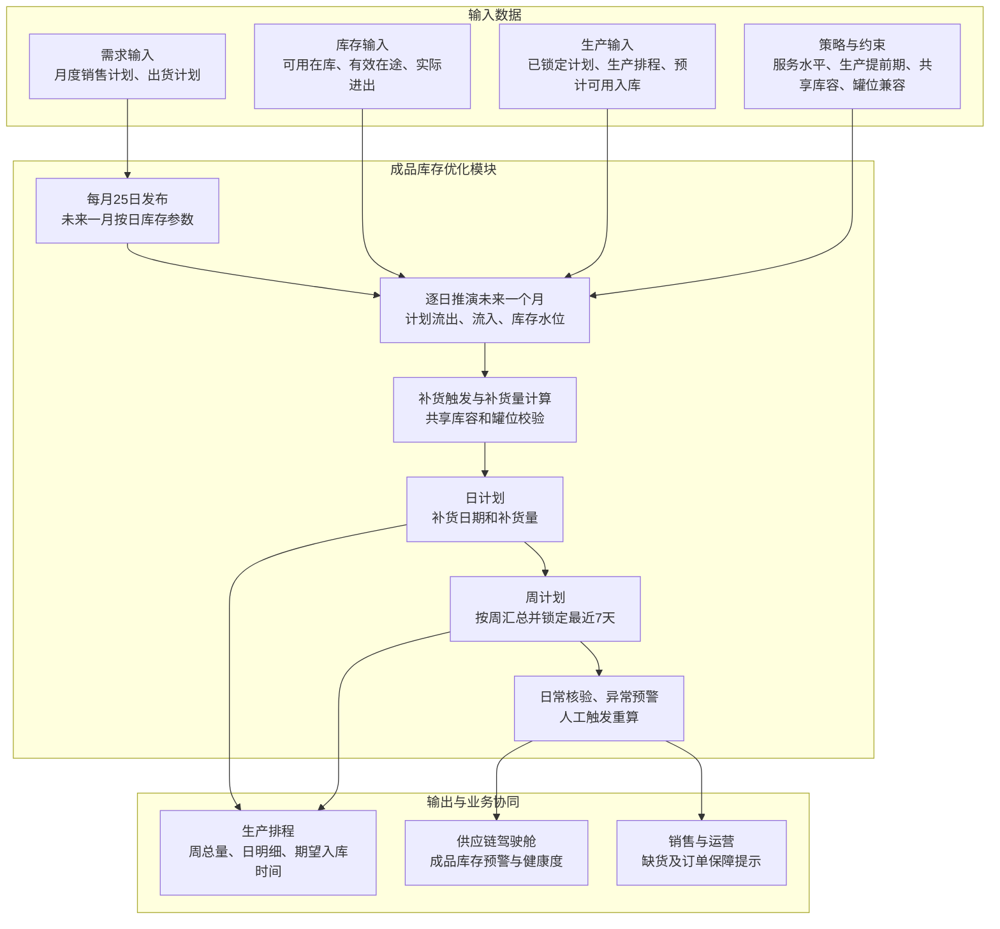

# 成品库存优化模块技术方案

## 1. 模块目标与边界

库存优化模块仅面向成品库存，解决三个问题：各成品应该保留多少库存、何时需要安排生产补充、建议生产补充多少。

模块根据月度销售计划、出货计划和生产排程，结合当前成品库存、有效在途或计划生产入库、历史出库波动和生产提前期，计算安全库存、再订货点、目标库存和生产补充建议，并对危险库存水位进行监控预警。计划按“月度参数—周计划—日计划”三级衔接：每月25日发布未来一个月按日使用的库存参数；每周滚动计算未来一个月计划并锁定最近7天；日计划给出具体补货日期、补货量和预计库存水位。

本模块不包含原料、辅料、在制品、副产品、包装材料及备品备件库存，也不涉及供应商选择或采购补货。补充建议和期望入库时间输出给生产排程模块，实际生产入库和销售出库结果返回库存模块更新库存水位。

## 2. 主要业务问题

- **成品库存参数依赖经验**：安全库存和上下限长期固定，不能随需求和生产补充能力变化及时调整。
- **可用库存口径不统一**：可用、已分配、冻结、待检和质量异常成品库存容易混用。
- **生产补充时点不准确**：没有同时考虑未来成品需求和生产提前期，发现缺货时可能已经来不及生产。
- **库存策略效果无法验证**：缺货、周转、呆滞和服务水平的实际变化缺少持续跟踪。

## 3. 业务处理与模块总图

### 3.1 成品库存模块总图

### 3.2 月、周、日三级计划协同

**月度参数**：每月25日接收次月分成品销售计划，结合生产提前期、服务水平和库存波动，一次性计算并发布未来一个月按日使用的安全库存、再订货点和目标库存。月度补货量由日计划汇总形成，用于总量查看，不单独作为生产执行版本。

**周计划**：系统每周滚动计算，展望未来一个月。根据起始库存、未来每日需求、已有生产排程、共享库容和库存参数，形成展望期内各周总补货量。最近7天为锁定期，与生产端确认后不再自动修改；锁定期外的计划随下周滚动重新计算。

**日计划**：在同一展望期内逐日推演计划流出、计划流入和预计库存，输出每天的补货日期、补货量和库存水位。有明确出货计划的日期使用出货计划；没有明确出货计划的日期使用月度销售计划拆分量。实际库存、实际出货和实际入库按日核验，异常时触发预警或人工重算。

周计划和日计划来自同一次逐日推演：先得到未来一个月每日补货明细，再按周汇总为周补货量。日计划必须扣除已锁定或已排程的计划生产入库，避免重复补货。锁定期内需求变化只触发风险提示，不自动改写已确认计划；确需调整时由业务人员人工触发并重新协同确认。

### 3.3 成品需求与库存分析

1. 获取销售订单、上游已有需求数据和生产排程，形成分周期成品需求；
2. 获取当前成品库存，包括可用、已分配、冻结、待检和质量异常库存；
3. 获取计划生产入库量、预计入库日期和待发运量；
4. 分析历史销售出库波动和生产提前期波动；
5. 计算未来成品库存水位和可支撑时间。

成品可用库存口径为：

$$
成品可用库存=现有合格库存-已分配库存-冻结库存-质量异常库存
$$

成品库存位置为：

$$
成品库存位置=成品可用库存+有效在途+已锁定或已排程计划入库-待满足成品需求
$$

有效在途包括已确认、数量和预计可用日期明确且未被取消的生产或转运数量。计划生产入库只在预计完成生产并具备入库条件的日期计入实物库存；转罐中的库存从原罐可用库存扣除，并在目标位置形成可用库存前保持在途状态，避免重复计算。

### 3.4 监控、预警与效果分析

库存数据更新频率与库存策略参数更新频率分开管理：库存水位需要高频更新，但安全库存、再订货点和目标库存不宜随日常库存变化频繁调整。

| 内容 | 建议更新频率 |
|---|---|
| 实际成品库存、罐位、待发运量 | 实时或按日更新 |
| 实际出货、实际生产入库 | 按日核验 |
| 生产排程和预计可用入库 | 按日同步，锁定计划单独标识 |
| 未来一个月日计划及各周总补货量 | 每周滚动计算 |
| 最近7天周计划和日计划 | 与生产端确认后锁定，原则上不自动修改 |
| 月度销售计划 | 每月25日更新 |
| 按日安全库存、再订货点 \(s_{i,d}\)、目标库存 \(S_{i,d}\) | 每月25日一次性计算并发布未来一个月参数 |
| 重大异常 | 预警后由业务人员确认是否临时调整参数 |

每月25日根据次月销售计划、生产提前期和服务水平，一次性计算并发布未来一个月每天使用的 \(SS_{i,d}\)、\(s_{i,d}\) 和 \(S_{i,d}\)。系统每周以最新库存为起点，逐日推演未来一个月库存水位，输出每日补货明细并汇总形成各周总补货量。最近7天经生产端确认后进入锁定期，其他日期随下一周滚动更新。

月度销售计划是需求基准，周计划是生产协同口径，日计划是执行明细。三者不能重复叠加；已锁定计划、已排程未完工量和有效在途必须先计入库存位置，再计算新增补货需求。

出现需求计划重大变化、产线长期停机、储罐检修、大客户订单变化或生产提前期明显延长时，系统进行预警，由业务人员确认是否在月中重新计算并发布库存策略。

- 实时比较当前成品库存、安全库存和再订货点；
- 当前或未来库存低于安全库存或再订货点时，在供应链驾驶舱触发预警；
- 预警可关联触发生产补充或生产排程调整建议；
- 记录成品库存策略、系统建议和实际执行结果；
- 统计成品库存周转率、订单满足率、缺货、滞销、呆滞和临期库存；
- 对比目标服务水平与实际达成率，验证库存策略效果。

## 4. 成品库存优化技术方案与模型

### 4.1 总体技术路线

成品库存优化采用动态 \((R,s,S)\) 策略：系统按复核周期 \(R\) 检查成品库存，当成品库存位置低于再订货点 \(s\) 时触发预警，并建议通过生产补充至目标库存 \(S\)。

其中，\(R\) 表示库存检查频率，可按日执行；\(s\) 和 \(S\) 是库存策略参数，原则上按月重新计算并发布。库存检查频率与策略参数更新频率不要求相同。

该模型结构简单、结果可解释，能够满足安全库存、再订货点和生产补充量计算要求。由于成品种类较少，系统按单个成品分别维护和计算库存参数，不增加ABC/XYZ分类模型。

### 4.2 储罐容量定义与成品映射

成品罐在当前成品使用结束后可以用于其他兼容成品，因此库存容量同时包含“罐位兼容”和“共享库容”两个层次，不能简单为每个成品永久划定固定容量。

容量采用以下口径：

- **工作容量**：储罐名义容量扣除安全液位、罐底余量等不可使用空间；
- **共享有效容量**：共享罐组中排除维修、清洗、冻结及不可用储罐后的工作容量之和；
- **兼容容量**：根据“成品—可用储罐”兼容关系，某成品理论上可使用的容量；
- **共享剩余容量**：共享有效容量扣除各成品在计划时点预计实物库存后的剩余空间。

共享罐组 \(g\) 在日期 \(t\) 的有效容量为：

$$
C_{g,t}^{eff}=\sum_{k\in T_g}V_k^{work}\times a_{k,t}
$$

所有使用该共享罐组的成品应满足：

$$
\sum_{i\in I_g}\hat I_{i,t}\leq C_{g,t}^{eff}
$$

第一阶段采用简化、可解释的分步处理：先暂不考虑共享库容计算各成品建议补货量；如果计划时点总库存超过共享有效容量，则按照成品服务水平从低到高依次减少补货量，直到满足共享库容。高服务水平成品优先保留补货需求。

$$
超出量_t=\max\left(0,\sum_{i\in I_g}\hat I_{i,t}-C_{g,t}^{eff}\right)
$$

系统同时保留共享库容联合优化接口，后续可在同一模型中统一计算多个成品的补货量。无论采用哪种方式，成品只能使用兼容储罐，不能因为共享库容而忽略产品与罐位的兼容关系。

储罐流转还需满足以下执行规则：

- 多个QC罐中的同一成品可以合并进入一个成品罐；
- 一个QC罐不能拆分进入多个成品罐；
- 成品罐库存返回QC罐时，转运量从可用库存转为在途或转运中状态；
- 转运中的数量不能同时计入可用库存和计划入库；
- 是否允许在原有库存上继续补入，以及是否需要整罐或封罐后销售，作为待确认的可配置约束。

库存优化模型负责共享总量和兼容容量校验，不直接生成批次级入罐任务；具体QC罐、成品罐及转罐执行由生产或仓储系统安排。

### 4.3 符号与参数

| 符号 | 含义 |
|---|---|
| \(i\) | 成品SKU |
| \(k\) | 成品储罐 |
| \(R_i\) | 成品 \(i\) 的库存复核周期 |
| \(\bar d_i\) | 成品 \(i\) 的周期平均需求量 |
| \(\sigma_{d_i}\) | 成品 \(i\) 的需求波动 |
| \(\bar L_i\) | 成品 \(i\) 的平均生产提前期 |
| \(\sigma_{L_i}\) | 成品 \(i\) 的生产提前期波动 |
| \(z_i\) | 目标服务水平对应的安全系数 |
| \(IP_i\) | 成品 \(i\) 的库存位置 |
| \(H\) | 周滚动计算的展望期，当前为未来一个月 |
| \(L\) | 锁定期，当前暂定为最近7天 |
| \(IP_{i,d}\) | 成品 \(i\) 在日期 \(d\) 的库存位置 |
| \(SS_{i,d}\) | 每月发布的成品 \(i\) 日期 \(d\) 安全库存 |
| \(s_{i,d}\) | 每月发布的成品 \(i\) 日期 \(d\) 再订货点 |
| \(S_{i,d}\) | 每月发布的成品 \(i\) 日期 \(d\) 目标库存 |
| \(Q_i\) | 成品 \(i\) 的建议生产补充量 |
| \(M_i\) | 成品 \(i\) 的月度计划出货总量 |
| \(M_{i,t}^{rem}\) | 日期 \(t\) 尚未分配的月度计划出货量 |
| \(W_{i,w}^{out}\) | 成品 \(i\) 在第 \(w\) 周的计划出货量 |
| \(W_{i,w}^{in}\) | 成品 \(i\) 在第 \(w\) 周的计划生产入库量 |
| \(Q_{i,w}^{plan}\) | 成品 \(i\) 在第 \(w\) 周的建议生产补充量 |
| \(I_{i,w}^{begin}\) | 成品 \(i\) 在第 \(w\) 周开始时的可用库存 |
| \(C_{g,d}^{eff}\) | 共享罐组 \(g\) 在日期 \(d\) 的有效容量 |
| \(D_{i,d}\) | 成品 \(i\) 在日期 \(d\) 的计划需求量 |
| \(O_{i,d}\) | 成品 \(i\) 在日期 \(d\) 的明确订单量 |
| \(A_{i,t}\) | 截至日期 \(t\) 成品 \(i\) 的本月累计实际出货量 |
| \(R_{i,t}\) | 日期 \(t\) 之后尚无明确订单的剩余日期集合 |
| \(P_{i,d}^{plan}\) | 成品 \(i\) 在日期 \(d\) 预计形成可用库存的计划生产入库量 |
| \(\hat I_{i,t+h}\) | 成品 \(i\) 在未来第 \(h\) 日的预计可用库存 |
| \(Q_{i,t}^{new}\) | 日期 \(t\) 重新计算的新增生产补充建议量 |
| \(T_g\) | 共享罐组 \(g\) 包含的储罐集合 |
| \(I_g\) | 可以使用共享罐组 \(g\) 的成品集合 |
| \(V_k^{work}\) | 储罐 \(k\) 的工作容量 |
| \(a_{k,t}\) | 时点 \(t\) 储罐 \(k\) 的可用状态，可用为1，否则为0 |
| \(B_i\) | 成品 \(i\) 的单次补货批量参数，业务规则待确认 |

### 4.4 未来一个月逐日推演、周汇总与锁定期

月度出货计划只有总量时，系统将月度总量分解到每日。每天先扣除本月累计实际出货和未来已有明确订单，得到尚未分配的月度计划出货量：

$$
M_{i,t}^{rem}=\max\left(0,M_i-A_{i,t}-\sum_{\tau>t,\tau\in U_i}O_{i,\tau}\right)
$$

对于未来已有明确订单的日期直接使用订单量；其余数量平均分摊到未来尚无明确订单的日期：

$$
D_{i,d}=\begin{cases}
O_{i,d}, & d\text{ 已有明确订单}\\
\dfrac{M_{i,t}^{rem}}{|R_{i,t}|}, & d\in R_{i,t}
\end{cases}
$$

其中，\(U_i\) 为已有明确出货计划的日期集合，\(R_{i,t}\) 为尚无明确出货计划的剩余日期集合。出货计划的提前期、展望期和锁定期尚待CRM确认；确认前按“有出货计划用出货计划、没有则使用销售计划日分摊”处理。

系统以当前可用库存和有效在途为起点，逐日推演未来一个月：

$$
\hat I_{i,d}=\hat I_{i,d-1}+P_{i,d}^{plan}+Q_{i,d}-D_{i,d}
$$

其中，已锁定计划、已排程未完工量和其他有效在途按预计形成可用库存的日期计入 \(P_{i,d}^{plan}\)，不得再次计算为新增补货。锁定期内的补货量保持已确认值：

$$
Q_{i,d}=Q_{i,d}^{locked},\qquad d\in L
$$

锁定期外，当库存位置达到当日再订货点时形成补货建议：

$$
IP_{i,d}\leq s_{i,d}\Rightarrow
Q_{i,d}^{raw}=\max\left(0,S_{i,d}-IP_{i,d}\right),\qquad d\notin L
$$

若启用最小补货批量参数，则建议量向上取到批量整数倍；该规则在业务确认前保持可配置：

$$
Q_{i,d}=\left\lceil\frac{Q_{i,d}^{raw}}{B_i}\right\rceil B_i
$$

计算完每日补货明细后，按周汇总形成周计划：

$$
Q_{i,w}^{plan}=\sum_{d\in w}Q_{i,d},\qquad
W_{i,w}^{out}=\sum_{d\in w}D_{i,d},\qquad
W_{i,w}^{in}=\sum_{d\in w}\left(P_{i,d}^{plan}+Q_{i,d}\right)
$$

共享库容校验在逐日推演后执行。如果某日多个成品预计库存超过共享有效容量，第一阶段按照服务水平从低到高削减未锁定补货量；锁定期内不自动削减，只触发容量冲突预警并由业务人员协调处理。

次周周初以最新库存、实际进出和生产排程重新计算新的未来一个月计划，并将新的最近7天转为锁定期。需求或生产发生重大异常时可人工触发重算，但锁定期内的调整必须重新确认发布。

### 4.5 成品安全库存

每月25日根据次月销售计划和历史波动，一次性计算并发布未来一个月每天使用的安全库存。对于需求和生产提前期波动相对稳定的成品，可按以下方式计算：

$$
SS_{i,d}=z_i\sqrt{\bar L_i\sigma_{d_i}^{2}+\bar d_i^{2}\sigma_{L_i}^{2}}
$$

该公式同时考虑成品需求波动和生产提前期波动。服务水平越高、需求或生产提前期波动越大，安全库存越高。

### 4.6 再订货点

$$
s_{i,d}=生产提前期内计划需求+SS_{i,d}
$$

当成品库存位置低于或等于再订货点时触发预警和生产补充建议：

$$
IP_{i,d}\leq s_{i,d}\quad\Rightarrow\quad触发成品库存预警和生产补充建议
$$

再订货点用于判断“何时安排生产补充”。生产提前期从生产补充需求审批完成、正式进入待生产状态开始，至成品生产完成并进入可用库存为止。当前为连续生产，正常情况下待生产时间暂按0处理；开车订单生产时间较长，应单独维护提前期。质检放行通常约2小时且日内完成，暂不单独计入提前期。

### 4.7 目标库存与生产补充量

不考虑容量时的目标库存为：

$$
S_{i,d}^{raw}=生产提前期及复核周期内计划需求+SS_{i,d}
$$

目标库存用于确定“生产补充到多少”。不考虑共享库容时，建议生产补充量为目标库存与库存位置之间的差额：

$$
Q_{i,d}^{raw}=\max(0,S_{i,d}^{raw}-IP_{i,d})
$$

随后进行共享库容和罐位兼容校验。若共享容量充足，则 \(S_{i,d}=S_{i,d}^{raw}\)；若超出共享容量，第一阶段按服务水平从低到高减少未锁定补货量，并标记“目标库存受共享库容限制”。锁定期内若出现容量冲突，只预警并提交人工协调，不自动修改已发布计划。

库存优化模型不增加批次级入罐决策，只输出共享罐组容量占用、兼容罐位范围和容量冲突；QC罐与成品罐的具体流转由生产或仓储执行环节安排。

系统向生产排程模块输出：

- **建议生产补充量**：按照 \((R,s,S)\) 策略补充至目标库存的数量，并经过共享库容调整；
- **补货批量参数**：业务确认前作为可配置参数，不默认要求整罐或灌满；
- **期望入库时间**：为保障订单交付，成品需要完成生产、质检并达到可用状态的时间。

### 4.8 可选成本分析

系统保留单位成品库存持有成本和单位缺货成本的比较能力，用于调整服务水平或库存策略，不作为日常库存水位计算的必选步骤：

$$
成品库存综合成本=库存持有成本+缺货成本
$$

系统可在业务配置的候选服务水平范围内，比较不同成品安全库存方案的持有成本和缺货成本，推荐综合成本较低的服务水平及安全库存。

## 5. 模型输入

| 数据来源分类 | 输入内容 | 说明 |
|---|---|---|
| 月度销售计划 | 成品SKU、月份、月度计划出货总量、日历拆分规则 | 每月25日更新，用于形成未来一个月需求基准和按日库存参数 |
| CRM/出货计划 | 成品SKU、计划出货日期、计划出货量、计划状态 | 有明确出货计划的日期优先使用；提前期、展望期和锁定期待CRM确认 |
| 生产排程/MES | 已锁定周计划、日生产计划、计划生产量、预计可用入库日期、实际完工量、订单类型 | 计入有效在途并识别正常连续生产或开车订单提前期 |
| SAP/WMS | 成品现有库存、已分配库存、冻结库存、待检库存、质量异常库存 | 用于计算成品可用库存和库存位置 |
| SAP/WMS/TMS | 待发运量、计划出库、实际出库、转罐中或在途库存 | 用于计算每日流出和避免转罐库存重复计入 |
| LIMS/QMS | 成品质检状态、放行时间和质量冻结状态 | 用于确定成品预计可用时间 |
| 历史数据服务 | 历史销售出库量、订单满足情况和出库日期 | 用于计算各成品的平均需求和需求波动 |
| 人工配置 | 服务水平、复核周期、安全系数、锁定期和展望期 | 服务水平按成品维护；锁定期暂定7天，展望期暂定未来一个月 |
| 人工配置 | 正常连续生产提前期、开车订单生产提前期 | 正常生产等待时间暂按0；开车订单单独维护 |
| 储罐主数据/人工配置 | 共享罐组、成品—储罐兼容关系、工作容量、安全液位 | 用于共享库容和罐位兼容校验 |
| WMS/MES或人工维护 | 储罐液位、当前成品、清洗、维修、冻结、QC罐及转罐状态 | 用于计算共享有效容量和库存状态转换 |
| 人工配置 | 最小补货批量、整罐、封罐和最低销售水位规则 | 业务调研未完成前均作为可选配置，不写死 |
| 人工配置 | 单位库存持有成本和单位缺货成本 | 用于可选成本分析 |

系统已有数据原则上通过统一数据服务层获取；暂时无法从业务系统取得的数据由业务人员维护。

## 6. 模型输出

| 输出 | 内容 |
|---|---|
| 按日库存参数 | 每月25日发布未来一个月每天的安全库存、再订货点和目标库存 |
| 月度补货汇总 | 由未来一个月每日补货量汇总形成，用于总量查看 |
| 周计划 | 展望期内各周计划流出、计划流入、总补货量及锁定状态 |
| 日计划 | 展望期内每天的计划需求、补货时间、补货量、预计库存和计划状态 |
| 锁定计划 | 最近7天已确认的周总量和日补货明细 |
| 共享库容结果 | 共享有效容量、预计占用、超出量、调整前后补货量和容量冲突 |
| 罐位兼容结果 | 成品可用罐位范围、QC罐不可拆分校验及转罐状态提示 |
| 期望可用入库时间 | 成品需要完成生产、质检并形成可用库存的时间 |
| 未来一个月库存轨迹 | 根据日度需求、当前库存、有效在途和补货计划形成的每日未来库存水位 |
| 成品库存预警 | 低于安全库存、再订货点或危险水位的成品和时间 |
| 情景比较 | 调整服务水平、生产提前期或共享库容后的库存和成本变化 |
| 成品库存健康度 | 周转率、订单满足率、缺货、滞销、呆滞和临期库存情况 |

## 7. 运行与接口要求

### 7.1 运行机制

- 系统每月25日根据次月销售计划计算并发布未来一个月按日安全库存、再订货点和目标库存；
- 系统每周滚动计算新的未来一个月计划，先形成每日补货明细，再按周汇总总补货量；
- 最近7天为锁定期，与生产端确认发布后不自动修改；锁定期外随周滚动重算；
- 有明确出货计划的日期使用出货计划，没有明确出货计划的日期使用月度销售计划拆分量；
- 当前成品库存、罐位、待发运状态和实际出库实时或按日更新；
- 系统每日核验实际库存、实际出货、实际入库和生产排程，异常时预警；
- 计算前先计入已锁定计划、已排程未完工量和有效在途，避免重复补货；
- 逐日推演完成后校验共享库容，超出部分第一阶段按服务水平从低到高削减未锁定补货量；
- 锁定期内发生需求、产能、库容或生产提前期重大变化时只预警，人工触发后重新确认发布；
- 全库成品安全库存重新计算应在1分钟内完成；
- 每次计算保存输入、参数、结果和人工调整记录。

### 7.2 参数配置与情景比较

- 服务水平、安全系数、生产提前期、锁定期、展望期和成本参数可通过界面配置；
- 支持按单个成品维护库存策略；
- 支持配置共享罐组和成品—储罐兼容关系；
- 最小补货批量、整罐和封罐规则在业务确认前作为可选参数；
- 支持模拟生产提前期、服务水平或共享库容变化后的库存计划；
- 情景结果通过对比表或图表展示，不直接修改正式库存策略。

### 7.3 核心接口

- 模块通过RESTful API与统一数据服务层、生产排程、销售订单和供应链驾驶舱集成；
- 从月度销售计划获取各成品月度计划出货总量和日历拆分规则；
- 从CRM获取明确到日的出货计划；
- 从生产排程/MES获取已锁定计划、日生产计划、预计可用入库日期、实际完工和订单类型；
- 从SAP/WMS获取成品库存、分配、冻结、待检和出库状态；
- 从LIMS/QMS获取成品质检、放行和质量冻结状态；
- 向生产排程输出未来各周总补货量、每日补货明细和期望入库时间；
- 接收生产排程返回的计划生产入库安排和实际执行结果；
- 向供应链驾驶舱推送成品库存预警和健康度指标。

## 8. 异常与预警

- 当前成品库存低于安全库存或再订货点时，系统触发预警；
- 未来成品库存预计低于危险水位时，系统输出缺口、时间和生产补充建议；
- 多成品预计库存超过共享罐组有效容量时，系统触发共享库容冲突预警；
- 锁定计划超过共享库容时不自动削减，提示人工协调；
- 成品与目标罐位不兼容、一个QC罐被拆分进入多个成品罐或转罐库存重复计入时，系统触发校验预警；
- 成品库存、计划生产入库或待发运数据缺失、过期或状态异常时，系统预警并提示人工核实；
- 生产提前期数据不足时，使用业务人员维护的标准提前期；开车订单使用单独参数；
- 出货计划口径或最小补货批量规则未确认时，系统按当前配置计算并标记数据口径；
- 生产排程无法满足期望入库时间时，系统更新缺货风险并提示调整生产排程或销售交付计划；
- 所有成品库存策略调整需由业务人员确认后生效。
