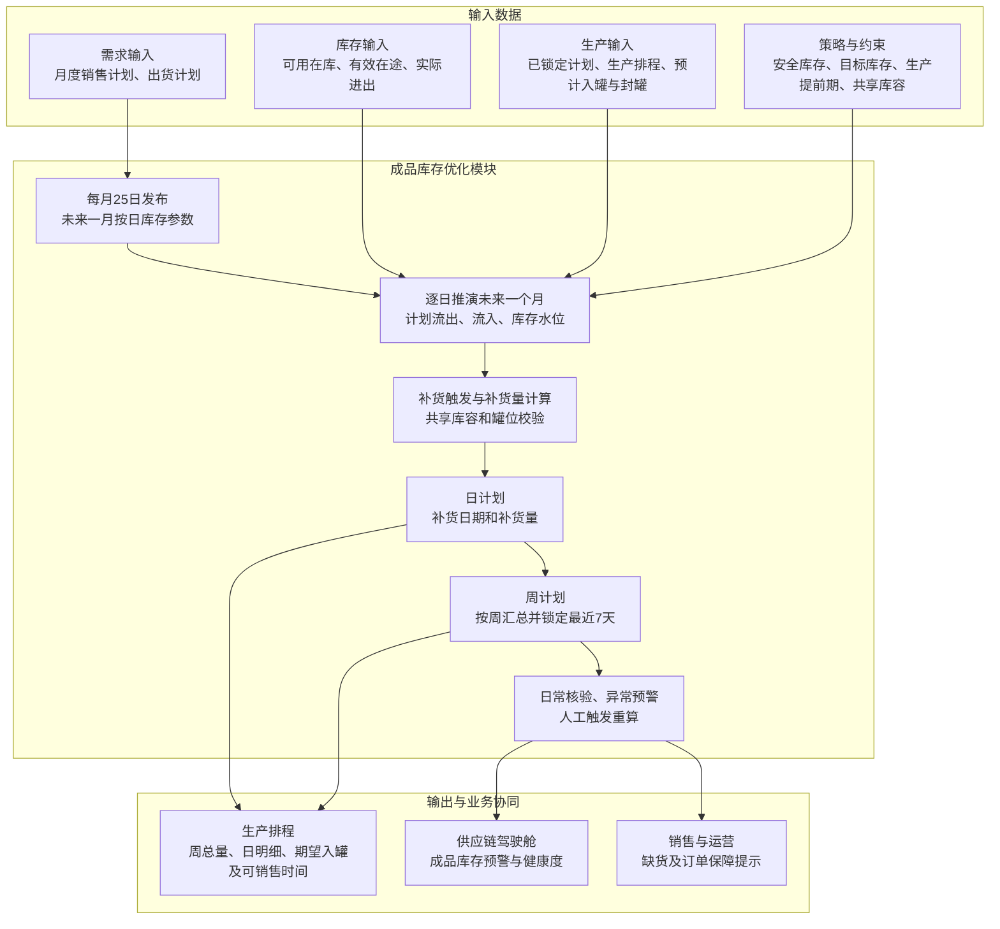

# 成品库存优化模块技术方案（优化版）

## 1. 模块目标与边界

库存优化模块仅面向成品库存，解决三个问题：各成品应该保留多少库存、何时需要安排生产补充、建议生产补充多少。

模块根据月度销售计划、明确出货计划和生产排程，结合当前成品库存、有效在途或计划生产入库、历史日需求波动、目标服务水平和生产提前期，逐日计算安全库存、再订货点、目标库存和生产补充建议，并对危险库存水位进行监控预警。计划按“月度参数—周计划—日计划”三级衔接：每月25日发布次月目标服务水平、历史波动参数及未来一个月按日使用的安全库存、再订货点和目标库存；每周滚动计算未来一个月计划并锁定最近7天；日计划给出具体补货日期、补货量和预计库存水位。

本模块不包含原料、辅料、在制品、副产品、包装材料及备品备件库存，也不涉及供应商选择或采购补货。补充建议、期望实际入罐时间和首个可销售时间输出给生产排程模块，实际入罐、封罐和销售出库结果返回库存模块更新实物与可销售库存水位。

## 2. 主要业务问题

- **安全库存水位缺少统一口径**：历史日需求波动、覆盖周期和成品或分类目标服务水平缺少统一计算、复核和发布机制。
- **可用库存口径不统一**：可用、已分配、冻结、待检和质量异常成品库存容易混用。
- **生产补充时点不准确**：没有同时考虑未来成品需求和生产提前期，发现缺货时可能已经来不及生产。
- **库存策略效果无法验证**：缺货、订单满足率、周转和呆滞等实际结果缺少持续跟踪。

## 3. 业务处理与模块总图

### 3.1 成品库存模块总图

### 3.2 月、周、日三级计划协同

**月度参数**：每月25日接收次月分成品销售计划，复核并发布成品或分类目标服务水平、历史日需求标准差及检查周期。系统根据逐日需求、包含入罐与封罐的完整补充周期以及检查周期，形成未来一个月按日使用的安全库存、再订货点和目标库存。月度补货量由日计划汇总形成，用于总量查看，不单独作为生产执行版本。

**周计划**：系统每周滚动计算，展望未来一个月。根据起始库存、未来每日需求、已有生产排程、共享库容和库存参数，形成展望期内各周总补货量。最近7天为锁定期，与生产端确认后不再自动修改；锁定期外的计划随下周滚动重新计算。

**日计划**：在同一展望期内逐日推演计划流出、计划流入和预计库存，输出每天的补货日期、补货量和库存水位。有明确出货计划的日期使用出货计划；没有明确出货计划的日期使用月度销售计划拆分量。实际库存、实际出货和实际入库按日核验，异常时触发预警或人工重算。

周计划和日计划来自同一次逐日推演：先得到未来一个月每日补货明细，再按周汇总为周补货量。日计划必须扣除已锁定或已排程的计划生产入库，避免重复补货。锁定期内需求变化只触发风险提示，不自动改写已确认计划；确需调整时由业务人员人工触发并重新协同确认。

### 3.3 成品需求与库存分析

1. 获取销售订单、上游已有需求数据和生产排程，形成分周期成品需求；
2. 获取当前成品库存，包括可用、已分配、冻结、待检和质量异常库存；
3. 获取计划生产入库量、预计入库日期和待发运量；
4. 复核历史日需求样本、目标服务水平、生产提前期和历史计划执行偏差；
5. 计算未来成品库存水位和可支撑时间。

成品可用库存口径为：

$$
成品可用库存=现有合格且已封罐库存-已分配库存-冻结库存-质量异常库存
$$

成品库存位置为：

$$
成品库存位置=成品可用库存+有效在途+已锁定或已排程计划入库-待满足成品需求
$$

其中“待满足成品需求”仅指已承诺但尚未从可用库存扣减的需求，不包含用于计算再订货点和目标库存的未来计划需求，以免重复扣减。未封罐的合格成品占用实物库容，但不得计入可销售库存；计划生产入罐按实际入罐日计入实物库存，完成封罐后才按首个可销售日计入可用库存。有效在途包括已确认、数量和预计可销售日期明确且未被取消的生产或转运数量。成品罐之间转运时，数量从原罐扣除，目标罐完成入罐与封罐前保持在途或不可销售状态，避免重复计算；成品罐库存不返回QC罐。

### 3.4 监控、预警与效果分析

库存数据更新频率与库存策略参数更新频率分开管理：库存水位需要高频更新，但服务水平、历史波动参数和检查周期不宜随日常库存变化频繁调整；按日水位可随计划需求更新。

| 内容 | 建议更新频率 |
|---|---|
| 实际成品库存、罐位、待发运量 | 实时或按日更新 |
| 实际出货、实际生产入库 | 按日核验 |
| 生产排程、预计实际入罐、封罐和首个可销售日 | 按日同步，锁定计划单独标识 |
| 未来一个月日计划及各周总补货量 | 每周滚动计算 |
| 最近7天周计划和日计划 | 与生产端确认后锁定，原则上不自动修改 |
| 月度销售计划 | 每月25日更新 |
| 目标服务水平 \(\alpha_i\)、历史日需求标准差 \(\sigma_i\)、检查周期 \(R_i\) | 每月25日复核并发布，重大异常时经人工确认调整 |
| 按日安全库存、再订货点及目标库存 | 每月25日按次月每日计划需求、生产周期和检查周期形成；周滚动计划采用最新需求重算未锁定日期，并留存参数版本 |
| 重大异常 | 预警后由业务人员确认是否临时调整参数 |

每月25日复核并发布次月各成品适用的目标服务水平 \(\alpha_i\)、历史日需求标准差 \(\sigma_i\) 和检查周期 \(R_i\)，再按每日计划需求形成逐日安全库存 \(SS_{i,d}^{s}\)、再订货点 \(s_{i,d}\) 和目标库存 \(S_{i,d}\)。周滚动计算时，使用最新需求重算未锁定日期的水位并记录版本；普通实际库存波动不改变已发布的服务水平和历史波动参数。系统每周以最新库存为起点，逐日推演未来一个月库存水位，输出每日补货明细并汇总形成各周总补货量。最近7天经生产端确认后进入锁定期，其他日期随下一周滚动更新。

月度销售计划是需求基准，周计划是生产协同口径，日计划是执行明细。三者不能重复叠加；按日安全库存不得再作为需求流出重复扣减；已锁定计划、已排程未完工量和有效在途必须先计入库存位置，再计算新增补货需求。

出现需求计划重大变化、产线长期停机、储罐检修、大客户订单变化或生产提前期明显延长时，系统进行预警，由业务人员确认是否在月中重新计算并发布库存策略。

- 实时比较当前成品库存、当日安全库存和当日再订货点；
- 库存位置达到再订货点时提示安排生产补充；当前或未来可用库存低于安全库存时触发危险水位预警；
- 预警可关联触发生产补充或生产排程调整建议；
- 记录成品库存策略、系统建议和实际执行结果；
- 统计成品库存周转率、订单满足率、缺货、滞销、呆滞和临期库存；
- 对比目标服务水平、模型计算的安全库存与实际订单满足率、缺货量和库存占用，验证库存策略效果。

## 4. 成品库存优化技术方案与模型

### 4.1 符号与参数

| 符号 | 含义 |
|---|---|
| \(i\) | 成品SKU |
| \(k\) | 成品储罐 |
| \(R_i\) | 成品 \(i\) 的检查周期，当前为1天 |
| \(\alpha_i\) | 成品 \(i\) 的目标周期服务水平，按成品优先、成品分类兜底配置 |
| \(z_i=\Phi^{-1}(\alpha_i)\) | 目标服务水平对应的标准正态分位数 |
| \(x_{i,j}\) | 历史第 \(j\) 天成品 \(i\) 的实际需求量，经缺货截断修正 |
| \(n_i\) | 历史有效日需求样本天数 |
| \(\bar x_i\) | 历史日需求均值 |
| \(\sigma_i\) | 历史日需求样本标准差 |
| \(L_i\) | 成品 \(i\) 的生产提前期 |
| \(IP_i\) | 成品 \(i\) 的库存位置 |
| \(H\) | 周滚动计算的展望期，当前为未来一个月 |
| \(L\) | 锁定期，当前暂定为最近7天 |
| \(IP_{i,d}\) | 成品 \(i\) 在日期 \(d\) 的库存位置 |
| \(H_{i,d}^{s}\) | 日期 \(d\) 起至完成生产、质检、封罐并进入可销售状态前的需求覆盖天数 |
| \(H_{i,d}^{S}=H_{i,d}^{s}+R_i\) | 目标库存覆盖天数，即完整补充周期加检查周期 |
| \(SS_{i,d}^{s}\) | 日期 \(d\) 的再订货点安全库存，覆盖 \(H_{i,d}^{s}\) 天 |
| \(SS_{i,d}^{S}\) | 日期 \(d\) 的目标库存安全库存，覆盖 \(H_{i,d}^{S}\) 天 |
| \(s_{i,d}\) | 成品 \(i\) 日期 \(d\) 的再订货点 |
| \(S_{i,d}\) | 成品 \(i\) 日期 \(d\) 的目标库存 |
| \(a_i(d)\) | 日期 \(d\) 触发生产补充后，完成封罐的首个可销售日期 |
| \(p_i(d)\) | 日期 \(d\) 触发生产补充后预计实际进入成品罐的日期，早于首个可销售日 \(a_i(d)\) |
| \(Q_i\) | 成品 \(i\) 的建议生产补充量 |
| \(Q_{i,d}\) | 日期 \(d\) 形成的生产补充建议量，按触发日期归属 |
| \(Q_{i,d}^{avail}\) | 日期 \(d\) 预计形成可用库存的新增建议量，按入库日期归属；已纳入正式排程后转入 \(P_{i,d}^{plan}\) |
| \(M_i\) | 成品 \(i\) 的月度计划出货总量 |
| \(M_{i,t}^{rem}\) | 日期 \(t\) 尚未分配的月度计划出货量 |
| \(W_{i,w}^{out}\) | 成品 \(i\) 在第 \(w\) 周的计划出货量 |
| \(W_{i,w}^{in}\) | 成品 \(i\) 在第 \(w\) 周的计划生产入库量 |
| \(Q_{i,w}^{plan}\) | 成品 \(i\) 在第 \(w\) 周的建议生产补充量 |
| \(I_{i,w}^{begin}\) | 成品 \(i\) 在第 \(w\) 周开始时的可用库存 |
| \(C_{g,d}^{eff}\) | 共享罐组 \(g\) 在日期 \(d\) 的有效容量 |
| \(T_i^{ded}\)、\(C_{i,t}^{ded}\) | 成品 \(i\) 的专用储罐集合及日期 \(t\) 的专用有效容量 |
| \(c_{i,k}\) | 成品 \(i\) 与储罐 \(k\) 的兼容关系，兼容为1，否则为0 |
| \(F_{i,k,t}\) | 联合模型中日期 \(t\) 末成品 \(i\) 在储罐 \(k\) 的规划库存 |
| \(G_{i,k,t}\) | 联合模型中日期 \(t\) 末储罐 \(k\) 内已封罐、可销售的成品 \(i\) 库存 |
| \(b_{i,k,t}\) | 联合模型中日期 \(t\) 储罐 \(k\) 是否分配给成品 \(i\) 的二元变量 |
| \(r_{i,k,t}\)、\(e_{i,k,t}\) | 联合模型中日期 \(t\) 进入储罐和从储罐发出的成品数量 |
| \(P_{i,t}^{tank}\)、\(Q_{i,t}^{tank}\) | 已确认计划及新增建议在日期 \(t\) 实际进入成品罐的数量，区别于封罐后的可销售入库量 |
| \(q_{i,d}\)、\(u_{i,t}\)、\(h_{i,t}\) | 联合模型中新增补货量、未满足需求量及低于安全库存的缺口 |
| \(m_{k,t}^{in}\)、\(m_{k,t}^{out}\) | 储罐 \(k\) 在日期 \(t\) 是否处于入罐或销售出罐状态的二元变量 |
| \(z_{k,t}^{seal}\)、\(v_{k,t}^{seal}\) | 日期 \(t\) 日末的封罐可销售状态及当日完成封罐的二元变量 |
| \(v_{k,t}^{ready}\) | 生产、质检及封罐流程允许在日期 \(t\) 完成封罐的状态参数 |
| \(\gamma_{k,t}\)、\(\gamma_{k,t}^{ready}\) | 联合模型中储罐在日期 \(t\) 的切换决策及经清空、清洗和质检确认的可切换状态 |
| \(M_{k,t}^{in}\)、\(M_{k,t}^{out}\)、\(Cap_d^{prod}\) | 储罐日最大入罐和销售出罐量，以及生产端提供时使用的日生产能力 |
| \(w_i^{dem}\)、\(w_i^{safe}\) | 成品需求缺口和安全库存缺口的业务优先级权重 |
| \(D_{i,d}\) | 成品 \(i\) 在日期 \(d\) 的计划需求量 |
| \(O_{i,d}\) | 成品 \(i\) 在日期 \(d\) 的明确订单量 |
| \(A_{i,t}\) | 截至日期 \(t\) 成品 \(i\) 的本月累计实际出货量 |
| \(R_{i,t}\) | 日期 \(t\) 之后尚无明确订单的剩余日期集合 |
| \(P_{i,d}^{plan}\) | 成品 \(i\) 在日期 \(d\) 预计形成可用库存的计划生产入库量 |
| \(\hat I_{i,t+h}\) | 成品 \(i\) 在未来第 \(h\) 日的预计可用库存 |
| \(Q_{i,t}^{new}\) | 日期 \(t\) 重新计算的新增生产补充建议量 |
| \(T_g\) | 共享罐组 \(g\) 包含的储罐集合 |
| \(I_g\) | 可以使用共享罐组 \(g\) 的成品集合 |
| \(V_k^{work}\) | 储罐 \(k\) 的工作容量 |
| \(a_{k,t}\) | 时点 \(t\) 储罐 \(k\) 的可用状态，可用为1，否则为0 |
| \(B_i\) | 成品 \(i\) 的单次补货批量参数，业务规则待确认 |

### 4.2 总体技术路线

成品库存优化采用动态 \((R,s,S)\) 策略：系统按检查周期 \(R\) 检查成品库存，当成品库存位置低于或等于当日再订货点 \(s_{i,d}\) 时触发预警，并建议通过生产补充至当日目标库存 \(S_{i,d}\)。

其中，\(R_i\) 表示检查周期，当前为1天；目标服务水平 \(\alpha_i\) 由业务人员在成品维度或成品分类维度设定，系统按历史日需求波动计算不同覆盖周期的安全库存。再订货点覆盖至封罐后首个可销售日的完整补充周期，目标库存覆盖该周期加检查周期；两者均按日期计算。服务水平与历史波动参数按月复核，检查周期与策略参数更新频率不要求相同。

该模型结构简单、结果可解释，能够满足安全库存、再订货点和生产补充量计算要求。由于成品种类较少，系统按单个成品计算库存水位，服务水平可继承成品分类配置，不增加ABC/XYZ分类模型。

### 4.3 储罐容量定义与成品映射

按储罐资源的实际使用关系，将成品分为两类。同一成品若同时使用专用罐和共享罐，整体按共享场景处理：其可用专用罐和共享罐一并纳入相应规划罐组，专用罐只对该成品设置兼容，避免把同一容量重复计入两个口径。储罐工作容量 \(V_k^{work}\) 为名义容量扣除安全液位、罐底余量等不可使用空间；\(a_{k,t}=0\) 表示日期 \(t\) 因维修、清洗、冻结等原因不可用。

**第一类：有明确对应储罐的成品。** 成品 \(i\) 的专用罐集合 \(T_i^{ded}\) 与其他成品的专用罐集合互不重叠，且均满足兼容关系。可直接按日期计算库容上限：

$$
C_{i,t}^{ded}=\sum_{k\in T_i^{ded}}V_k^{work}a_{k,t},\qquad
\hat I_{i,t}\leq C_{i,t}^{ded}
$$

该上限约束预计实物库存和新增补货的可入库量；还须逐罐校验封罐后销售和入罐、销售出罐互斥。目标库存 \(S_{i,d}\) 仍按需求及安全库存公式计算，若超过专用库容，保留原目标值并报告容量缺口，不把目标库存参数直接改写为库容上限。

**第二类：多个成品共享多个储罐。** 共享罐组 \(g\) 含储罐集合 \(T_g\) 和可能使用该组的成品集合 \(I_g\)。共享总容量及必要的总量约束为：

$$
C_{g,t}^{eff}=\sum_{k\in T_g}V_k^{work}a_{k,t},\qquad
\sum_{i\in I_g}\hat I_{i,t}\leq C_{g,t}^{eff}
$$

仅满足总量约束仍可能因成品与储罐不兼容、单罐不足或同一罐不能同时装两种成品而无法执行。因此共享场景提供以下两种方案，按罐组配置选择，均以“成品—储罐”兼容关系 \(c_{i,k}\) 为硬约束。

**方案一：第一阶段采用简化、可解释的分步处理。** 先按各成品的 \((R,s,S)\) 规则分别形成原始补货建议，再逐日检查共享总容量、各成品兼容罐的容量上界、封罐状态及入罐和销售出罐是否冲突。若超限或封罐时序不满足销售计划，输出各日超出量、原始建议量、估计的可执行量上界及最早可销售日期：

$$
超出量_{g,t}=\max\left(0,\sum_{i\in I_g}\hat I_{i,t}-C_{g,t}^{eff}\right)
$$

库存计划员优先保障销售需求，结合当前罐位、清洗及封罐安排调整未锁定补货量；在销售可满足的可行方案中，优先选择能使在用罐液位更接近工作容量的安排，但不设置封罐最低液位。单个成品的容量上界不能直接视为所有成品可同时执行的补货量；调整后必须重新逐日推演并复核总量、兼容性和封罐后销售条件。锁定计划出现冲突时只预警并提交人工协调。

**方案二：共享罐组联合优化。** 在同一个规划模型中同时决定 \(I_g\) 内各成品的新增补货量和共享储罐的规划占用，使用未来一个月逐日需求、现有罐内库存、已确认入罐及封罐计划、首个可销售日期、罐位状态和兼容关系。可采用混合整数线性规划；以下变量和约束定义了可执行的基础模型：

- 决策变量：\(q_{i,d}\geq0\) 为日期 \(d\) 新增补货量；\(F_{i,k,t}\geq0\) 为日末罐内实物库存，\(G_{i,k,t}\geq0\) 为其中已封罐可销售库存；\(r_{i,k,t}\geq0\)、\(e_{i,k,t}\geq0\) 分别为该日入罐和销售出罐量；\(b_{i,k,t}\in\{0,1\}\) 表示规划罐位归属；\(m_{k,t}^{in}\)、\(m_{k,t}^{out}\)、\(z_{k,t}^{seal}\)、\(v_{k,t}^{seal}\) 为入罐、销售出罐、日末封罐状态及当日封罐事件的二元变量；\(u_{i,t}\geq0\)、\(h_{i,t}\geq0\) 为无法满足的需求和安全库存缺口。
- 时间口径：新增补货在预计实际入罐日 \(p_i(d)\) 占用实物库容，\(Q_{i,t}^{tank}=\sum_{d:p_i(d)=t}q_{i,d}\)；完成封罐后，最早从下一规划日 \(a_i(d)>p_i(d)\) 起销售。锁定期内 \(q_{i,d}=0\)，已确认入罐量只通过 \(P_{i,t}^{tank}\) 计入。\(P_{i,t}^{plan}\) 与 \(Q_{i,t}^{avail}\) 仅在封罐后按首个可销售日计入可用库存，不再次作为实物入罐量。
- 罐内守恒和需求满足：

$$
F_{i,k,t}=F_{i,k,t-1}+r_{i,k,t}-e_{i,k,t},\qquad
\sum_{k\in T_g}r_{i,k,t}=P_{i,t}^{tank}+Q_{i,t}^{tank},\qquad
\sum_{k\in T_g}e_{i,k,t}+u_{i,t}=D_{i,t}
$$

- 单罐工作容量、产品兼容和同日独占：

$$
0\leq F_{i,k,t}\leq V_k^{work}a_{k,t}b_{i,k,t},\qquad
b_{i,k,t}\leq c_{i,k},\qquad
\sum_{i\in I_g}b_{i,k,t}\leq1
$$

初始 \(F_{i,k,0}\)、罐位归属和封罐状态取实际库存与罐况。一个罐从成品 \(i\) 切换到另一成品 \(j\) 时，仅在前一日末已清空、清洗及质检完成后允许新的罐位归属，可加入：

$$
b_{i,k,t-1}+b_{j,k,t}\leq1+\gamma_{k,t}\quad(i\ne j),\qquad
\sum_i F_{i,k,t-1}\leq V_k^{work}(1-\gamma_{k,t}),\qquad
\gamma_{k,t}\leq\gamma_{k,t}^{ready}
$$

其中 \(\gamma_{k,t}^{ready}\) 依据已确认的清洗、质检可用时间给定；未确认可切换的日期取0。这样日与日之间不能凭空转移库存或在同一规划日切换成品。

- 封罐后销售与入出罐互斥。每日入罐和销售出罐不能同时进行，销售只能从前一日末已封罐的成品罐发出：

$$
m_{k,t}^{in}+m_{k,t}^{out}\leq1,\qquad
r_{i,k,t}\leq M_{k,t}^{in}m_{k,t}^{in},\qquad
r_{i,k,t}\leq M_{k,t}^{in}b_{i,k,t},\qquad
e_{i,k,t}\leq M_{k,t}^{out}m_{k,t}^{out},\qquad
e_{i,k,t}\leq M_{k,t}^{out}z_{k,t-1}^{seal}
$$

封罐事件只能在生产、质检与封罐流程允许时发生；发生入罐后，原封罐状态失效，必须重新封罐才能在后续规划日销售：

$$
v_{k,t}^{seal}\leq v_{k,t}^{ready},\qquad
z_{k,t}^{seal}\leq z_{k,t-1}^{seal}+v_{k,t}^{seal},\qquad
z_{k,t}^{seal}\leq1-m_{k,t}^{in}+v_{k,t}^{seal},\qquad
z_{k,t}^{seal}\geq z_{k,t-1}^{seal}-m_{k,t}^{in},\qquad
z_{k,t}^{seal}\geq v_{k,t}^{seal}
$$

封罐没有最低液位约束；允许在任意实际液位完成封罐并销售。若封罐后仍需补入，须先停止销售、取消原封罐可销售状态，补入并再次封罐后才能恢复销售。

实物库存与可销售库存分别计算，以下线性约束保证仅已封罐的罐内库存计入安全库存水位：

$$
0\leq G_{i,k,t}\leq F_{i,k,t},\qquad
G_{i,k,t}\leq V_k^{work}z_{k,t}^{seal},\qquad
G_{i,k,t}\geq F_{i,k,t}-V_k^{work}(1-z_{k,t}^{seal})
$$

- 安全库存和触发边界：\(h_{i,t}\geq SS_{i,t}^{s}-\sum_k G_{i,k,t}\)；未达到当日再订货点的成品，新增补货量固定为0。对已触发成品，独立计算的 \(Q_{i,d}^{raw}\) 是联合优化的参考值，不是共享库容下必须满足的硬约束。若生产端提供产线日能力，再加入 \(\sum_i q_{i,d}\leq Cap_d^{prod}\) 等产能约束；否则结果仍须由生产排程确认。
- 求解目标按优先级依次为：①最小化 \(\sum_{i,t}w_i^{dem}u_{i,t}\)，优先保障销售需求；②在第一目标最优值下最小化 \(\sum_{i,t}w_i^{safe}h_{i,t}\)；③在前两目标最优值下最小化 \(\sum_{i,d}|q_{i,d}-Q_{i,d}^{raw}|\)，保持目标库存策略；④在前三目标不劣化的方案中最小化在用罐未利用的工作容量 \(\sum_{k,t}(V_k^{work}a_{k,t}\sum_i b_{i,k,t}-\sum_i F_{i,k,t})\) 及不必要的罐位切换，使库存尽量集中、在用罐尽量满罐。满罐仅为偏好，不构成封罐液位硬阈值，也不能牺牲销售满足或突破库容。权重和成品优先级由业务确认；未确认时使用同权重并披露这一口径。绝对值可用标准辅助变量线性化。

模型输出各成品逐日补货量、实际入罐日、封罐日、首个可销售日、各罐日末规划占用和充装率、需求缺口和安全库存缺口；若锁定入库、既有库存、罐位或封罐状态使硬约束无解，报告冲突日期、涉及成品和储罐，不自动修改锁定计划。罐位变量仅用于容量可行性规划，不生成批次级入罐任务；具体QC罐、成品罐及转罐执行仍由生产或仓储系统安排。

储罐流转还需满足以下执行规则：

- 多个QC罐中的同一成品可以合并进入一个成品罐；
- 一个QC罐不能拆分进入多个成品罐；
- 成品罐库存不得返回QC罐；成品罐之间如发生转罐，须重新核对目标罐封罐状态，不能在转运中计入可销售库存；
- 转运中的数量不能同时计入可用库存和计划入库；
- 成品罐必须完成封罐后才能销售；同一规划日不得同时入罐和销售出罐；
- 封罐不要求最低液位或整罐。优先保障销售需求，在不影响销售和库存策略的可行方案中尽量提高在用罐充装率。

分步方案负责共享总量与兼容罐位校验；联合模型在此基础上优化各成品补货量和规划罐位占用。两者均不直接生成批次级入罐任务；具体QC罐、成品罐及转罐执行由生产或仓储系统安排。

### 4.4 未来一个月逐日推演、周汇总与锁定期

月度出货计划只有总量时，系统将月度总量分解到每日。每天先扣除本月累计实际出货和未来已有明确订单，得到尚未分配的月度计划出货量：

$$
M_{i,t}^{rem}=\max\left(0,M_i-A_{i,t}-\sum_{\tau>t,\tau\in U_i}O_{i,\tau}\right)
$$

对于未来已有明确订单的日期直接使用订单量；其余数量平均分摊到未来尚无明确订单的日期：

$$
D_{i,d}=\begin{cases}
O_{i,d}, & d\text{ 已有明确订单}\\
\dfrac{M_{i,t}^{rem}}{|R_{i,t}|}, & d\in R_{i,t}
\end{cases}
$$

其中，\(U_i\) 为已有明确出货计划的日期集合，\(R_{i,t}\) 为尚无明确出货计划的剩余日期集合。出货计划的提前期、展望期和锁定期尚待CRM确认；确认前按“有出货计划用出货计划、没有则使用销售计划日分摊”处理。

系统以当前可用库存和有效在途为起点，逐日推演未来一个月：

$$
\hat I_{i,d}=\hat I_{i,d-1}+P_{i,d}^{plan}+Q_{i,d}^{avail}-D_{i,d}
$$

此式用于无缺货时的基础推演及共享库容方案一，但其中计划入库必须按完成封罐后的首个可销售日计入；未封罐实物仅占库容。共享库容方案二允许未满足需求 \(u_{i,d}\)，以 \(\sum_k G_{i,k,d}\) 为日末可销售库存，并单独输出缺口，不允许用负库存掩盖缺货。其中，已锁定计划、已排程未完工量和其他有效在途按首个可销售日期计入 \(P_{i,d}^{plan}\)，不得再次计算为新增补货。新建议量 \(Q_{i,d}\) 按触发日期记录，按封罐后的首个可销售日期映射到 \(Q_{i,d}^{avail}\)；建议转为已确认排程后，只计入 \(P_{i,d}^{plan}\)，不再计入 \(Q_{i,d}^{avail}\)。锁定期内的补货建议量保持已确认值：

$$
Q_{i,d}=Q_{i,d}^{locked},\qquad d\in L
$$

锁定期外，当库存位置达到当日再订货点时形成补货建议：

$$
IP_{i,d}\leq s_{i,d}\Rightarrow
Q_{i,d}^{raw}=\max\left(0,S_{i,d}-IP_{i,d}\right),\qquad d\notin L
$$

若启用最小补货批量参数，则建议量向上取到批量整数倍；该规则在业务确认前保持可配置：

$$
Q_{i,d}=\left\lceil\frac{Q_{i,d}^{raw}}{B_i}\right\rceil B_i
$$

计算完每日补货明细后，按周汇总形成周计划：

$$
Q_{i,w}^{plan}=\sum_{d\in w}Q_{i,d},\qquad
W_{i,w}^{out}=\sum_{d\in w}D_{i,d},\qquad
W_{i,w}^{in}=\sum_{d\in w}\left(P_{i,d}^{plan}+Q_{i,d}^{avail}\right)
$$

其中 \(W_{i,w}^{out}\) 为计划需求；联合优化方案若出现缺货，实际可满足量还需扣除 \(\sum_{d\in w}u_{i,d}\)，不得把计划需求量当作已满足出货量。

专用储罐成品在逐日推演后校验其专用容量。共享罐组采用方案一时，逐日推演后检查共享总容量及兼容罐位，系统输出容量冲突、超出量和可执行量上界，由库存计划员人工调整未锁定计划并重新校验；采用方案二时，补货量、逐日库存和罐位规划在同一模型中求解。锁定期内不自动削减计划，只触发冲突预警并由业务人员协调处理。

次周周初以最新库存、实际进出和生产排程重新计算新的未来一个月计划，并将新的最近7天转为锁定期。需求或生产发生重大异常时可人工触发重算，但锁定期内的调整必须重新确认发布。

### 4.5 成品安全库存

安全库存用于缓冲历史日需求波动。业务人员设定目标周期服务水平 \(0.5<\alpha_i<1\)：成品有单独配置时优先使用该值，否则继承所属成品分类的配置；同一成品只应用一个有效服务水平。这里的服务水平指覆盖期内不缺货的概率，非订单满足率。系统用标准正态分布的反函数取得对应的 \(z\)-score：

$$
z_i=\Phi^{-1}(\alpha_i)
$$

历史窗口内每个自然日均保留一个需求观测值，包括零需求日；异常数据、节假日及缺货导致的实际出货截断应标记并按已确认的真实需求修正。有效样本天数至少为2天，历史日需求均值和样本标准差为：

$$
\bar x_i=\frac{1}{n_i}\sum_{j=1}^{n_i}x_{i,j},\qquad
\sigma_i=\sqrt{\frac{1}{n_i-1}\sum_{j=1}^{n_i}(x_{i,j}-\bar x_i)^2}
$$

在历史每日需求波动近似独立、生产提前期确定的基础口径下，\(H\) 天覆盖期的安全库存为 \(z_i\sigma_i\sqrt{H}\)。因此同一成品在日期 \(d\) 有两种覆盖期安全库存：

$$
SS_{i,d}^{s}=z_i\sigma_i\sqrt{H_{i,d}^{s}},\qquad
SS_{i,d}^{S}=z_i\sigma_i\sqrt{H_{i,d}^{s}+R_i}
$$

其中 \(H_{i,d}^{s}\) 为从触发补充到完成生产、质检、封罐并进入可销售状态前的完整补充周期，\(R_i=1\) 天为当前检查周期。目标库存使用的安全库存比再订货点多覆盖一个检查周期；两个安全库存值不能混为一个固定吨数。危险水位预警默认使用当日 \(SS_{i,d}^{s}\)；目标库存计算使用 \(SS_{i,d}^{S}\)。若历史需求存在明显连续相关、强季节性或有效样本不足，须标记估计不可靠并由业务人员复核历史窗口或采用经确认的分类波动参数，不静默套用独立同分布公式。目标服务水平和历史波动参数每月25日复核发布，月内普通库存变化不自动修改。

### 4.6 再订货点

设 \(a_i(d)\) 为日期 \(d\) 触发生产补充后，预计完成入罐、质检和封罐并进入可销售状态的最早日期；按日计划口径，最早为封罐完成后的下一规划日。\(H_{i,d}^{s}\) 为日期 \(d\) 至该日期之前的完整补充周期天数。再订货点覆盖该周期内的计划需求及对应安全库存：

$$
s_{i,d}=\sum_{\tau=d}^{a_i(d)-1}D_{i,\tau}+SS_{i,d}^{s}
$$

当成品库存位置低于或等于当日再订货点时触发预警和生产补充建议：

$$
IP_{i,d}\leq s_{i,d}\quad\Rightarrow\quad触发成品库存预警和生产补充建议
$$

再订货点用于判断“何时安排生产补充”。补充周期从生产补充需求审批完成、正式进入待生产状态开始，至成品完成入罐、质检、封罐并达到可销售状态为止。当前为连续生产，正常情况下待生产时间暂按0处理；开车订单生产时间较长，应单独维护提前期。质检放行通常约2小时且日内完成，但必须计入首个可销售日期的时序校验；按日粒度不能把当日刚入罐的产品用于当日销售。

### 4.7 目标库存与生产补充量

目标库存 \(S_{i,d}\) 用于确定“生产补充到多少”。与再订货点相比，它的计划需求覆盖期增加一个检查周期 \(R_i\)，对应的安全库存也按更长覆盖期计算。当前 \(R_i=1\) 天，目标库存按日期 \(d\) 逐日计算：

$$
S_{i,d}=\sum_{\tau=d}^{a_i(d)+R_i-1}D_{i,\tau}+SS_{i,d}^{S}
$$

即 \(S_{i,d}-s_{i,d}\) 包含新增检查周期的计划需求，以及从 \(SS_{i,d}^{s}\) 增至 \(SS_{i,d}^{S}\) 的安全库存差额。计划需求不足以覆盖目标日期时，应从已确认的后续计划或日历拆分规则延展，不以零需求代替。目标库存建议值保留为需求目标；专用储罐成品直接校验专用库容，共享储罐成品依所选方案校验或联合求解，不把容量上限误写成目标库存公式。

不考虑共享库容时，建议生产补充量为当日目标库存与库存位置之间的差额：

$$
Q_{i,d}^{raw}=\max(0,S_{i,d}-IP_{i,d})
$$

库存位置已计入已锁定计划、已排程未完工量和有效在途；新增建议在预计实际入罐日占用实物库容，但只有完成封罐后才按首个可销售日进入可用库存推演，不能在触发日直接增加可销售库存。上式给出未受库容约束的原始建议量：专用储罐成品以专用容量约束可执行量；共享储罐采用方案一时由计划员据容量与兼容校验结果调整，采用方案二时由联合模型在硬约束下确定可执行量。锁定期内若出现容量冲突，只预警并提交人工协调，不自动修改已发布计划。

库存优化模型不增加批次级入罐决策。联合模型可输出按日规划的罐位占用供容量可行性核验；QC罐与成品罐的具体流转由生产或仓储执行环节安排。

系统向生产排程模块输出：

- **建议生产补充量**：按照 \((R,s,S)\) 策略补充至当日目标库存的数量，并经过共享库容调整；
- **补货批量参数**：业务确认前作为可配置参数，不默认要求整罐或灌满；
- **期望入罐与可销售时间**：分别输出预计实际入罐时间，以及完成质检、封罐后可用于销售的最早时间；以可销售时间校验订单交付。

### 4.8 安全库存水位复核

系统记录目标服务水平、历史需求样本、日需求标准差、逐日安全库存、实际订单满足率、缺货量、缺货天数和库存占用情况，用于月度复核模型结果。分析结果只形成调整参考，不自动修改当前有效服务水平或历史波动参数；调整后需由业务人员确认并发布新版本。

## 5. 模型输入

| 数据来源分类 | 输入内容 | 说明 |
|---|---|---|
| 月度销售计划 | 成品SKU、月份、月度计划出货总量、日历拆分规则 | 每月25日更新，用于形成未来一个月需求基准和按日库存参数 |
| CRM/出货计划 | 成品SKU、计划出货日期、计划出货量、计划状态 | 有明确出货计划的日期优先使用；提前期、展望期和锁定期待CRM确认 |
| 生产排程/MES | 已锁定周计划、日生产计划、计划生产量、预计实际入罐日、预计封罐完成日、首个可销售日、实际完工量、订单类型 | 分别校验实物占罐与封罐后可销售时点，并识别正常连续生产或开车订单提前期 |
| SAP/WMS | 成品现有库存、已分配库存、冻结库存、待检库存、质量异常库存 | 用于计算成品可用库存和库存位置 |
| SAP/WMS/TMS | 待发运量、计划出库、实际出库、转罐中或在途库存 | 用于计算每日流出和避免转罐库存重复计入 |
| LIMS/QMS | 成品质检状态、放行时间和质量冻结状态 | 用于确定成品预计可用时间 |
| 历史数据服务 | 分成品逐日真实需求量、销售出库量、缺货未满足量、异常日及订单满足情况 | 用于估计历史日需求波动、修正出货截断并复核计划执行偏差 |
| 人工配置 | 成品或成品分类目标周期服务水平、历史样本窗口、检查周期、锁定期和展望期 | 成品配置优先于分类配置；检查周期当前1天，锁定期暂定7天，展望期暂定未来一个月 |
| 人工配置 | 正常连续生产提前期、开车订单生产提前期 | 正常生产等待时间暂按0；开车订单单独维护 |
| 储罐主数据/人工配置 | 成品专用罐映射、共享罐组、成品—储罐兼容关系、工作容量、安全液位、共享罐组选用方案 | 用于计算专用容量，并支持共享罐组的分步校验或联合优化 |
| WMS/MES或人工维护 | 逐罐库存和液位、当前成品、已封罐状态及封罐完成时间、清洗及质检完成时间、维修、冻结、QC罐及转罐状态、出入罐流量上限 | 用于固定联合模型初始状态，约束先封罐后销售和同日入出互斥，并判断可切换日期 |
| 人工配置 | 最小补货批量及满罐偏好权重 | 最小补货批量待业务确认；封罐为销售硬条件，不配置最低封罐液位或整罐要求 |

系统已有数据原则上通过统一数据服务层获取；暂时无法从业务系统取得的数据由业务人员维护。

## 6. 模型输出

| 输出 | 内容 |
|---|---|
| 库存策略参数 | 每月25日发布目标服务水平、历史日需求波动参数，以及未来一个月逐日安全库存、再订货点和目标库存及其覆盖周期 |
| 月度补货汇总 | 由未来一个月每日补货量汇总形成，用于总量查看 |
| 周计划 | 展望期内各周计划流出、计划流入、总补货量及锁定状态 |
| 日计划 | 展望期内每天的计划需求、补货时间、补货量、预计库存和计划状态 |
| 锁定计划 | 最近7天已确认的周总量和日补货明细 |
| 专用库容结果 | 成品逐日专用有效容量、预计占用和容量缺口 |
| 共享库容结果 | 所选方案、共享有效容量、预计占用、超出量、原始与可执行补货量、容量冲突；联合优化时包括未满足需求和安全库存缺口 |
| 罐位兼容结果 | 成品可用罐位范围；联合优化时包括逐罐日末规划占用；另含QC罐不可拆分校验及转罐状态提示 |
| 入罐、封罐及可销售时间 | 成品预计实际入罐日、封罐完成日和首个可销售日，销售保障按首个可销售日判断 |
| 未来一个月库存轨迹 | 根据日度需求、当前库存、有效在途和补货计划形成的每日未来库存水位 |
| 成品库存预警 | 低于安全库存、再订货点或危险水位的成品和时间 |
| 参数比较 | 调整目标服务水平、历史波动参数、检查周期、生产提前期或共享库容后的库存计划变化 |
| 成品库存健康度 | 周转率、订单满足率、缺货、滞销、呆滞和临期库存情况 |

## 7. 运行与接口要求

### 7.1 运行机制

- 系统每月25日发布次月目标服务水平和历史日需求波动参数，并根据每日计划需求、包含封罐的完整补充周期和检查周期形成按日安全库存、再订货点和目标库存；
- 系统每周滚动计算新的未来一个月计划，先形成每日补货明细，再按周汇总总补货量；
- 最近7天为锁定期，与生产端确认发布后不自动修改；锁定期外随周滚动重算；
- 有明确出货计划的日期使用出货计划，没有明确出货计划的日期使用月度销售计划拆分量；
- 当前成品库存、罐位、待发运状态和实际出库实时或按日更新；
- 系统每日核验实际库存、实际出货、实际入库和生产排程，异常时预警；
- 系统将未封罐库存计入实物库容但不计入可销售库存；销售出罐必须晚于封罐，同一储罐同一规划日不得同时入罐和销售出罐；
- 计算前先计入已锁定计划、已排程未完工量和有效在途，避免重复补货；
- 专用储罐成品逐日校验专用容量；共享罐组按配置执行分步校验与人工调整，或执行多个成品的联合优化；两种方案均校验兼容关系并保留锁定计划；
- 锁定期内发生需求、产能、库容或生产提前期重大变化时只预警，人工触发后重新确认发布；
- 全库成品再订货点及分步方案的补货计划重新计算应在1分钟内完成；联合优化设置1分钟求解时限，返回求解状态、可行解及最优性差距；时限内无可行解时提示人工协调，不发布不可行计划；
- 每次计算保存输入、参数、结果和人工调整记录。

### 7.2 参数配置与方案比较

- 成品或分类目标服务水平、历史需求样本窗口、生产提前期、检查周期、锁定期和展望期可通过界面配置；安全库存与目标库存由模型按日计算；
- 支持按单个成品维护库存策略；
- 支持配置专用罐映射、共享罐组、成品—储罐兼容关系，以及每个共享罐组采用分步处理或联合优化；
- 最小补货批量待业务确认并保持可配置；封罐后销售和入出罐互斥为固定规则，封罐液位不设下限，满罐仅作为销售满足后的优化偏好；
- 支持比较目标服务水平、历史波动参数、检查周期、生产提前期或共享库容调整前后的库存计划；
- 比较结果通过表格或图表展示，不直接修改正式库存策略。

### 7.3 核心接口

- 模块通过RESTful API与统一数据服务层、生产排程、销售订单和供应链驾驶舱集成；
- 从月度销售计划获取各成品月度计划出货总量和日历拆分规则；
- 从CRM获取明确到日的出货计划；
- 从生产排程/MES获取已锁定计划、日生产计划、实际入罐安排、预计封罐与首个可销售日期、实际完工和订单类型；
- 从SAP/WMS获取成品库存、分配、冻结、待检和出库状态；
- 从WMS/MES或储罐主数据获取专用罐映射、共享罐组、逐罐库存、封罐状态和完成时间、兼容关系、工作容量、清洗质检完成时间及出入罐能力；
- 从LIMS/QMS获取成品质检、放行和质量冻结状态；
- 向生产排程输出未来各周总补货量、每日补货明细、期望实际入罐时间和首个可销售时间；
- 接收生产排程返回的计划生产入库安排和实际执行结果；
- 向供应链驾驶舱推送成品库存预警和健康度指标。

## 8. 异常与预警

- 当前库存位置低于或等于再订货点时，系统提示安排生产补充；
- 当前或未来可用库存低于对应日期的安全库存水位时，系统触发危险水位预警，并输出缺口、时间和生产补充建议；
- 成品预计库存超过专用容量，或共享罐组出现总量超限、兼容罐位不可分配、联合优化硬约束无解时，系统触发对应容量冲突预警；
- 锁定计划超过共享库容时不自动削减，提示人工协调；
- 成品与目标罐位不兼容、一个QC罐被拆分进入多个成品罐或转罐库存重复计入时，系统触发校验预警；
- 未封罐即计划销售、同一储罐同日同时入罐和销售出罐、或成品罐库存被计划返回QC罐时，系统阻断该计划并提示修正；
- 成品库存、计划生产入库或待发运数据缺失、过期或状态异常时，系统预警并提示人工核实；
- 生产提前期数据不足时，使用业务人员维护的标准提前期；开车订单使用单独参数；
- 出货计划口径或最小补货批量规则未确认时，系统按当前配置计算并标记数据口径；
- 生产排程或封罐安排无法满足期望可销售时间时，系统更新缺货风险并提示调整生产排程或销售交付计划；
- 目标服务水平、历史波动参数及其他成品库存策略调整需由业务人员确认后生效。
