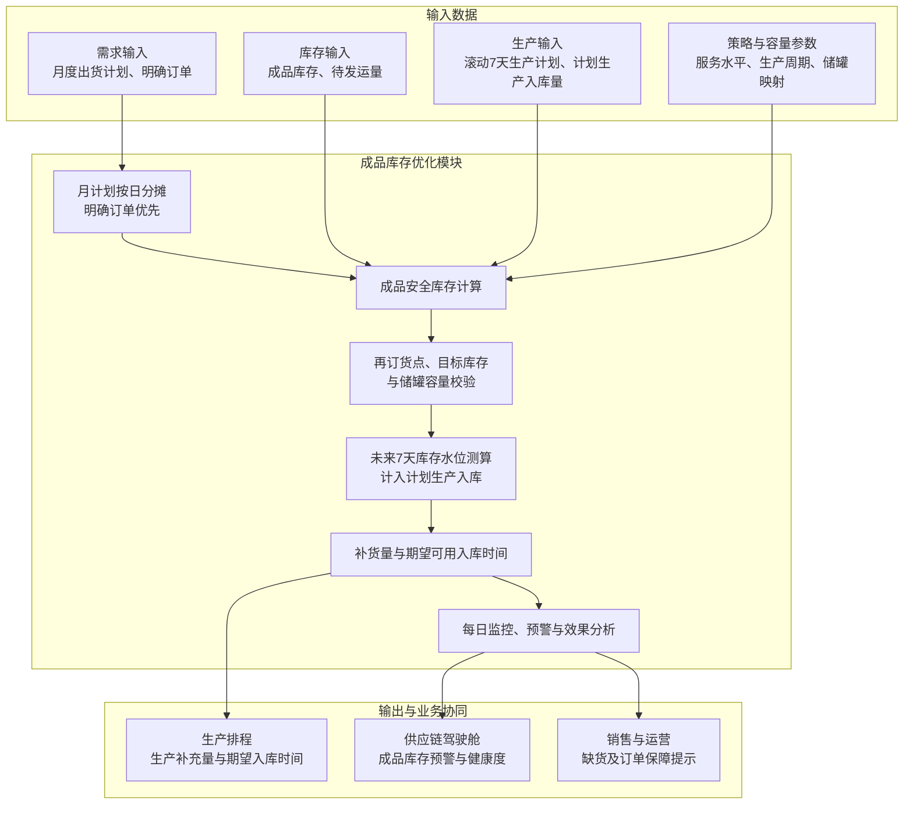

# 成品库存优化模块技术方案

## 1. 模块目标与边界

库存优化模块仅面向成品库存，解决三个问题：各成品应该保留多少库存、何时需要安排生产补充、建议生产补充多少。

模块根据月度出货计划、销售订单和生产排程，结合当前成品库存、计划生产入库量、待发运量、历史出库波动和生产补充周期，计算成品安全库存、再订货点、目标库存和生产补充建议，并对危险库存水位进行监控预警。生产补充结果分为每月25日形成的下月总补充计划和日常库存核验后的每日补充建议。

本模块不包含原料、辅料、在制品、副产品、包装材料及备品备件库存，也不涉及供应商选择或采购补货。补充建议和期望入库时间输出给生产排程模块，实际生产入库和销售出库结果返回库存模块更新库存水位。

## 2. 主要业务问题

- **成品库存参数依赖经验**：安全库存和上下限长期固定，不能随需求和生产补充能力变化及时调整。
- **可用库存口径不统一**：可用、已分配、冻结、待检和质量异常成品库存容易混用。
- **生产补充时点不准确**：没有同时考虑未来成品需求和生产补充周期，发现缺货时可能已经来不及生产。
- **库存策略效果无法验证**：缺货、周转、呆滞和服务水平的实际变化缺少持续跟踪。

## 3. 业务处理与模块总图

### 3.1 成品库存模块总图

### 3.2 月计划、滚动7天生产计划与每日更新

每月25日接收下月分成品出货总量，结合当前可用库存、已确定的计划生产入库和目标月末库存，计算下月各成品的生产补货总量。月度补货计划只确定总量，不直接确定具体生产日期。

月度出货总量分摊到每日作为计划需求；某日已有明确订单时，以订单量为准，月度计划扣除明确订单后，剩余数量重新平均分摊到其他尚无明确订单的日期。该处理是对已有月计划的日度分解，不建设需求预测模型。

系统每天获取滚动未来7天生产计划，包括计划生产数量和预计可用入库日期，并结合每日更新的实际库存、出货和待发运数据，重新测算未来7天库存水位。已经排入生产计划、尚未形成可用库存的数量作为计划生产入库，只在预计完成生产并具备入库条件的日期计入未来库存。

每日计算结果用于更新新增生产补充建议量和期望可用入库时间。计算时必须扣除滚动7天生产计划中已有的计划生产入库，避免对同一库存缺口重复提出补货建议。月度总补充量作为计划基准，已完工量或计划生产量增加时，月度剩余待生产量相应减少；计划生产量减少或延期时，系统重新计算库存缺口并提出调整建议。

### 3.3 成品需求与库存分析

1. 获取销售订单、上游已有需求数据和生产排程，形成分周期成品需求；
2. 获取当前成品库存，包括可用、已分配、冻结、待检和质量异常库存；
3. 获取计划生产入库量、预计入库日期和待发运量；
4. 分析历史销售出库波动和生产补充周期波动；
5. 计算未来成品库存水位和可支撑时间。

成品可用库存口径为：

$$
成品可用库存=现有合格库存-已分配库存-冻结库存-质量异常库存
$$

成品库存位置为：

$$
成品库存位置=成品可用库存+计划生产入库量-待满足成品需求
$$

计划生产入库量按预计完成生产并具备入库条件的日期分期计入，避免尚未完成生产的成品被提前视为可用库存。

### 3.4 监控、预警与效果分析

库存数据更新频率与库存策略参数更新频率分开管理：库存水位需要高频更新，但安全库存、再订货点和目标库存不宜随日常库存变化频繁调整。

| 内容 | 建议更新频率 |
|---|---|
| 实际成品库存、罐位、待发运量 | 实时或按日更新 |
| 滚动未来7天生产计划、计划生产入库 | 每日更新 |
| 未来成品库存水位 | 每日根据最新数据重新测算 |
| 月度出货计划和月度总补充计划 | 按月更新 |
| 安全库存、再订货点 \(s\)、目标库存 \(S\) | 原则上按月重新计算和发布，月内保持稳定 |
| 重大异常 | 预警后由业务人员确认是否临时调整参数 |

每月25日根据下月出货计划、生产补充周期和有效储罐容量计算下月的 \(s\) 和 \(S\)，同时输出分成品的下月总补充量及建议入库节奏，供月度生产计划使用。月内每日获取滚动未来7天生产计划，更新库存位置和未来7天库存水位；达到触发条件时更新新增生产补充建议量和期望可用入库时间，但不因普通库存升降自动修改 \(s\) 和 \(S\)。

月度总补充量是计划口径，每日补充建议是滚动执行口径。日度计算必须扣除已纳入生产排程的计划入库量，避免将月度计划和日度建议重复计算。

出现需求计划重大变化、产线长期停机、储罐检修、大客户订单变化或生产补充周期明显延长时，系统进行预警，由业务人员确认是否在月中重新计算并发布库存策略。

- 实时比较当前成品库存、安全库存和再订货点；
- 当前或未来库存低于安全库存或再订货点时，在供应链驾驶舱触发预警；
- 预警可关联触发生产补充或生产排程调整建议；
- 记录成品库存策略、系统建议和实际执行结果；
- 统计成品库存周转率、订单满足率、缺货、滞销、呆滞和临期库存；
- 对比目标服务水平与实际达成率，验证库存策略效果。

## 4. 成品库存优化技术方案与模型

### 4.1 总体技术路线

成品库存优化采用动态 \((R,s,S)\) 策略：系统按复核周期 \(R\) 检查成品库存，当成品库存位置低于再订货点 \(s\) 时触发预警，并建议通过生产补充至目标库存 \(S\)。

其中，\(R\) 表示库存检查频率，可按日执行；\(s\) 和 \(S\) 是库存策略参数，原则上按月重新计算并发布。库存检查频率与策略参数更新频率不要求相同。

该模型结构简单、结果可解释，能够满足安全库存、再订货点和生产补充量计算要求。由于成品种类较少，系统按单个成品分别维护和计算库存参数，不增加ABC/XYZ分类模型。

### 4.2 储罐容量定义与成品映射

系统先维护“成品—可用储罐”映射，再按成品分别计算库存策略。例如成品A只能使用1—10号罐、成品B只能使用11—20号罐，则两种成品的容量分别计算，不能直接使用全厂总容量。

容量统一采用以下口径：

- **名义容量**：储罐设计容积；
- **工作容量**：扣除安全液位、罐底余量等不可使用空间后的可用容积；
- **有效容量**：成品可使用储罐的工作容量之和，并排除维修、清洗、冻结或不可用储罐；
- **剩余容量**：有效容量扣除预计实物库存后的可用空间。

成品 \(i\) 在时点 \(t\) 的有效容量和剩余容量为：

$$
C_{i,t}^{eff}=\sum_{k\in T_i}V_k^{work}\times a_{k,t}
$$

$$
C_{i,t}^{free}=C_{i,t}^{eff}-预计实物库存_{i,t}
$$

预计实物库存按“当前实物库存+计划生产入库-计划销售出库”计算，容量检查使用计划生产完成时点的剩余容量。以专用罐划分为例：

$$
C_A^{eff}=\sum_{k=1}^{10}V_k^{work}\times a_k,\qquad
C_B^{eff}=\sum_{k=11}^{20}V_k^{work}\times a_k
$$

对于同规格专用罐，目标库存可换算为目标占罐数：

$$
n_i^{target}=\left\lceil\frac{S_i}{V^{work}}\right\rceil
$$

生产入库前按成品校验其对应储罐的合计剩余容量。库存优化模型不按生产批次分配储罐，具体入罐安排由生产或仓储执行环节确定。

### 4.3 符号与参数

| 符号 | 含义 |
|---|---|
| \(i\) | 成品SKU |
| \(k\) | 成品储罐 |
| \(R_i\) | 成品 \(i\) 的库存复核周期 |
| \(\bar d_i\) | 成品 \(i\) 的周期平均需求量 |
| \(\sigma_{d_i}\) | 成品 \(i\) 的需求波动 |
| \(\bar L_i\) | 成品 \(i\) 的平均生产补充周期 |
| \(\sigma_{L_i}\) | 成品 \(i\) 的生产补充周期波动 |
| \(z_i\) | 目标服务水平对应的安全系数 |
| \(IP_i\) | 成品 \(i\) 的库存位置 |
| \(IP_{i,t}^{(7)}\) | 成品 \(i\) 在日期 \(t\) 考虑滚动7天需求和计划生产入库后的库存位置 |
| \(SS_i\) | 成品 \(i\) 的安全库存 |
| \(s_i\) | 成品 \(i\) 的再订货点 |
| \(S_i\) | 成品 \(i\) 的目标库存 |
| \(Q_i\) | 成品 \(i\) 的建议生产补充量 |
| \(M_i\) | 成品 \(i\) 的月度计划出货总量 |
| \(M_{i,t}^{rem}\) | 日期 \(t\) 尚未分配的月度计划出货量 |
| \(D_{i,d}\) | 成品 \(i\) 在日期 \(d\) 的计划需求量 |
| \(O_{i,d}\) | 成品 \(i\) 在日期 \(d\) 的明确订单量 |
| \(A_{i,t}\) | 截至日期 \(t\) 成品 \(i\) 的本月累计实际出货量 |
| \(R_{i,t}\) | 日期 \(t\) 之后尚无明确订单的剩余日期集合 |
| \(P_{i,d}^{plan}\) | 成品 \(i\) 在日期 \(d\) 预计形成可用库存的计划生产入库量 |
| \(\hat I_{i,t+h}\) | 成品 \(i\) 在未来第 \(h\) 日的预计可用库存 |
| \(Q_{i,t}^{new}\) | 日期 \(t\) 重新计算的新增生产补充建议量 |
| \(T_i\) | 成品 \(i\) 允许使用的储罐集合 |
| \(V_k^{work}\) | 储罐 \(k\) 的工作容量 |
| \(a_{k,t}\) | 时点 \(t\) 储罐 \(k\) 的可用状态，可用为1，否则为0 |
| \(C_i^{eff}\) | 成品 \(i\) 当前可使用的有效容量 |
| \(C_i^{free}\) | 成品 \(i\) 当前剩余可用容量 |

### 4.4 月度需求日分解与滚动7天库存

月度出货计划只有总量时，系统将月度总量分解到每日。每天先扣除本月累计实际出货和未来已有明确订单，得到尚未分配的月度计划出货量：

$$
M_{i,t}^{rem}=\max\left(0,M_i-A_{i,t}-\sum_{\tau>t,\tau\in U_i}O_{i,\tau}\right)
$$

对于未来已有明确订单的日期直接使用订单量；其余数量平均分摊到未来尚无明确订单的日期：

$$
D_{i,d}=\begin{cases}
O_{i,d}, & d\text{ 已有明确订单}\\
\dfrac{M_{i,t}^{rem}}{|R_{i,t}|}, & d\in R_{i,t}
\end{cases}
$$

其中，\(U_i\) 为已有明确订单的日期集合，\(R_{i,t}\) 为日期 \(t\) 之后尚无明确订单的剩余日期集合。系统每日根据实际出货和新增订单重新分摊剩余月度计划；明确订单及实际出货累计超过月度计划时，超出部分作为需求增加并触发计划偏差提示。

系统每天接收滚动未来7天生产计划。计划生产数量只在预计生产完成、质检放行并形成可用库存的日期计入未来库存：

$$
\hat I_{i,t+h}=I_{i,t}^{avail}+\sum_{\tau=t+1}^{t+h}P_{i,\tau}^{plan}-\sum_{\tau=t+1}^{t+h}D_{i,\tau},\qquad h=1,\ldots,7
$$

未来7天库存位置需要计入滚动生产计划中的全部有效计划入库，用于判断是否还存在新增数量缺口：

$$
IP_{i,t}^{(7)}=I_{i,t}^{avail}+\sum_{\tau=t+1}^{t+7}P_{i,\tau}^{plan}-\sum_{\tau=t+1}^{t+7}D_{i,\tau}
$$

新增生产补充建议量按滚动7天库存位置计算，已有计划生产入库已经包含在 \(IP_{i,t}^{(7)}\) 中，不得重复建议：

$$
Q_{i,t}^{new}=\min\left[\max\left(0,S_i-IP_{i,t}^{(7)}\right),C_{i,t}^{free}\right]
$$

每日预计库存轨迹用于判断计划入库之前是否会提前出现低水位。若未来某日预计库存首次低于或等于再订货点，则该日为风险触发日：

$$
t_i^*=\min\left\{t+h\mid \hat I_{i,t+h}\leq s_i,\ h=1,\ldots,7\right\}
$$

若已有计划入库能够覆盖7天总量缺口，则新增建议量可以为0；但计划入库前的预计库存仍可能低于再订货点或安全库存，此时系统应提示将已有生产计划提前，而不是重复增加同等数量。计划生产数量减少或预计可用入库日期延期时，系统重新计算新增数量缺口、风险日期和期望可用入库时间。若生产补充周期已无法满足期望日期，系统只输出风险和调整建议，由业务人员决定是否调整生产排程或销售交付。

月度剩余待生产量随实际完工和滚动7天生产计划同步更新：

$$
月度剩余待生产量=月度总补充计划-本月累计完工量-已排程未完工量
$$

当滚动生产计划增加时，月度剩余待生产量相应减少；生产计划减少或取消时，剩余待生产量相应增加。月度总补充计划作为计划基准，不限制因明确订单增加等重大变化产生的新增补货需求。

### 4.5 成品安全库存

对于需求和生产补充周期波动相对稳定的成品，安全库存可按以下方式计算：

$$
SS_i=z_i\sqrt{\bar L_i\sigma_{d_i}^{2}+\bar d_i^{2}\sigma_{L_i}^{2}}
$$

该公式同时考虑成品需求波动和生产补充周期波动。服务水平越高、需求或生产周期波动越大，安全库存越高。

### 4.6 再订货点

$$
s_i=生产补充周期内计划需求+SS_i
$$

当成品库存位置低于或等于再订货点时触发预警和生产补充建议：

$$
IP_i\leq s_i\quad\Rightarrow\quad触发成品库存预警和生产补充建议
$$

再订货点用于判断“何时安排生产补充”。生产补充周期从生产补充需求审批完成、正式进入待排产状态开始，至成品生产完成并进入库存为止，包括排产等待、生产加工和成品入库时间。当前业务口径暂按 3–5 天管理；质检放行约 2 小时且日内完成，暂不单独计入生产补充周期。

### 4.7 目标库存与生产补充量

不考虑容量时的目标库存为：

$$
S_i^{raw}=生产补充周期及复核周期内计划需求+SS_i
$$

结合成品可用储罐容量后的目标库存为：

$$
S_i=\min(S_i^{raw},C_i^{eff})
$$

当 \(S_i^{raw}>C_i^{eff}\) 时，系统按有效容量给出当前可执行的目标库存，同时标记“目标库存受容量限制”，提示该库存水平可能无法完全满足原服务水平目标。

$$
Q_i=\min\left[\max(0,S_i-IP_i),C_i^{free}\right]
$$

目标库存用于确定“生产补充到多少”。建议生产补充量为目标库存与当前成品库存位置之间的差额，同时不能超过该成品的剩余储罐容量。

在计划生产完成时点 \(t\)，还应满足：

$$
计划生产入库量_{i,t}\leq C_{i,t}^{free}
$$

储罐容量按成品汇总校验，不在库存优化模型中增加批次级入罐约束。系统输出该成品对应储罐的合计剩余容量，供生产或仓储执行环节安排具体入罐位置。

系统向生产排程模块输出：

- **最低生产补充量**：避免成品库存跌破危险水位所需的最低数量；
- **建议生产补充量**：按照 \((R,s,S)\) 策略补充至目标库存的数量；
- **最大生产补充量**：结合成品库容、储罐容量、保质期和最大库存天数计算的上限；
- **期望入库时间**：为保障订单交付，成品需要完成生产、质检并达到可用状态的时间。

### 4.8 可选成本分析

系统保留单位成品库存持有成本和单位缺货成本的比较能力，用于调整服务水平或库存策略，不作为日常库存水位计算的必选步骤：

$$
成品库存综合成本=库存持有成本+缺货成本
$$

系统可在业务配置的候选服务水平范围内，比较不同成品安全库存方案的持有成本和缺货成本，推荐综合成本较低的服务水平及安全库存。

## 5. 模型输入

| 数据来源分类 | 输入内容 | 说明 |
|---|---|---|
| 月度出货计划 | 成品SKU、月份、月度计划出货总量 | 用于计算月度总补充计划，并分摊形成无明确订单日期的日度计划需求 |
| 销售订单或上游需求服务 | 成品SKU、明确订单日期、订单数量 | 某日已有明确订单时优先作为当日需求；库存模块不单独建设预测模型 |
| 生产排程/MES | 滚动未来7天生产计划、计划生产量、预计可用入库日期、实际完工量、生产补充周期 | 每日更新，用于计算未来7天库存和生产周期波动 |
| SAP/WMS | 成品现有库存、已分配库存、冻结库存、待检库存、质量异常库存 | 用于计算成品可用库存和库存位置 |
| SAP/WMS/TMS | 待发运量、计划出库时间和实际出库状态 | 用于计算待满足需求和未来库存水位 |
| LIMS/QMS | 成品质检状态、放行时间和质量冻结状态 | 用于确定成品预计可用时间 |
| 历史数据服务 | 历史销售出库量、订单满足情况和出库日期 | 用于计算各成品的平均需求和需求波动 |
| 人工配置 | 服务水平、复核周期和安全系数 | 按单个成品配置 |
| 储罐主数据/人工配置 | 成品—储罐映射、名义容量、工作容量、安全液位 | 用于计算每种成品的有效容量 |
| WMS/MES或人工维护 | 储罐液位、占用成品、清洗、维修、冻结及可用状态 | 用于计算实时剩余容量和可用罐数 |
| 人工配置 | 保质期和最大库存天数 | 用于限制最大生产补充量和目标库存 |
| 人工配置 | 单位库存持有成本和单位缺货成本 | 用于可选成本分析 |

系统已有数据原则上通过统一数据服务层获取；暂时无法从业务系统取得的数据由业务人员维护。

## 6. 模型输出

| 输出 | 内容 |
|---|---|
| 成品安全库存 | 各成品动态安全库存量及计算参数 |
| 再订货点 | 各成品触发生产补充的库存水位 |
| 目标库存 | 触发生产补充后建议达到的成品库存水平 |
| 储罐容量 | 各成品有效容量、剩余容量、可用罐数和目标占罐数 |
| 生产补充量范围 | 最低、建议和最大生产补充量 |
| 月度总补充计划 | 每月25日按成品输出下月总补充量及建议入库节奏 |
| 月度剩余待生产量 | 月度总补充计划扣除本月累计完工量和已排程未完工量后的剩余数量 |
| 日度计划需求 | 明确订单优先，其他日期按剩余月度计划分摊形成的每日需求 |
| 每日新增补充建议 | 每日扣除滚动7天计划生产入库后，输出新增建议量和期望可用入库时间 |
| 期望可用入库时间 | 成品需要完成生产、质检并形成可用库存的时间 |
| 滚动7天库存轨迹 | 根据日度需求、当前库存和计划生产入库量形成的每日未来库存水位 |
| 成品库存预警 | 低于安全库存、再订货点或危险水位的成品和时间 |
| 情景比较 | 调整服务水平或生产补充周期后的库存和成本变化 |
| 成品库存健康度 | 周转率、订单满足率、缺货、滞销、呆滞和临期库存情况 |

## 7. 运行与接口要求

### 7.1 运行机制

- 系统按月根据月度出货计划、生产补充周期和有效储罐容量重新计算并发布成品库存策略，同时生成当月总补充计划；
- 月度出货总量按日分摊；某日存在明确订单时使用订单量，剩余月度计划重新分摊到其他尚无明确订单的日期；
- 当前成品库存、罐位、待发运状态和实际出库实时或按日更新；
- 系统每天接收滚动未来7天生产计划，并按预计可用入库日期更新计划生产入库；
- 系统每日测算未来7天库存水位，与当月已发布的安全库存和再订货点比较，扣除已有计划生产入库后生成新增补充建议量和期望可用入库时间；
- 实际完工或计划生产量增加时减少月度剩余待生产量，计划生产量减少、取消或延期时重新计算库存缺口和风险日期；
- 月内普通库存变化只触发预警和生产补充建议，不自动修改 \(s\) 和 \(S\)；
- 发生需求、产能、储罐容量或生产补充周期重大变化时，由业务人员确认是否人工触发重新计算；
- 全库成品安全库存重新计算应在1分钟内完成；
- 每次计算保存输入、参数、结果和人工调整记录。

### 7.2 参数配置与情景比较

- 服务水平、安全系数、生产周期波动系数和成本参数可通过界面配置；
- 支持按单个成品维护库存策略；
- 支持模拟生产补充周期缩短或服务水平调整后的成品安全库存变化；
- 情景结果通过对比表或图表展示，不直接修改正式库存策略。

### 7.3 核心接口

- 模块通过RESTful API与统一数据服务层、生产排程、销售订单和供应链驾驶舱集成；
- 从月度出货计划获取各成品月度计划出货总量；
- 从销售订单或上游需求服务获取明确到日的成品需求；
- 从生产排程/MES每日获取滚动未来7天生产计划、预计可用入库日期和实际完工数据；
- 从SAP/WMS获取成品库存、分配、冻结、待检和出库状态；
- 从LIMS/QMS获取成品质检、放行和质量冻结状态；
- 向生产排程输出生产补充量范围和期望入库时间；
- 接收生产排程返回的计划生产入库安排和实际执行结果；
- 向供应链驾驶舱推送成品库存预警和健康度指标。

## 8. 异常与预警

- 当前成品库存低于安全库存或再订货点时，系统触发预警；
- 未来成品库存预计低于危险水位时，系统输出缺口、时间和生产补充建议；
- 计算得到的再订货点或目标库存超过成品有效储罐容量时，系统触发容量不足预警；
- 计划生产入库量超过该成品对应储罐的合计剩余容量时，系统触发容量不足预警；
- 成品库存、计划生产入库或待发运数据缺失、过期或状态异常时，系统预警并提示人工核实；
- 生产补充周期数据不足时，使用业务人员维护的标准生产周期；
- 生产排程无法满足期望入库时间时，系统更新缺货风险并提示调整生产排程或销售交付计划；
- 所有成品库存策略调整需由业务人员确认后生效。
