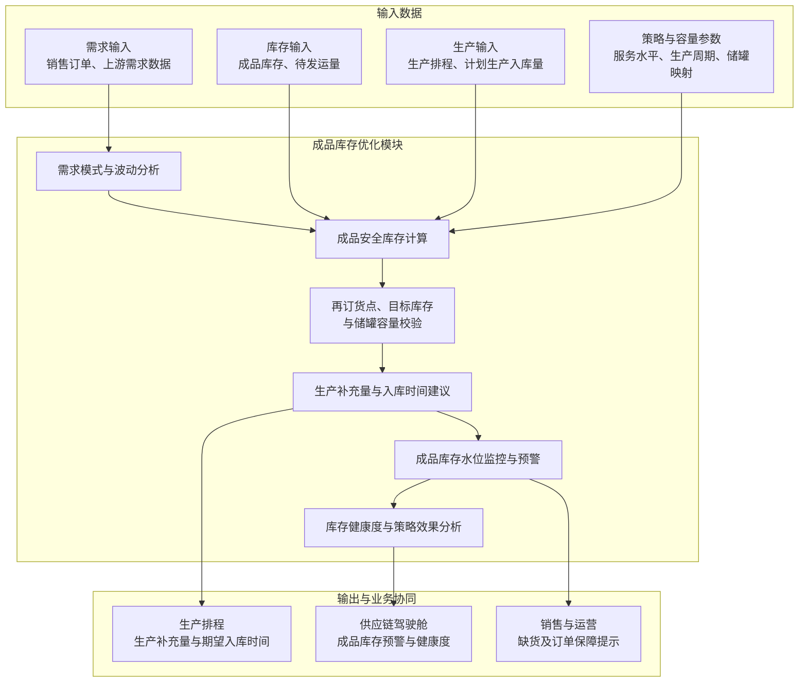

# 成品库存优化模块技术方案

## 1. 模块目标与边界

库存优化模块仅面向成品库存，解决三个问题：各成品应该保留多少库存、何时需要安排生产补充、建议生产补充多少。

模块根据销售订单、上游已有需求数据和生产排程，结合当前成品库存、计划生产入库量、待发运量、历史出库波动和生产补充周期，计算成品安全库存、再订货点、目标库存和生产补充建议，并对危险库存水位进行监控预警。

本模块不包含原料、辅料、在制品、副产品、包装材料及备品备件库存，也不涉及供应商选择或采购补货。补充建议和期望入库时间输出给生产排程模块，实际生产入库和销售出库结果返回库存模块更新库存水位。

## 2. 主要业务问题

- **成品库存参数依赖经验**：安全库存和上下限长期固定，不能随需求和生产补充能力变化及时调整。
- **可用库存口径不统一**：可用、已分配、冻结、待检和质量异常成品库存容易混用。
- **生产补充时点不准确**：没有同时考虑未来成品需求和生产补充周期，发现缺货时可能已经来不及生产。
- **不同成品使用相同策略**：高销量、季节性、间歇性和高价值成品没有采用差异化库存策略。
- **库存策略效果无法验证**：缺货、周转、呆滞和服务水平的实际变化缺少持续跟踪。

## 3. 业务处理与模块总图

### 3.1 成品库存模块总图

### 3.2 成品需求与库存分析

1. 获取销售订单、上游已有需求数据和生产排程，形成分周期成品需求；
2. 获取当前成品库存，包括可用、已分配、冻结、待检和质量异常库存；
3. 获取计划生产入库量、预计入库日期和待发运量；
4. 分析历史销售出库波动和生产补充周期波动；
5. 计算未来成品库存水位和可支撑时间。

成品可用库存口径为：

$$
成品可用库存=现有合格库存-已分配库存-冻结库存-质量异常库存
$$

成品库存位置为：

$$
成品库存位置=成品可用库存+计划生产入库量-待满足成品需求
$$

计划生产入库量按预计完成生产并具备入库条件的日期分期计入，避免尚未完成生产的成品被提前视为可用库存。

### 3.3 成品分类与差异化策略

系统根据历史销售出库识别稳定、趋势、季节性和间歇性需求，并计算标准差、变异系数等波动指标。成品支持按ABC/XYZ分类，由业务人员为不同成品组配置服务水平、复核周期和库存策略。

| 成品类型 | 策略重点 |
|---|---|
| 高销量或关键客户成品 | 提高服务水平，优先保障订单交付 |
| 高价值成品 | 控制目标库存，降低资金占用 |
| 季节性成品 | 根据需求计划和历史季节波动调整安全库存 |
| 间歇性成品 | 使用历史经验分布计算安全库存，不强制采用正态分布 |
| 易过期成品 | 结合保质期和未来需求限制目标库存 |

### 3.4 监控、预警与效果分析

库存数据更新频率与库存策略参数更新频率分开管理：库存水位需要高频更新，但安全库存、再订货点和目标库存不宜随日常库存变化频繁调整。

| 内容 | 建议更新频率 |
|---|---|
| 实际成品库存、罐位、计划生产入库、待发运量 | 实时或按日更新 |
| 未来成品库存水位 | 每日根据最新数据重新测算 |
| 月度需求计划和生产计划 | 按月更新 |
| 安全库存、再订货点 \(s\)、目标库存 \(S\) | 原则上按月重新计算和发布，月内保持稳定 |
| 重大异常 | 预警后由业务人员确认是否临时调整参数 |

月初根据月度需求计划、生产计划、生产补充周期和有效储罐容量计算本月的 \(s\) 和 \(S\)。月内每日更新库存位置并与已发布的 \(s\) 比较，但不因普通库存升降自动修改 \(s\) 和 \(S\)。

出现需求计划重大变化、产线长期停机、储罐检修、大客户订单变化或生产补充周期明显延长时，系统进行预警，由业务人员确认是否在月中重新计算并发布库存策略。

- 实时比较当前成品库存、安全库存和再订货点；
- 当前或未来库存低于安全库存或再订货点时，在供应链驾驶舱触发预警；
- 预警可关联触发生产补充或生产排程调整建议；
- 记录成品库存策略、系统建议和实际执行结果；
- 统计成品库存周转率、订单满足率、缺货、滞销、呆滞和临期库存；
- 对比目标服务水平与实际达成率，验证库存策略效果。

## 4. 成品库存优化技术方案与模型

### 4.1 总体技术路线

成品库存优化采用动态 \((R,s,S)\) 策略：系统按复核周期 \(R\) 检查成品库存，当成品库存位置低于再订货点 \(s\) 时触发预警，并建议通过生产补充至目标库存 \(S\)。

其中，\(R\) 表示库存检查频率，可按日执行；\(s\) 和 \(S\) 是库存策略参数，原则上按月重新计算并发布。库存检查频率与策略参数更新频率不要求相同。

该模型结构简单、结果可解释，能够满足安全库存、再订货点和生产补充量计算要求。对于间歇性成品需求，安全库存使用历史经验分布或分位数方法计算，不强制假设需求服从正态分布。

### 4.2 储罐容量定义与成品映射

系统先维护“成品—可用储罐”映射，再按成品分别计算库存策略。例如成品A只能使用1—10号罐、成品B只能使用11—20号罐，则两种成品的容量分别计算，不能直接使用全厂总容量。

容量统一采用以下口径：

- **名义容量**：储罐设计容积；
- **工作容量**：扣除安全液位、罐底余量等不可使用空间后的可用容积；
- **有效容量**：成品可使用储罐的工作容量之和，并排除维修、清洗、冻结或不可用储罐；
- **剩余容量**：有效容量扣除预计实物库存后的可用空间。

成品 \(i\) 在时点 \(t\) 的有效容量和剩余容量为：

$$
C_{i,t}^{eff}=\sum_{k\in T_i}V_k^{work}\times a_{k,t}
$$

$$
C_{i,t}^{free}=C_{i,t}^{eff}-预计实物库存_{i,t}
$$

预计实物库存按“当前实物库存+计划生产入库-计划销售出库”计算，容量检查使用计划生产完成时点的剩余容量。以专用罐划分为例：

$$
C_A^{eff}=\sum_{k=1}^{10}V_k^{work}\times a_k,\qquad
C_B^{eff}=\sum_{k=11}^{20}V_k^{work}\times a_k
$$

对于同规格专用罐，目标库存可换算为目标占罐数：

$$
n_i^{target}=\left\lceil\frac{S_i}{V^{work}}\right\rceil
$$

生产入库前除校验总剩余容量外，还需确认至少有一个适用储罐能够接收一个完整生产批次，避免出现“总体积足够但没有单罐可接收”的情况。

### 4.3 符号与参数

| 符号 | 含义 |
|---|---|
| \(i\) | 成品SKU |
| \(k\) | 成品储罐 |
| \(R_i\) | 成品 \(i\) 的库存复核周期 |
| \(\bar d_i\) | 成品 \(i\) 的周期平均需求量 |
| \(\sigma_{d_i}\) | 成品 \(i\) 的需求波动 |
| \(\bar L_i\) | 成品 \(i\) 的平均生产补充周期 |
| \(\sigma_{L_i}\) | 成品 \(i\) 的生产补充周期波动 |
| \(z_i\) | 目标服务水平对应的安全系数 |
| \(IP_i\) | 成品 \(i\) 的库存位置 |
| \(SS_i\) | 成品 \(i\) 的安全库存 |
| \(s_i\) | 成品 \(i\) 的再订货点 |
| \(S_i\) | 成品 \(i\) 的目标库存 |
| \(Q_i\) | 成品 \(i\) 的建议生产补充量 |
| \(T_i\) | 成品 \(i\) 允许使用的储罐集合 |
| \(V_k^{work}\) | 储罐 \(k\) 的工作容量 |
| \(a_{k,t}\) | 时点 \(t\) 储罐 \(k\) 的可用状态，可用为1，否则为0 |
| \(C_i^{eff}\) | 成品 \(i\) 当前可使用的有效容量 |
| \(C_i^{free}\) | 成品 \(i\) 当前剩余可用容量 |

### 4.4 成品安全库存

对于需求和生产补充周期波动相对稳定的成品，安全库存可按以下方式计算：

$$
SS_i=z_i\sqrt{\bar L_i\sigma_{d_i}^{2}+\bar d_i^{2}\sigma_{L_i}^{2}}
$$

该公式同时考虑成品需求波动和生产补充周期波动。服务水平越高、需求或生产周期波动越大，安全库存越高。

对于季节性成品，平均需求和需求波动按对应季节或需求周期计算；对于间歇性成品，采用生产补充周期内需求的历史经验分布计算目标分位数，不直接套用正态分布公式。

### 4.5 再订货点

$$
s_i=生产补充周期内计划需求+SS_i
$$

当成品库存位置低于或等于再订货点时触发预警和生产补充建议：

$$
IP_i\leq s_i\quad\Rightarrow\quad触发成品库存预警和生产补充建议
$$

再订货点用于判断“何时安排生产补充”，生产补充周期包括排产等待、生产加工、质检放行和成品入库时间。

### 4.6 目标库存与生产补充量

不考虑容量时的目标库存为：

$$
S_i^{raw}=生产补充周期及复核周期内计划需求+SS_i
$$

结合成品可用储罐容量后的目标库存为：

$$
S_i=\min(S_i^{raw},C_i^{eff})
$$

当 \(S_i^{raw}>C_i^{eff}\) 时，系统按有效容量给出当前可执行的目标库存，同时标记“目标库存受容量限制”，提示该库存水平可能无法完全满足原服务水平目标。

$$
Q_i=\min\left[\max(0,S_i-IP_i),C_i^{free}\right]
$$

目标库存用于确定“生产补充到多少”。建议生产补充量为目标库存与当前成品库存位置之间的差额，同时不能超过该成品的剩余储罐容量。

在计划生产完成时点 \(t\)，还应满足：

$$
计划生产入库量_{i,t}\leq C_{i,t}^{free}
$$

如果生产按整批入罐，还需确认至少存在一个与成品匹配且剩余容量能够容纳该批次的储罐。该检查属于储罐可用性校验，不改变 \((R,s,S)\) 的库存计算逻辑。

系统向生产排程模块输出：

- **最低生产补充量**：避免成品库存跌破危险水位所需的最低数量；
- **建议生产补充量**：按照 \((R,s,S)\) 策略补充至目标库存的数量；
- **最大生产补充量**：结合成品库容、储罐容量、保质期和最大库存天数计算的上限；
- **期望入库时间**：为保障订单交付，成品需要完成生产、质检并达到可用状态的时间。

### 4.7 可选成本分析

系统保留单位成品库存持有成本和单位缺货成本的比较能力，用于调整服务水平或库存策略，不作为日常库存水位计算的必选步骤：

$$
成品库存综合成本=库存持有成本+缺货成本
$$

系统可在业务配置的候选服务水平范围内，比较不同成品安全库存方案的持有成本和缺货成本，推荐综合成本较低的服务水平及安全库存。

## 5. 模型输入

| 数据来源分类 | 输入内容 | 说明 |
|---|---|---|
| 销售订单或上游需求服务 | 成品SKU、需求周期、需求数量 | 作为未来成品需求；库存模块不单独建设预测模型 |
| 生产排程/MES | 计划生产入库量、预计入库时间、实际完工量、生产补充周期 | 用于计算未来成品库存和生产周期波动 |
| SAP/WMS | 成品现有库存、已分配库存、冻结库存、待检库存、质量异常库存 | 用于计算成品可用库存和库存位置 |
| SAP/WMS/TMS | 待发运量、计划出库时间和实际出库状态 | 用于计算待满足需求和未来库存水位 |
| LIMS/QMS | 成品质检状态、放行时间和质量冻结状态 | 用于确定成品预计可用时间 |
| 历史数据服务 | 历史销售出库量、订单满足情况和出库日期 | 用于识别需求模式并计算需求波动 |
| 人工配置 | ABC/XYZ分类、服务水平、复核周期和安全系数 | 支持按成品或成品组配置 |
| 储罐主数据/人工配置 | 成品—储罐映射、名义容量、工作容量、安全液位 | 用于计算每种成品的有效容量 |
| WMS/MES或人工维护 | 储罐液位、占用成品、清洗、维修、冻结及可用状态 | 用于计算实时剩余容量和可用罐数 |
| 人工配置 | 保质期和最大库存天数 | 用于限制最大生产补充量和目标库存 |
| 人工配置 | 单位库存持有成本和单位缺货成本 | 用于可选成本分析 |

系统已有数据原则上通过统一数据服务层获取；暂时无法从业务系统取得的数据由业务人员维护。

## 6. 模型输出

| 输出 | 内容 |
|---|---|
| 成品需求模式 | 稳定、趋势、季节性或间歇性及对应波动指标 |
| 成品安全库存 | 各成品动态安全库存量及计算参数 |
| 再订货点 | 各成品触发生产补充的库存水位 |
| 目标库存 | 触发生产补充后建议达到的成品库存水平 |
| 储罐容量 | 各成品有效容量、剩余容量、可用罐数和目标占罐数 |
| 生产补充量范围 | 最低、建议和最大生产补充量 |
| 期望入库时间 | 成品需要完成生产、质检并达到可用状态的时间 |
| 成品库存轨迹 | 根据需求、当前库存和计划生产入库量形成的未来库存水位 |
| 成品库存预警 | 低于安全库存、再订货点或危险水位的成品和时间 |
| 情景比较 | 调整服务水平或生产补充周期后的库存和成本变化 |
| 成品库存健康度 | 周转率、订单满足率、缺货、滞销、呆滞和临期库存情况 |

## 7. 运行与接口要求

### 7.1 运行机制

- 系统按月根据需求计划、生产计划、生产补充周期和有效储罐容量重新计算并发布成品库存策略；
- 当前成品库存、计划生产入库、罐位和待发运状态实时或按日更新；
- 系统每日测算未来库存水位，并与当月已发布的安全库存和再订货点进行比较；
- 月内普通库存变化只触发预警和生产补充建议，不自动修改 \(s\) 和 \(S\)；
- 发生需求、产能、储罐容量或生产补充周期重大变化时，由业务人员确认是否人工触发重新计算；
- 全库成品安全库存重新计算应在1分钟内完成；
- 每次计算保存输入、参数、结果和人工调整记录。

### 7.2 参数配置与情景比较

- 服务水平、安全系数、生产周期波动系数和成本参数可通过界面配置；
- 支持批量设置成品组库存策略；
- 支持模拟生产补充周期缩短或服务水平调整后的成品安全库存变化；
- 情景结果通过对比表或图表展示，不直接修改正式库存策略。

### 7.3 核心接口

- 模块通过RESTful API与统一数据服务层、生产排程、销售订单和供应链驾驶舱集成；
- 从销售订单或上游需求服务获取未来成品需求；
- 从生产排程/MES获取计划生产入库和实际完工数据；
- 从SAP/WMS获取成品库存、分配、冻结、待检和出库状态；
- 从LIMS/QMS获取成品质检、放行和质量冻结状态；
- 向生产排程输出生产补充量范围和期望入库时间；
- 接收生产排程返回的计划生产入库安排和实际执行结果；
- 向供应链驾驶舱推送成品库存预警和健康度指标。

## 8. 异常与预警

- 当前成品库存低于安全库存或再订货点时，系统触发预警；
- 未来成品库存预计低于危险水位时，系统输出缺口、时间和生产补充建议；
- 计算得到的再订货点或目标库存超过成品有效储罐容量时，系统触发容量不足预警；
- 计划生产批量无法找到匹配且容量足够的可用储罐时，系统触发入罐冲突预警；
- 成品库存、计划生产入库或待发运数据缺失、过期或状态异常时，系统预警并提示人工核实；
- 生产补充周期数据不足时，使用业务人员维护的标准生产周期；
- 间歇性成品需求不满足常规分布假设时，使用历史经验分布计算安全库存；
- 生产排程无法满足期望入库时间时，系统更新缺货风险并提示调整生产排程或销售交付计划；
- 所有成品库存策略调整需由业务人员确认后生效。

## 9. 待业务确认事项

以下问题会直接影响库存口径、模型参数和系统边界，需要在详细设计前由业务确认。

| 序号 | 待确认问题 | 影响内容 |
|---|---|---|
| 1 | 标书中的库存范围包括原料、在制品、产成品和副产品，目前业务蓝图限定为成品库存，是否已确认按成品范围建设和验收？ | 项目范围、标书响应和验收边界 |
| 2 | 标书要求使用未来预测，当前方案不建设需求预测模型，仅消费销生产需求计划，业务是否认可？ | 需求数据来源、模型范围和标书符合性 |
| 7 | 一个生产批次能否拆分进入多个罐？同一储罐能否混装不同生产批次，能否在原有库存上继续补入？ | 单罐容量校验、批次追溯和入罐冲突判断 |
| 8 | 到厂待检、成品待检、质量冻结、清洗、维修等储罐状态由哪个系统提供？状态多久更新一次？ | 储罐可用状态和实时容量准确性 |
| 9 | 生产补充周期从哪个时间点开始、到哪个时间点结束？是从提出生产需求到生产完成，还是到质检放行并入库？ | 再订货点、安全库存和期望入库时间 |
| 10 | 生产补充周期按成品设置固定值，还是根据产线、产品和生产排程动态计算？ | 提前期均值、波动和滚动计算方式 |
| 11 | 服务水平采用“订单满足率”“不缺货概率”还是其他指标？由谁按成品或成品组配置？ | 安全系数和安全库存计算 |
| 12 | 安全库存、再订货点和危险水位是三个不同阈值，还是部分阈值可以合并？各级预警颜色和处理责任人如何定义？ | 预警规则、驾驶舱展示和处理流程 |
| 13 | 最大生产补充量除了储罐容量外，是否还需要考虑保质期、最大库存天数、销售承诺或库存资金上限？ | 目标库存和最大生产补充量 |
| 14 | 建议生产补充量是否必须按生产批量、最小生产批次或包装规格取整？取整规则由库存模块还是生产排程处理？ | 输出数量和生产排程接口 |
| 15 | 当前暂按“月度发布 \(s/S\)、日度更新库存水位、重大异常人工重算”设计。月中允许重算的触发条件和变化阈值分别是多少？ | 运行频率、参数稳定性和业务操作方式 |
| 16 | 单位库存持有成本和单位缺货成本是否有可用数据？如果暂时没有，是否仅保留参数接口而不启用成本最优服务水平推荐？ | 可选成本分析范围 |
| 18 | 当理论再订货点或目标库存超过有效储罐容量时，优先调整生产频次、服务水平还是储罐分配？由哪个岗位确认？ | 容量不足处理规则和审批流程 |
