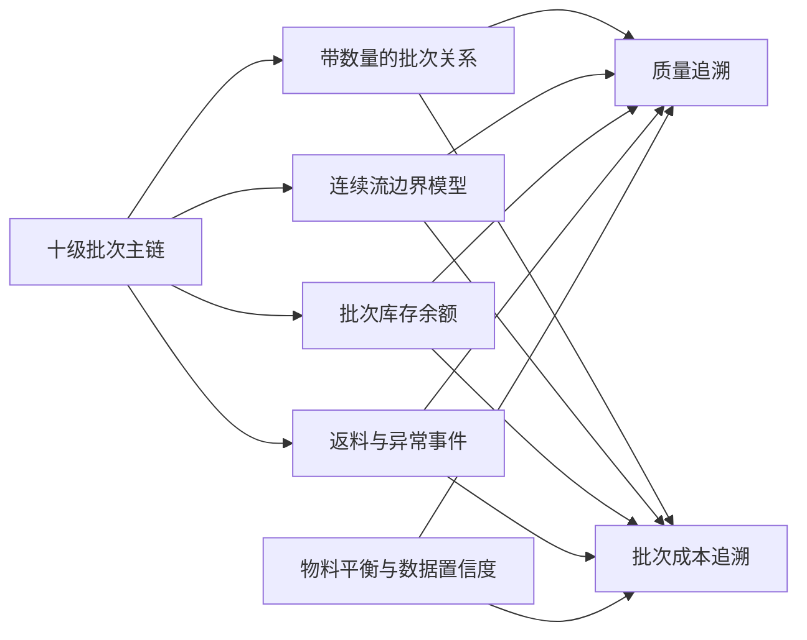
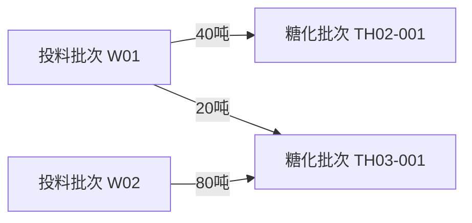
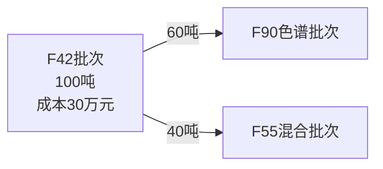
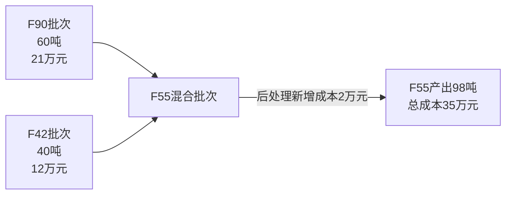
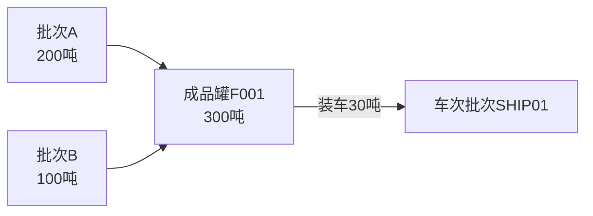
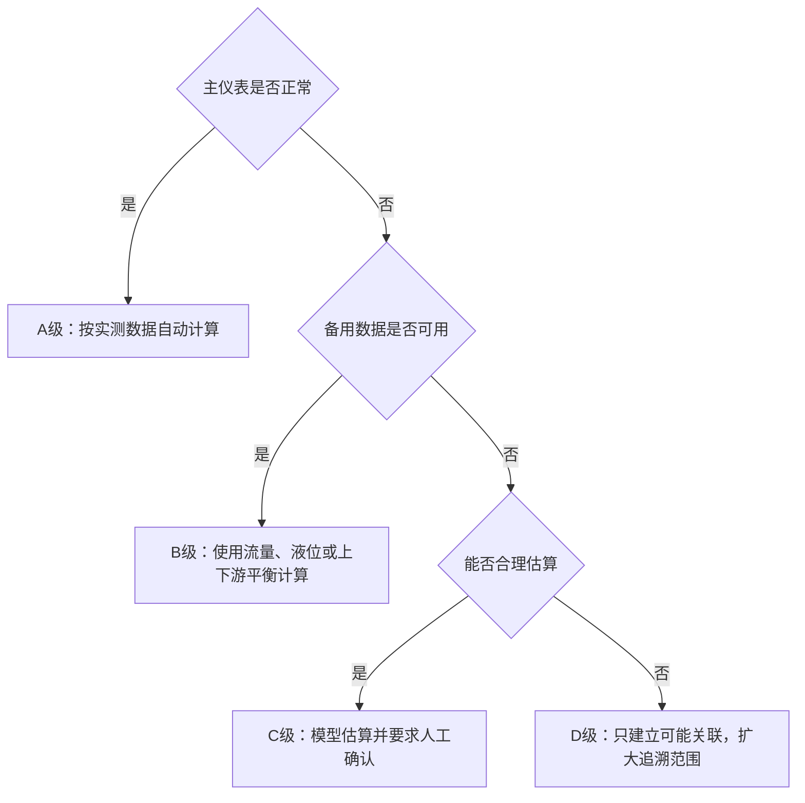

# 果葡糖浆批次划分旧方案补救措施

## 1. 补救目标

旧方案保留十级批次结构：

```text
供应商批次 → 入厂批次 → 平库批次 → 线边批次 → 投料批次
→ 糖化批次 → F42批次 → F90批次 → F55批次
→ QC罐批次 → 成品罐批次 → 车次批次
```

补救的重点不是增加更多批次，而是为旧方案补齐：

- 转移数量；
- 连续流边界误差；
- 拆批和并批关系；
- 罐内批次余额；
- 返料和过渡料；
- 仪表故障兜底；
- 物料平衡；
- 批次修正和成本调整。

## 2. 补救后的总体结构



## 3. 补救措施一：所有批次关系增加数量

### 3.1 需要解决的问题

旧方案主要保存上下游批次号。如果没有实际数量，只能知道“有关联”，无法确定影响范围和成本。

### 3.2 补救方法

所有批次关系统一增加：

| 字段 | 说明 |
| --- | --- |
| 上游批次 | 物料来源 |
| 下游批次 | 物料去向 |
| 关系类型 | 投入、产出、拆分、合并、移库、返料、装车 |
| 数量 | 实际转移数量 |
| 开始/结束时间 | 转移发生时间 |
| 计量依据 | 地磅、流量计、液位、袋数或估算 |
| 数据状态 | 实测、计算、估算、补录 |

### 3.3 示例：投料与糖化多对多



| 投料批次 | 糖化批次 | 转入量 | 时间范围 |
| --- | --- | ---: | --- |
| W01 | TH02-001 | 40t | 08:00—08:45 |
| W01 | TH03-001 | 20t | 08:45—09:05 |
| W02 | TH03-001 | 80t | 09:05—10:20 |

没有这张数量明细表，TH03无法准确追溯其原料和成本。

## 4. 补救措施二：连续流批次增加边界误差范围

### 4.1 需要解决的问题

旧方案按以下公式计算过程时间：

```text
过程时间 = 设备及管道有效容积 ÷ 平均流量
```

该方法只能得到平均到达时间。实际生产存在流量变化、返混、回流、停机和设备滞留，不能认为计算时刻就是绝对物理批界。

### 4.2 补救方法

保留旧公式作为基础模型，同时增加：

- 入口和出口累计流量；
- 实际流量曲线；
- 当前有效持液量；
- 停机和断料时间；
- 阀门切换记录；
- 前后过渡区；
- 数据置信度。

### 4.3 输出方式


追溯结果不只返回一个批次：

| 关系 | 处理方式 |
| --- | --- |
| 核心归属批次 | 正常生产、成本和展示的主要来源 |
| 前过渡批次 | 质量追溯时列为可能影响 |
| 后过渡批次 | 质量追溯时列为可能影响 |
| 过渡贡献比例 | 成本按比例分配 |

### 4.4 示例

系统预计批次A在10:00结束，但流量发生变化，确定的过渡范围为09:55—10:15：

| 出口时间 | A贡献 | B贡献 |
| --- | ---: | ---: |
| 09:55—10:00 | 80% | 20% |
| 10:00—10:10 | 50% | 50% |
| 10:10—10:15 | 20% | 80% |
| 10:15后 | 0% | 100% |

质量异常发生在10:05时，A、B均进入可能影响范围；成本按贡献比例分配。

## 5. 补救措施三：固定时间窗口增加强制断批事件

### 5.1 需要解决的问题

固定“两小时一批”不能覆盖配方切换、停机、清洗和返料等实际事件。

### 5.2 强制断批事件

- 产品变化；
- 配方或配方版本变化；
- F90:F42目标比例变化；
- 糖化罐或工艺路径切换；
- 管道清洗或排空；
- 断料超过阈值；
- 停机超过阈值；
- 质量冻结；
- 返料加入；
- 人工确认断批。

### 5.3 示例

原时间窗口为08:00—10:00，09:20配方由60:40调整为58:42：

```mermaid
timeline
    title F55混合批次强制断批
    08:00 : 批次H01开始，配方60:40
    09:20 : 配方变化，H01结束
          : 批次H02开始，配方58:42
    10:00 : H02正常结束
```

不能继续把08:00—10:00作为同一个批次。

## 6. 补救措施四：平库和线边保留原始身份

### 6.1 需要解决的问题

每次移库均重新建批，会造成批次数量膨胀，并可能丢失原始入厂批次。

### 6.2 补救方法

如果继续保留平库批次和线边批次，应同时永久保存：

- 原始入厂批次号；
- 上一层子批次号；
- 当前库位或工位；
- 当前数量；
- 移库事件。

### 6.3 示例

```text
入厂批次 RM001：36吨
├─ 平库K001：26吨
└─ 线边XB01：10吨
```

从K001再移5吨至XB02后：

| 原始批次 | 位置 | 数量 |
| --- | --- | ---: |
| RM001 | K001 | 21t |
| RM001 | XB01 | 10t |
| RM001 | XB02 | 5t |

无论生成多少位置子批次，原始身份始终是RM001。

### 6.4 直送线边兜底

线边批次来源允许二选一：

```text
入厂批次 → 线边批次
平库批次 → 线边批次
```

不得为直送线边虚构平库入库和出库记录。

## 7. 补救措施五：F42分流和F55汇流按数量处理

### 7.1 F42分流示例



若F42单位成本为3,000元/吨：

```text
进入F90的转入成本 = 60 × 3,000 = 180,000元
直接进入F55的转入成本 = 40 × 3,000 = 120,000元
```

### 7.2 F55汇流示例



```text
F55总成本 = 210,000 + 120,000 + 20,000 = 350,000元
F55单位成本 = 350,000 ÷ 98吨
```

## 8. 补救措施六：糖化罐采用双计量

### 8.1 需要解决的问题

单独使用“液位×密度”容易受到罐体几何、泡沫、残留和密度取样时间影响。

### 8.2 补救方法

| 优先级 | 计量方式 | 用途 |
| --- | --- | --- |
| 1 | 入口/出口累计流量 | 批次投入和产出主值 |
| 2 | 标定罐容对应液位×同期密度 | 交叉核对 |
| 3 | 人工核定值 | 仪表异常时兜底 |

### 8.3 示例

```text
入口累计流量：103吨
液位×密度：105吨
差异：2吨
```

处理方式：

- 差异在阈值内：按主值确认，记录核对差异；
- 轻微超差：预警并人工确认；
- 严重超差：冻结批次数量确认，检查仪表、密度和残留。

## 9. 补救措施七：统一F42、F90、F55控制点

正式实施前形成并审批批次控制点表：

| 批次 | 入口控制点 | 出口控制点 | 主计量点 | 故障备用 |
| --- | --- | --- | --- | --- |
| 投料 | 投料口 | 糖化罐入口阀 | 淀粉乳质量流量计 | 原料消耗与罐液位 |
| F42 | 糖化罐出口阀 | F42指定出口 | `FT120101`待核实 | 上下游物料平衡 |
| F90 | 色谱入口 | F55混合入口阀 | `FT120103`待核实 | 色谱投入产出累计 |
| F55 | F55混合入口 | QC罐进料阀 | F55蒸发出口流量计及QC入口数据 | QC罐液位与物料平衡 |

F55公式必须包含蒸发器出口至QC罐入口之间的输送持液量，或把F55正式终点统一改为蒸发器出口。

## 10. 补救措施八：成品罐建立批次余额账

### 10.1 需要解决的问题

成品罐非空续加后，车辆不能简单归属于最近一次进料批次。

### 10.2 完全混合示例



按完全混合计算：

```text
车辆来源A = 30 × 200/300 = 20吨
车辆来源B = 30 × 100/300 = 10吨

装车后余额：
A = 180吨
B = 90吨
```

### 10.3 模型选择

| 现场状态 | 使用模型 |
| --- | --- |
| 空罐建批、清空后再进料 | 每次进料形成独立成品罐批次 |
| 非空续加且持续搅拌 | 完全混合比例模型 |
| 非空续加但存在明显分层 | 经现场验证的分层模型 |
| 无法确认混合状态 | 扩大可能来源范围，不输出单一精确比例 |

## 11. 补救措施九：返料、甜水和过渡料建立事件

### 11.1 返料示例


返料事件至少记录：

- 原批次；
- 数量；
- 原成本；
- 返入节点；
- 时间；
- 原因；
- 新批次；
- 审批人；
- 新增加工成本。

### 11.2 过渡料处理

换品或配方切换时可选择：

1. 按比例分配至前后批次；
2. 独立生成过渡批次；
3. 根据在线浓度或检验结果确定切换点。

不能在没有记录的情况下全部归入前批或后批。

## 12. 补救措施十：仪表和数据故障分级兜底



| 等级 | 处理方式 | 是否可自动确认 |
| --- | --- | --- |
| A | 主仪表、阀门和罐次完整 | 可以 |
| B | 使用备用仪表或多数据平衡计算 | 满足误差阈值时可以 |
| C | 按历史流量、持液量或人工数据估算 | 不可以，需人工确认 |
| D | 无法合理估算，只能确定可能关联 | 不可以，质量追溯扩大范围 |

## 13. 补救措施十一：无效、冻结和作废批次保留谱系

错误做法：

```text
批次无效 → 追溯时跳过
```

正确做法：

```text
批次无效/冻结/作废
→ 保留全部上下游关系
→ 禁止放行、结算或继续使用
→ 记录原因、操作者和替代批次
```

例如F90批次因流量计故障被标记为无效，但物料实际已经进入F55，则该F90批次仍必须出现在追溯图中，并标记数量为估算或待确认。

## 14. 补救措施十二：物料平衡校验

每个工艺段统一校验：

```text
期初量 + 投入量
= 产出量 + 期末量 + 废料量 + 损耗量 ± 计量差异
```

### 示例

```text
期初：5吨
投入：100吨
产出：98吨
期末：4吨
废料：1吨
计算差异：2吨
```

系统需判断2吨属于：

- 正常持液或残留；
- 取样和排放；
- 密度换算差异；
- 仪表误差；
- 未记录的转移或损失。

处理规则：

| 差异情况 | 系统动作 |
| --- | --- |
| 阈值内 | 自动确认并保留差异 |
| 轻微超差 | 预警，人工选择原因后确认 |
| 严重超差 | 冻结批次数量和成本结算，完成调查后修正 |

## 15. 补救措施十三：批次边界和成本修正版本化

批次边界、数量和成本不得直接覆盖历史值。

### 示例

月末发现糖化罐切换时间应由09:15修正为09:05，影响W01、W02和TH03的数量。

系统应保存：

| 内容 | 要求 |
| --- | --- |
| 原边界 | 09:15 |
| 修正边界 | 09:05 |
| 修正原因 | 阀门时钟偏差 |
| 受影响批次 | W01、W02、TH03及其下游 |
| 数量调整 | 自动重新计算 |
| 成本调整 | 自动重新传递 |
| 审批记录 | 操作人、审批人、时间 |
| 规则版本 | 修正前后均可回放 |

若受影响物料已经发货，应重新计算客户和订单影响范围。

## 16. 补救措施十四：成本追溯补齐

### 16.1 成本传递公式

```text
下游批次总成本
= Σ上游批次单位成本 × 实际转入数量
+ 本工序直接成本
+ 本工序分摊成本
- 副产品或回收物抵减
```

### 16.2 每条批次关系增加的成本字段

- 转入单位成本；
- 转入总成本；
- 本工序新增直接成本；
- 本工序分摊成本；
- 标准/实际成本标识；
- 暂估/正式状态；
- 成本规则版本；
- SAP对账状态；
- 月末调整金额；
- 调整前后成本。

### 16.3 成本类型处理

| 成本 | 处理方式 |
| --- | --- |
| 原料、辅料 | 按实际批次投入量直接转入 |
| 蒸汽、电、水 | 有独立表计时直接归集，无表计时按运行时间、产量等动因分摊 |
| 人工 | 按班组工时、作业时长或产量分摊 |
| 折旧、维修 | 按设备工时、产量或标准费率分摊 |
| 仓储搬运 | 按吨数、移库次数、叉车工时或吨天归集 |
| 运输 | 直接关联车次、订单和客户 |
| 返料 | 原成本随数量转入，并叠加重新加工成本 |

## 17. 补救措施实施优先级

| 优先级 | 必须完成的补救措施 |
| --- | --- |
| P0 | 数量关系、控制点确认、批次编码唯一、无效批次保留、返料关系、物料平衡 |
| P0 | 糖化、QC、成品罐和装车事件自动采集 |
| P1 | 连续流累计量、过渡区、数据置信度和故障降级 |
| P1 | 成品罐批次余额和混合模型 |
| P2 | 精细能源、人工和间接费用的批次成本分摊 |

## 18. 最低落地条件

旧方案完成以下补救后才建议上线：

- 所有拆批、并批和混罐关系均带数量；
- F42、F90、F55入口、出口和计量点已现场确认；
- 连续流批次能够表达过渡范围和置信度；
- 固定时间窗口受到配方、清洗、停机等事件约束；
- 成品罐续加和装车来源计算规则明确；
- 返料、甜水、过渡料和不合格调整均可追溯；
- 仪表故障具有分级降级方案；
- 无效和作废批次不会从谱系消失；
- 物料平衡误差和超差流程明确；
- 批次边界、数量和成本修正可版本化；
- 已完成至少一次供应商至客户的正向和反向追溯演练。

## 19. 结论

旧十级批次方案可以保留，但不能只依赖固定时间窗口和批次号关联。

补齐数量关系、连续流边界误差、库存余额、返料事件、仪表降级、物料平衡和版本修正后，旧方案可以落地，并能够支持质量追溯和批次成本核算。

补救后的底层能力会逐步接近“物料转移账本”模型。建议十级结构继续作为业务展示和沟通框架，底层按实际数量、事件和数据精度运行。
