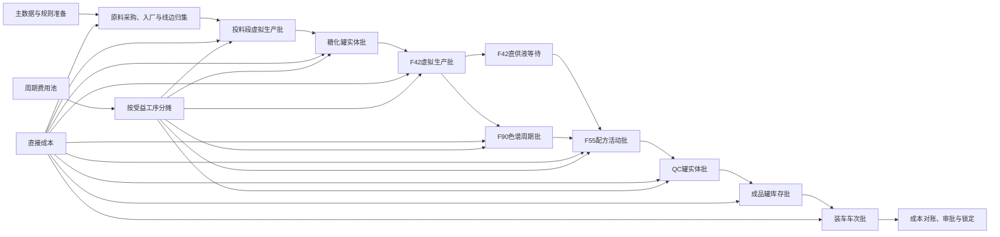
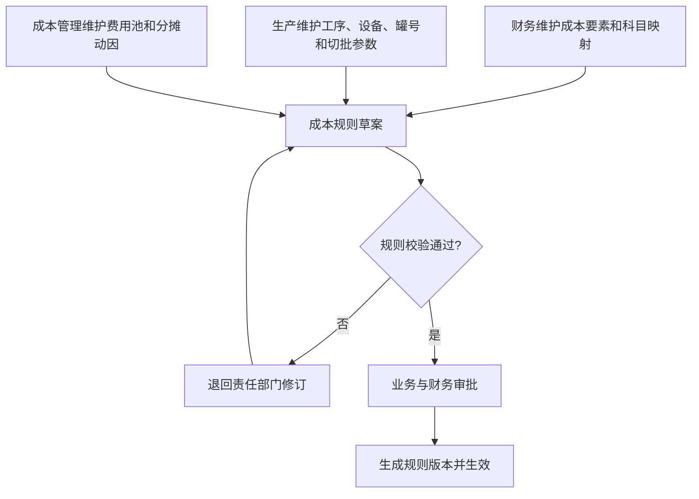
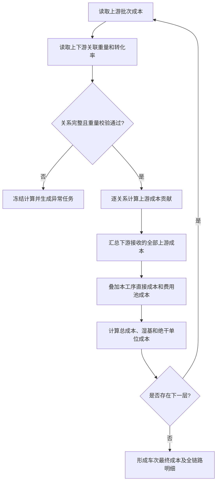
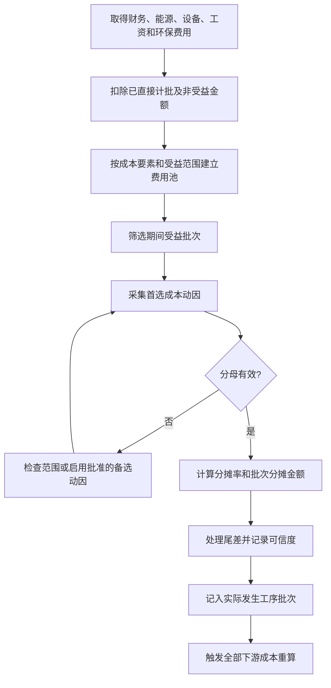
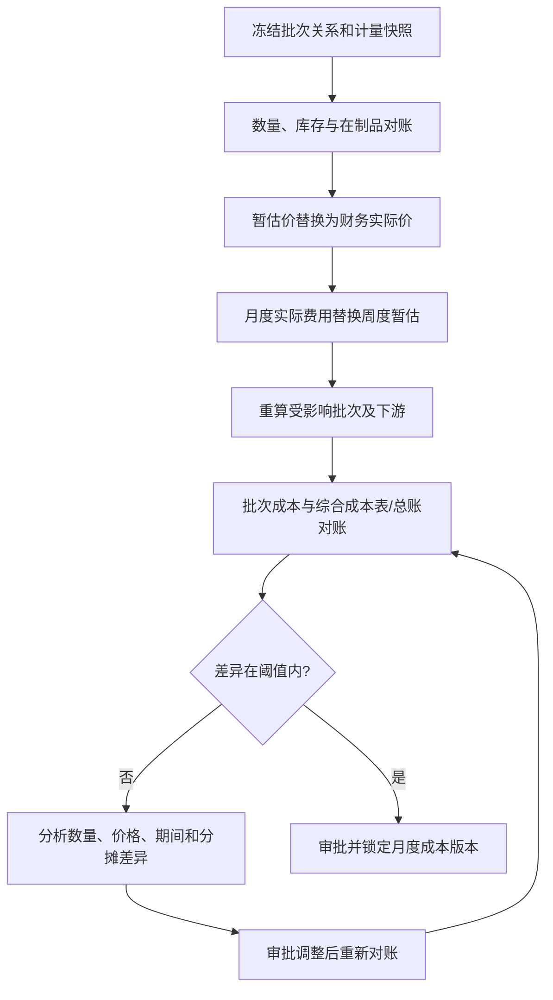

# 果葡糖浆生产线批次成本计算业务方案

## 1. 文档定位

### 1.1 编制目的

本方案用于建立一套可执行、可核对、可追溯的果葡糖浆生产线批次成本计算规则，使原料成本从最上游批次开始，沿生产批次关联关系逐级传导，在每个工艺层叠加本工序新增成本，最终形成成品罐批次、装车批次的完整成本。同时，将无法直接定位到单一批次的人工、折旧、公共能耗、污水、保险等费用先归集到周期费用池，再依据明确的成本动因分摊至受益批次。

本方案既服务于生产经营分析，也为财务月度综合成本核销提供批次维度的明细依据，但不改变财务总账的法定核算口径。

### 1.2 资料依据

本方案依据以下资料编制：

- `20260826-成本分析调研.md`：成本范围、可直接计批成本与周期分摊成本的初步分类。
- `正式产线(1).pdf`：果葡糖浆当前生产工艺及物料流向。
- `果葡糖浆生产线批次划分规则1.xlsx`：供应商批次至车次批次的十层批次体系及批次字段。
- `综合成本表太仓.xlsx`：现行业务核销使用的成本项目、绝干量口径和期间费用结构。
- `批次和批次关联数据样例_QC整罐转成品罐修正版.xlsx`：上下游批次关联重量、转化率、罐容和连续生产样例。

资料中的描述仅作为现状事实和业务规则来源。本方案的方案结构、计算方法与实施建议以本次需求为准。

### 1.3 适用范围与边界

- 仅考虑果糖糖浆生产所经过的淀粉乳罐 A 路径，不考虑淀粉乳罐 B 路径。
- 覆盖玉米淀粉采购入厂、线边供料、投料、糖化、F42、F90 色谱、F55 混合、QC 罐、成品罐和装车出库。
- 批次关联采用时间、阀门、罐次、流量/重量和转化率形成的近似谱系，不将连续管道内的批次边界解释为精准物理切分。
- 默认批次重量采用湿基实际重量；跨产品、跨浓度比较及周期费用池分摊可使用绝干重量。绝干重量必须记录对应的干物质比例和检测来源。
- 成本金额默认采用不含可抵扣增值税口径；含税分析作为派生视图，不与制造成本主账混用。
- 生产批次成本与完全经营成本分层展示。管理、销售、财务等期间费用进入“完全经营成本视图”，不伪装成某道生产工序的直接制造消耗。

## 2. 业务背景

果葡糖浆属于连续与罐式活动并存的制造过程。投料、F42、色谱和混合段主要表现为连续流；糖化罐、QC 罐和成品罐具有明确的罐级活动边界。物料在 F42 后发生分流，一部分作为 F42 直供液等待，另一部分进入色谱形成 F90；两路物料按配方重新汇合形成 F55。因此，批次成本不能简单地按“一个上游批次对应一个下游批次”计算，而必须支持分拆、合并和多对多关系。

现行综合成本表主要按月、产品和装置汇总，已覆盖淀粉、辅料、动力能源、排污、折旧、工资、制造费用、销售费用、管理费用、财务费用及其他项目，并使用产量、绝干量或产值进行分配。这一体系适合月度经营核销，但无法直接解释某个成品罐或某一车产品为何形成当前成本。

本方案通过“批次直接成本逐级传导 + 周期费用池按成本动因分摊 + 财务月末对账调整”的三层机制，将生产追溯数据与现行成本核销口径连接起来。

## 3. 业务需求

### 3.1 核心业务目标

1. 计算任一生产批次的来源成本、本工序新增成本、周期分摊成本、总成本和单位成本。
2. 从成品罐或车次向上追溯到 F55、F90/F42、糖化、投料及原料批次，并解释每一笔成本贡献。
3. 支持上游批次拆分给多个下游批次、多个上游批次汇合为一个下游批次，以及同一车次跨两个相邻成品罐的情形。
4. 对无法实时计入批次的成本建立费用池，明确期间、受益范围、分摊动因、分母、计算结果和差异处理。
5. 支持周度暂估、月度结算和结算后调整，保证批次明细之和与财务核销金额可勾稽。
6. 同时输出湿基吨成本、绝干吨成本、批次制造成本和完全经营成本，避免不同分析口径互相覆盖。

### 3.2 管理问题

系统应能回答以下问题：

- 某车 F55 的原料来自哪些供应商批次，各贡献多少重量和成本？
- 某个糖化罐用了哪些投料批次，糖化酶、酸、蒸汽和人工如何计入？
- F42 分流后，直供路径与色谱路径的成本如何分别保留并在 F55 汇合？
- 转化损失、罐底、在制品和质量不合格造成的成本由谁承担？
- 某周人工、折旧、公共水电、污水、保险、树脂等费用为何分到某个批次？
- 月度综合成本表与批次成本合计不一致时，差异来自数量、价格、时间边界还是分摊口径？

## 4. 总体解决方案

### 4.1 成本 BOM 全景及待确认项

下表将调研资料、现行综合成本表和生产业务中可能发生的成本统一整理为分层成本 BOM。一级分类用于区分成本所处的经营环节，二级分类对应综合成本表或业务费用池，三级分类为具体成本要素。表中同时保留生产制造费用和管理、销售、财务、税费等完全经营成本，以便后续分别形成“生产成本口径”和“完全经营成本口径”。

最后两列为业务确认列，当前保持空白，不在本方案中预先判断。建议由生产、财务和管理层逐项确认后再固化到成本规则版本中。

| 一级成本 BOM | 二级成本 BOM | 三级成本要素 | 成本内容或口径说明 | 是否考虑在生产成本中（待确认） | 是否需要分摊（待确认） |
|---|---|---|---|---|---|
| 原料采购及入厂 | 主要原料 | 玉米淀粉采购价 | 采购订单或合同中的不含税材料采购单价 |  |  |
| 原料采购及入厂 | 主要原料 | 玉米淀粉运输价 | 供应商或承运商将原料运输至工厂的费用；与采购价共同构成合同价 |  |  |
| 原料采购及入厂 | 主要原料 | 原料质量扣款及价差 | 水分、质量、短重、结算单价与暂估单价形成的调整 |  |  |
| 原料采购及入厂 | 采购附加 | 采购保险费 | 原料采购、运输和存货环节相关保险 |  |  |
| 原料采购及入厂 | 采购附加 | 采购手续费及其他附加 | 与采购合同、结算或到货直接相关的其他费用 |  |  |
| 原料采购及入厂 | 外库成本 | 外库租赁费 | 厂内库容不足时发生的外部仓库租赁费用 |  |  |
| 原料采购及入厂 | 外库成本 | 外库装卸费 | 原料进出外库产生的装卸作业费用 |  |  |
| 原料采购及入厂 | 外库成本 | 外库至厂内运输费 | 原料由外库运至厂内或线边的二次运输费用 |  |  |
| 原料采购及入厂 | 厂内物流 | 入厂卸货费 | 车辆到厂后卸货所发生的劳务和作业费用 |  |  |
| 原料采购及入厂 | 厂内物流 | 移库及倒运费 | 平面库、线边库和工位之间的叉车移库、倒运费用 |  |  |
| 原料采购及入厂 | 厂内物流 | 仓储及投料辅助人工 | 卸货、入库、保管、备料和投料辅助人员成本 |  |  |
| 原料采购及入厂 | 厂内物流 | 叉车及机械设备费用 | 叉车、输送和拆包设备的能耗、维修、折旧或租赁费用 |  |  |
| 生产变动成本 | 酸碱及过滤辅料 | 盐酸（折百） | 调节 pH、离交再生或清洗等实际消耗 |  |  |
| 生产变动成本 | 酸碱及过滤辅料 | 氢氧化钠（折百） | 中和、离交再生或清洗等实际消耗 |  |  |
| 生产变动成本 | 酸碱及过滤辅料 | 硅藻土 | 过滤环节实际耗用 |  |  |
| 生产变动成本 | 酸碱及过滤辅料 | 活性炭 | 脱色环节实际耗用；包括一次性或周期性更换成本 |  |  |
| 生产变动成本 | 酸碱及过滤辅料 | 过滤材料及其他耗材 | 滤袋、滤芯、助滤材料和其他生产耗材 |  |  |
| 生产变动成本 | 酶制剂及配方辅料 | 淀粉酶 | 投料、溶粉和液化阶段使用的酶制剂 |  |  |
| 生产变动成本 | 酶制剂及配方辅料 | 复合糖化酶 | 糖化罐实际投加的酶制剂 |  |  |
| 生产变动成本 | 酶制剂及配方辅料 | 异构酶 | 异构环节实际使用或按寿命周期摊销的酶制剂 |  |  |
| 生产变动成本 | 酶制剂及配方辅料 | 硫酸镁（食品级） | 配方或工艺要求的实际耗用 |  |  |
| 生产变动成本 | 酶制剂及配方辅料 | 焦亚硫酸钠（食品级） | 配方或工艺要求的实际耗用 |  |  |
| 生产变动成本 | 酶制剂及配方辅料 | 其他辅料 | 未单列但实际参与生产或配方的辅料 |  |  |
| 生产变动成本 | 长周期材料 | 离交树脂 | 离交系统使用、无逐批领用但存在采购或在建转入成本的树脂 |  |  |
| 生产变动成本 | 长周期材料 | 色谱树脂 | 色谱分离设备使用并按寿命周期或处理量摊销的树脂 |  |  |
| 生产变动成本 | 长周期材料 | 循环活性炭及其他循环材料 | 可跨多个批次、多个期间循环使用的生产材料 |  |  |
| 生产变动成本 | 包装物 | 包材 | 桶、袋、标签、封口及其他包装材料；大宗槽车产品无实际耗用时为零 |  |  |
| 生产变动成本 | 包装物 | 包装损耗 | 包装过程中正常损耗或报废的包材成本 |  |  |
| 生产变动成本 | 动力能源 | 水 | 工艺水、清洗水、冷却补水及其他生产用水 |  |  |
| 生产变动成本 | 动力能源 | 电 | 泵、搅拌、过滤、色谱、蒸发和公用设备用电 |  |  |
| 生产变动成本 | 动力能源 | 蒸汽 | 液化、蒸发、加热、清洗等环节使用的蒸汽 |  |  |
| 生产变动成本 | 动力能源 | 天然气 | 锅炉或工艺设备使用的天然气 |  |  |
| 生产变动成本 | 动力能源 | 沼气 | 生产或污水处理系统回用、采购的沼气能源成本 |  |  |
| 生产变动成本 | 动力能源 | 其他动力能源 | 压缩空气、制冷、冰水及未单列的公用工程消耗 |  |  |
| 生产变动成本 | 排污及环保 | 污水处理变动成本 | 药剂、动力等随污水量或污染负荷变化的处理成本 |  |  |
| 生产变动成本 | 排污及环保 | 污水处理固定成本 | 污水设施折旧、固定人工及维持性费用 |  |  |
| 生产变动成本 | 排污及环保 | 固废和危废处置费 | 生产、检修或质量处置产生的固废、危废处理费用 |  |  |
| 生产变动成本 | 质量成本 | 检验耗材 | QC/LIMS 取样、试剂和检验耗材成本 |  |  |
| 生产变动成本 | 质量成本 | 外部检测费 | 委托第三方进行质量检验发生的费用 |  |  |
| 生产变动成本 | 质量成本 | 返工、降级及报废损失 | 质量异常导致的返工新增成本、售价损失或报废成本 |  |  |
| 生产变动成本 | 副产及回收 | 蛋白糟/糖渣回收收益 | 副产物销售净收益，作为成本抵减项单独展示 |  |  |
| 生产变动成本 | 副产及回收 | 其他废料回收收益 | 其他可销售废料或回收物资的净收益 |  |  |
| 生产固定成本 | 人工 | 生产人员工资及奖金 | 车间生产、工艺和班组人员工资奖金 |  |  |
| 生产固定成本 | 人工 | 生产外包劳务 | 不属于装卸和运输费的生产外包劳务 |  |  |
| 生产固定成本 | 折旧与摊销 | 生产设备折旧 | 生产设备、罐体、管线和公用工程设备折旧 |  |  |
| 生产固定成本 | 折旧与摊销 | 生产资产摊销 | 与生产相关的长期待摊、软件或其他资产摊销 |  |  |
| 生产固定成本 | 维修保养 | 日常维修费 | 维修材料、维修人工和外委维修费用 |  |  |
| 生产固定成本 | 维修保养 | 计划检修及保养费 | 定期检修、保养和设备维持性费用 |  |  |
| 生产固定成本 | 制造费用 | 公共制造费用 | 扣除已单列人工、折旧和外包劳务后的其他制造费用 |  |  |
| 生产固定成本 | 制造费用 | 生产保险费 | 厂房、设备、存货等生产相关保险的期间摊销 |  |  |
| 生产固定成本 | 制造费用 | 停工及闲置成本 | 无产出期间仍发生的维持性人工、折旧和能源费用 |  |  |
| 出库及销售物流 | 槽车及装车 | 槽车租赁费 | 成品出库所使用槽车的租赁费用 |  |  |
| 出库及销售物流 | 槽车及装车 | 装车人工费 | 装车作业人员及相关劳务费用 |  |  |
| 出库及销售物流 | 槽车及装车 | 装车机械设备费 | 装车泵、输送、计量及辅助设备费用 |  |  |
| 出库及销售物流 | 客户运输 | 成品运输费 | 从工厂到客户的车次、吨公里或合同运输费用 |  |  |
| 出库及销售物流 | 客户运输 | 货物运输保险 | 成品运输和交付相关保险费用 |  |  |
| 出库及销售物流 | 客户运输 | 包装费、租赁费等 | 综合成本表销售价格与运费部分列示的包装、租赁等费用 |  |  |
| 管理费用 | 管理人工 | 管理人员工资及奖金 | 公司及管理部门人员成本 |  |  |
| 管理费用 | 管理人工 | 保安、保洁及管理劳务 | 管理口径下的保安、保洁和其他外包劳务 |  |  |
| 管理费用 | 管理资产 | 管理资产折旧与摊销 | 办公楼、管理设备、管理软件等折旧摊销 |  |  |
| 管理费用 | 其他管理费用 | 办公及管理运营费用 | 从管理费用总额扣除人工、折旧、保安保洁后的其他管理费用 |  |  |
| 销售费用 | 销售人工 | 销售人员工资及奖金 | 销售和客户服务人员成本 |  |  |
| 销售费用 | 销售资产 | 销售资产折旧与摊销 | 销售环节使用资产的折旧摊销 |  |  |
| 销售费用 | 销售运营 | 市场、客户及销售服务费用 | 从销售费用总额扣除人工、折旧和已单列运输费后的其他销售费用 |  |  |
| 财务费用 | 融资成本 | 利息支出 | 借款、票据和其他融资利息 |  |  |
| 财务费用 | 融资成本 | 手续费支出 | 银行、支付、融资及结算手续费 |  |  |
| 财务费用 | 汇兑影响 | 汇兑损益 | 外币结算和汇率波动形成的损益；现行综合成本表在“其他”中列示 |  |  |
| 税费及其他 | 税费 | 增值税测算额 | 含税分析视图中的测算税额，不与不含税制造成本混用 |  |  |
| 税费及其他 | 税费 | 税金及附加 | 城建税、教育费附加等税费 |  |  |
| 税费及其他 | 其他业务损益 | 其他业务收支 | 除主营生产销售外的其他业务收入与支出 |  |  |
| 税费及其他 | 其他业务损益 | 营业外收支 | 非日常经营活动形成的收入与支出；不含大额补贴的口径需单独确认 |  |  |
| 税费及其他 | 投资及估值 | 投资收益及公允价值变动损益 | 投资活动和公允价值变动形成的损益 |  |  |
| 税费及其他 | 其他收益与损失 | 其他收益 | 政府补助等其他收益，具体纳入口径需确认 |  |  |
| 税费及其他 | 其他收益与损失 | 资产减值损失 | 存货、应收或其他资产减值形成的损失 |  |  |
| 税费及其他 | 其他收益与损失 | 其他未列明收支 | 未归入上述类别但需纳入完全经营成本分析的其他项目 |  |  |

> 确认填写建议：“是否考虑在生产成本中”填写“是/否/仅完全经营成本”；“是否需要分摊”填写“否—直接计批/是—费用池分摊/不适用”。本表当前仅预留字段，不代替业务确认。

### 4.2 成本对象分层

| 层级 | 成本对象 | 主要边界 | 成本角色 |
|---|---|---|---|
| 1 | 供应商原料批次 | 供应商生产/包装批号 | 原料采购成本源头 |
| 2 | 入厂、库位、线边原料批次 | 车次、库位、线边工位 | 承接采购、运输、卸货、移库成本 |
| 3 | 投料段虚拟生产批 | 4 小时投料后工艺时间窗 | 汇集原料与拆包、溶粉、液化成本 |
| 4 | 糖化罐实体批 | 单罐进满、糖化、出空 | 承接投料成本，叠加酶、酸及糖化成本 |
| 5 | F42 虚拟生产批 | 连续 8 小时时间窗 | 承接糖化成本，叠加过滤、脱色、离交、异构等成本 |
| 6 | F90 色谱周期批 | 连续 6 小时周期 | 承接进入色谱的 F42 成本，叠加色谱、树脂、蒸发成本 |
| 7 | F55 配方活动批 | F90 首次产出后，两路按配方同步汇合 | 合并 F42 直供与 F90 成本，叠加混合、混床、过滤、蒸发成本 |
| 8 | QC 罐实体批 | 单 QC 罐进料至出空 | 承接 F55 成本，叠加检验、暂存成本 |
| 9 | 成品罐库存批 | 单成品罐进料至出料 | 承接完整 QC 罐；叠加成品储存成本 |
| 10 | 装车车次批 | 每车装车活动 | 按实际出罐重量承接成品成本，叠加槽车、装车和运输成本 |

### 4.3 两类成本处理机制

| 成本类型 | 识别条件 | 处理方式 |
|---|---|---|
| 批次直接成本 | 能取得批次、设备活动、领料、计量点或业务单据的唯一对应关系 | 直接记入发生层批次，并随物料向下传导 |
| 周期费用池成本 | 只能取得车间、装置、班组或会计期间总额，不能可靠定位到单批 | 先归集到费用池，再按经审批的成本动因分摊至受益批次 |
| 经营期间费用 | 管理、销售、财务等不直接改变在制品状态的费用 | 进入完全经营成本视图；原则上不进入批次制造成本 |
| 副产收益/废料收益 | 可识别来源批次则直接抵减，否则只有周期总额 | 作为成本抵减项单列，不冲减物料重量 |

### 4.4 可直接在批次上计算的成本清单

“可直接计批”不是指成本项目天然都能直接计入，而是该笔成本必须能够通过采购批号、领料单、计量点、设备活动、作业工单、运输单或车次单据唯一对应到一个或一组明确批次。若只有车间或期间汇总金额，则必须转入费用池，不能人为指定批次。

| 阶段 | 成本项目 | 可直接计批的条件 | 直接计入对象 | 直接计算方法 | 主要数据来源 | 无法满足条件时 |
|---|---|---|---|---|---|---|
| 原料采购 | 玉米淀粉采购成本 | 采购订单、收货记录和供应商批次可对应 | 供应商原料批次/入厂原料批次 | \(C=Q\times P\)；月末按发票价调整暂估价 | ERP/SAP、WMS、供应商批号 | 按采购批次暂估，发票到达后调整；不得进入生产公共池 |
| 原料采购 | 合同运输费 | 运输合同或承运单能对应车辆和装载批次 | 入厂原料批次 | 固定车次费用按该车各原料批实际重量拆分 | TMS、运输结算单、过磅单 | 进入入厂物流费用池，按运输重量或吨公里分摊 |
| 原料采购 | 采购保险及货运保险 | 保单或结算单能对应合同、运输单或货值 | 入厂原料批次 | 按保单实际金额或货值比例分配 | 保险单、采购合同、TMS | 进入保险费用池，按存货货值、运输货值或重量分摊 |
| 外库 | 外库租赁费 | 可取得批次在外库的占用重量和天数 | 库位/线边原料批次 | \(C=Q\times T\times R\)，其中 \(T\) 为占用天数 | WMS、外库结算单 | 按批次吨天数建立外库费用池 |
| 外库 | 外库到厂内运输费 | 运输单能对应外库批次和入厂批次 | 入厂或线边原料批次 | 按实际车次金额及装载重量拆分 | TMS、WMS、过磅单 | 进入入厂物流费用池 |
| 入厂至投料 | 卸货费 | 卸货作业单或合同按车次/吨计费 | 入厂原料批次 | 实际卸货吨数乘合同单价，或直接取车次费用 | WMS、作业单、劳务结算 | 进入卸货费用池，按卸货吨数分摊 |
| 入厂至投料 | 移库费 | 叉车任务能对应来源批次、目标库位和搬运重量 | 库位/线边原料批次 | 搬运重量乘单价，或实际作业时长乘设备/人工费率 | WMS、叉车任务、工时记录 | 进入移库费用池，按搬运吨数或标准任务工时分摊 |
| 入厂至投料 | 叉车、拆包等机械作业费 | 设备运行记录能对应作业任务和批次 | 线边原料批次/投料批次 | 设备工时乘批次费率；有独立电表时另计实际能耗 | WMS、EAM、设备运行记录 | 进入设备组费用池，按设备运行小时分摊 |
| 投料、溶粉、液化 | 玉米淀粉投入成本 | 原料领用、投料扫码或称量数据对应投料时间窗 | 投料段虚拟生产批 | 按实际投入重量承接原料批次单位成本 | WMS、投料称、DCS | 依批次关系和累计流量估算，并标记可信度；不进入期间费用池 |
| 投料、溶粉、液化 | 淀粉酶及其他可计量辅料 | 实际领用或投加量可对应投料批 | 投料段虚拟生产批 | \(C=Q_{\mathrm{aux}}\times P_{\mathrm{aux}}\) | ERP领料、DCS加料记录 | 进入对应工序辅料费用池，按处理量或标准单耗分摊 |
| 糖化 | 糖化酶、酸 | DCS记录单个糖化罐实际投加量 | 糖化罐实体批 | 各辅料实际投加量乘批次移动平均价后求和 | DCS、ERP、配方系统 | 先按标准配方暂估，月末按实际领耗差异调整 |
| F42 加工 | 盐酸、氢氧化钠、硅藻土、活性炭、异构酶、硫酸镁、焦亚硫酸钠等 | 领料或投加记录能对应 F42 时间窗/设备活动 | F42 虚拟生产批 | 各辅料实际数量乘期间材料单价 | ERP、DCS、配方/领料记录 | 进入 F42 辅料费用池，按绝干处理量或标准单耗分摊 |
| F90 色谱 | 色谱专用辅料及当期可识别树脂更换成本 | 更换工单、领料单能对应色谱设备和运行周期 | F90 色谱周期批 | 实际领用金额按更换后各周期处理量分摊；若仅影响一个周期可直计 | EAM、ERP、DCS | 长周期树脂进入寿命周期费用池 |
| F55 混合 | 配方新增辅料、过滤材料和可计量耗材 | 配方执行或领料可对应 F55 活动批 | F55 配方活动批 | 实际耗用数量乘材料单价 | 配方系统、ERP、DCS | 进入 F55 辅料费用池 |
| 包装/灌装 | 包材 | 包材领用或扫码记录能对应产品批次、包装批或车次 | 对应成品/包装批次或装车车次批 | 实际耗用数量乘包材移动平均价 | ERP、WMS、包装系统 | 进入产品包材费用池，按实际包装数量或标准单耗分摊 |
| 各生产工序 | 水、电、蒸汽、天然气、沼气 | 独立表计或可靠的设备级计量能按批次时间区间取累计差 | 实际受益的投料、糖化、F42、F90、F55、QC 等批次 | \(C=(M_{\mathrm{end}}-M_{\mathrm{start}})\times P\) | 能源管理、DCS、计量表 | 进入对应工序能源费用池；不得使用全厂总量直接计批 |
| 各生产工序 | 维修费 | 维修工单明确由某批次异常或特定生产活动触发 | 引发维修的工序批次或异常损失对象 | 工单材料费、人工费和外委费合计 | EAM、采购、工时系统 | 一般计划检修进入设备维修费用池，按运行小时分摊 |
| 各生产工序 | 批次专属人工 | 工时记录能明确到某次清洗、切换、返工或异常处置 | 对应生产批次/异常批次 | 实际工时乘人员费率 | MES、HR、工时单 | 常规班组人工进入工序人工费用池 |
| QC | 检验耗材和外检费 | 检验任务、样品号对应唯一 QC 罐批 | QC 罐实体批 | 实际耗材数量乘单价，加外检结算金额 | LIMS、ERP、外检单 | 进入质量费用池，按检验次数或 QC 批次数分摊 |
| 成品储存 | 特定成品罐清洗、处置费用 | 清洗/处置工单对应唯一成品罐批 | 成品罐库存批 | 工单实际材料、能源、人工及外委金额 | EAM、MES、DCS | 常规储罐维护进入成品储存费用池 |
| 出库 | 槽车租赁费 | 租赁结算单对应具体车次 | 装车车次批 | 直接取车次租赁金额 | TMS、租车合同、结算单 | 进入槽车费用池，按车次或装车吨数分摊 |
| 出库 | 客户运输费 | 运输单对应车次、客户和里程 | 装车车次批 | 合同车次价，或装车重量乘吨公里费率 | TMS、销售订单、运费结算 | 进入线路/客户物流费用池，按吨公里分摊 |
| 出库 | 装车人工和机械费 | 装车作业记录能对应具体车次 | 装车车次批 | 实际工时乘费率，加设备工时成本 | 装车系统、工时、设备记录 | 进入装车费用池，按车次或装车吨数分摊 |
| 出库 | 货物运输保险 | 保单或投保清单能对应车次/销售订单 | 装车车次批 | 按实际保费或车次货值占比分配 | 保单、销售订单、TMS | 进入运输保险费用池 |
| 副产物 | 可追溯废料/糖渣回收收益 | 销售称重和来源工序/批次可对应 | 来源生产批次 | 以不含税净收益作为成本抵减 | 过磅、销售、财务收款 | 进入副产收益池，按副产量或相关绝干产量抵减 |

直接计批时必须同时保存数量、单价、金额、来源单据、发生时间、计入批次和成本要素。对“是否可直接计批”存在争议的项目，以能否形成可复核的批次证据链为判断标准，而不是以成本项目名称判断。

上述直接计批公式中的变量解释如下：\(C\) 为该项直接成本，\(Q\) 为实际业务数量，\(P\) 为对应的不含税单价，\(T\) 为占用天数，\(R\) 为单位重量、单位天数的租赁费率；\(Q_{\mathrm{aux}}\) 和 \(P_{\mathrm{aux}}\) 分别为辅料实际耗用量和辅料单价；\(M_{\mathrm{start}}\) 与 \(M_{\mathrm{end}}\) 分别为批次有效区间开始、结束时的能源表累计读数。各公式只在本表对应成本项目内使用，不能跨成本项目混用费率。

以下项目在当前只能取得期间、车间或公司汇总数据时，**不得直接计入单个批次**：年度统一投保的保险费、常规班组工资奖金、无分表的公共水电汽、设备折旧、计划性维修保养、公共制造费用、集中污水处理费用、管理费用、销售管理费用和财务费用。它们必须先进入第 8 章定义的费用池。后续若补齐批次级计量或单据，可从下一规则版本开始改为直接计批，但历史已关账结果不原地覆盖。

### 4.5 双视图成本口径

**批次制造成本**用于生产、质量和工艺分析：

$$
C_{\mathrm{manufacturing}}=C_{\mathrm{upstream}}+C_{\mathrm{auxiliary}}+C_{\mathrm{energy}}+C_{\mathrm{direct\ labor/equipment}}+C_{\mathrm{manufacturing\ pool}}-R_{\mathrm{byproduct}}
$$

其中，\(C_{\mathrm{manufacturing}}\) 为批次制造成本；\(C_{\mathrm{upstream}}\) 为上游传入的材料及半成品成本；\(C_{\mathrm{auxiliary}}\) 为本工序直接辅料成本；\(C_{\mathrm{energy}}\) 为本工序直接能源成本；\(C_{\mathrm{direct\ labor/equipment}}\) 为可直接归集的人工和设备成本；\(C_{\mathrm{manufacturing\ pool}}\) 为制造类费用池分摊额；\(R_{\mathrm{byproduct}}\) 为可归属本批次的副产物净收益。

**批次完全经营成本**用于经营分析：

$$
C_{\mathrm{full}}=C_{\mathrm{manufacturing}}+C_{\mathrm{selling}}+C_{\mathrm{administrative}}+C_{\mathrm{financial}}+C_{\mathrm{other}}
$$

其中，\(C_{\mathrm{full}}\) 为批次完全经营成本；\(C_{\mathrm{manufacturing}}\) 为前式计算的批次制造成本；\(C_{\mathrm{selling}}\)、\(C_{\mathrm{administrative}}\)、\(C_{\mathrm{financial}}\) 和 \(C_{\mathrm{other}}\) 分别为分摊到该批次的销售费用、管理费用、财务费用和其他经营费用。

其中，销售、管理和财务费用是否下沉到车次或产品批次，应由财务管理制度确认；即便下沉，也必须保留独立成本要素，不得回写成“生产直接成本”。

### 4.6 三个核算状态

| 状态 | 含义 | 使用场景 |
|---|---|---|
| 实时暂估 | 已入账直接成本 + 标准价/预算率计提的费用 | 日常看板、异常监控 |
| 周度结算 | 已完成批次直接成本 + 周度费用池实际或暂估分摊 | 周经营分析 |
| 月度关账 | 财务实际金额替换暂估，完成数量和金额对账并锁定版本 | 财务核销、正式分析 |

## 5. 业务流程

### 5.1 总流程

```text
主数据与规则准备
  → 原料采购、入厂与线边成本归集
  → 投料虚拟批生成并汇集原料成本
  → 糖化罐实体批承接成本并叠加罐级成本
  → F42 连续批承接、加工并分流
  → 色谱周期批形成 F90；F42 直供液受阀门控制等待
  → F42 直供液与 F90 按配方汇合形成 F55
  → F55 进入 QC 罐，整罐转入单一成品罐
  → 成品罐按先入先出逻辑供装车
  → 直接成本逐层计算
  → 周期费用池分摊
  → 批次成本重算、对账、审批与锁定
  → 输出批次追溯、吨成本、差异和经营分析
```



每一次成本计算均先固化“批次关系版本”，再计算成本。若上游与下游关联重量发生变化，必须生成新的关系版本并触发受影响下游批次重算，不能只修改最终成本金额。

### 5.2 规则准备子流程



1. 财务维护成本要素、含税属性、科目映射和制造/期间费用属性。
2. 生产维护工序、设备、罐号、流量计、阀门、标准过程时长和批次划分参数。
3. 成本管理人员维护费用池、受益范围、分摊周期、动因优先级和缺失数据替代规则。
4. 系统校验批次关系是否完整、重量是否守恒、时间是否合理、转化率是否在阈值内。
5. 规则经业务和财务审批后生效；已关账期间继续使用原规则版本。

### 5.3 批次直接成本归集与传导子流程



1. 采集上游批次成本、上下游关系重量、转化率和下游本工序直接成本。
2. 按每条批次关系计算上游传入成本。成本按上游实际转出重量分拆，不能按下游批次数量平均分配。
3. 汇总同一下游批次收到的全部上游成本。
4. 叠加本工序直接成本与已完成的周期费用池分摊。
5. 计算下游批次总成本、湿基吨成本和绝干吨成本。
6. 将下游批次作为下一层的上游，重复步骤 2—5，直至装车批次。
7. 保存每条关系的成本贡献明细，使最终车次成本可以逐层展开。

### 5.4 周期费用池子流程



1. 按周或月从财务、能源、设备、工资和环保系统取得费用总额。
2. 按车间、工序、设备组、产品范围和成本要素建立费用池。
3. 选出期间内实际受益的已生产批次，不以“期末仍在库”作为排除条件。
4. 取得每个批次的成本动因数量，校验分母是否为零、是否覆盖全部受益对象。
5. 计算分摊率和批次分摊金额，处理尾差。
6. 将金额记入费用实际发生的批次层，再沿谱系向下传导；不得为了方便直接平均摊到最终车次。
7. 月末以财务实际金额替换周度暂估，生成差额调整记录并重算尚未锁定的下游成本。

### 5.5 月度关账子流程



1. 冻结当月批次关系快照、计量数据和成本规则版本。
2. 完成原辅料数量对账、能源数量对账、库存/在制品盘点和财务金额对账。
3. 将暂估价替换为发票价或财务实际价，计算价格差异。
4. 将月度费用池实际金额与周度累计分摊比较，补分或冲回差额。
5. 检查批次成本合计与综合成本表相应成本项目的差额。
6. 对超阈值差异出具原因和审批记录，完成后锁定月度版本。

## 6. 各生产层级的成本归集规则

### 6.1 供应商原料、入厂与线边批次

**直接计批项目：**玉米淀粉采购价、合同约定运输费、可定位到车次的保险或附加费、卸货费、移库费、外库到场内运输费。

**计算规则：**

- 采购材料成本按供应商批次的实际验收入库重量和不含税采购单价计算。
- 一车包含多个供应商批次时，车次运输费按各供应商批次实际入厂重量分摊；若承运合同按里程、车型或固定车次计价，应先算出车次实际金额，再按重量分配。
- 入库、库位和线边移动不改变材料本体成本，只新增发生环节的卸货、移库或机械作业成本。
- 供应商短重、拒收和质量扣款必须调整对应原料批次，不能分给正常原料批次。

### 6.2 投料段虚拟生产批

投料批次是投料后的工艺时间批，示例按连续 4 小时切片，覆盖拆包、溶粉和液化至糖化罐入口的过程。批次边界是管理近似边界，不是管道内精准物理隔断。

**成本构成：**

- 由线边原料批次传入的淀粉成本；
- 可直接计量的投料用水、蒸汽、电、淀粉酶等；
- 可定位的拆包、溶粉、液化作业费；
- 投料段周期人工、折旧、维修和公共能耗分摊。

多条线边批次进入同一投料批时，按实际投料重量汇集；一个线边批次跨多个投料时间窗时，按流量计累计量或领料过账量拆分。

### 6.3 糖化罐实体批

每个糖化罐必须灌满后才开始糖化。样例中共 12 个糖化罐，每罐容量 396 m³、约 415 吨，灌满约需 5 小时，并按罐号依次进出。

**成本构成：**投料批传入成本 + 本罐实际投加的复合糖化酶、酸等辅料 + 本罐可计量动力 + 糖化工序费用池分摊。

投料批与糖化罐批按糖化罐进料窗口的重叠和累计流量建立多对多关系。若平均流量为 83 吨/小时，则 4 小时投料批为 332 吨，5 小时满罐为 415 吨。第一罐可由第一个投料批 332 吨和第二个投料批前 1 小时 83 吨组成。

### 6.4 F42 虚拟生产批

F42 批次按连续 8 小时时间窗首尾相接。起点为糖化批次出料开始时间；每个 F42 批次结束时间为起始时间加 8 小时；用于匹配下游的有效区间可按结束时间再向后推一个标准过程时间。该延伸用于关联，不代表批次本身继续生产。

**成本构成：**糖化批传入成本 + 过滤、F00/F42 脱色、离交、异构、换热和蒸发等环节可直接计量的辅料及动力 + F42 工序费用池分摊。

F42 总成本在分流时必须拆为两部分：进入色谱的成本和直供等待的成本。拆分依据为实际分流重量，不得把色谱加工成本反向摊给未进入色谱的直供液。

### 6.5 F90 色谱周期批

色谱批按连续 6 小时周期切片，示例第一周期从 `2026-08-12 09:00` 开始。其成本包括进入色谱的 F42 成本、色谱直接动力、可计量辅料和色谱专属费用池（例如树脂成本）。

色谱收率单独记录。若进入色谱的 F42 为 175.05 吨、F90 收率为 92%，则 F90 产出为 161.046 吨；进入色谱的全部 F42 成本由 161.046 吨 F90 承担，8% 的正常损失不会凭空消失，而是体现为 F90 单位成本上升。异常损失则转入异常损失成本对象，经审批后决定由产品承担或计入当期损失。

### 6.6 F55 配方活动批

F42 直供液在阀门控制下等待 F90 产出，两路同时进入混合段。第一批 F55 的起点是第一批 F90 实际产出时间，示例为 `2026-08-12 15:00`。配方比例承接前段分流并考虑 F90 损耗，示例中 F42 直供液与 F90 色谱液之比约为 \(2.701:1\)，期末不保留 F42 直供暂存库存。

F55 成本由直供 F42 成本、F90 成本、混合/混床/过滤/蒸发直接成本和 F55 工序费用池分摊组成。不同来源必须保留独立关系行，以支持配方、来源和成本贡献追溯。

### 6.7 QC 罐、成品罐与装车批次

- QC 罐共 5 个，每罐 100 m³，依次进出。
- 一个 QC 罐的液体不得拆给不同成品罐。
- 成品罐共 15 个，每罐 804 m³；应尽量装满当前罐。若当前成品罐剩余容量不足以容纳下一整个 QC 罐，则启用下一个成品罐。
- QC 到成品罐的转罐损耗通过转化率记录，损耗成本由产出的合格成品承担；异常泄漏或报废单独处理。
- 装车按成品罐实际出料重量承接成本。必须先出空当前成品罐再切下一罐；若一辆车恰好跨罐，则允许一个车次关联两个相邻成品罐批次。
- 槽车租赁、运输、装车人工和装车机械费能定位到车次时直接计入车次；不能定位时进入物流费用池。

## 7. 统一计算规则

### 7.1 基础变量

对上游批次 `u`、下游批次 `d` 和二者之间的关系 `r`，定义：

| 符号 | 含义 |
|---|---|
| \(Q_u\) | 上游批次可供分配重量 |
| \(Q_r\) | 关系记录中的上游转入重量 |
| \(Y_r\) | 上下游转化率 |
| \(Q_{r,\mathrm{out}}\) | 折算后对下游的贡献重量，\(Q_rY_r\) |
| \(C_u\) | 上游批次可传导总成本 |
| \(C_{r,\mathrm{in}}\) | 该关系承接的上游成本 |
| \(C_{d,\mathrm{direct}}\) | 下游本工序直接成本 |
| \(C_{d,\mathrm{pool}}\) | 下游承担的周期费用池成本 |
| \(C_{d,\mathrm{abnormal}}\) | 经批准由该批次承担的异常成本或冲减 |
| \(C_d\) | 下游批次总成本 |

### 7.2 上游成本拆分

正常情况下，上游批次向各下游批次传递的成本按上游实际转入重量占上游可分配重量的比例拆分：

$$
C_{r,\mathrm{in}}=C_u\frac{Q_r}{Q_u}
$$

其中，\(C_{r,\mathrm{in}}\)、\(C_u\)、\(Q_r\) 和 \(Q_u\) 的含义见 7.1 节变量表；\(r\) 表示一条确定的上下游批次关系。

若 \(\sum_r Q_r<Q_u\)，差额为期末在制、罐底、留存库存或待确认损失，上游批次不得提前结清。若 \(\sum_r Q_r>Q_u\)，说明关系重复、计量口径不一致或发生数据错误，必须暂停成本结算。

转化率用于计算下游产出重量和单位成本，不用于再次折减已经发生的上游成本：

$$
Q_{r,\mathrm{out}}=Q_rY_r
$$

其中，\(Q_{r,\mathrm{out}}\)、\(Q_r\) 和 \(Y_r\) 的含义见 7.1 节变量表。

正常工艺损失的成本仍由合格产出承担。因此，收率下降会推高下游单位成本，但不会减少传递的历史投入成本。

### 7.3 下游批次成本

$$
C_d=\sum_r C_{r,\mathrm{in}}+C_{d,\mathrm{direct}}+C_{d,\mathrm{pool}}+C_{d,\mathrm{abnormal}}
$$

其中，\(d\) 表示当前下游批次，\(r\) 遍历所有进入该下游批次的关系；其余成本变量含义见 7.1 节变量表。

$$
UC_{d,\mathrm{wet}}=\frac{C_d}{Q_{d,\mathrm{qualified,wet}}}
$$

其中，\(UC_{d,\mathrm{wet}}\) 为下游批次湿基单位成本，\(C_d\) 为下游批次总成本，\(Q_{d,\mathrm{qualified,wet}}\) 为该批次合格湿基产出重量。

$$
UC_{d,\mathrm{dry}}=\frac{C_d}{Q_{d,\mathrm{qualified,wet}}\times R_{d,\mathrm{dry\ matter}}}
$$

其中，\(UC_{d,\mathrm{dry}}\) 为下游批次绝干单位成本，\(R_{d,\mathrm{dry\ matter}}\) 为该批次干物质质量比例；\(C_d\) 和 \(Q_{d,\mathrm{qualified,wet}}\) 与上一公式一致。

若某批次尚未完成，单位成本使用预计合格产出量并标记为“暂估”；完成后改用实际合格产出量。

### 7.4 多对多关系规则

- **上游拆分：**一个上游批次进入多个下游批次时，每条关系按 \(Q_r/Q_u\) 承接成本。
- **下游汇合：**一个下游批次接收多个上游批次时，先分别计算每个来源的成本贡献，再求和。
- **跨罐装车：**一辆车跨两个成品罐时，每个成品罐按实际装入该车的重量传递成本。
- **关系可解释性：**每条成本贡献必须同时保留上游批次、下游批次、上游转入重量、转化率、来源单位成本和传入成本。

### 7.5 损耗、罐底与在制品

| 情形 | 重量处理 | 成本处理 |
|---|---|---|
| 标准工艺损耗 | 通过转化率体现 | 全部正常投入成本由合格产出承担 |
| 异常损失 | 建立异常损失数量 | 从正常批次剥离，记入异常损失成本对象，审批后决定是否计入产品成本 |
| 罐底继续留用 | 保留来源谱系和重量 | 对应成本保留在罐底库存，随下一批实际转出量传递 |
| 周末/月末在制品 | 按当前层级确认重量和完工程度 | 未传出的成本留在当前批次，不得直接分给已完工批次 |
| 返工/回流 | 建立回流关系，防止环路重复计算 | 只传递实际回流成本；系统按版本和节点顺序防止成本被循环叠加 |

### 7.6 成本精度与尾差

- 重量至少保留 6 位小数，金额计算至少保留 6 位小数，展示时金额保留 2 位。
- 分摊尾差由成本动因数量最大的批次承担，尾差调整单独记录。
- 不允许在每一层过早四舍五入单位成本后再乘重量；应传递总成本，单位成本仅用于展示和分析。

## 8. 周期费用池分摊规则

### 8.1 通用公式

为避免下角标过长，费用池计算统一使用以下简化变量：

| 变量 | 含义 | 单位/说明 |
|---|---|---|
| \(P\) | 本费用池在本周期归集的实际发生额 | 元 |
| \(B\) | 已经直接计入具体批次的金额 | 元；必须从费用池中扣除，避免重复计算 |
| \(O\) | 不属于本费用池受益范围的金额 | 元；例如其他产线、其他产品承担的费用 |
| \(K\) | 应资本化或应由其他成本对象承担的金额 | 元 |
| \(A\) | 本费用池最终可分摊金额 | 元 |
| \(D_i\) | 第 \(i\) 个受益批次的成本动因数量 | 工时、吨、吨公里、立方米等 |
| \(D\) | 全部受益批次的成本动因总量 | \(D=\sum_{i=1}^{n}D_i\) |
| \(R\) | 本费用池的单位动因分摊率 | 元/动因单位 |
| \(C_i\) | 第 \(i\) 个受益批次从本费用池分得的成本 | 元 |
| \(n\) | 本费用池受益批次数量 | 正整数 |

先计算可分摊金额：

$$
A=P-B-O-K
$$

再汇总成本动因并计算分摊率：

$$
D=\sum_{i=1}^{n}D_i
$$

$$
R=\frac{A}{D}
$$

第 \(i\) 个批次的分摊金额为：

$$
C_i=R\times D_i=A\times\frac{D_i}{D}
$$

校验公式为：

$$
\sum_{i=1}^{n}C_i=A
$$

若由于金额保留两位小数产生尾差，则将尾差记入 \(D_i\) 最大的受益批次，并单独保存尾差金额。一项费用一旦已经直接计入批次，必须计入变量 \(B\) 并从费用池中扣除。

### 8.2 分摊动因优先级

选择动因时按以下优先级执行：

1. 实际因果动因：设备电表、蒸汽表、用水表、物料领用、实际工时、污水流量。
2. 可验证代理动因：设备运行小时、泵送吨数、色谱进料量、罐占用小时。
3. 产品物量动因：绝干产量、合格湿基产量。
4. 产值动因：仅用于与价值创造更相关且缺乏物量动因的经营费用。
5. 平均分配：只允许用于金额很小且各批次受益程度无显著差异的费用，并需审批。

### 8.3 费用池规则矩阵

| 费用池 | 建议周期 | 归集范围 | 首选分摊动因 | 备选动因 | 记入层级 |
|---|---|---|---|---|---|
| 车间直接人工及外包劳务 | 周/月 | 班组、工序 | 批次实际人工工时 × 岗位系数 | 工序运行小时或绝干产量 | 实际作业工序批次 |
| 卸货/移库公共人工 | 周 | 仓储作业区 | 批次搬运吨数 × 标准作业系数 | 入厂/移库重量 | 入厂或线边批次 |
| 公共电费 | 周/月 | 配电回路、装置 | 分表电量 | 设备额定功率 × 运行小时 | 对应工序批次 |
| 蒸汽费 | 周/月 | 蒸汽母管、装置 | 分表蒸汽量 | 标准蒸汽单耗 × 绝干产量 | 投料、F42、F90、F55 |
| 水、天然气、沼气 | 周/月 | 计量区域 | 实际表计消耗 | 运行小时或绝干产量 | 实际受益工序 |
| 维修保养 | 月 | 设备或设备组 | 维修工单工时/金额；能定位批次则直计 | 设备运行小时 | 对应设备所在工序 |
| 折旧与摊销 | 月 | 设备、车间 | 设备运行小时 | 设计产能小时或绝干产量 | 对应工序批次 |
| 树脂、炭等长周期材料 | 周/月或寿命周期 | 使用设备/周期 | 该周期处理量或有效运行周期 | 绝干进料量 | F42 离交或 F90 色谱批 |
| 污水处理变动费 | 周/月 | 污水来源工序 | 实测污水量 × 污染负荷系数 | 工艺标准排污系数 × 绝干产量 | 污水产生工序 |
| 污水固定成本 | 月 | 受益生产装置 | 绝干产量 | 产值 | 正常产品相关生产批次 |
| 保险费 | 月度摊销 | 被保险资产/存货/运输 | 资产原值、存货占用额或运输货值 | 绝干产量/运输重量 | 对应资产工序或物流批次 |
| 公共制造费用 | 月 | 车间/装置 | 设备运行小时 + 人工工时的组合动因 | 绝干产量 | 正常生产批次 |
| 槽车与出库公共费用 | 周/月 | 物流线路/客户区域 | 车次、吨公里、实际装车吨数 | 销售重量 | 装车车次 |
| 管理费用 | 月 | 公司/事业部 | 绝干产量或制造成本 | 产值 | 完全经营成本视图 |
| 销售费用 | 月 | 产品/客户/区域 | 可识别销售订单；否则销售重量或收入 | 产值 | 车次/销售批次的经营视图 |
| 财务费用 | 月 | 公司/产品 | 存货资金占用额 × 占用天数 | 产值 | 完全经营成本视图 |
| 废料/糖渣回收收益 | 周/月 | 可追溯来源或车间 | 实际副产数量或来源主产品绝干量 | 正常产品绝干产量 | 成本抵减项 |

### 8.4 人工费用池

人工费用包括工资、奖金及相关劳务合同支出。综合成本表要求区分车间、管理、销售人工，且车间人工包含外包劳务，但不包含已计入装卸、运输项目的劳务。

推荐使用“有效工时”。其中，\(H_i\) 为第 \(i\) 个批次的有效工时，\(h_i\) 为实际工时，\(k_p\) 为岗位系数，\(k_s\) 为班次系数：

$$
H_i=h_i\times k_p\times k_s
$$

人工费用池分摊时，以 \(H_i\) 作为通用公式中的 \(D_i\)。

班组同时照看多个连续批次时，先按工序运行时间切分，再按设备数量或监控工作量修正。管理、销售人工不得混入生产人工费用池。

### 8.5 动力能源费用池

有消耗数量和单价时，优先把数量分给批次，再按期间加权平均不含税单价计算成本。其中，\(E_i\) 为第 \(i\) 个批次的能源成本，\(q_i\) 为批次能源消耗量，\(p\) 为期间加权平均能源单价：

$$
E_i=q_i\times p
$$

这与综合成本表“原料、辅料、动力能源先分配数量，再以单价乘数量”的现行逻辑一致。只有金额、没有可靠数量时，才直接分配成本金额，并标记为低一级可信度。

### 8.6 长周期材料费用池

树脂、炭等可能没有逐批领用记录，但存在采购或在建转入成本。应按使用寿命周期建立资产/耗材卡。其中，\(A_t\) 为本期应摊金额，\(V\) 为可摊销原值，\(q_t\) 为本期实际处理量，\(Q\) 为预计寿命总处理量：

$$
A_t=V\times\frac{q_t}{Q}
$$

当期应摊金额再按各 F42 离交批或 F90 色谱批的绝干处理量分配。提前失效若属于异常操作，应将未摊余额转入异常损失；正常寿命偏差则更新估计并未来适用。

### 8.7 污水费用池

污水费用应分为变动处理成本和污水设施固定成本：

- 变动成本优先按实测污水量乘污染负荷系数分配；污染负荷可依据 COD、BOD 或工艺标准系数。
- 固定成本在正常产品范围内按绝干产量分配；不得分给没有受益或不属于果葡糖浆装置的产品。
- 环保罚款原则上作为异常/期间损失，不作为正常产品制造成本。

### 8.8 废料回收收益

蛋白糟、糖渣等回收收益单独作为成本抵减项。能通过时间、产线或称重记录关联来源批次时，直接抵减来源批次；只有周期总额时，按相关批次的副产实物量分配，缺少副产计量时才按主产品绝干产量分配。销售收入、处置费用和净收益应分别留痕。

### 8.9 分摊可信度

每条费用分摊结果应附可信度等级：

| 等级 | 依据 |
|---|---|
| A | 单批实测或业务单据直接归集 |
| B | 设备/工序表计和实际运行数据分摊 |
| C | 标准单耗、运行小时或绝干产量代理分摊 |
| D | 产值或平均分配，需重点披露 |

## 9. 计算数据样例

本章的批次时间、重量和关系优先采用现有样例表；为便于展示成本算法，单价、工序新增成本和费用池金额为测算数据，不代表财务实际发生额。

### 9.1 投料批次到糖化罐批次

已知：

- 投料批 `20260810-W-0000`：有效区间 `2026-08-10 04:00—08:00`，产出 332 吨，总成本 996,000 元，单位成本 3,000 元/吨。
- 投料批 `20260810-W-0400`：有效区间 `2026-08-10 08:00—12:00`，产出 332 吨，总成本 1,029,200 元，单位成本 3,100 元/吨。
- 糖化罐批 `260810-TH01-001`：`04:00` 开始进罐，`09:00` 灌满，满罐 415 吨；使用第一投料批 332 吨和第二投料批 83 吨。
- 本罐复合糖化酶、酸等直接辅料 8,000 元；本罐可计量动力 12,000 元。

关联及成本如下：

| 下游糖化批 | 上游投料批 | 关联重量 | 上游重量占比 | 传入成本 |
|---|---|---:|---:|---:|
| 260810-TH01-001 | 20260810-W-0000 | 332 吨 | \(332/332=100\%\) | 996,000 元 |
| 260810-TH01-001 | 20260810-W-0400 | 83 吨 | \(83/332=25\%\) | 257,300 元 |

$$
C_{\mathrm{TH01}}=996{,}000+257{,}300+8{,}000+12{,}000=1{,}273{,}300\ \text{元}
$$

其中，\(C_{\mathrm{TH01}}\) 为糖化罐批 `260810-TH01-001` 的总成本；四项金额依次为第一投料批传入成本、第二投料批传入成本、糖化直接辅料成本和糖化直接动力成本。

$$
UC_{\mathrm{TH01}}=\frac{1{,}273{,}300}{415}=3{,}068.192771\ \text{元/吨}
$$

其中，\(UC_{\mathrm{TH01}}\) 为该糖化罐批的湿基单位成本；分子为 \(C_{\mathrm{TH01}}\)，分母 415 吨为该罐合格出罐重量。

第二个投料批剩余 249 吨及对应成本 771,900 元继续传给后续糖化罐，不能在第一罐中结清。

### 9.2 F42 分流、F90 损耗与 F55 汇合

以 F55 批 `20260812-H-1500` 为例，现有关系样例为：

| 上游批次 | 物料 | 上游转入重量 | 转化率 | 对 F55 贡献重量 |
|---|---|---:|---:|---:|
| 20260812-F42-0100 | F42 直供液 | 435.000 吨 | 99% | 430.650 吨 |
| 20260812-F90-0900 | F90 色谱液 | 161.046 吨 | 99% | 159.43554 吨 |
| **合计** |  | **596.046 吨** |  | **590.08554 吨** |

假设 F42 直供液上游单位成本为 3,500 元/吨，F90 色谱液上游单位成本为 4,900 元/吨，F55 混合段本批直接成本为 20,000 元，则：

| 成本来源 | 计算 | 成本贡献 |
|---|---|---:|
| F42 直供成本 | \(435\times3{,}500\) | 1,522,500.00 元 |
| F90 色谱成本 | \(161.046\times4{,}900\) | 789,125.40 元 |
| F55 本工序直接成本 | 已归集金额 | 20,000.00 元 |
| **F55 批总成本** | 三项合计 | **2,331,625.40 元** |

$$
UC_{\mathrm{F55,wet}}=\frac{2{,}331{,}625.40}{590.08554}=3{,}951.334581\ \text{元/吨}
$$

其中，\(UC_{\mathrm{F55,wet}}\) 为 F55 批 `20260812-H-1500` 的湿基单位成本；分子为该 F55 批总成本，分母为考虑 99% 转化率后的合格贡献重量。

99% 的混合段收率不把上游成本乘以 99%。全部 2,311,625.40 元上游投入成本仍由 590.08554 吨合格产出承担，因此损耗会提高单位成本。

若 F90 的 161.046 吨来自 175.05 吨 F42 色谱进料，色谱收率为 92%，则进入色谱的 F42 历史成本全部传给 161.046 吨 F90；色谱新增成本只加在 F90 路径，不加到 435 吨 F42 直供路径。

### 9.3 F55 到 QC 罐和成品罐

假设上述 F55 批向 QC 罐实际转出 100 吨，F55 可分配产出为 590.08554 吨，则该关系传入 QC 的成本为：

$$
C_{\mathrm{F55\rightarrow QC}}=2{,}331{,}625.40\times\frac{100}{590.08554}=395{,}133.46\ \text{元}
$$

其中，\(C_{\mathrm{F55\rightarrow QC}}\) 为该 F55 批向当前 QC 罐转入 100 吨物料所携带的上游成本；590.08554 吨为 F55 批可分配合格产出重量。

若 QC 本罐检验和暂存直接成本为 1,500 元，且本罐合格转出率为 99.8%，则：

$$
C_{\mathrm{QC}}=395{,}133.46+1{,}500=396{,}633.46\ \text{元}
$$

其中，\(C_{\mathrm{QC}}\) 为当前 QC 罐批总成本；395,133.46 元为 F55 传入成本，1,500 元为本 QC 罐检验和暂存直接成本。

$$
Q_{\mathrm{QC,qualified}}=100\times99.8\%=99.8\ \text{吨}
$$

其中，\(Q_{\mathrm{QC,qualified}}\) 为当前 QC 罐批合格转出重量；100 吨为转入重量，99.8% 为本罐合格转出率。

$$
UC_{\mathrm{QC,qualified}}=\frac{396{,}633.46}{99.8}=3{,}974.283166\ \text{元/吨}
$$

其中，\(UC_{\mathrm{QC,qualified}}\) 为当前 QC 罐批合格品单位成本；分子为 \(C_{\mathrm{QC}}\)，分母为 \(Q_{\mathrm{QC,qualified}}\)。

在现有扩展示例中，每个 QC 批转出约 104.273990 吨；一个成品罐连续接收 8 个完整 QC 批，累计转入约 834.191919 吨，剩余空间已无法放入第 9 个完整 QC 批，因此第 9 个 QC 批必须进入下一成品罐。成本按这 8 条 QC→成品罐关系逐条传递，不得把第 9 个 QC 批拆开填补尾部空间。

### 9.4 成品罐到跨罐车次

假设车次 `20260818-F01-034` 装车 25 吨，其中：

- 从成品罐批 `260813-F01-01` 装入 7.523535 吨，该罐单位成本 4,020 元/吨；
- 当前罐出空后，从相邻成品罐批 `260813-F02-01` 装入 17.476465 吨，该罐单位成本 4,080 元/吨；
- 本车槽车租赁、装车和运输直接成本共 4,500 元。

| 来源 | 重量 | 单位成本 | 成本贡献 |
|---|---:|---:|---:|
| F01 成品罐批 | 7.523535 吨 | 4,020 元/吨 | 30,244.61 元 |
| F02 成品罐批 | 17.476465 吨 | 4,080 元/吨 | 71,303.98 元 |
| 本车新增成本 |  |  | 4,500.00 元 |
| **车次总成本** | **25 吨** |  | **106,048.59 元** |

$$
UC_{\mathrm{truck}}=\frac{106{,}048.59}{25}=4{,}241.94\ \text{元/吨}
$$

其中，\(UC_{\mathrm{truck}}\) 为车次 `20260818-F01-034` 的单位成本；分子为该车承接两个成品罐的成本加本车新增成本，分母 25 吨为实际装车量。

车次虽关联两个成品罐，但仍是一个销售/发运批次；成本明细保留两条来源关系。

### 9.5 周度人工费用池样例

某周 F55 工序生产人工及外包劳务费用池为 420,000 元，三个 F55 批次的有效工时分别为 30、42、28 小时，总有效工时为 100 小时：

$$
R_{\mathrm{labor}}=\frac{420{,}000}{100}=4{,}200\ \text{元/有效工时}
$$

其中，\(R_{\mathrm{labor}}\) 为本周 F55 人工费用池分摊率；420,000 元为可分摊人工费用，100 小时为三个受益批次的有效工时总量。

| F55 批次 | 有效工时 | 分摊金额 |
|---|---:|---:|
| H-A | 30 | 126,000 元 |
| H-B | 42 | 176,400 元 |
| H-C | 28 | 117,600 元 |
| **合计** | **100** | **420,000 元** |

这些金额先计入相应 F55 批，再随 QC、成品罐和装车关系向下传导。

### 9.6 保险与污水费用池样例

同一周制造环节保险摊销 70,000 元，三个受益批次绝干产量分别为 300、420、280 吨，总计 1,000 吨：

| 批次 | 绝干产量 | 保险分摊 |
|---|---:|---:|
| A | 300 吨 | 21,000 元 |
| B | 420 吨 | 29,400 元 |
| C | 280 吨 | 19,600 元 |

同周污水变动费用池 90,000 元，三个工序批次经污染负荷修正后的污水当量分别为 1,200、900、900 m³，总计 3,000 m³：

| 批次 | 修正污水当量 | 污水费分摊 |
|---|---:|---:|
| A | 1,200 m³ | 36,000 元 |
| B | 900 m³ | 27,000 元 |
| C | 900 m³ | 27,000 元 |

保险与污水的受益批次可能不同，系统必须分别建立费用池和分母，不能把所有周期费用使用同一个产量比例。

### 9.7 树脂费用池样例

某色谱树脂可摊销原值 1,200,000 元，预计寿命处理量 8,000 吨。本周实际处理 800 吨，则本周应摊 120,000 元。其中 F90 周期批 F90-A 处理 450 吨、F90-B 处理 350 吨：

| F90 周期批 | 色谱进料量 | 树脂分摊 |
|---|---:|---:|
| F90-A | 450 吨 | 67,500 元 |
| F90-B | 350 吨 | 52,500 元 |
| **合计** | **800 吨** | **120,000 元** |

该成本只进入 F90 色谱路径，不分给 F42 直供液。

## 10. 数据模型与数据流转

### 10.1 核心数据表

#### 批次主表 `batch_master`

| 字段 | 说明 |
|---|---|
| 批次编码、批次层级、物料编码、产品类型 | 唯一识别成本对象 |
| 工序、设备/罐号、生产线 | 确定成本归集范围 |
| 开始时间、结束时间、完成时间 | 支持时间关联与结算状态 |
| 投入重量、产出重量、合格重量、绝干重量 | 支持重量守恒和单位成本 |
| 干物质比例、密度、质量状态 | 支持浓度折算与合格品判断 |
| 批次状态、成本状态、规则版本 | 控制暂估、结算和锁定 |

#### 批次关系表 `batch_relation`

| 字段 | 说明 |
|---|---|
| 关系编码、上游批次、下游批次 | 建立有向谱系 |
| 上游转入重量、转化率、下游贡献重量 | 定量传导基础 |
| 上游重量占比、下游配方占比 | 支持拆分与汇合解释 |
| 关联开始/结束时间、关联依据 | 时间窗、阀门、流量计或罐次依据 |
| 来源计量点、目标计量点 | 审计计量来源 |
| 关系版本、有效状态、可信度 | 控制修订和质量 |

#### 直接成本事实表 `batch_direct_cost`

| 字段 | 说明 |
|---|---|
| 成本记录号、批次编码、成本要素 | 标识批次直接成本 |
| 数量、单位、单价、金额 | 同时保留量价 |
| 含税标识、税率、不含税金额 | 统一核算口径 |
| 来源单据、来源系统、过账时间 | 可审计追溯 |
| 暂估/实际标识、冲销原记录 | 支持发票差异调整 |

#### 费用池主表和分摊结果表

费用池主表至少记录：费用池编码、成本要素、期间、组织/工序/设备范围、总额、已直计金额、可分摊金额、动因、规则版本、状态和审批人。

分摊结果表至少记录：费用池编码、受益批次、动因数量、分母、分摊率、分摊金额、尾差、可信度和计算时间。

#### 批次成本结果表 `batch_cost_result`

| 字段 | 说明 |
|---|---|
| 批次、成本版本、结算状态 | 唯一结果版本 |
| 上游传入成本、本工序直接成本、费用池成本、异常成本 | 成本组成 |
| 制造总成本、完全经营总成本 | 双视图金额 |
| 湿基单位成本、绝干单位成本 | 分析口径 |
| 计算时间、规则版本、谱系版本 | 可复算控制 |

### 10.2 数据来源与流向

| 数据来源 | 主要数据 | 去向 |
|---|---|---|
| ERP/SAP 采购与库存 | 采购订单、收货、发票、原辅料领用、移动、库存金额 | 原料/辅料直接成本、价格差异 |
| WMS/TMS | 供应商批次、车辆、库位、线边转移、运输和装卸 | 原料谱系、物流直接成本 |
| DCS/PLC/SCADA | 阀门事件、罐进出、流量累计、设备运行、配方执行 | 批次主表、关系表、动因数量 |
| MES/生产管理 | 生产批次、报工、停机、返工、损失 | 批次状态和异常对象 |
| LIMS/QMS | 检验结果、浓度、干物质比例、合格量 | 绝干量、质量状态、合格品成本 |
| 能源管理 | 水、电、蒸汽、气、污水表计 | 直接能源或能源费用池 |
| EAM/设备管理 | 维修工单、设备运行小时、资产和折旧 | 维修、折旧费用池 |
| HR/考勤 | 班组、工时、工资和劳务 | 人工费用池 |
| 财务总账 | 实际费用、期间费用、保险、折旧、差异 | 月度费用池和总账对账 |
| 销售与物流 | 销售订单、车次、客户、里程、槽车和运费 | 装车直接成本、销售费用视图 |

### 10.3 数据处理顺序

1. 生成/更新批次主数据。
2. 根据实际计量和业务事件生成批次关系。
3. 校验批次时间、路线、关系重量和转化率。
4. 导入直接成本并去重。
5. 按拓扑顺序从上游向下计算成本；存在未完成上游时生成暂估结果。
6. 周期结束后创建并分摊费用池。
7. 重算受影响批次及全部下游后代批次。
8. 与库存、产量和财务金额对账。
9. 审批并锁定成本版本，向经营分析和财务核销输出。

### 10.4 必要的数据质量校验

- \(\sum_r Q_r\leq Q_u+\varepsilon_Q\)。
- \(\sum_r Q_{r,\mathrm{out}}\) 应与下游实际收料重量在容差 \(\varepsilon_Q\) 内一致。
- 其中，\(\varepsilon_Q\) 为当前工序配置的重量允许误差；可采用固定吨数或上游可分配重量的一定比例，但同一规则版本内必须保持一致。
- 转化率必须大于 0，且不超过该工序配置上限；超限进入异常审批。
- 时间关系必须符合工艺顺序；允许标准过程时长形成的关联延迟，但必须记录规则版本。
- F55 配方占比合计应为 100%（允许计算尾差）。
- 一个 QC 批只能关联一个成品罐批。
- 一个成品罐批可关联多个完整 QC 批，但不得超过罐容；容积转重量必须引用当时有效密度。
- 同一直接成本来源单据不能重复进入批次和费用池。
- 已锁定批次的关系、数量和成本不得原地覆盖。

## 11. 异常情况处理

### 11.1 计量缺失或流量计故障

1. 优先使用相邻可靠计量点的累计量，经罐液位变化和物料平衡校验。
2. 仍无法取得时，使用经过审批的标准流量 × 有效运行时间暂估。
3. 标记数据来源为“替代计量”，可信度降级，并创建待补录任务。
4. 实际数据恢复后重建关系版本，计算数量差异和成本调整。

### 11.2 上下游重量不守恒

- 容差内差异记为正常测量误差或标准损耗，并通过转化率体现。
- 超容差时冻结相关批次成本，不允许自动结算；检查重复关系、密度、湿基/绝干混用、时间窗错位和仪表漂移。
- 确认为异常损失时，创建独立异常损失批次，保留责任工序、原因和审批结论。

### 11.3 批次时间错位或关系缺失

先检查时钟同步、标准过程时长、阀门事件和停机记录。若只能按时间近似关联，应扩大或平移有效区间并记录规则版本与可信度，不能手工指定成本金额绕过关系表。

### 11.4 F42 直供等待异常

若 F90 延迟导致 F42 直供液等待时间超限，应记录等待罐/管段占用、额外能耗和质量影响。正常等待成本计入对应 F55 批；因故障造成的超期处置、降级或报废进入异常损失对象。

### 11.5 配方比例偏差

实际 F42 与 F90 的比例偏离目标时：

1. 仍按实际重量传导成本，不按标准比例篡改实际谱系。
2. 计算标准与实际的用量偏差、成本偏差和质量偏差。
3. 超阈值时冻结 F55 批质量和成本结算，待工艺/质量审批。

### 11.6 QC 不合格、返工或降级

- 不合格 QC 批不得按正常路径进入成品罐。
- 返工时建立 QC→返工工序的回流关系，保留原成本并叠加返工成本。
- 降级销售时保留实际制造成本，在经营分析中单列售价/利润损失，不反向修改历史制造成本。
- 报废时将其成本转入异常损失，不摊给无关正常批次，除非财务制度明确规定且完成审批。

### 11.7 QC 整罐转移冲突

如果当前成品罐剩余容量小于下一 QC 整罐重量，必须切换到下一成品罐。若系统出现一个 QC 批关联两个成品罐，应作为硬错误拒绝结算。若实际发生紧急拆罐，须以异常事件和特殊审批处理，而不是修改常规规则。

### 11.8 费用池分母为零

- 先检查受益范围、批次状态和动因采集是否错误。
- 期间无生产但发生的维持性固定成本，进入“停工/闲置成本池”，不强制摊给下一期产品。
- 确有生产但动因缺失时，按预先批准的备选动因分摊并降级可信度。

### 11.9 发票迟到与价格差异

批次先按采购订单价或标准价暂估。发票到达后计算实际价差：尚有库存的部分调整库存/在制品，已发出部分按原谱系追溯至相关成品或车次；若已关账，则生成下一期间的可追溯差异调整，不回写已锁定结果。

### 11.10 关系或成本追溯修改

任何修改均采用“冲销原版本 + 新建版本”，记录修改前后值、原因、操作人、审批人和影响批次范围。系统从最早受影响节点向所有下游后代批次重算。

## 12. 对账、控制与审批

### 12.1 三类对账

**数量对账：**

$$
Q_{\mathrm{opening}}+Q_{\mathrm{input}}=Q_{\mathrm{transferred}}+Q_{\mathrm{closing/WIP}}+Q_{\mathrm{normal\ loss}}+Q_{\mathrm{abnormal\ loss}}
$$

其中，\(Q_{\mathrm{opening}}\) 为期初库存/在制重量，\(Q_{\mathrm{input}}\) 为本期投入重量，\(Q_{\mathrm{transferred}}\) 为本期转出重量，\(Q_{\mathrm{closing/WIP}}\) 为期末库存/在制重量，\(Q_{\mathrm{normal\ loss}}\) 和 \(Q_{\mathrm{abnormal\ loss}}\) 分别为正常损耗和异常损失重量。

分别对原料、投料、糖化、F42 分流、F90、F55、QC、成品罐和装车执行。

**成本对账：**

$$
C_{\mathrm{opening}}+C_{\mathrm{added}}=C_{\mathrm{transferred}}+C_{\mathrm{closing/WIP}}+C_{\mathrm{abnormal\ loss}}
$$

其中，\(C_{\mathrm{opening}}\) 为期初库存/在制成本，\(C_{\mathrm{added}}\) 为本期新增成本，\(C_{\mathrm{transferred}}\) 为本期转出成本，\(C_{\mathrm{closing/WIP}}\) 为期末库存/在制成本，\(C_{\mathrm{abnormal\ loss}}\) 为转入异常损失对象的成本。正常损耗成本已经由合格产出承担，因此不在成本等式右侧单独列示。

**财务对账：**批次成本要素汇总与综合成本表/总账相应项目比较，至少分别核对淀粉、辅料、动力能源、污水、折旧、工资、制造费用和副产收益。

### 12.2 推荐控制阈值

阈值应在试运行后由生产和财务共同确认。初始可采用：

| 控制项 | 建议预警 | 建议冻结结算 |
|---|---:|---:|
| 单层重量不平衡率 | >0.5% | >1.0% |
| 实际转化率偏离标准 | >2 个百分点 | >5 个百分点 |
| F55 配方偏差 | >1% | >2% |
| 费用池未分摊余额 | >0.1% | >0.5% |
| 批次成本与财务项目差异 | >0.5% | >1.0% |
| 替代计量占比 | >5% | >10% |

阈值不是损失认定标准，只是触发调查和审批的控制条件。

### 12.3 职责分工

| 角色 | 主要职责 |
|---|---|
| 生产 | 批次、阀门、罐次、停机、配方和异常事件确认 |
| 仓储物流 | 原料批次、库位、移库、装卸和车次数据确认 |
| 质量 | 合格量、浓度、干物质、降级/报废结论 |
| 能源/设备 | 表计、运行小时、维修工单、资产归属确认 |
| 财务成本 | 成本要素、费用池金额、动因规则、对账和关账 |
| IT/数据 | 接口、版本、重算、权限、审计日志和监控 |

## 13. 输出与分析

系统至少提供：

- 批次成本卡：来源成本、本工序新增成本、周期分摊和单位成本。
- 车次成本追溯：从车次展开到成品罐、QC、F55、F90/F42、糖化、投料和原料。
- 批次成本差异：实际与标准的价格、用量、收率、配方、能源和费用率差异。
- 费用池分摊清单：费用总额、受益范围、动因、分母、分摊率、批次金额、可信度。
- 在制品和罐底成本：按层级、罐号、来源批次和账龄展示。
- 异常损失报表：正常损耗、异常损失、返工、报废和责任原因。
- 财务勾稽表：批次汇总与综合成本表、总账金额的差异及处理状态。
- 成本版本对比：实时暂估、周结、月结及调整版本之间的差额。

## 14. 实施路径与验收标准

### 14.1 分阶段实施

**阶段一：关系和直接成本跑通。**先打通淀粉采购、投料、糖化、F42、F90、F55、QC、成品罐和装车的重量谱系；上线能直接计批的原料、辅料和车次费用。

**阶段二：制造费用池。**上线人工、能源、污水、树脂、维修、折旧和公共制造费用；建立周度暂估与月度实际调整。

**阶段三：财务融合。**与综合成本表及总账对账，形成制造成本和完全经营成本双视图，并上线成本差异分析。

**阶段四：精度提升。**增加分表、污水计量、工时采集和罐液位校准，逐步将 C/D 级分摊提升为 A/B 级。

### 14.2 上线前必备条件

- 批次编码、批次状态和关系版本规则已统一。
- 关键流量计、阀门、罐号、设备与工序映射完成。
- 物料湿基/绝干、密度、浓度口径统一。
- 成本要素与财务科目完成映射，含税规则明确。
- 所有费用池均配置受益范围、首选/备选动因和分母为零处理。
- 异常损失、返工、罐底和已关账调整流程完成审批。

### 14.3 验收标准

1. 任一车次可在系统中展开完整上游谱系，所有关系均有重量和依据。
2. 任一批次总成本可拆解为上游传入、直接成本、费用池成本和异常调整。
3. 上游批次成本在“已转出 + 在制/库存 + 损失”之间完整守恒。
4. F42 分流后直供与色谱路径成本互不串用，F55 汇合时能分别展示贡献。
5. QC 整罐转移规则和成品罐尽量装满规则通过测试；异常拆罐被系统阻断。
6. 每个费用池金额 100% 分配或有明确未分配原因，且不存在直接计批与费用池重复。
7. 周度暂估可在月度实际到达后自动计算差额并重算下游。
8. 批次成本汇总与财务综合成本项目差异在批准阈值内。
9. 已锁定版本不可覆盖，所有调整均可审计和复算。

## 15. 关键业务结论

1. 果葡糖浆连续生产可以实施批次成本，但其批次谱系是基于时间、罐次、阀门、流量和重量的管理近似，不是精准物理切分。
2. 成本必须以批次关系表中的实际关联重量逐级传导；转化率用于产出和单位成本计算，不能把已经发生的上游成本按收率削减。
3. F42 分流时必须先拆分成本，F90 只承担进入色谱部分的 F42 成本及色谱新增成本；F55 再合并直供 F42 与 F90 成本。
4. 费用池应在成本实际发生的工序层分配，再向下游传导；直接把所有周期费用平均摊到最终车次会破坏工序成本解释。
5. 湿基量适合批次物料平衡，绝干量适合跨浓度产品分摊；两者必须并存且不可混用。
6. 制造成本与管理、销售、财务等经营费用应分层展示，以兼容生产决策和现行综合成本核销。
7. 系统落地的关键不只是公式，而是关系版本、计量完整性、在制品保留、异常损失对象和财务对账闭环。
