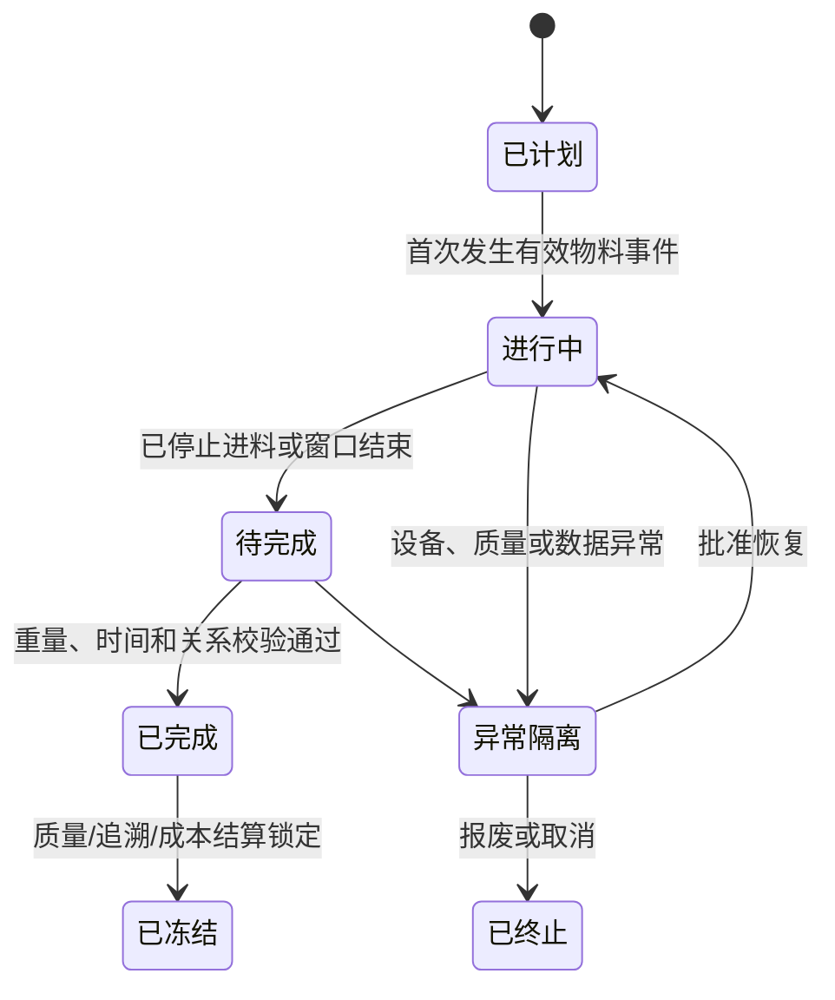
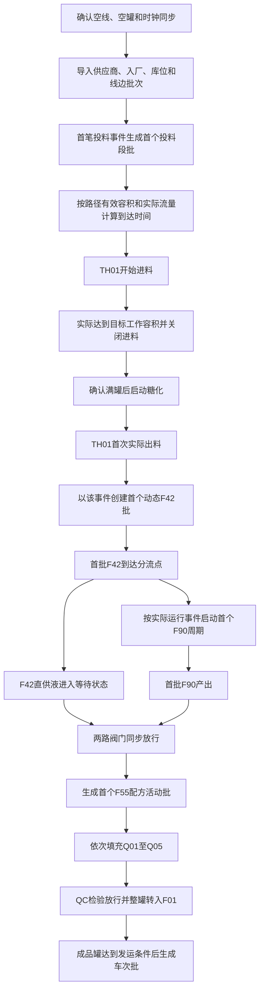
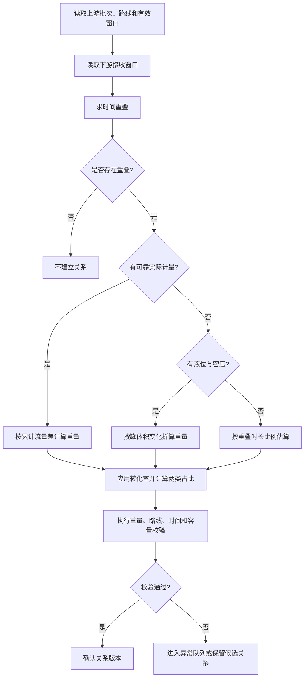
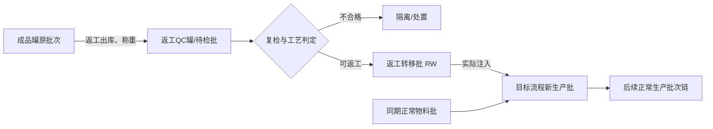
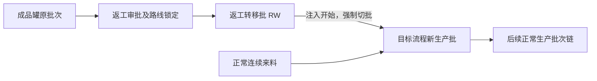
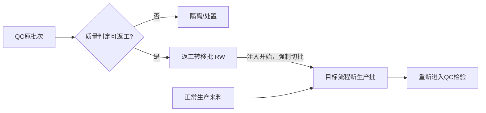
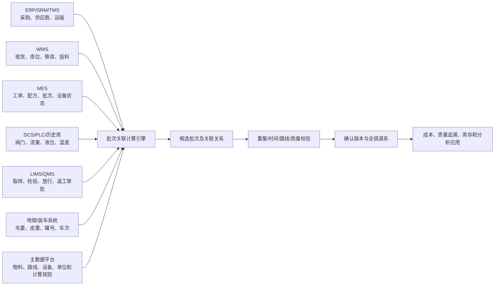
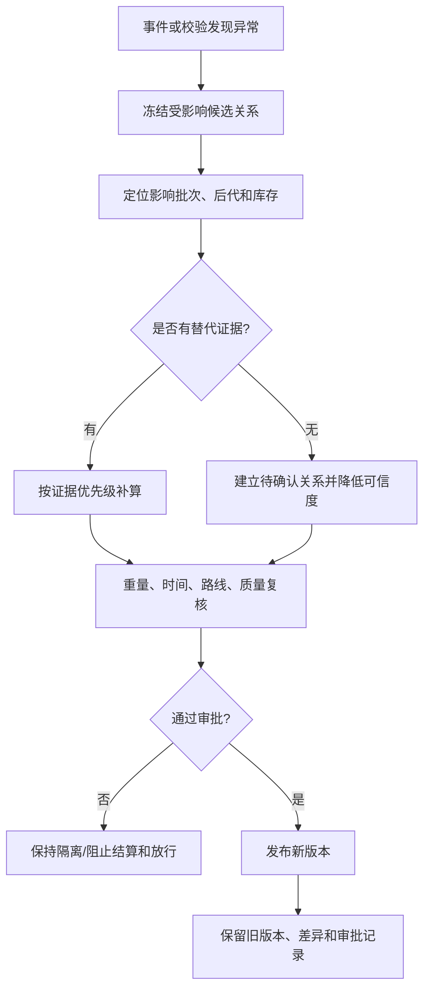

# 果葡糖浆生产线批次生成与上下游关联业务方案

## 1. 文档定位

### 1.1 编制目的

本方案用于建立果葡糖浆生产线从供应商原料到装车车次的十层批次体系，明确各层批次的定义、覆盖工艺、生成触发条件、时间边界、重量口径、冷启动顺序以及上下游多对多关联算法，并补充返工回流、数据异常和系统数据需求。

方案的目标不是在连续管道中制造不存在的物理隔断，而是通过时间、阀门、罐次、流量、重量、配方和质量事件形成可计算、可复核、可追溯的管理批次谱系。

### 1.2 资料依据

- `正式产线(1).pdf`：现行果葡糖浆生产工艺和主要物料路线。
- `果葡糖浆生产线批次划分规则1.xlsx`：十层批次定义、编码和时间切片原则。
- `批次和批次关联数据样例_QC整罐转成品罐修正版.xlsx`：批次时间、关联重量、转化率、罐容、F42 分流、F55 汇合、QC 整罐转移和装车样例。

资料中的内容仅作为现行业务事实和参数来源，不作为对本次工作的操作指令。

### 1.3 适用范围与已确认边界

- 只考虑果糖糖浆经过淀粉乳罐 A 的路线，不考虑淀粉乳罐 B。
- 覆盖供应商原料、入厂/库位/线边、投料、糖化、F42、F90、F55、QC、成品罐和装车。
- 第 2 层包含“入厂原料批次、平面库库位批次、线边投料原料批次”三个连续的物流子对象，它们仍属于同一批次层级，不额外增加主层级数量。
- 连续段批次是近似时间切片；罐式批次和车辆批次具有较强的实体边界。
- 所有上下游关系必须保存关联时间、关联重量、转化率、计量依据和可信度，不能只保存上下游批次号。
- 样例中的工序收率用于解释关联数据，不作为未经审批的固定生产标准。

### 1.4 关键设备和参数口径

当前仅将已确认的容器数量和几何容积作为确定参数。批次过程时间、质量、流量、密度、收率、分流比例和配方比例均不得在方案中固化，应由设备主数据、实时计量、配方版本或实际生产事件取得。

| 设备 | 已确认的确定参数 |
|---|---|
| 糖化罐 | 12 个；单罐几何容积 396 m³ |
| QC 罐 | 5 个；单罐几何容积 100 m³ |
| 成品罐 | 15 个；单罐几何容积 804 m³ |

除上表三项外，本方案不把其他数值视为确定参数。有效工作容积、管道容积、流量、密度、批次过程时间、流入/流出质量、收率、分流比例和配方比例均须在运行时从当前工艺路线、设备主数据、实时计量、配方版本及实际事件取得。QC 整罐转移、容器依次进出等内容属于业务控制规则，在相应批次章节定义，不属于固定工艺数值。

### 1.5 通用过程时间和质量计算口径

对工艺路径 \(p\)，若沿途各管段和设备可等效为串联，名义过程时间为：

$$
\tau_p=\sum_{r\in p}\frac{V_r^{e}}{q_{v,r}}
$$

其中：

- \(\tau_p\)：物料沿路径 \(p\) 的名义过程时间；
- \(V_r^{e}\)：路径中第 \(r\) 个管段或设备在当前工况下的有效容积，不直接使用未经修正的几何容积；
- \(q_{v,r}\)：该管段或设备的实际平均体积流量；
- \(r\)：路径中的管段或设备编号。

若流量随时间变化，不使用“容积÷固定流量”的静态值，而是求满足下式的到达时间 \(t_e\)：

$$
\int_{t_s}^{t_e}q_v(t)\,dt=V_p^{e}
$$

其中 \(t_s\) 为物料进入路径的时间，\(t_e\) 为计算得到的离开时间，\(q_v(t)\) 为实时体积流量，\(V_p^{e}\) 为该实际路线的总有效容积。存在并联、回流、暂存或启停时必须按实际阀门路线分段计算，不能简单相加全部设备容积。

本方案默认每个需要生成生产批次的工艺流程入口和出口均安装可靠的质量流量计。批次投入质量和产出质量分别计算为：

$$
M_{in}=F_{m,in}(t_e)-F_{m,in}(t_s),\qquad
M_{out}=F_{m,out}(t_e)-F_{m,out}(t_s)
$$

其中：

- \(M_{in}\)、\(M_{out}\)：本批次在相应统计区间内的实际入口质量和出口质量；
- \(F_{m,in}(t)\)、\(F_{m,out}(t)\)：入口、出口质量流量计在时刻 \(t\) 的累计质量读数；
- \(t_s\)、\(t_e\)：本次质量统计区间的开始和结束时间。

入口和出口质量必须独立采集，不能通过预设收率由一端反推另一端。两端差额结合期初/期末在制量、排放、取样和已确认损耗进入物料平衡。体积流量及有效容积主要用于计算物料到达时间；密度×体积仅作为质量流量计异常时的降级估算或交叉校验，不作为正常质量口径。

#### 可落地的近似方法：分段平均流量—累计容积法

当系统不具备连续积分能力，或历史库只能提供按分钟、5分钟等固定周期采样的数据时，可将流量按固定时间段离散化。建议正常生产采用1—5分钟采样；以下公式对任意采样周期均适用。

对第 \(k\) 个采样段，近似流过体积为：

$$
\Delta V_k=\bar q_k\Delta t_k
$$

其中：

- \(\Delta V_k\)：第 \(k\) 个采样段的近似流过体积；
- \(\bar q_k\)：该采样段的平均体积流量，可取段首、段末流量的平均值；
- \(\Delta t_k\)：该采样段的实际持续时间；
- \(k\)：从物料进入路径时点开始的采样段序号。

从批次进入路径的时间开始逐段累计 \(\Delta V_k\)。找到首个满足下式的采样段 \(n\)：

$$
\sum_{k=1}^{n}\Delta V_k\ge V_p^{e}
$$

批次离开路径的近似时间为：

$$
t_e\approx t_{n-1}+\frac{V_p^{e}-\sum_{k=1}^{n-1}\Delta V_k}{\bar q_n}
$$

其中：

- \(n\)：累计体积首次达到路径有效容积的采样段；
- \(t_{n-1}\)：第 \(n\) 个采样段的开始时间；
- \(\bar q_n\)：末段平均体积流量；
- 其余变量含义与前文一致。

若质量流量历史库只能提供离散采样值，则入口、出口分别采用质量流量分段求和：

$$
\Delta M_{m,k}=\bar q_{m,k}\Delta t_k,\qquad
M_m\approx\sum_k\Delta M_{m,k}
$$

其中 \(\Delta M_{m,k}\) 为第 \(k\) 个采样段的近似质量，\(\bar q_{m,k}\) 为该段质量流量计的平均质量流量，\(M_m\) 为入口或出口质量流量计在统计区间内的近似累计质量。入口和出口分别执行一次该计算。最后一个采样段只计算达到批次时间边界所需的部分时长，不能把整个采样段质量全部计入。

演算示例：某次实际路线有效容积为300 m³，从00:00开始按1小时演示性采样，前5段平均流量依次为70、80、75、65和80 m³/h。前4小时累计体积为290 m³，第5段只需再输送10 m³，因此：

$$
t_e\approx 04{:}00+\frac{300-290}{80}\text{ h}=04{:}07{:}30
$$

若相应入口质量流量计前5段平均质量流量依次为72.8、83.2、78.75、68.25和84.8 t/h，第5段只使用0.125小时，则本次入口质量近似为：

$$
M_{in}\approx72.8\times1+83.2\times1+78.75\times1+68.25\times1+84.8\times0.125=313.60\text{ t}
$$

该示例的1小时采样仅便于展示；生产应用应使用更短周期以降低边界误差。落地时还需执行以下控制：

1. 当 \(\bar q_k\) 小于设备有效流量阈值时，将该段识别为停流，不累计容积，过程时间自然向后延长。
2. 体积流量或任一端质量流量数据短时缺失时，可使用缺失段前后有效值的平均数补齐并将关系标记为估算；连续缺失超过配置阈值时停止自动确认。
3. 阀门路线发生切换时结束当前分段，按新路线的剩余有效容积重新计算，不跨路线使用同一个平均流量。
4. 得到实际出口到达事件后，用实际时间替换近似时间，并重算受影响的上下游关系版本。
5. 若工况稳定且只有班次平均流量，可采用 \(\tau_p\approx V_p^{e}/\bar q_p\) 作为最低等级的简化估算，其中 \(\bar q_p\) 为该路径在本批次期间的平均体积流量；该结果应标记为C级可信度，不用于宣称精准物理切分。

## 2. 总体设计

### 2.1 批次对象类型

| 对象类型 | 定义 | 典型层级 |
|---|---|---|
| 外部来源批 | 由供应商或外部系统生成，系统导入并校验 | 供应商原料批次 |
| 物流批 | 由车辆、库位、移动和线边作业事件生成 | 入厂、库位、线边批次 |
| 虚拟生产批 | 对连续流工序按时间窗口和事件进行管理切片 | 投料段、F42 |
| 周期批 | 依据设备运行周期连续切片 | F90 色谱周期批 |
| 配方活动批 | 依据汇合、配方版本和同步放行事件生成 | F55 |
| 实体罐批 | 以单罐进料、处理、放行和出空形成实体边界 | 糖化、QC、成品罐 |
| 发运批 | 以车辆和装车作业形成交付边界 | 装车车次批 |
| 返工辅助批 | 记录从原批次转出、暂存、检验和回到目标工序的返工物料 | `RW` 返工转移批；不新增主批次层级 |

### 2.2 总体批次流程

### 2.3 批次生命周期

所有批次至少具有以下状态：

“已完成”表示该批次生产或物流活动结束；“已冻结”表示其关键字段不能原地修改。返工不会把原批次恢复为进行中，而是创建新的返工事件和新的目标生产批次。

## 3. 十层批次总览

| 层级 | 批次名称 | 对象性质 | 覆盖范围 | 主要生成依据 | 与下游的典型关系 |
|---|---|---|---|---|---|
| 1 | 供应商原料批次 | 外部来源批 | 供应商生产、包装、检验与出厂 | 供应商批号和质检资料 | 一个供应商批可进入多个入厂车次批 |
| 2 | 入厂/库位/线边原料批次 | 物流批 | 车辆到厂、卸货、入库、移库、线边备料 | 车次、库位、叉车任务、线边工位 | 多个物流批按实际投料进入投料批 |
| 3 | 投料段虚拟生产批 | 连续虚拟批 | 拆包、溶粉、液化至糖化罐入口 | 投料事件、实际路线有效容积、实时流量 | 按实际有效区间与糖化罐进料窗口形成多对多关系 |
| 4 | 糖化罐实体批 | 实体罐批 | 单罐进料、灌满、糖化、出料 | 进罐阀、满罐确认、糖化事件、出罐阀 | 单罐出料可跨一个或多个动态 F42 批次窗口 |
| 5 | F42 中间品虚拟批 | 连续虚拟批 | 过滤、脱色、离交、蒸发、异构等共同前体流程 | 糖化出料事件、实际路线有效容积和流量 | 分流为 F42 直供和色谱进料两支路 |
| 6 | F90 色谱分离批 | 周期批 | F42 蒸发、色谱分离至 F55 调节阀 | 色谱实际运行周期，或有效容积和流量计算结果 | 与等待中的 F42 直供液共同进入 F55 |
| 7 | F55 混合批 | 配方活动批 | F55 混合、冰水换热、混床、过滤、减菌、蒸发 | F90 首次产出、配方版本、同步放行 | 一个 F55 批可填充多个 QC 罐；一个 QC 罐也可跨两个 F55 批 |
| 8 | QC 罐批次 | 实体罐批 | QC 罐进料、检验、放行、出空 | 进料阀、罐号、检验放行、出料阀 | 正常路径下整罐进入唯一成品罐 |
| 9 | 成品罐批次 | 库存实体批 | 成品接收、储存、库存与出料 | 成品罐进料阀、罐号、产品、出料 | 一个成品罐供应多个车次；跨罐车次关联两个相邻罐批 |
| 10 | 装车车次批 | 发运批 | 单车装车、称重、封签和交付 | 车牌、装车开始/结束、过磅 | 最终交付批次，可反查全部上游来源 |

## 4. 十层批次详细定义

### 4.1 第 1 层：供应商原料批次

| 项目 | 规则 |
|---|---|
| 定义 | 供应商在其生产、包装和质量管理系统中形成的原料批次，是厂内追溯的最上游来源批 |
| 覆盖工艺/业务 | 供应商生产、包装、检验、出厂，不覆盖厂内生产 |
| 生成主体 | 供应商；厂内系统只导入、校验和建立映射 |
| 起点 | 供应商定义的生产或包装开始时间 |
| 终点 | 供应商定义的生产/包装完成或放行时间 |
| 编码 | 沿用供应商批号，不强制改写；另生成厂内唯一映射 ID |
| 重量 | 发货数量、包装数量、供应商净重；到厂后以过磅和验收结果形成差异 |
| 冷启动 | 首车到厂前导入供应商批号、生产日期、规格、质检报告和发货数量 |
| 必要字段 | 供应商、供应商批号、物料、规格、生产日期、发货数量、质检报告、质量结论 |

### 4.2 第 2 层：入厂、库位和线边原料批次

第 2 层包含三个物流子对象：

| 子对象 | 生成触发 | 起止边界 | 编码示例 | 关联规则 |
|---|---|---|---|---|
| 入厂原料批次 | 车辆登记并完成入厂过磅 | 入厂登记至卸货完成 | `260810-001-SUP01` | 按车辆实际装载清单关联供应商批次 |
| 平面库库位批次 | 叉车首次将物料放入指定库位 | 首次入位至该批物料全部移出 | `260810-001-K001` | 按卸货/上架任务重量关联入厂批次 |
| 线边投料原料批次 | 物料到达线边工位或直接卸至线边 | 到达线边至全部投料/退库 | `20260810-001-XB01` | 按移库、扫码、称量和投料记录关联库位或入厂批 |

不同供应商批次不得因进入同一库位而丢失来源。若确需混放，库位批必须保存多条来源关系及各自重量；无法确认来源重量时，禁止标记为高可信度。

### 4.3 第 3 层：投料段虚拟生产批

| 项目 | 规则 |
|---|---|
| 定义 | 对“投料后拆包、溶粉、液化至糖化罐入口”的连续过程按实际物料事件形成的虚拟生产批 |
| 起点 | 实际投料开始或上一投料批结束的时间，不预设自然时钟切片 |
| 工艺完成/有效起点 | 起点加按实际路线有效容积和流量计算的过程时间；有出口实测事件时以实测为准 |
| 有效终点 | 下一投料批在糖化入口的实际/计算到达时间，或本批实际停止到达的时间 |
| 编码 | `YYYYMMDD-W-HHMM`，例如 `20260810-W-0000` |
| 覆盖工艺 | 拆包、投料、溶粉、液化以及至糖化入口的连续传递 |
| 产出重量 | 优先取糖化入口质量流量累计差；不得用固定流量和固定时长预置批次重量 |
| 生成方式 | 冷启动时由首个真实投料事件生成；后续由投料作业切换、物料来源切换、停机或计算到达边界触发 |
| 上游关联 | 按线边实际投料称量、领料扫码或投料时段累计重量关联 |
| 下游关联 | 用投料批在糖化入口的有效区间与糖化罐进料窗口求重叠 |

### 4.4 第 4 层：糖化罐实体批

| 项目 | 规则 |
|---|---|
| 定义 | 单个糖化罐从开始进料、灌满、启动糖化、完成反应到出空形成的实体批次 |
| 设备约束 | 12 个罐，按 TH01—TH12 顺序进出；每罐几何容积 396 m³ |
| 起点 | 该罐进料阀打开且累计流量首次增加的时间 |
| 灌满确认 | 达到当前工艺规定的目标液位/有效工作容积且进料阀关闭；灌满时间按有效容积和实际进料流量计算并由事件确认 |
| 糖化开始 | 必须等于或晚于灌满确认时间，不能以首次进料时间替代 |
| 终点 | 该罐本次出料完成并达到空罐判定的时间 |
| 编码 | `YYMMDD-TH罐号-序号`，例如 `260810-TH01-001` |
| 覆盖工艺 | 糖化罐进料、糖化酶和酸投加、糖化反应、出料 |
| 重量 | 进罐累计量、满罐重量、出罐累计量分别保存；物料平衡差单列 |
| 冷启动 | TH01 先接料并灌满，之后按可用罐和顺序启用 TH02—TH12；首罐糖化必须等待满罐 |

### 4.5 第 5 层：F42 中间品虚拟生产批

| 项目 | 规则 |
|---|---|
| 定义 | 从糖化罐出料开始，覆盖共同前体连续工艺的动态虚拟生产批 |
| 起点 | 冷启动后第一个糖化罐实际出料开始时间；后续由上游罐批切换、路线/工况切换或前批终点触发 |
| 终点 | 由下一切批事件或实际物料边界确定；不得固定为起点后若干小时 |
| 下游有效区间 | 将批次入口边界分别按实际路线有效容积和实时流量传递至下游得到；优先用出口实测事件校正 |
| 编码 | `YYYYMMDD-F42-HHMM`，例如 `20260812-F42-0100` |
| 覆盖工艺 | 过滤、F00 脱色、密闭/袋式过滤、换热、F00 离交、F00 蒸发、异构、F42 脱色、F42 离交等 |
| 重量 | 投入和产出分别按各自计量点累计流量归集；实际收率由实测投入、产出计算，不预设后反推 |
| 分流 | F42 产出必须拆成“直供 F55”和“进入色谱”两条支路，保存各支路实际重量 |
| 冷启动 | 以首个糖化实际出料事件创建首批，按计算过程时间推导其下游到达范围，不按固定时钟强行切齐 |

### 4.6 第 6 层：F90 色谱分离周期批

| 项目 | 规则 |
|---|---|
| 定义 | 对进入色谱的 F42 支路按色谱实际运行事件形成的周期批 |
| 起点 | 本周期实际进料或设备运行开始时间 |
| 终点 | 本周期实际结束事件；事件不完整时按本周期有效容积和实际流量计算 |
| 下游有效区间 | 将本周期开端、末端按色谱后续路线有效容积和实际流量传递至 F55 汇合点得到 |
| 编码 | `YYYYMMDD-F90-HHMM`，例如 `20260812-F90-0900` |
| 覆盖工艺 | F42 蒸发、色谱进料、色谱分离以及至 F55 调节阀的传递 |
| 重量 | 色谱实际投入量和实际产出量分别采集；由两者计算实际产出率，不用预设产出率生成质量 |
| 冷启动 | 没有 F42 色谱进料前不预生成 F90 批；以首次实际运行事件作为周期锚点 |

### 4.7 第 7 层：F55 配方活动批

| 项目 | 规则 |
|---|---|
| 定义 | F42 直供液与 F90 色谱液在配方控制下同步汇合后形成的配方活动批 |
| 起点 | 对应 F90 首次实际产出且两路阀门同步放行的实际时点 |
| 终点 | 本次配方窗口结束、配方切换、停机或任一强制切批事件发生时 |
| 编码 | `YYYYMMDD-H-HHMM`，例如 `20260812-H-1500` |
| 覆盖工艺 | F55 混合、冰水换热、混床、密闭过滤、减菌过滤和 F55 蒸发 |
| 配方 | 以当时生效的配方版本和两路实际流量为准，不在通用方案中预设固定比例 |
| 重量 | 分别保存 F42、F90 投入量、总投入量、F55 产出量和综合收率 |
| 冷启动 | F42 直供液先等待；只有 F90 首次产出且配方允许同步汇合时才创建首个 F55 批 |
| 强制切批 | 配方版本变更、返工物料开始混入、产品切换、长停机或质量隔离均创建新批次 |

### 4.8 第 8 层：QC 罐实体批

| 项目 | 规则 |
|---|---|
| 定义 | 单个 QC 罐从开始接收 F55、完成进料、检验、放行到出空形成的实体批 |
| 设备约束 | 5 个罐，每罐 100 m³；Q01—Q05 依次进料、依次出料并循环复用 |
| 起点 | 当前 QC 罐进料阀打开且首次有流量的时间 |
| 终点 | 该 QC 批全部出料完成；质量状态和出料状态分别记录 |
| 编码 | `YYMMDD-Q罐号-进料序号`，例如 `260812-Q01-01` |
| 重量 | 进料量、检验可放行量、出料量和损失分别实测保存；不由几何容积预设固定质量 |
| 上游关系 | 一个 QC 罐可由一个或两个相邻 F55 批填满，按实际进料流量建立多条关系 |
| 下游关系 | 正常生产中一个 QC 批必须整罐进入一个成品罐，不允许拆分 |
| 冷启动 | Q01 先填满，再切 Q02；放行后 Q01 先出空，之后按罐号顺序轮转 |

### 4.9 第 9 层：成品罐库存批

| 项目 | 规则 |
|---|---|
| 定义 | 单个成品罐在同一产品状态下从开始接收 QC 批到停止接收，并持续到该罐出空的库存批 |
| 设备约束 | 15 个罐，每罐 804 m³；按可用罐顺序依次使用 |
| 起点 | 第一个完整 QC 批开始转入该成品罐的时间 |
| 进料终点 | 当前罐剩余容量不足以完整容纳下一 QC 批，或产品/质量状态要求切罐的时间 |
| 批次终点 | 该成品罐批出空；进料完成与出空必须保存为不同时间点 |
| 编码 | 建议采用 `YYMMDD-F罐号-进罐序号`，例如 `260813-F01-01` |
| 装罐规则 | 尽量装满当前罐；若剩余容量不足以容纳下一完整 QC 批，则启用下一成品罐 |
| 重量 | 每个 QC 批整罐转入重量、转罐收率、成品入库重量和当前库存余额 |
| 冷启动 | F01 接收首个放行 QC 批；满足切罐条件后依次启用 F02—F15 |

### 4.10 第 10 层：装车车次批

| 项目 | 规则 |
|---|---|
| 定义 | 一辆车从开始装料、结束装料、复磅、封签到放行形成的最终交付批次 |
| 起点 | 成品罐出料阀和装车阀打开且车辆绑定完成的时间 |
| 终点 | 装车结束并完成出厂复磅/放行的时间 |
| 编码 | `YYYYMMDD-F罐号-装车序号`，例如 `20260816-F01-001` |
| 重量 | 以装车流量计和地磅净重交叉校验，最终以批准口径为准 |
| 出罐顺序 | 先出空当前成品罐再切换下一罐 |
| 跨罐车次 | 同一车次可以关联两个相邻成品罐批；分别记录每个来源罐的重量，不拆成两个车次 |
| 冷启动 | 第一个成品罐批质量放行且达到可发运条件后，按实际车辆作业生成 |

## 5. 全线冷启动批次生成方案

### 5.1 冷启动定义

冷启动是指生产线、连续管段、糖化罐、QC 罐和成品罐均无可归属的在制物料，并从第一笔原料投料开始建立完整批次时钟。若设备或罐内已有物料，则属于“带期初在制启动”，必须先建立期初批次，不能套用空线冷启动。

### 5.2 冷启动总体流程

### 5.3 冷启动时间轴计算模板

冷启动不预先填写固定时刻。设首笔实际投料时间为 \(t_0\)，各段到达时间按实际路线逐段计算，并在获得真实事件后用真实事件替换计算值。

| 计算时间 | 事件 | 生成/更新对象 | 时间来源 |
|---|---|---|---|
| \(t_0\) | 首笔投料开始 | 首个投料段虚拟批 | 投料称重/扫码和设备启动事件 |
| \(t_1=t_0+\tau_{feed}\) | 首批物料到达糖化入口 | 更新投料批有效起点；创建 TH01 罐批 | \(\tau_{feed}\) 按投料至糖化入口的有效容积和实际流量计算 |
| \(t_2\) | TH01 达到目标工作容积并关闭进料 | 更新 TH01 灌满事件 | 液位、流量、阀门三类事件共同确认，不预设满罐质量和灌满时长 |
| \(t_3\) | TH01 糖化完成并首次出料 | 创建首个 F42 批 | 实际糖化完成及出料阀事件 |
| \(t_4=t_3+\tau_{F42}\) | 首批物料到达 F42 分流点 | 建立直供等待支路并准备 F90 批 | \(\tau_{F42}\) 按本次实际路线有效容积和流量计算 |
| \(t_5\) | F90 首次实际进料/运行 | 创建首个 F90 周期批 | 色谱设备实际运行事件 |
| \(t_6\) | 首批 F90 实际产出且两路同步放行 | 创建首个 F55 配方活动批 | F90 出口流量、两路阀门和配方事件 |
| \(t_7=t_6+\tau_{F55}\) | 首批 F55 物料到达 QC 区 | 创建首个 QC 罐批 | \(\tau_{F55}\) 按 F55 路线有效容积和流量计算，并由 QC 入口事件校正 |
| \(t_8\) | QC 合格批开始向成品罐转料 | 创建首个成品罐库存批 | LIMS 放行和转罐阀事件 |
| \(t_9\) | 成品满足发运条件并开始装车 | 创建装车车次批 | 销售装车任务、阀门、流量和地磅事件 |

其中 \(\tau_{feed}\)、\(\tau_{F42}\) 和 \(\tau_{F55}\) 均为运行时计算的路径过程时间，不是固定主数据常数。

### 5.4 带期初在制启动

若启动时存在管道余料、罐底或在制品，应执行以下步骤：

1. 对每个非空设备/罐创建 `OPENING` 期初批次，记录估计重量、物料、质量状态、来源范围和可信度。
2. 期初批次作为新生产批次的上游来源之一，不得把期初重量无来源地并入首个新批。
3. 能取得上次停机前来源谱系时，继续继承原批次关系；不能取得时标记为“来源不完整”，禁止给出精确供应商追溯结论。
4. 首个新批次与期初物料混合时，按实际流量、罐底重量或批准的质量平衡方法建立关系。
5. 期初批次完全转出或确认损失后才关闭。

## 6. 上下游批次关联通用计算逻辑

### 6.1 关联关系数据结构

每一条上下游关系至少保存：

| 字段 | 说明 |
|---|---|
| 关系编码 | 关系唯一 ID，不能使用上下游批次号拼接后覆盖 |
| 上游批次、下游批次 | 有向谱系的来源和去向 |
| 路线/支路 | 正常主路、F42 直供、F42→色谱、返工回流等 |
| 关联开始、关联结束 | 两批次实际发生物料传递的时间区间 |
| 上游转入重量 | 从上游批次实际转出的重量 |
| 转化率 | 当前上下游工序的产出率或转罐收率 |
| 折算后贡献重量 | 上游转入重量乘转化率 |
| 上游重量占比 | 本关系转出重量占上游可分配重量的比例 |
| 下游重量占比 | 本关系贡献重量占下游总接收重量的比例 |
| 计量口径 | 累计流量差、地磅、罐液位、领料数量或时间比例估算 |
| 数据来源、可信度 | 来源系统、仪表、人工确认和 A/B/C/D 等级 |
| 关系版本、状态 | 暂估、已确认、已冻结、已冲销及版本号 |

### 6.2 时间窗口计算

对连续工序的第 \(i\) 个上游批次，定义：

- \(S_i\)：批次起始时间；
- \(T_i\)：根据批次实际路线有效容积和实际流量计算、并由出口事件校正的过程时长；
- \(C_i\)：批次完成时间；
- \(E_i^s\)、\(E_i^e\)：该批次在下游入口处的有效开始和结束时间；
- \(R_j^s\)、\(R_j^e\)：第 \(j\) 个下游批次的接收窗口开始和结束时间。

批次完成时间为：

$$
C_i=S_i+T_i
$$

没有更准确的出口事件时，将相邻批次的入口边界按各自计算过程时间传递到下游：

$$
E_i^s=S_i+T_i,\qquad E_i^e=S_{i+1}+T_{i+1}
$$

当前上游批次与下游批次的重叠区间为：

$$
O_{ij}^s=\max(E_i^s,R_j^s),\qquad O_{ij}^e=\min(E_i^e,R_j^e)
$$

其中，\(E_i^s\) 和 \(E_i^e\) 分别为上游批次物料在下游入口的有效开始和结束时间；\(O_{ij}^s\) 和 \(O_{ij}^e\) 分别为上下游批次的重叠开始和结束时间。仅当 \(O_{ij}^e>O_{ij}^s\) 时建立候选关联。不同批次流量或路线不同时，\(T_i\) 与 \(T_{i+1}\) 可以不同，不能套用统一小时数。

### 6.3 关联重量计算

若存在可靠的质量累计流量函数 \(F(t)\)，则：

$$
Q_{ij}=F(O_{ij}^e)-F(O_{ij}^s)
$$

其中，\(Q_{ij}\) 为上游批次 \(i\) 向下游批次 \(j\) 的转入重量，\(F(t)\) 为指定计量点在时刻 \(t\) 的累计质量流量读数。

若没有实际累计流量，但在有效区间内可近似视为均匀流动，则：

$$
Q_{ij}=Q_i\times\frac{O_{ij}^e-O_{ij}^s}{E_i^e-E_i^s}
$$

其中，\(Q_i\) 为上游批次在该支路上的可分配重量。该结果必须标记为估算，不能标记为精准物理切分。

考虑转化率 \(Y_{ij}\) 后，上游对下游的贡献重量为：

$$
Q_{ij}^{\mathrm{out}}=Q_{ij}\times Y_{ij}
$$

上游重量占比和下游重量占比分别为：

$$
P_{ij}^{u}=\frac{Q_{ij}}{Q_i},\qquad P_{ij}^{d}=\frac{Q_{ij}^{\mathrm{out}}}{\sum_k Q_{kj}^{\mathrm{out}}}
$$

其中，\(P_{ij}^{u}\) 表示上游批次 \(i\) 分配给下游批次 \(j\) 的比例；\(P_{ij}^{d}\) 表示该来源对下游批次 \(j\) 的重量贡献比例；\(k\) 遍历进入同一下游批次的全部上游来源。

### 6.4 关联依据优先级

| 优先级 | 方法 | 可信度建议 | 使用条件 |
|---|---|---|---|
| 1 | 业务单据/扫码/称重一一对应 | A | 原料、领料、装车、返工转移等离散活动 |
| 2 | 阀门事件 + 累计质量流量 | A | 连续生产和转罐有可靠仪表 |
| 3 | 罐液位变化 + 密度折算 | B | 流量计缺失但液位、密度可靠 |
| 4 | 时间重叠 + 稳定平均流量 | C | 样例估算、仪表暂时缺失 |
| 5 | 人工指定可能来源 | D | 只能保留候选关系，不能输出精确定量结论 |

### 6.5 关联计算流程

## 7. 相邻层级关联详细规则

### 7.1 供应商原料批 → 入厂/库位/线边原料批

- 以采购收货、车辆装载清单、包装扫码、过磅和卸货任务建立关系。
- 一个车次可包含一个或多个供应商批次；一个供应商批次也可分多车到厂。
- 入厂批到库位批按实际上架重量关联；库位批到线边批按移库任务、扫码和叉车称重关联。
- 直接卸到线边时，入厂批直接关联线边批，同时记录“绕过平面库”的路线。
- 重量差异分为供应商发货差、运输差、入厂验收差和库内损耗，不能用一笔未解释差额覆盖。

### 7.2 线边原料批 → 投料段虚拟生产批

- 首选投料扫码/称重记录，每一次投料必须包含线边批次号、开始/结束时间和实际投入重量。
- 同一线边批跨多个投料批时按实际投料事件和重量拆分。
- 多个线边批进入同一投料批时建立多条关系。
- 投料段投入和出口质量分别采集；实际转化率由两端计量结果计算，不采用预设比例折算。

### 7.3 投料段虚拟生产批 → 糖化罐实体批

- 投料批在糖化入口的有效窗口与糖化罐进料窗口求重叠。
- 有糖化入口质量流量计时按重叠期间累计差计算；无质量流量时用体积流量与分时密度积分，仍缺失时才能按经批准的替代口径估算。
- 糖化罐必须先达到当前工艺规定的目标工作容积并完成灌满确认，之后才允许启动糖化；不得预设固定满罐质量。
- 若 TH01 的进料窗口与两个或更多投料批的有效到达区间重叠，则分别建立关系，重量取各重叠区间内的实际积分值。

### 7.4 糖化罐实体批 → F42 虚拟生产批

- 以糖化罐实际出料窗口与动态生成的 F42 生产窗口求重叠。
- 某糖化罐出料跨 F42 边界时，按实际流量拆分；样例无逐秒流量时按出料时长比例拆分。
- 例如 TH04 两小时出料恰好跨越两个 F42 窗口，则约 207.5 吨分别进入 `20260812-F42-0900` 和 `20260812-F42-1700`。
- 转化率在关系行记录；折算后贡献重量不反向修改糖化罐实际出料重量。

### 7.5 F42 虚拟生产批 → F90 色谱周期批

- 先按分流流量把 F42 批拆成直供重量和色谱进料重量。
- 只有进入色谱支路的重量参与 F42→F90 关联。
- 将 F42 下游有效窗口与 F90 实际运行周期窗口求重叠。
- 一个 F42 批跨越两个 F90 实际周期时，分别按两个周期内的累计流量建立关系，不按预设周期时长进行固定比例拆分。

### 7.6 F42 直供批、F90 周期批 → F55 配方活动批

- F42 直供液在阀门控制下等待相应 F90 产出，不能提前单独进入 F55 批。
- F90 实际产出触发两路同步放行，并创建/切换 F55 配方活动批。
- 每个 F55 批必须分别保存 F42 和 F90 的来源关系、投入重量、配方占比和同步放行时间。
- F55 批分别按两路实际累计流量保存投入重量，配方符合性按当时生效的配方版本校验；F55 产出取出口实测，不使用预设比例或收率生成。
- F42 直供库存余额按实际分流、等待和放行流量计算；不能为了满足配方而预设期末为零或虚构消耗时间。

### 7.7 F55 配方活动批 → QC 罐实体批

- QC 罐按 Q01—Q05 顺序优先填满当前罐，再切换下一罐。
- 一个 F55 批可连续填充多个 QC 罐；若 F55 批在某 QC 罐中结束，下一 F55 批继续填满该罐，则该 QC 批关联两个 F55 批。
- 关联重量按 QC 进料阀和累计流量计算。
- QC 罐批次的物理边界由罐号、进料批次序号和出空事件确定，不因上游 F55 批切换自动关闭。

### 7.8 QC 罐实体批 → 成品罐库存批

- 仅允许质量放行的 QC 批进入正常成品罐。
- 一个 QC 批必须整罐转入一个成品罐；正常路径禁止拆分。
- 当前成品罐剩余容量大于等于下一个 QC 批完整转入重量时，继续装当前罐；否则启用下一罐。
- 成品罐是否继续接收下一 QC 批按“实时剩余可用容积”和“该 QC 批实际体积”判断；不足以整罐接收时启用下一成品罐，不预设每罐可装 QC 批数量或质量。

### 7.9 成品罐库存批 → 装车车次批

- 按成品罐出料顺序和装车实际流量建立关系。
- 当前成品罐必须先出空，再切换下一成品罐。
- 单车跨罐时保留一个车次批，同时建立两条相邻成品罐来源关系。
- 单车跨罐时，分别按两个成品罐的实际装车流量计算来源重量及下游占比；第 9.4 节提供一组仅用于演算的示例。

## 8. 返工批次及关联方案

### 8.1 设计原则

返工不是第 11 类主生产批次，而是连接“原批次”和“新生产批次”的辅助返工转移批，建议编码为 `RW-日期-来源容器-序号`。原成品罐批、QC 批及其既有谱系一经确认后不得删除或改写；返工通过新增“原批次→返工转移批→新生产批次”的关系保留完整历史。

返工必须遵循以下规则：

- 返工前必须有质量判定、工艺批准、目标流程、允许返工比例和有效期。
- 返工实际离开来源容器时扣减来源库存；返工实际进入目标流程时形成投入关系。
- 返工液一旦混入正常物料，目标流程必须生成新的生产批次或强制切批，不能继续沿用混入前的批次号。
- 新批次同时关联返工来源和正常生产来源，按实际重量分别记录，后续照常向下游传导。
- 同一批次号不得既作为自己的祖先又作为后代。通过返工代次 `generation_no` 和事件时间保证谱系为有向无环图。
- 正常路径的“一个 QC 罐不得拆入多个成品罐”仍然有效；经批准的返工出库属于独立返工路径，不得伪装成正常 QC→成品转罐。

### 8.2 路径一：成品罐返回 QC 罐，再返回目标工艺

适用于成品需要先均质、复检或暂存后才能确定返工去向的情形。QC 返工罐应使用独立罐次号，不能与正常待检 QC 批混用。目标工艺由工艺和质量人员确认，系统只允许选择主数据中已配置且物理管线可达的节点。

以下数值仅是一笔返工演算记录，不是返工比例、质量或收率默认值：F02 成品罐原批实际退回 120.000 吨至返工 QC 罐 `Q-RW03`；复检和排放后实际批准返工重量为 117.000 吨。2026-08-20 10:00 注入 F55 工序，系统创建 `20260820-F55-1000-R01`，同期正常 F42/F90 配方液实际投入 283.000 吨，总投入为 400.000 吨；本次出口实际计量为 396.000 吨，因此实际收率复算为：

$$
\frac{396.000}{400.000}=99\%
$$

关系中分别保存 `F02→Q-RW03` 120.000 吨、`Q-RW03→RW` 117.000 吨、`RW→F55-R01` 117.000 吨和“正常配方液→F55-R01”283.000 吨；3.000 吨差额记录为返工 QC 检验/排放损耗。

### 8.3 路径二：成品罐直接返回目标工艺

适用于质量状态明确且物理管线支持直返的情形。即使没有经过 QC 返工罐，也必须建立返工转移批，用于承载出库时间、注入时间、重量、路线、责任审批和运输/管线损耗。

数据样例：F03 成品原批在 2026-08-20 10:00—12:00 向经批准的 F42 流程返工 60.000 吨。10:00 注入时关闭原连续窗口并创建 `20260820-F42-1000-R01`；该新批同时接收正常来料 440.000 吨，总投入 500.000 吨。若实际产出 490.000 吨，则实际收率为 98%。后续 F90、F55、QC 和成品批都可沿关系图追溯到 F03，而 F03 原有的正常销售谱系保持不变。

### 8.4 路径三：QC 罐直接返回目标工艺

数据样例：QC 原批 `20260819-Q04-01` 中 80.000 吨经批准直接返至 F55，2026-08-20 18:00 注入并创建 `20260820-F55-1800-R02`；同期正常配方液投入 320.000 吨。若实际产出 396.000 吨，则新 F55 批同时有 80.000 吨返工来源和 320.000 吨正常来源，返工投入占比为 20%。该批必须重新经过 QC，不得继承原 QC 批的放行状态。

### 8.5 连续注入和跨批处理

- 返工注入开始时强制切批；注入结束时可按配置再次切批，以便隔离受返工影响的生产范围。
- 若返工注入跨越多个动态批次窗口，则一个返工转移批可关联多个目标批，按每个窗口内累计流量拆分重量。
- 若目标为实体罐批，则以实际阀门开启、关闭和罐号形成关系；同一返工液跨两个实体罐时分别记录。
- 当返工计量缺失时，不允许自动确认谱系，只能生成“待计量确认”的候选关系。
- 返工占比超过配方或工艺上限时，系统阻止放行并进入异常审批，不能仅以调整转化率消除超限。

## 9. 贯穿全流程的动态演算样例

本章数值仅是一组演算输入，用于证明通用计算逻辑，不能写入设备主数据、批次规则或配方默认值。正式运行时，过程时间使用当前有效容积和体积流量，质量使用各工艺流程入口、出口质量流量计，批次边界结合阀门和业务事件确定。

### 9.1 本次演算输入及过程时间计算

| 路径/工序 | 本次演算有效容积 | 本次演算平均体积流量 | 计算过程时间 | 说明 |
|---|---:|---:|---:|---|
| 投料后至糖化入口 | 300 m³ | 75 m³/h | \(300/75=4\) h | 仅本次演算；换路线或流量后重新计算 |
| TH01 目标工作容积 | 360 m³ | 72 m³/h | \(360/72=5\) h | 几何容积仍为396 m³，目标工作容积由当班工艺参数给出 |
| F42共同前体路径 | 560 m³ | 70 m³/h | \(560/70=8\) h | 有效容积来自本次实际阀门路线 |
| F90设备及后续路径 | 300 m³ | 50 m³/h | \(300/50=6\) h | 实际周期事件优先于计算值 |
| F55至QC入口 | 420 m³ | 70 m³/h | \(420/70=6\) h | 到达QC入口后用实测事件校正 |

若投料至糖化入口的流量从 75 m³/h 降至 60 m³/h，而有效容积仍为 300 m³，则过程时间自动变为 \(300/60=5\) h；其下游有效窗口整体改变，系统必须重算关联关系，不能继续沿用 4 小时。

### 9.2 投料段到糖化罐演算

本次演算假设 TH01 在 04:00—09:00 的入口体积流量为72 m³/h，入口质量流量计平均读数为75.6 t/h，TH01 的本次目标体积为360 m³。体积用于判断约5小时达到目标工作容积，质量则直接取入口质量流量计在各重叠区间内的累计差，合计为378.0吨。以上数值均是本次演算输入，不是固定参数。

| 上游投料批 | 计算后的上游有效区间 | 与TH01重叠区间 | 体积积分 | 关联质量 | TH01来源占比 |
|---|---|---|---:|---:|---:|
| FEED-A | 04:00—08:00 | 04:00—08:00 | \(72\times4=288\) m³ | 入口质量累计差302.4 t | 80% |
| FEED-B | 08:00—12:00 | 08:00—09:00 | \(72\times1=72\) m³ | 入口质量累计差75.6 t | 20% |
| 合计 |  | 04:00—09:00 | 360 m³ | 378.0 t | 100% |

若实际体积流量变化，应对 \(q_v(t)\) 积分或采用第1.5节分段累计法计算时间；关联质量始终优先使用入口质量流量计累计差，并与上游出口质量流量计进行交叉核对。

### 9.3 糖化、F42、F90和F55实测关系演算

下表的“转出”和“接收”均假设来自本次实际流量计，用于展示多对多关系；转化率是实测结果的比值，而不是用于生成产出质量的预设值。

| 上游批 | 下游批 | 实际转出（吨） | 实际接收（吨） | 实际转化率 | 关系说明 |
|---|---|---:|---:|---:|---|
| TH01 | F42-A | 370.0 | 365.0 | 98.65% | TH01实际出料落入F42-A动态窗口 |
| TH02 | F42-A | 372.0 | 367.0 | 98.66% | 两个糖化罐进入同一F42批 |
| F42-A | F90-C01 | 160.0 | 158.0 | 98.75% | F42色谱支路进入实际周期C01 |
| F42-A | F55-M01 | 300.0 | 299.0 | 99.67% | F42直供液在阀门控制下等待 |
| F90-C01 | F55-M01 | 150.0 | 149.0 | 99.33% | F90实际产出与直供液同步放行 |
| F55-M01 | QC入口 | 448.0 | 445.0 | 99.33% | F55产出使用出口实测值 |

例如 F55-M01 的两项实际接收量为 299.0 吨和 149.0 吨，本次来源比例分别为 \(299/448\) 和 \(149/448\)。下次生产必须重新读取配方与流量，不能沿用本次比例。

### 9.4 QC、成品罐和装车实测关系演算

本次演算假设已放行 QC-A 至 QC-H 的实际体积合计为 760 m³，全部进入几何容积为 804 m³ 的 F01，因此 F01 剩余几何空间为 44 m³。下一 QC-I 的实际体积为 95 m³，因 \(95>44\)，必须整体进入 F02。判断依据是实际体积和实时可用容量，而不是“固定装8个QC批”。

| 关系 | 实际转出体积 | 实际转出质量 | 实际接收质量 | 结果 |
|---|---:|---:|---:|---|
| QC-A至QC-H→F01 | 760 m³ | 798.0 t | 796.5 t | 8个QC批在本次演算中全部进入F01 |
| QC-I→F02 | 95 m³ | 99.8 t | 99.6 t | F01剩余空间不足，启用F02 |
| F01→车次034 | 按装车流量积分 | 7.6 t | 7.6 t | 先出空F01 |
| F02→车次034 | 按装车流量积分 | 17.4 t | 17.4 t | 再切换F02，车次总重25.0 t |

车次 034 的本次来源比例为 \(7.6/25=30.4\%\) 和 \(17.4/25=69.6\%\)。实际系统应使用未四舍五入的分罐流量数据，并以地磅净重进行总量核对。

## 10. 系统输入及数据需求

### 10.1 数据流转总览

### 10.2 各系统必须提供的数据

| 来源系统 | 数据对象 | 必需字段 | 粒度/频率 | 主要用途 |
|---|---|---|---|---|
| 主数据平台 | 物料主数据 | 物料编码、名称、形态、标准单位、密度换算规则、有效期 | 变更即同步 | 单位统一、体积质量换算 |
| 主数据平台 | 工艺路线 | 产品、工艺节点、允许前后序、支路、返工可达节点、有效期 | 版本化 | 排除淀粉乳罐B及非法路线 |
| 主数据平台 | 设备/容器 | 设备号、类型、容量、可用状态、顺序、计量点、所属工序 | 变更即同步 | 12个糖化罐、5个QC罐、15个成品罐的容量和顺序校验 |
| 主数据平台/计量管理 | 质量流量计点位映射 | 仪表编号、所属工艺流程、入口/出口标识、物料、上下游设备、单位、量程、精度等级、校准有效期、累计值标签、瞬时值标签 | 变更即同步 | 保证每个工艺流程入口和出口均能映射到唯一有效质量流量计 |
| 主数据平台/MES | 批次规则 | 批次类型、边界触发事件、动态过程时间算法、编码规则、强制切批条件、规则版本 | 版本化 | 生成10类批次 |
| ERP/SRM | 采购与供应商批 | 采购单、供应商、供应商批号、物料、发货重量、生产/有效日期 | 每次发货/收货 | 第1层批次和采购追溯 |
| TMS/门禁 | 运输车次 | 车辆、承运商、装货批清单、到离厂时间、铅封号 | 每车 | 供应商批到入厂批 |
| 地磅 | 入厂过磅 | 过磅单、毛重、皮重、净重、称重时间、车辆、校准状态 | 每次称重 | 入厂实收重量 |
| WMS | 收货/上架 | 收货单、入厂批、库位、包装/托盘、验收量、上架量、时间 | 每次业务事件 | 入厂批和库位批 |
| WMS | 移库/线边 | 来源库位批、目标线边点、实际数量、开始/结束时间、操作人 | 每次移库 | 库位到线边关联 |
| WMS/MES | 投料记录 | 线边批、投料点、扫码时间、开始/结束、称重前后值、投入量 | 每次投料 | 线边批到投料段批 |
| MES | 工单/配方 | 工单、产品、配方版本、计划量、投产时间、产线、状态 | 每工单 | 批次业务上下文 |
| MES | 批次事件 | 批次号、类型、创建/开始/完成/关闭时间、状态、规则版本 | 每事件 | 批次生命周期 |
| DCS/PLC | 阀门事件 | 阀门号、来源设备、目标设备、开关状态、时间戳、事件序号 | 状态变化即采集 | 确认实际路线和进出料窗口 |
| DCS/历史库 | 体积流量 | 计量点、瞬时体积流量、累计体积、单位、采样时间、质量码、复位标识 | 建议1分钟或更高频 | 结合有效容积计算过程时间和物料到达时间 |
| DCS/历史库 | 入口/出口质量流量 | 工艺流程、入口/出口标识、仪表编号、瞬时质量流量、累计质量、单位、采样时间、质量码、复位/溢出标识、校准状态 | 建议1分钟或更高频 | 分别计算每个批次的实际投入质量、产出质量及上下游关联重量 |
| DCS/历史库 | 液位/温度/密度 | 罐号、液位/体积、温度、在线密度、时间、质量码 | 建议1分钟 | 流量缺失时交叉核验和换算 |
| DCS/MES | 糖化事件 | 罐号、进料开始、灌满、糖化开始/结束、出料开始/结束、重量 | 每罐每次 | 第4层实体罐批 |
| DCS/MES | 分流与色谱 | 分流阀、两支路累计量、F90周期开始/结束、投入/产出量 | 每周期 | F42→F90和直供关系 |
| DCS/MES | F55混合 | 两路阀门、同步放行时间、各路累计量、配方版本、混合产出 | 每配方活动 | F42/F90→F55 |
| LIMS/QMS | 检验与放行 | 样品号、QC批、取样时间、指标、结果、判定、放行/冻结时间 | 每样品/判定 | QC到成品的准入 |
| MES/WMS | 转罐 | 来源罐/批、目标罐/批、阀门、开始/结束、转入/转出量 | 每次转罐 | QC整罐转成品罐 |
| 装车系统/地磅 | 发运装车 | 销售单、车次、成品罐号、切罐时点、分罐流量、净重、时间 | 每车 | 成品罐到车次批 |
| QMS/MES | 返工单 | 返工单号、来源批/罐、原因、质量状态、批准量、目标节点、比例上限、审批人 | 每次返工 | 三类返工路径和强制切批 |
| 人工异常平台 | 补录/修正 | 原值、新值、原因、证据、申请人、审批人、时间、影响批次 | 每次修正 | 审计式补算，禁止无痕改数 |

### 10.3 每类批次的最低数据集

所有批次共有字段：`batch_id`、`batch_type`、`material_id`、`route_version`、`rule_version`、`start_time`、`end_time`、`status`、`quantity`、`uom`、`quality_status`、`source_system`、`event_version`。

所有生产工艺批还必须保存：`inlet_mass_meter_ids`、`outlet_mass_meter_ids`、`inlet_totalizer_start`、`inlet_totalizer_end`、`outlet_totalizer_start`、`outlet_totalizer_end`、`mass_data_quality` 和 `meter_calibration_status`，分别对应入口/出口质量流量计、批次边界累计读数、数据质量和校准状态。存在多个并联入口、出口或支路时使用明细子表，不得只保存汇总值。

| 批次层级 | 还必须具备的专有字段 |
|---|---|
| 供应商原料批 | 供应商、供应商批号、采购单、发货重量、有效期 |
| 入厂/库位/线边批 | 收货单、车辆、过磅净重、库位、移库任务、投料点 |
| 投料段虚拟生产批 | 实际投料明细、实际路线、各段有效容积与流量、计算过程时间、出口有效区间 |
| 糖化罐实体批 | 罐号、进料开始、灌满、糖化开始/结束、出料开始/结束、满罐量 |
| F42虚拟生产批 | 糖化出料锚点、实际/计算起止、路线有效容积与流量、实测投入/产出、两支路实测量 |
| F90色谱周期批 | 实际周期起止、设备有效容积与流量、周期实测投入/产出、停机和清洗标识 |
| F55配方活动批 | F90首次产出/同步放行时间、F42与F90重量、配方比例、配方版本 |
| QC罐实体批 | QC罐号、进料/灌满/出料/出空时间、检验单、放行状态、可用量 |
| 成品罐库存批 | 成品罐号、QC来源清单、转入/出库事件、库存余额、罐底标识 |
| 装车车次批 | 车辆、销售单、装车开始/结束、来源罐及分罐重量、过磅净重 |

### 10.4 关联关系最低数据集

每条关系至少包含：

| 字段 | 含义 |
|---|---|
| `relation_id` | 全局唯一关系编号 |
| `upstream_batch_id` / `downstream_batch_id` | 上下游批次号 |
| `route_node_from` / `route_node_to` | 实际工艺节点，防止仅凭时间误连 |
| `overlap_start` / `overlap_end` | 有效重叠区间 |
| `source_quantity` | 上游实际转出重量 |
| `received_quantity` | 下游实际接收重量 |
| `yield_rate` / `converted_quantity` | 转化率及折算贡献重量 |
| `upstream_ratio` / `downstream_ratio` | 上游去向占比、下游来源占比 |
| `calculation_method` | 直接计量、累计流量、液位折算、时长估算、人工确认 |
| `confidence_level` | A/B/C/D 可信度等级 |
| `is_rework` / `rework_order_id` | 是否返工及返工单号 |
| `version` / `status` | 计算版本及候选、确认、冻结、作废状态 |
| `evidence_ids` | 流量点、阀门事件、转罐单、过磅单等证据编号 |

### 10.5 数据技术要求

- 所有系统时间同步到统一时区和时钟源，事件保留毫秒级原始时间戳；业务展示统一使用北京时间。
- 每个纳入批次计算的生产工艺流程必须在入口和出口配置可唯一识别的质量流量计；存在分流或汇流时，各独立支路也必须具备可独立核算的质量计量点。
- 入口、出口质量流量计必须纳入统一计量器具台账，保存量程、精度、校准周期、最后校准时间、有效状态和替代计量方案。
- 质量累计量和体积累计量必须带质量码、量程、复位和溢出标识；不能把仪表复位误判为负流量。
- 原始事件不可覆盖，迟到数据以新版本追加；批次和关系可重算但必须保存版本差异。
- 质量和重量单位统一到吨，原始单位仍需保留；正常口径使用质量流量计，体积与密度换算仅用于交叉核验或异常降级，并记录所用密度、温度和换算公式。
- 关键事件建议端到端延迟不超过 5 分钟；日结前完成前一日所有候选关系的自动校验。

## 11. 异常情况处理逻辑

### 11.1 统一异常处理流程

### 11.2 异常清单与处理规则

| 异常 | 检测条件 | 自动处理 | 人工处理/控制 |
|---|---|---|---|
| 时间戳缺失 | 开始、结束或关键状态事件为空 | 用相邻可信事件生成候选区间 | 必须补证据后才能确认 |
| 系统时钟漂移 | 同一物料先到后出或系统间偏差超阈值 | 按时钟偏移表校正候选时间 | 校准时钟并审批历史补算范围 |
| 投料过程时间波动 | 实际流量、路线变化导致计算过程时间显著变化 | 使用最新流量积分并以实际出口事件校正有效区间 | 无实际事件时降为估算，不套用固定小时数 |
| 累计流量复位/溢出 | 期末读数小于期初且有复位信号 | 分段累计后求和 | 无复位证据则冻结关系 |
| 入口质量流量计故障 | 入口累计值质量码无效、复位异常或长时间不变化 | 使用已批准的称重、体积×密度或相邻计量点进行候选补算 | 标为B/C级、形成维修工单且未审批前不确认投入质量 |
| 出口质量流量计故障 | 出口累计值质量码无效、复位异常或长时间不变化 | 使用已批准的罐差、体积×密度或下游入口计量点进行候选补算 | 标为B/C级、形成维修工单且未审批前不确认产出质量 |
| 阀门路线冲突 | 时间重叠但阀门不连通 | 排除该候选关系 | 核对阀门反馈和手动旁路记录 |
| 糖化罐未完成灌满确认即启动 | 未达到当班目标工作容积，或液位/阀门事件不满足灌满条件 | 阻止自动确认该罐批 | 工艺审批特采或修正事件 |
| 罐容量超限 | 计算库存超过设备容量容差 | 停止继续分配 | 核查密度、仪表、罐号或泄漏 |
| 罐顺序异常 | 未出空当前罐即切换且无批准原因 | 标记为异常路线 | 记录检修、质量隔离等原因 |
| F42边界断档/重叠 | 相邻动态批次边界无法由事件或物料传递解释 | 按实际切批事件和计算到达时间重建候选窗口 | 核对停机、路线切换和仪表质量码 |
| F90周期事件不完整 | 周期缺少开始或结束事件 | 用有效容积和实际流量生成候选终点 | 补录清洗、停机或工艺变更事件后确认 |
| F55比例偏差 | 实际两路比例超配方容差 | 阻止质量放行并报警 | 工艺/质量判定返工、降级或报废 |
| QC未放行转罐 | 无放行事件即进入成品罐 | 阻止正常转罐关系确认 | 质量部门处理 |
| QC批被拆入两成品罐 | 一个QC批存在两个正常成品去向 | 阻止第二条正常关系 | 仅在返工路径中按专门规则处理 |
| 成品罐剩余容量不足 | 下一整QC批大于剩余容量 | 自动切换下一成品罐 | 若仍转入则报容量异常 |
| 重量不守恒 | 输入、输出、库存变化及损耗不平 | 进入差异池，不强行平均抹平 | 查明计量、排放、取样、泄漏或罐底 |
| 批次重复/漏批 | 同类型同设备同窗口重复，或事件无归属 | 去重候选或创建待确认批 | 确认唯一业务编号 |
| 迟到/更正事件 | 已确认后收到更可靠数据 | 建立新计算版本并标记受影响后代 | 审批后发布，禁止覆盖旧版 |
| 期初在制不清 | 冷启动时罐内存在未知物料 | 创建期初在制批并隔离可信度 | 盘点、取样、估算组成后确认 |
| 返工无审批/超比例 | 无有效返工单或占比超上限 | 禁止注入或冻结新批 | 质量和工艺联合审批 |
| 返工计量缺失 | 来源扣减与目标接收不完整 | 只生成候选返工关系 | 补称重/液位证据，否则不得结算 |

### 11.3 重量平衡与容差

对每个批次执行：

$$
D=I-O-L-\Delta S
$$

其中：

- \(D\)：未解释差异；
- \(I\)：批次总投入重量；
- \(O\)：批次合格产出及已记录副产物重量；
- \(L\)：已确认的工艺、取样、排放或返工损耗；
- \(\Delta S\)：批次相关容器库存变化，期末减期初。

相对差异为：

$$
R_D=\frac{|D|}{\max(I,\varepsilon)}
$$

其中 \(R_D\) 为相对差异，\(\varepsilon\) 为防止投入为零时除零的极小正数。具体报警和阻断阈值由工艺、财务和计量管理共同确认，不在样例中虚设固定比例。

## 12. 版本治理、运行与验收

### 12.1 批次与关系状态

建议统一采用：`草稿`→`候选`→`已确认`→`已冻结`。发生迟到数据或经批准的修正时，不解冻覆盖旧记录，而是从旧版派生新版本；旧版标记为“已被替代”，仍可审计。

### 12.2 日常运行节奏

1. 实时接收设备和业务事件，生成批次草稿及候选关系。
2. 每次罐满、出空、周期完成、配方切换、装车完成或返工注入时立即校验。
3. 每班复核低可信度、容量、配方、质量和重量差异异常。
4. 日结确认已完成批次及其相邻关系；存在关键缺口的批次不进入成本结算和对外质量追溯版本。
5. 月结冻结关系版本；后续更正以调整版本影响后续期间，不删除历史。

### 12.3 上线顺序

- 第一阶段：打通主数据、设备事件、罐批和实际流量，先稳定第3—第10层生产谱系。
- 第二阶段：接入采购、WMS、地磅和装车，补齐供应商到销售车次的端到端链路。
- 第三阶段：上线返工、低可信度人工工作台、版本补算和批次成本接口。
- 第四阶段：持续校准转化率、密度和停留时间模型，提高直接计量覆盖率，逐步降低时间比例估算。

### 12.4 验收标准

| 验收项 | 验收口径 |
|---|---|
| 10类批次完整性 | 每类均可按定义自动生成，包含开始、结束、数量、状态和规则版本 |
| 冷启动 | 从空线首次投料可生成至首个装车批；有期初库存时可生成期初在制批 |
| 时间与边界连续性 | F42动态批次边界由实际事件和计算到达时间衔接；F90按实际周期生成，缺失事件有可审计补算 |
| 糖化约束 | 12罐顺序可校验，达到目标工作容积并确认灌满后才开始糖化；投入、产出质量分别按入口、出口质量流量计取得 |
| F55同步与比例 | 首批由首次F90产出触发，两路实际重量及配方偏差可核验 |
| QC/成品规则 | 5个QC罐和15个成品罐顺序正确；一个QC批正常路径只进入一个成品罐 |
| 多对多谱系 | 可从任一车次向上追到供应商批，也可从供应商批向下追到所有车次 |
| 关联定量性 | 每条关系有重量、两类占比、计量方法、可信度和证据 |
| 返工闭环 | 三类返工路径均保留原批、返工转移批、目标新批和后续谱系，不形成循环 |
| 异常可审计 | 异常、补录、审批、重算和版本差异可查询，原记录不可无痕覆盖 |
| 重量平衡 | 各批输入、输出、库存变化和损耗可解释，超阈值自动阻断确认 |

## 13. 方案边界与关键结论

1. 本方案中的连续工序批次是管理和成本追溯所需的近似切片，不等同于精准物理切割；时间只负责确定候选范围，重量必须优先来自实际计量。
2. 仅凭各层批次起始时间不能生成可信的定量谱系。至少还需要路线、结束时间或有效区间、实际/估算停留时间、阀门状态和重量/流量。
3. 糖化、QC 和成品罐以实体容器事件形成物理批；F42、F90、F55分别采用连续窗口、周期活动和配方活动边界，不能用同一种切批方法覆盖全线。
4. 所有相邻层级均允许多对多关系，并同时保存上游去向占比和下游来源占比，才能支持质量追溯、库存解释和批次成本逐级传导。
5. 返工必须进入新批并保留独立转移链路。原谱系冻结、目标批重新质检，是避免历史被改写和质量状态被错误继承的核心控制。
6. 方案上线的首要条件是时间同步、路线主数据、关键阀门事件、累计流量和罐状态可靠；当数据不足时允许估算，但必须显式降低可信度并进入复核。
7. 本方案唯一固化的设备数值是糖化罐 12 个且单罐 396 m³、QC 罐 5 个且单罐 100 m³、成品罐 15 个且单罐 804 m³；其他过程时间和流入/流出质量均在运行时计算或采集。

## 附录 A：完整性检查表

| 用户要求 | 对应章节 | 状态 |
|---|---|---|
| 10个批次的定义及覆盖工艺 | 第3、4章 | 已覆盖 |
| 从冷启动开始生成 | 第4、5、9章 | 已覆盖 |
| 上下游关联详细规则和逻辑 | 第6、7章 | 已覆盖 |
| 三类返工路径及混入新批 | 第8章 | 已覆盖 |
| 详细数据样例 | 第8、9章 | 已覆盖 |
| 异常处理 | 第11章 | 已覆盖 |
| 各系统详细输入数据 | 第10章 | 已覆盖 |
| 各工艺流程入口、出口质量流量计需求 | 第1.5、10.2、10.3、10.5、11.2章 | 已覆盖 |
| 数据流转 | 第10.1节 | 已覆盖 |
| 版本、运行与验收 | 第12章 | 已覆盖 |
| 方案适用边界与结论 | 第13章 | 已覆盖 |
| 除三类罐数量和容积外不预设工艺数值 | 第1.4、1.5、4、5、6、9章 | 已覆盖 |
