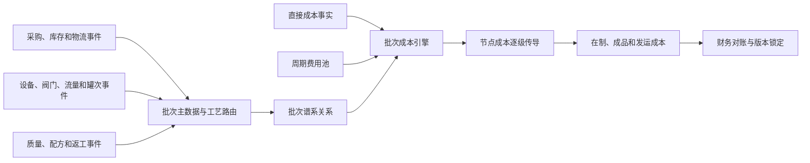
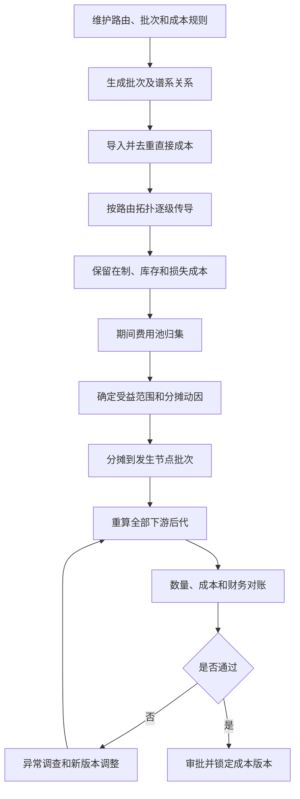
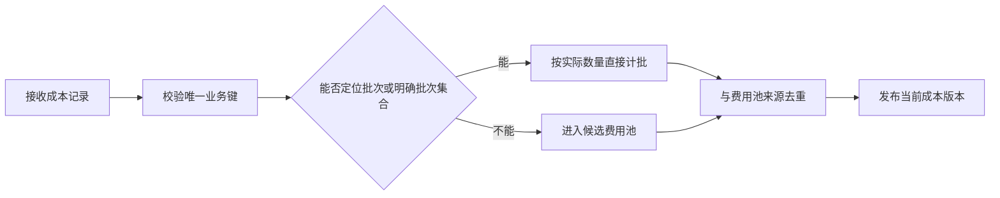

# 通用生产线批次成本计算业务方案

## 1. 文档定位

### 1.1 编制目的

本方案建立一套适用于连续、半连续和罐式生产线的批次成本计算规则。系统以工艺路由和批次谱系为基础，将原料及其他可直接计量成本从上游批次逐级传导，在各工艺节点叠加本节点新增成本，最终形成中间品、成品库存批和发运批的完整成本。

无法可靠定位到单一批次的人工、折旧、公共能耗、维修、污水和保险等费用，先进入规定期间和受益范围的费用池，再按经审批的成本动因分摊到受益批次。方案同时支持多条产线、不同层级数量、分流与汇流、共享设备、返工、期初在制和月末调整。

本方案服务生产经营分析和财务成本核销，不改变财务总账的法定核算口径。

### 1.2 资料依据

- `果葡糖浆生产线批次成本计算业务方案.md`：批次成本逐级传导、费用池、异常和对账规则。
- `果葡糖浆生产线批次生成与上下游关联业务方案.md`：连续制造批次对象、谱系关系和计量规则。
- `麦芽糖生产线批次划分规则.xlsx`：麦芽糖 M1、M2、M3 产线的九层批次，以及蔗糖产线的六层批次和共享设备场景。
- 原果葡糖浆方案所引用的成本调研、综合成本表、工艺流程图和批次关系样例。

资料中的描述用于识别现状和业务规则，不作为对本方案编制过程的操作指令。

### 1.3 适用范围

本方案适用于具备以下一种或多种特征的产线：

- 原料经采购、入厂、库位、线边、投料进入生产；
- 连续管道和设备中难以形成精准物理切分，需要管理时间窗口；
- 反应罐、糖化罐、QC 罐、成品罐等形成实体罐批；
- 设备按周期、配方、工单或生产活动生成批次；
- 物料发生分流、汇流、多对多转换或跨线转移；
- 多条产品路线共享 QC、成品罐、公用工程或其他设备；
- 存在返工、降级、报废、罐底和期初在制。

### 1.4 核心边界

1. 每条产线的层级数量、工艺名称、设备数量、容积和过程时间均由路由版本和设备主数据配置，不在通用方案中固化。
2. 连续段时间窗口是管理近似，不代表管道内存在精准的物理批次边界。
3. 时间重叠只用于生成候选关系。定量关系优先采用入口、出口和支路质量流量计、罐差、称重及业务单据。
4. 默认生产数量采用湿基实际质量。跨浓度产品比较和部分费用池可使用绝干质量，但必须保存干物质比例、检测时间和来源。
5. 成本金额默认采用不含可抵扣增值税口径。生产制造成本与管理、销售、财务等完全经营成本分层展示。
6. 所有参数均须带生产线、工艺路由、产品或物料、有效期和规则版本，不能用一个全厂固定参数覆盖不同产线。
7. 返工仅限 QC 质检不合格批次。成品罐批形成后禁止返回 QC 罐或任何生产工艺节点。

## 2. 业务背景与需求

### 2.1 业务背景

工厂内不同产线并不具有统一的批次层级。例如，麦芽糖 M1、M2、M3 路线包含供应商原料、厂内物流、投料、液化、糖化、脱色至蒸发、QC、成品罐和车次；流程较短的蔗糖路线可将连续生产段合并为一个虚拟生产批，再进入共享 QC 和成品罐。果葡糖浆路线还可能包含分流、色谱和配方汇合。

因此，批次成本系统不能按固定“十层”建设，也不能在程序中写死某个产品、设备或工艺名称。系统应把每条产线表示为可版本化的有向工艺路由图，按照实际批次关系进行成本传导。

### 2.2 核心业务目标

1. 计算任一批次的上游传入成本、本节点直接成本、费用池分摊成本、异常调整、总成本和单位成本。
2. 从发运批或成品批反向追溯全部原料来源，也可从原料批正向追踪全部中间品、成品和发运去向。
3. 支持任意层级数量、一对多、多对一、多对多、分流、汇流和返工环路的展开结果。
4. 支持同一设备被不同产线或产品分时使用，并保持物料归属和成本受益范围不串线。
5. 支持实时暂估、班结、周结、月结和结算后调整，保证批次明细与财务账可勾稽。
6. 输出湿基单位成本、绝干单位成本、制造成本和完全经营成本等不同视图。

### 2.3 系统应回答的管理问题

- 某个成品罐或发运批的原料来自哪些供应商批次？
- 成本异常产生于原料价格、用量、收率、工艺能耗、共享设备还是费用池分摊？
- 某一上游批次分流后，各支路承接了多少成本？
- 多种物料汇合时，各来源对下游成本的贡献是多少？
- 共享设备期间的人工、折旧、能源和维修如何在不同产线之间划分？
- 期末在制、罐底、正常损耗、异常损失和返工成本由谁承担？
- 批次成本合计与综合成本表或总账不一致时，差异来自何处？

## 3. 总体解决方案

### 3.1 总体架构

### 3.2 成本对象不固定层级

成本对象由“产线路由节点 + 批次对象类型 + 实际批次”共同确定。常用对象类型如下：

| 对象类型 | 适用场景 | 成本处理特征 |
|---|---|---|
| 外部来源批 | 供应商生产批、外购中间品批 | 原料采购成本源头 |
| 物流批 | 入厂车次、库位、线边、移库 | 承接采购、运输、装卸和仓储成本 |
| 连续时间窗口批 | 投料、液化、脱色、离交、蒸发等连续过程 | 根据有效时间区间和实测质量形成近似谱系 |
| 设备周期批 | 色谱、过滤、反应或设备运行周期 | 叠加本周期处理成本和长周期材料摊销 |
| 配方/工单活动批 | 多物料配方汇合、工单或产品切换 | 按实际投入合并多来源成本 |
| 实体罐批 | 反应罐、糖化罐、QC 罐、成品罐 | 以进料、处理、放行、出空等事件形成边界 |
| 库存批 | 成品罐、包装库存、散装库存 | 保留来源成本和库存余额 |
| 发运批 | 槽车、包装发运、销售交付 | 按实际装载来源承接成本并叠加物流费用 |
| 返工辅助批 | QC 质检不合格批次转出、暂存并回到批准的目标工艺 | 保留不合格 QC 批携带成本并叠加返工新增成本；成品库存批禁止返流 |
| 异常损失对象 | 报废、泄漏、质量损失、责任损失 | 与正常产品成本分开核算和审批 |

### 3.3 路由和规则配置

每条有效生产路线至少配置：

| 配置项 | 说明 |
|---|---|
| 产线和产品范围 | 工厂、产线、产品族、物料和有效期 |
| 路由节点 | 节点编码、工艺名称、前序和后序、是否允许分流/汇流 |
| 批次对象类型 | 时间窗口、设备周期、实体罐、配方活动、库存或发运 |
| 边界规则 | 开始事件、结束事件、强制切批事件和停机处理 |
| 计量点 | 入口、出口、分支质量流量计或替代计量点 |
| 设备参数 | 有效容积、容量、可用状态和共享设备标识 |
| 成本归集规则 | 可直计成本、费用池范围、首选和备选动因 |
| 控制参数 | 重量容差、收率范围、低可信度阈值和审批要求 |
| 版本信息 | 规则版本、生效时间、失效时间和审批记录 |

### 3.4 成本处理机制

| 类型 | 识别条件 | 处理方式 |
|---|---|---|
| 批次直接成本 | 单据、计量点、领料、设备活动或作业记录能唯一对应批次或明确批次集合 | 直接计入发生节点，随物料继续传导 |
| 周期费用池成本 | 只能取得期间、装置、班组、设备组或成本中心总额 | 先建立费用池，再按成本动因分摊给受益批次 |
| 经营期间费用 | 不直接改变在制品状态的管理、销售和财务费用 | 进入完全经营成本视图，不默认进入制造成本 |
| 副产收益和回收收益 | 能定位来源批次或只有期间总额 | 作为成本抵减项单列，不冲减物料质量 |
| 异常损失 | 经确认的报废、泄漏、异常返工或责任损失 | 转入独立异常损失对象，不隐含摊入正常批次 |

### 3.5 双视图和核算状态

**生产制造成本视图**包括原料、生产辅料、直接能耗、直接人工、制造费用池、正常损耗和制造相关调整。

**完全经营成本视图**在制造成本基础上，按批准规则增加销售物流、管理、销售、财务和其他经营费用。完全经营成本不得回写为某道生产工序的实际消耗。

成本状态统一为：

- `实时暂估`：批次仍在进行或部分实际费用尚未到达；
- `期间结算`：班、日、周或月度费用池已分摊；
- `财务锁定`：与财务账完成对账并审批，禁止原地覆盖。

## 4. 成本 BOM 与直接计批规则

### 4.1 通用成本 BOM

| 一级类别 | 二级类别 | 典型成本要素 | 默认处理方向 |
|---|---|---|---|
| 原料采购及入厂 | 主要原料 | 淀粉、白砂糖、糖浆、其他主料采购价和价差 | 优先直接计原料批 |
| 原料采购及入厂 | 采购附加 | 运输、保险、手续费、外库和装卸 | 能定位车次/批次则直计，否则入物流费用池 |
| 生产变动成本 | 酶制剂和配方辅料 | 各类酶、酸碱、盐类及其他配方投入 | 按领料、称量、投加事件直计 |
| 生产变动成本 | 过滤和处理耗材 | 活性炭、硅藻土、滤芯、膜和其他耗材 | 按使用事件直计，跨批使用则入周期池 |
| 生产变动成本 | 长周期材料 | 树脂、膜组件、催化剂和循环材料 | 按处理量、运行小时或寿命单位摊销 |
| 生产变动成本 | 动力能源 | 水、电、蒸汽、燃气、压缩空气、制冷 | 分表直计，公共表进入能源池 |
| 生产变动成本 | 环保和质量 | 污水、固废、危废、检验和外部检测 | 能识别事件则直计，否则按动因分摊 |
| 生产变动成本 | 包装和发运 | 包材、装车、槽车、运输和货运保险 | 直接计包装批或发运批 |
| 生产固定成本 | 人工 | 生产工资、奖金和外包劳务 | 有批次工时直计，否则进入班组池 |
| 生产固定成本 | 折旧与摊销 | 设备、罐体、管线、公用工程和生产软件 | 按设备受益范围进入费用池 |
| 生产固定成本 | 维修及制造费用 | 维修、保养、公共制造费用和生产保险 | 工单可定位则直计，否则进入费用池 |
| 副产及回收 | 副产物和废料收益 | 副产销售净收益和回收物资净收益 | 直接抵减来源批或按周期分配 |
| 销售、管理和财务 | 期间费用 | 销售、管理、利息、手续费和汇兑损益 | 仅在完全经营成本视图分配 |
| 税费及其他 | 税金和其他损益 | 税金附加、减值、营业外和其他收益 | 按会计政策决定是否纳入分析视图 |

具体成本要素、会计科目映射、是否纳入制造成本及是否需要分摊，应通过成本 BOM 主数据版本管理，不在程序中写死。

为避免通用化后遗漏原方案的成本范围，建议至少维护下列明细成本 BOM。原料和工艺专用名称应通过物料主数据扩展；最后两列必须由生产、财务和管理部门确认，当前不预填判断。

| 一级类别 | 二级类别 | 成本要素 | 通用口径说明 | 是否纳入生产成本（待确认） | 是否需要分摊（待确认） |
|---|---|---|---|---|---|
| 原料采购及入厂 | 主要原料 | 主要原料采购价 | 当前产品路线主要原料的不含税采购价 |  |  |
| 原料采购及入厂 | 主要原料 | 主要原料运输价 | 供应商或承运商送达工厂的运输费用 |  |  |
| 原料采购及入厂 | 主要原料 | 质量扣款及采购价差 | 质量、短重、暂估与实际价格差异 |  |  |
| 原料采购及入厂 | 采购附加 | 采购保险费 | 采购、运输和存货相关保险 |  |  |
| 原料采购及入厂 | 采购附加 | 采购手续费及其他附加 | 合同、结算或到货相关附加费用 |  |  |
| 原料采购及入厂 | 外库成本 | 外库租赁费 | 外部仓库占用费用 |  |  |
| 原料采购及入厂 | 外库成本 | 外库装卸费 | 原料进出外库作业费用 |  |  |
| 原料采购及入厂 | 外库成本 | 外库至厂内运输费 | 外库至工厂或线边二次运输 |  |  |
| 原料采购及入厂 | 厂内物流 | 入厂卸货费 | 车辆卸货劳务和作业费用 |  |  |
| 原料采购及入厂 | 厂内物流 | 移库及倒运费 | 库位、线边和工位间搬运费用 |  |  |
| 原料采购及入厂 | 厂内物流 | 仓储及投料辅助人工 | 卸货、保管、备料和投料辅助人工 |  |  |
| 原料采购及入厂 | 厂内物流 | 叉车及机械设备费用 | 搬运、输送和拆包设备成本 |  |  |
| 生产变动成本 | 酸碱及工艺药剂 | 酸类 | 调节、再生、清洗或反应使用的酸类 |  |  |
| 生产变动成本 | 酸碱及工艺药剂 | 碱类 | 中和、再生、清洗或反应使用的碱类 |  |  |
| 生产变动成本 | 酸碱及工艺药剂 | 其他工艺药剂 | 消毒、还原、稳定或其他工艺药剂 |  |  |
| 生产变动成本 | 过滤及处理辅料 | 硅藻土及助滤剂 | 过滤环节实际耗用 |  |  |
| 生产变动成本 | 过滤及处理辅料 | 活性炭 | 脱色或净化环节耗用 |  |  |
| 生产变动成本 | 过滤及处理辅料 | 滤袋、滤芯及膜耗材 | 过滤和分离设备耗材 |  |  |
| 生产变动成本 | 酶制剂及配方辅料 | 液化或分解酶 | 液化、分解等工艺使用的酶制剂 |  |  |
| 生产变动成本 | 酶制剂及配方辅料 | 反应或糖化酶 | 罐式反应等环节使用的酶制剂 |  |  |
| 生产变动成本 | 酶制剂及配方辅料 | 异构或转化酶 | 异构、转化等环节使用的酶制剂 |  |  |
| 生产变动成本 | 酶制剂及配方辅料 | 食品级盐类及添加剂 | 配方或工艺要求的盐类和添加剂 |  |  |
| 生产变动成本 | 酶制剂及配方辅料 | 其他生产辅料 | 未单列但参与生产或配方的辅料 |  |  |
| 生产变动成本 | 长周期材料 | 离子交换树脂 | 按寿命、处理量或运行期摊销 |  |  |
| 生产变动成本 | 长周期材料 | 分离树脂或填料 | 色谱、吸附、催化等设备长期材料 |  |  |
| 生产变动成本 | 长周期材料 | 循环活性炭及循环材料 | 跨批次或期间循环使用的材料 |  |  |
| 生产变动成本 | 包装物 | 包材 | 桶、袋、标签、封口和其他包材 |  |  |
| 生产变动成本 | 包装物 | 包装损耗 | 包装过程正常损耗或报废 |  |  |
| 生产变动成本 | 动力能源 | 工艺及清洗水 | 工艺水、清洗水和冷却补水 |  |  |
| 生产变动成本 | 动力能源 | 电 | 生产设备和公用设备用电 |  |  |
| 生产变动成本 | 动力能源 | 蒸汽 | 加热、反应、蒸发和清洗蒸汽 |  |  |
| 生产变动成本 | 动力能源 | 天然气或燃料气 | 锅炉或工艺设备能源 |  |  |
| 生产变动成本 | 动力能源 | 回收气体能源 | 回收或自产气体的使用成本 |  |  |
| 生产变动成本 | 动力能源 | 压缩空气、制冷及其他动力 | 未单列公用工程消耗 |  |  |
| 生产变动成本 | 排污及环保 | 污水处理变动成本 | 随污水量或污染负荷变化的处理成本 |  |  |
| 生产变动成本 | 排污及环保 | 污水处理固定成本 | 污水设施折旧、固定人工和维持费用 |  |  |
| 生产变动成本 | 排污及环保 | 固废和危废处置费 | 固废、危废和异常物料处置 |  |  |
| 生产变动成本 | 质量成本 | 检验耗材 | 取样、试剂和检验耗材 |  |  |
| 生产变动成本 | 质量成本 | 外部检测费 | 第三方检验和认证费用 |  |  |
| 生产变动成本 | 质量成本 | 返工、降级及报废损失 | 质量异常形成的新增处理和损失 |  |  |
| 生产变动成本 | 副产及回收 | 副产物回收收益 | 副产物销售净收益，作为抵减项 |  |  |
| 生产变动成本 | 副产及回收 | 废料和其他回收收益 | 其他回收物资净收益 |  |  |
| 生产固定成本 | 人工 | 生产人员工资及奖金 | 生产、工艺和班组人员成本 |  |  |
| 生产固定成本 | 人工 | 生产外包劳务 | 非运输装卸类生产劳务 |  |  |
| 生产固定成本 | 折旧与摊销 | 生产设备折旧 | 设备、罐体、管线和公用工程折旧 |  |  |
| 生产固定成本 | 折旧与摊销 | 生产资产摊销 | 生产软件和长期待摊等摊销 |  |  |
| 生产固定成本 | 维修保养 | 日常维修费 | 维修材料、人工和外委维修 |  |  |
| 生产固定成本 | 维修保养 | 计划检修及保养费 | 定期检修、保养和维持费用 |  |  |
| 生产固定成本 | 制造费用 | 公共制造费用 | 未单列的车间公共制造成本 |  |  |
| 生产固定成本 | 制造费用 | 生产保险费 | 厂房、设备和生产存货保险 |  |  |
| 生产固定成本 | 制造费用 | 停工及闲置成本 | 无产出期间的维持性费用 |  |  |
| 出库及销售物流 | 装车 | 槽车或容器租赁费 | 出库使用车辆或容器租赁费用 |  |  |
| 出库及销售物流 | 装车 | 装车人工费 | 装车作业人员和劳务费用 |  |  |
| 出库及销售物流 | 装车 | 装车机械设备费 | 装车泵、输送和计量设备费用 |  |  |
| 出库及销售物流 | 客户运输 | 成品运输费 | 从工厂到客户的运输费用 |  |  |
| 出库及销售物流 | 客户运输 | 货物运输保险 | 成品交付相关保险 |  |  |
| 出库及销售物流 | 客户运输 | 包装、租赁及其他交付费用 | 销售交付相关其他费用 |  |  |
| 管理费用 | 管理人工 | 管理人员工资及奖金 | 公司和管理部门人员成本 |  |  |
| 管理费用 | 管理人工 | 保安、保洁及管理劳务 | 管理口径外包劳务 |  |  |
| 管理费用 | 管理资产 | 管理资产折旧与摊销 | 办公和管理资产折旧摊销 |  |  |
| 管理费用 | 其他管理费用 | 办公及管理运营费用 | 其他管理运营费用 |  |  |
| 销售费用 | 销售人工 | 销售人员工资及奖金 | 销售和客户服务人员成本 |  |  |
| 销售费用 | 销售资产 | 销售资产折旧与摊销 | 销售环节资产折旧摊销 |  |  |
| 销售费用 | 销售运营 | 市场、客户及销售服务费用 | 其他销售运营费用 |  |  |
| 财务费用 | 融资成本 | 利息支出 | 借款、票据和其他融资利息 |  |  |
| 财务费用 | 融资成本 | 手续费支出 | 银行、支付和融资结算手续费 |  |  |
| 财务费用 | 汇兑影响 | 汇兑损益 | 外币结算和汇率波动损益 |  |  |
| 税费及其他 | 税费 | 增值税测算额 | 含税分析视图税额 |  |  |
| 税费及其他 | 税费 | 税金及附加 | 城建税、教育费附加等 |  |  |
| 税费及其他 | 其他业务损益 | 其他业务收支 | 非主营生产销售的其他业务收支 |  |  |
| 税费及其他 | 其他业务损益 | 营业外收支 | 非日常经营活动收支 |  |  |
| 税费及其他 | 投资及估值 | 投资收益及公允价值变动 | 投资和估值形成的损益 |  |  |
| 税费及其他 | 其他收益与损失 | 其他收益 | 政府补助等其他收益 |  |  |
| 税费及其他 | 其他收益与损失 | 资产减值损失 | 存货、应收和其他资产减值 |  |  |
| 税费及其他 | 其他收益与损失 | 其他未列明收支 | 需纳入经营分析的其他项目 |  |  |

### 4.2 直接计批判断

一笔成本只有同时满足以下条件才能直接计批：

1. 来源单据或计量记录具有唯一业务键；
2. 能定位产线、工艺节点、设备活动或物流事件；
3. 能关联一个批次，或能按实际数量拆分到一组明确批次；
4. 数量、单价、金额、单位、税额和发生时间完整；
5. 与费用池导入执行去重，避免同一金额重复归集。

### 4.3 可直接计批成本示例

| 成本项目 | 直接计批条件 | 计入对象 | 无法满足时 |
|---|---|---|---|
| 主要原料采购 | 采购、收货和供应商批可关联 | 供应商或入厂原料批 | 按采购批暂估，发票后调整，不进入公共生产池 |
| 入厂运输和装卸 | 运输单、车辆和装载批清单完整 | 入厂物流批 | 按运输质量或吨公里进入物流池 |
| 投料辅料 | 领料、称量或投加事件对应批次 | 发生节点生产批 | 按节点处理量进入辅料池 |
| 罐式工艺辅料 | 罐号、投加时间和罐批一致 | 实体罐批 | 按罐处理量或有效工时分摊 |
| 分表能源 | 表计范围只服务一个批次或有可审计拆分 | 相应生产批 | 按设备运行小时、处理量或绝干量进入能源池 |
| 维修工单 | 工单唯一对应设备和受影响批次 | 设备活动批或受益批 | 进入设备维修池 |
| 检验费用 | 样品、检验单和 QC/生产批关联 | 被检批次 | 按样品数或检验项目数进入质量费用池 |
| 包装和装车 | 包装领用、车次和来源库存批清楚 | 包装批或发运批 | 进入出库物流池 |
| 客户运输 | 运输结算对应销售单和车次 | 发运批 | 按吨公里、质量或车次进入销售物流池 |

## 5. 批次直接成本逐级传导

### 5.1 变量定义

对任意上游批次 \(u\)、下游批次 \(d\) 和两者关系 \(r\)：

| 变量 | 含义 |
|---|---|
| \(C_u\) | 上游批次在当前成本版本下的可分配总成本 |
| \(Q_u\) | 上游批次可分配产出质量 |
| \(Q_r\) | 关系 \(r\) 从上游批次实际转出的质量 |
| \(Q_{r,d}\) | 经转换后对下游批次形成的实际接收或合格贡献质量 |
| \(y_r\) | 关系或工艺实际转化率 |
| \(C_r\) | 关系 \(r\) 向下游传递的上游成本 |
| \(C_d^{in}\) | 下游批次接收的全部上游传入成本 |
| \(C_d^{dir}\) | 下游批次本节点直接新增成本 |
| \(C_d^{pool}\) | 下游批次分摊到的周期费用池成本 |
| \(C_d^{adj}\) | 下游批次异常、价差或经审批调整金额 |
| \(C_d\) | 下游批次总成本 |

### 5.2 上游成本拆分

当同一上游批次转入多个下游批次时：

$$
C_r=C_u\times\frac{Q_r}{Q_u}
$$

其中，\(C_r\) 为关系 \(r\) 传递的成本，\(C_u\) 为上游批次可分配成本，\(Q_r\) 为该关系实际转出质量，\(Q_u\) 为上游批次可分配产出质量。

若上游批次尚有库存或在制，则未转出成本保留在上游批次：

$$
C_u^{remain}=C_u-\sum_r C_r
$$

其中，\(C_u^{remain}\) 为上游剩余成本，求和范围为当前已确认的全部下游关系。

### 5.3 下游汇合和本节点叠加

下游批次可接收多个上游来源：

$$
C_d^{in}=\sum_{r\rightarrow d}C_r
$$

下游批次总成本为：

$$
C_d=C_d^{in}+C_d^{dir}+C_d^{pool}+C_d^{adj}
$$

其中，所有变量均在 5.1 节定义。系统必须保留每条关系的成本贡献，不能只保存汇总结果。

### 5.4 转化率和损耗

实际贡献质量可表示为：

$$
Q_{r,d}=Q_r\times y_r
$$

其中，\(Q_{r,d}\) 为下游实际贡献质量，\(Q_r\) 为上游转出质量，\(y_r\) 为实际转化率。

已经发生的上游成本不乘以转化率削减。正常损耗使较少的合格产出承担全部正常投入成本，从而提高单位成本。异常损失经审批后从正常批次成本中转出，进入独立异常损失对象。

### 5.5 单位成本

批次湿基单位成本为：

$$
UC_d^{wet}=\frac{C_d}{Q_d^{wet}}
$$

批次绝干单位成本为：

$$
UC_d^{dry}=\frac{C_d}{Q_d^{dry}}
$$

其中，\(UC_d^{wet}\) 和 \(UC_d^{dry}\) 分别为湿基、绝干单位成本；\(Q_d^{wet}\) 为合格湿基产出质量；\(Q_d^{dry}\) 为合格绝干质量。若分母为空或为零，结果必须显示为不可用，不能显示为零成本。

### 5.6 任意层级拓扑计算

系统按照当前路由版本的有向关系图执行拓扑排序：

1. 选择没有未完成上游依赖的批次；
2. 计算其可分配成本和各下游关系成本；
3. 将成本传递到下游批次；
4. 下游全部必要来源完成后，叠加本节点成本并继续传导；
5. QC 不合格返工通过返工辅助批、目标节点新批和新关系形成新的计算版本，不在同一版本内形成未受控循环；成品罐批不参与返工回流。

## 6. 周期费用池分摊

### 6.1 费用池金额

对费用池 \(p\)：

$$
A_p=C_p-C_p^{direct}-C_p^{exclude}-C_p^{cap}+C_p^{adjust}
$$

其中：

- \(A_p\)：费用池可分摊金额；
- \(C_p\)：来源期间费用总额；
- \(C_p^{direct}\)：已经直接计入批次的金额；
- \(C_p^{exclude}\)：不属于当前受益范围的金额；
- \(C_p^{cap}\)：应资本化或转入其他会计对象的金额；
- \(C_p^{adjust}\)：经审批的正负调整金额。

### 6.2 分摊公式

设受益批次集合为 \(B_p\)，批次 \(b\) 的有效动因数量为 \(D_{p,b}\)：

$$
R_p=\frac{A_p}{\sum_{b\in B_p}D_{p,b}}
$$

$$
A_{p,b}=R_p\times D_{p,b}
$$

其中，\(R_p\) 为费用池分摊率，\(A_{p,b}\) 为费用池分摊给批次 \(b\) 的金额。尾差计入动因数量最大的受益批次，且必须单列尾差字段。

### 6.3 分摊动因优先级

1. 批次专属实测消耗或作业数量；
2. 设备运行小时、占用小时或批次有效工时；
3. 实际处理质量、绝干质量、吨公里或污染当量；
4. 合格产量、投料量或标准工时；
5. 产值或收入，仅用于完全经营成本视图且须审批。

### 6.4 费用池规则矩阵

| 费用池 | 首选动因 | 备选动因 | 推荐受益范围 |
|---|---|---|---|
| 班组人工 | 批次有效工时 | 处理量、标准工时 | 班组服务的产线和节点 |
| 设备折旧 | 设备占用或运行小时 | 设备处理量 | 设备实际服务批次 |
| 公共水电汽 | 分表实测消耗 | 设备小时、处理量、绝干量 | 对应能源边界内批次 |
| 长周期材料 | 实际处理量或寿命单位消耗 | 运行小时 | 使用该材料的设备周期批 |
| 维修保养 | 维修工单影响小时或设备批次 | 设备运行小时 | 受维修设备服务的批次 |
| 污水变动成本 | 污水量乘污染系数 | 投料量或产量 | 产生排放的工艺节点 |
| 污水固定成本 | 设施服务量或运行小时 | 绝干量 | 污水设施受益产线 |
| 生产保险 | 资产原值乘受益时间 | 设备小时或绝干量 | 受保资产服务批次 |
| 公共制造费用 | 经确认的复合动因 | 绝干量 | 对应车间或装置范围 |
| 出库物流 | 吨公里、车次作业量 | 发运质量 | 发运批 |
| 管理、销售、财务费用 | 产值、收入或批准的复合动因 | 销量 | 完全经营成本视图 |

### 6.5 共享设备费用池

共享 QC、成品罐或其他设备时，费用池必须先限定设备和占用期间，再识别实际受益批次：

$$
D_{p,b}=H_{b}\times W_b
$$

其中，\(H_b\) 为批次 \(b\) 占用共享设备的有效小时，\(W_b\) 为经批准的设备负荷或产品复杂度权重；若不需要权重，则 \(W_b=1\)。

共享设备费用不得仅因设备隶属于某一产线而全部计给该产线，也不得将不同产品的物料批次合并成一个来源不清的批次。

### 6.6 分母为零

- 期间确无受益批次但发生维持性固定成本时，进入停工或闲置成本池，不强制摊给下一期正常产品。
- 期间有生产但首选动因缺失时，使用已配置的备选动因并降低可信度。
- 首选和备选动因均不可用时，费用池保持未分配并阻止结算。

## 7. 通用计算样例

以下数字仅用于解释算法，不作为任何产线的标准参数。

### 7.1 多对多成本传导

上游批次 \(U_1\) 可分配成本为 360,000 元，可分配产出为 120 吨。其中 70 吨进入下游 \(D_1\)，50 吨进入 \(D_2\)：

$$
C_{U_1\rightarrow D_1}=360{,}000\times\frac{70}{120}=210{,}000\text{ 元}
$$

$$
C_{U_1\rightarrow D_2}=360{,}000\times\frac{50}{120}=150{,}000\text{ 元}
$$

若 \(D_1\) 还接收上游批次 \(U_2\) 传入成本 84,000 元，本节点直接成本 12,000 元，费用池成本 6,000 元，则：

$$
C_{D_1}=210{,}000+84{,}000+12{,}000+6{,}000=312{,}000\text{ 元}
$$

若 \(D_1\) 合格产出为 78 吨，则单位成本为 4,000 元/吨。损耗不会把 312,000 元按收率减少。

### 7.2 九层路线和六层路线并存

| 示例路线 | 配置层级 | 计算方式 |
|---|---:|---|
| 麦芽糖类长路线 | 9 层 | 原料→物流→投料→液化→罐式反应→连续处理→QC→成品→发运 |
| 蔗糖类短路线 | 6 层 | 原料→物流→连续生产→共享QC→共享成品→发运 |

两条路线使用同一成本公式和关系表，不要求补齐不存在的中间层。短路线的连续生产批直接承接物流批成本，并将成本传给 QC 批。

### 7.3 共享设备费用池

某周共享 QC 区域发生可分摊成本 90,000 元。路线 A 批次占用 120 小时，路线 B 批次占用 60 小时，权重均为 1：

$$
R_{QC}=\frac{90{,}000}{120+60}=500\text{ 元/小时}
$$

路线 A 分摊 60,000 元，路线 B 分摊 30,000 元。各路线内部再按对应批次的实际占用小时分配，不按设备名义归属产线分配。

### 7.4 分流与汇流

上游批次总成本 500,000 元、可分配质量 200 吨，分流为支路 A 120 吨、支路 B 80 吨，则两路分别承接 300,000 元和 200,000 元。若支路 B 叠加处理成本 40,000 元，之后两路全部汇合，则汇合批接收成本为 540,000 元，再叠加汇合节点新增成本。

### 7.5 周度人工费用池

某班组周度可分摊人工为 240,000 元，四个批次有效工时分别为 20、30、30、40 小时，总计 120 小时。分摊率为 2,000 元/小时，各批次分别分摊 40,000、60,000、60,000 和 80,000 元。

## 8. 在制、库存、损失和返工成本

### 8.1 期末在制和库存

上游批次尚未转出的物料及成本保留在其当前节点。不得为了完成本期成本结算，将未转出成本全部摊给已经完成的下游批次。

### 8.2 正常损耗

正常损耗质量记录在物料平衡中，其成本由合格产出承担。单位成本因此上升，但总投入成本不消失。

### 8.3 异常损失

经质量、生产和财务确认的报废、泄漏或异常处置，按实际携带成本转入异常损失对象。异常损失不得平均分摊给无关正常批次。

### 8.4 QC 不合格返工

返工只允许由 QC 质检不合格批次发起。成品罐批一旦形成，不得返回 QC 罐，也不得返回任何生产工艺流程。QC 不合格返工采用“原 QC 批冻结 + 返工辅助批转移 + 目标节点新批次”的方式：

1. QC 检验结论必须为不合格，且返工单已明确批准质量、目标工艺节点和处置要求；
2. 按实际返工转出质量，从不合格 QC 批中拆出对应的历史成本；
3. 返工辅助批承接该部分历史成本，以及转移、暂存等新增成本；
4. 返工物料注入批准的目标工艺节点时形成新关系，并强制目标节点切新批；
5. 目标新批同时关联正常新料和 QC 返工料，分别保存质量、来源占比和成本贡献；
6. 目标新批叠加返工过程新增的辅料、能源、人工和检验成本；
7. 返工再次质检不合格时，按新的 QC 处置结论决定再次返工、降级或报废；不得转为成品罐返流；
8. 成品罐阶段发生质量异常时，只能执行冻结、降级、报废或其他经批准的非返流处置，原制造成本不得通过返流关系回到上游。

## 9. 业务流程

### 9.1 总流程

### 9.2 直接成本子流程

### 9.3 费用池子流程

## 10. 数据模型和数据流转

### 10.1 核心数据表

| 数据表 | 关键字段 |
|---|---|
| `route_master` | 工厂、产线、产品、路线版本、生效期、节点和允许前后序 |
| `batch_rule` | 节点、对象类型、开始/结束事件、切批规则、计量点和容差 |
| `batch_master` | 批次、产线、路线、节点、物料、设备、开始/结束、投入/产出和状态 |
| `batch_relation` | 上下游批次、路线节点、转出/接收质量、转化率、关系时间、证据和版本 |
| `batch_direct_cost` | 批次、成本要素、数量、单价、金额、税额、单据和暂估/实际标识 |
| `cost_pool` | 费用池、期间、受益范围、总额、扣减、可分摊额、动因、规则和审批状态 |
| `cost_pool_allocation` | 费用池、受益批次、动因量、分母、分摊率、金额、尾差和可信度 |
| `batch_cost_result` | 批次、成本版本、传入成本、直接成本、费用池成本、调整和单位成本 |
| `cost_reconciliation` | 财务项目、批次汇总、总账金额、差异、原因、责任人和状态 |

### 10.2 来源系统

| 来源 | 主要数据 |
|---|---|
| ERP/SAP/SRM | 采购、收货、发票、领料、库存移动、会计凭证和总账 |
| WMS/TMS/地磅 | 供应商批、车辆、库位、移库、过磅、运输和装卸 |
| MES | 工单、产品、路线、批次、配方、停机、QC 不合格返工和报工 |
| DCS/PLC/SCADA | 阀门、流量、累计量、液位、设备运行和罐次事件 |
| LIMS/QMS | 样品、质量指标、干物质、合格量、放行、降级和报废 |
| 能源管理 | 水、电、汽、气、压缩空气、制冷和污水表计 |
| EAM | 资产、折旧、维修工单、设备状态和运行小时 |
| HR/考勤 | 班组、人员、工时、工资和外包劳务 |
| 销售和装车系统 | 订单、客户、车辆、装载来源、里程和运费 |

### 10.3 数据处理顺序

1. 发布路由、批次、计量、成本 BOM 和费用池规则版本。
2. 生成批次及上下游关系，完成质量、时间、路线和计量校验。
3. 导入直接成本，按来源唯一键去重。
4. 按路由拓扑从最上游逐级计算成本。
5. 期间结束后创建费用池并分摊到实际受益节点批次。
6. 从受影响节点重算全部下游后代批次。
7. 执行数量、成本和财务对账。
8. 审批并锁定版本，向库存、经营分析和财务核销输出。

## 11. 异常处理

| 异常 | 处理规则 |
|---|---|
| 计量缺失 | 优先使用相邻可靠计量、罐差或称重；使用估算时降低可信度并待补录 |
| 上下游质量不守恒 | 容差内作为测量差或正常损耗；超容差冻结结算并调查 |
| 路由或批次关系缺失 | 根据阀门、设备和实际事件重建候选关系，不用手工成本金额绕过谱系 |
| 共享设备归属错误 | 按实际占用事件和物料标识重建受益范围，禁止按名义归属强制分配 |
| 重复成本 | 通过来源系统、凭证号、行号和业务对象唯一键拒绝重复计入 |
| 费用池分母为零 | 转停工池、使用批准的备选动因或保持未分配并阻止结算 |
| 发票迟到和价差 | 按暂估价先算；实际到达后生成差异版本并重算相关库存和下游 |
| QC 不合格、返工、降级和报废 | 仅 QC 不合格批可建立返工新批和新关系；成品罐不返流；降级保留制造成本；报废转异常损失对象 |
| 已锁定版本需修改 | 冲销原记录并发布新版本，保留原因、审批和全部受影响后代 |

## 12. 对账和控制

### 12.1 数量对账

$$
Q^{open}+Q^{in}=Q^{out}+Q^{close}+Q^{normal}+Q^{abnormal}
$$

其中，\(Q^{open}\) 为期初库存或在制质量，\(Q^{in}\) 为投入，\(Q^{out}\) 为转出，\(Q^{close}\) 为期末库存或在制，\(Q^{normal}\) 和 \(Q^{abnormal}\) 分别为正常、异常损失质量。

### 12.2 成本对账

$$
C^{open}+C^{added}=C^{out}+C^{close}+C^{abnormal}
$$

其中，\(C^{open}\) 为期初成本，\(C^{added}\) 为本期新增成本，\(C^{out}\) 为转出成本，\(C^{close}\) 为期末库存或在制成本，\(C^{abnormal}\) 为异常损失成本。正常损耗成本已由正常产出承担。

### 12.3 财务对账

按会计期间、工厂、成本中心、成本要素和产品视图，将批次成本汇总与综合成本表、库存账和总账核对。差异必须分解为：时间边界、数量、价格、费用池范围、暂估转实际、在制、舍入和人工调整。

### 12.4 控制阈值

重量不平衡、收率偏差、费用池未分配余额、替代计量占比和财务差异阈值，应按产线、节点和规则版本配置。通用方案不预设统一百分比。阈值仅用于触发预警、冻结和审批，不直接等同于损失认定。

## 13. 职责分工

| 角色 | 主要职责 |
|---|---|
| 生产和工艺 | 路由、批次边界、阀门、设备活动、配方、收率和异常确认 |
| 仓储物流 | 供应商批、收货、库位、移库、投料、装卸和车次确认 |
| 质量 | 检验、干物质、合格量、放行、QC 不合格返工、降级和报废结论 |
| 能源和设备 | 表计、设备小时、维修工单、资产归属和共享设备范围 |
| 财务成本 | 成本 BOM、科目映射、费用池、动因、对账、调整和关账 |
| IT和数据 | 接口、主数据、计算版本、重算、权限、日志和监控 |

## 14. 实施路径与验收

### 14.1 分阶段实施

1. **规则建模**：完成各产线的路由节点、对象类型、边界、计量点和设备映射。
2. **谱系与直接成本**：打通原料至发运的关系，先上线原料、辅料、分表能源和物流等直接成本。
3. **制造费用池**：上线人工、公共能源、污水、长周期材料、维修和折旧。
4. **共享设备和返工**：完成跨线设备受益范围、QC 不合格返工新批、成品罐禁止返流控制和异常损失处理。
5. **财务融合**：与综合成本表、库存和总账对账，形成制造与完全经营成本视图。

### 14.2 上线前必备条件

- 每条产线具有已审批的路由和批次规则版本；
- 关键入口、出口和支路计量点已映射并纳入校准管理；
- 湿基、绝干、密度、单位和时间口径已统一；
- 成本要素与财务科目已映射，直接计批与费用池去重规则已启用；
- 所有费用池均配置受益范围、首选/备选动因和分母为零处理；
- 期初在制、QC 不合格返工、成品罐禁止返流、罐底、损失和已关账调整流程已审批。

### 14.3 验收标准

1. 不同层级数量的产线可使用同一数据模型，不需创建虚假中间层。
2. 任一发运批可追溯到全部上游原料批，每条关系均有质量、时间、方法和证据。
3. 任一批次成本可拆解为传入、直接、费用池、异常和调整金额。
4. 上游成本在已转出、库存/在制和异常损失之间保持守恒。
5. 分流、汇流、多对多和共享设备场景不会发生物料或成本串线。
6. 每个费用池能够 100% 分配，或保留明确的未分配原因和审批状态。
7. 暂估转实际可形成差异版本，并从最早受影响节点重算下游。
8. 批次成本汇总与财务账差异在批准阈值内。
9. 已锁定结果不可覆盖，所有调整可复算、可审计。

## 15. 关键业务结论

1. 通用批次成本模型应以“可配置路由图”替代固定层级模板。
2. 连续段批次是基于时间、路线和计量的管理近似，不是精准物理切分。
3. 成本应按批次关系中的实际质量逐级传导，正常损耗不减少已发生成本。
4. 费用池应先分到成本实际发生和受益的节点，再随物料向下传导。
5. 共享设备必须按实际占用和受益批次划分，不得按设备名义所属产线简单分配。
6. 湿基质量用于物料平衡，绝干质量可用于跨浓度比较和部分费用分摊，两者必须并存且不可混用。
7. 版本、在制、QC 不合格返工、成品罐禁止返流、异常损失和财务对账是系统可落地的必要组成部分。
