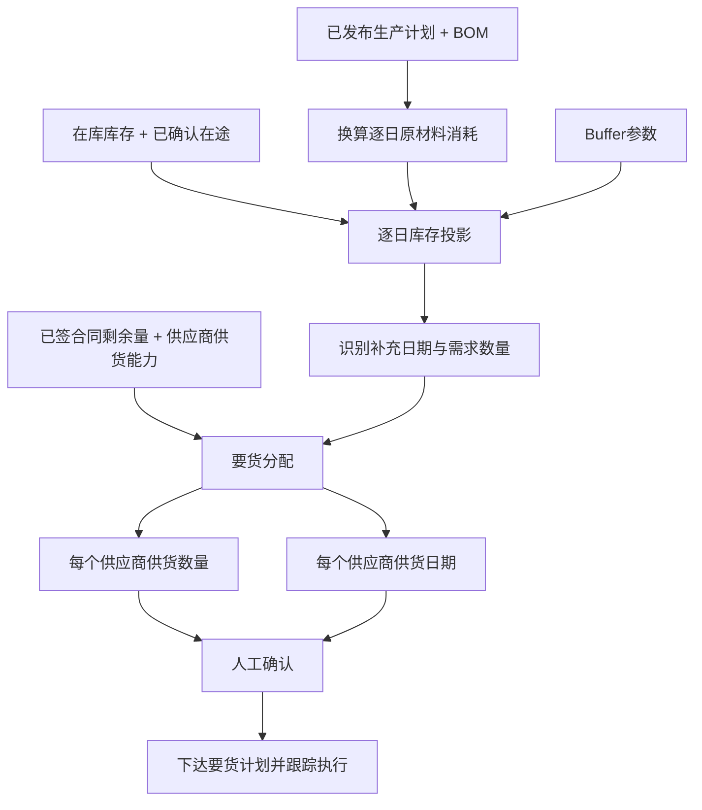

# 要货计划模块技术方案

## 1. 方案概述

要货计划模块面向采购合同签订后的供货安排，根据原材料库存、已确认在途和已发布生产计划，在已签约供应商范围内回答两个问题：

1. 每个供应商供货多少；
2. 每个供应商什么时候供货。

模块的核心不是重新选择供应商或比较采购价格，而是把已签合同的可执行量转换为具体、可执行的供应商要货计划，在保证生产连续性和Buffer的前提下尽量避免过早到货。

```text
已签供应商合同
        +
在库库存 + 已确认在途 + 生产计划/BOM + Buffer
        ↓
逐日原材料库存投影
        ↓
识别需要补充的日期与数量
        ↓
在已签约供应商间分配供货数量和供货日期
        ↓
人工确认 → 下达要货计划 → 跟踪执行
```

## 2. 业务目标与模块边界

### 2.1 业务目标

- 保证原材料按生产需要及时到货，避免断料；
- 保留业务设定的生产缓冲，降低到货延迟风险；
- 避免合同量过早全部到货造成库存和资金占用；
- 合理使用各供应商已签合同剩余量；
- 明确每个供应商的供货数量和供货日期；
- 在库存、排程、在途或合同状态变化时滚动调整尚未执行的要货计划。

### 2.2 模块边界

- 只在已签订且有效的供应商合同范围内安排要货；
- 不重新选择采购供应商，不进行供应商询报价；
- 不计算采购综合成本，不改变已经签订的合同价格；
- 读取生产计划，但不编制或优化生产排程；
- 读取库存数据，但不维护库存台账；
- 读取采购订单和在途数据，但不替代物流跟踪系统；
- 输出要货建议，经业务人员确认后才能下达给供应商；
- 合同量不足或供应商无法满足生产需要时，输出缺口并返回采购业务处理。

## 3. 总体业务流程



## 4. 核心决策逻辑与技术方案

### 4.1 逐日生产耗用换算

成品生产计划按BOM单耗和生产得率转换为原材料逐日消耗：

$$
R_{id}=\sum_pS_{pd}\times\frac{u_{ip}}{\eta_{ip}}
$$

其中：

- \(S_{pd}\)：成品 \(p\) 在日期 \(d\) 的已发布计划产量；
- \(u_{ip}\)：物料 \(i\) 对成品 \(p\) 的标准单耗；
- \(\eta_{ip}\)：对应生产得率；
- \(R_{id}\)：物料 \(i\) 在日期 \(d\) 的预计消耗量。

### 4.2 可用量口径

要货计划需要区分三类数量：

| 数量口径 | 是否直接计入逐日库存 | 说明 |
|---|---|---|
| 在库实物库存 | 是 | 质检合格且未冻结的可用实物 |
| 在途实物库存 | 有明确到货日期时计入 | 按确认到货日期加入库存投影 |
| 在手未执行合同量 | 否 | 只是可安排要货的合同额度，不是实物库存 |

合同量只有形成明确的供应商、供货数量和供货日期后，才作为本次要货建议进入模拟库存曲线。

### 4.3 无新增要货时的库存投影

$$
I_{id}=I_{i,d-1}+A_{id}-R_{id}
$$

其中：

- \(I_{i0}\)：当前在库可用量；
- \(A_{id}\)：已有订单中确认在日期 \(d\) 到货的在途数量；
- \(I_{id}\)：日期 \(d\) 生产消耗后的预计库存。

### 4.4 动态Buffer

Buffer按未来若干天生产耗用动态折算：

$$
B_{id}=\sum_{h=d+1}^{d+b_i}R_{ih}+SS_i
$$

其中：

- \(b_i\)：物料缓冲天数；
- \(SS_i\)：可选固定安全库存；
- \(B_{id}\)：日期 \(d\) 的动态缓冲量。

生产负荷增加时Buffer自动增加，生产负荷下降时Buffer相应下降。

### 4.5 需要供货的日期与数量

系统从规划起点开始逐日模拟。当预计库存将低于动态Buffer时，产生新的供货需要：

$$
Q_{id}^{need}=\max(0,B_{id}+R_{id}-I_{i,d-1}-A_{id})
$$

在满足生产连续性的前提下，供货日期尽量靠近实际需要日期，避免提前形成库存。

如果业务设置最小要货量、整车量或固定送货日，系统应在满足这些规则后重新校验库存曲线。

### 4.6 已签约供应商供货分配

设：

- \(x_{ijd}\)：物料 \(i\) 要求已签约供应商 \(j\) 在日期 \(d\) 供货的数量；
- \(C_{ij}\)：供应商 \(j\) 的有效合同剩余量；
- \(U_{ijd}\)：供应商 \(j\) 在日期 \(d\) 的最大可供量。

要货计划在有效合同供应商范围内分配数量，基本约束如下：

1. **逐日库存与Buffer约束**

   $$
   I_{id}=I_{i,d-1}+A_{id}+\sum_jx_{ijd}-R_{id}
   $$

   $$
   I_{id}\geq B_{id},\quad\forall i,d
   $$

2. **合同剩余量约束**

   $$
   \sum_dx_{ijd}\leq C_{ij},\quad\forall i,j
   $$

3. **供应商日期供货能力约束**

   $$
   0\leq x_{ijd}\leq U_{ijd}
   $$

4. **合同有效期约束**

   供货日期必须落在合同有效期内。合同失效、暂停或额度为0时，不允许安排要货。

5. **供货规则约束**

   可配置最小要货量、整车量、最小通知天数、供应商固定送货日和单日收货能力等规则。

### 4.7 供应商分配规则

当多个已签约供应商都能满足同一供货需要时，可按以下顺序分配：

1. 优先使用临近到期的合同额度；
2. 满足合同约定的最低执行量或执行比例；
3. 优先选择准时率较高、风险分较低的供应商；
4. 平衡供应商合同执行进度，避免个别合同长期不执行；
5. 在满足生产和合同要求的前提下，使到货尽量晚且库存峰值尽量低。

上述规则应支持业务配置。合同价格只作为结果参考，不作为重新选择供应商的依据。

### 4.8 求解目标

要货计划采用分层目标：

1. 保证逐日预计库存不低于Buffer；
2. 不超过各供应商合同剩余量和日期供货能力；
3. 满足最小要货量、整车量和收货能力等执行规则；
4. 尽量推迟到货，降低原材料平均库存和库存峰值；
5. 平衡已签合同的执行进度。

## 5. 功能与技术架构

| 功能层 | 主要功能 |
|---|---|
| 数据准备层 | 获取生产计划、BOM、库存、在途、合同和供应商供货能力 |
| 生产耗用换算层 | 将成品生产计划转换为逐日原材料消耗 |
| 库存投影层 | 形成逐日预计库存、动态Buffer和风险日期 |
| 要货计划引擎 | 在已签约供应商间分配供货数量和供货日期 |
| 方案解释层 | 展示库存曲线、要货安排、合同执行进度和风险原因 |
| 业务确认层 | 支持调整参数、确认要货计划并下达执行 |

运行顺序如下：

1. 校验生产计划、BOM、库存和在途数据；
2. 校验已签合同状态、剩余量和供应商供货能力；
3. 换算逐日原材料消耗并形成无新增要货时的库存投影；
4. 计算动态Buffer和需要供货的日期、数量；
5. 在已签约供应商范围内分配供货数量和日期；
6. 重新模拟库存，校验生产连续性和执行规则；
7. 输出推荐要货计划、风险缺口和形成理由；
8. 业务人员确认后下达并跟踪执行。

## 6. 输入与输出

### 6.1 输入数据

| 数据来源 | 输入内容 | 用途 |
|---|---|---|
| APS/生产计划 | 成品、生产日期、计划数量、版本、发布状态 | 换算逐日原材料消耗 |
| BOM/工艺数据 | 原材料单耗、生产得率、生效日期 | 支撑耗用换算 |
| WMS/SAP | 在库实物、冻结量、质检状态、可用量、数据时间 | 形成库存投影期初量 |
| SAP/E采/TMS | 已下达订单、在途量、确认到货日期、订单状态 | 加入已有到货承诺 |
| 合同管理 | 已签约供应商、合同有效期、合同剩余量、合同价、最低执行要求 | 确定可安排要货的合同范围 |
| 供应商协同 | 日期可供量、最小通知天数、固定送货日、最小送货量 | 形成可执行供货安排 |
| 收货能力 | 日收货上限、不可收货日期 | 校验到货执行能力 |
| 业务参数 | Buffer天数、固定安全库存、规划周期、整车量 | 控制要货计划求解 |
| 供应商评价 | 准时率、风险分 | 多供应商可行时的分配参考 |

### 6.2 输出结果

| 输出结果 | 输出内容 |
|---|---|
| 1. 各供应商供货量 | 每个已签约供应商需要供货多少 |
| 2. 各供应商供货日期 | 每个已签约供应商什么时候供货 |

同时展示合同价、合同剩余量、计划执行后合同余额、预计库存曲线、Buffer、最早风险日期和无法覆盖的数量，作为要货计划的执行依据。

## 7. 运行与接口要求

### 7.1 运行机制

- 每日滚动读取生产计划、库存、在途和合同执行状态；
- 生产计划、库存、在途日期、合同额度或供应商供货能力变化时重新计算；
- 已经确认或已发运的供货安排默认冻结，只调整尚未下达的建议；
- 支持业务人员人工触发重新计算；
- 每次计算保存输入版本、参数、推荐结果和人工调整记录；
- 常规要货计划求解应在3秒内完成。

### 7.2 核心接口

- 从APS获取已发布逐日生产计划；
- 从BOM/工艺服务获取单耗、得率和生效版本；
- 从WMS/SAP获取在库可用量和数据时间；
- 从SAP/E采/TMS获取采购订单、在途和确认到货日期；
- 从合同管理获取已签约供应商、合同余额、有效期和合同价；
- 从供应商协同平台获取日期可供量和供货规则；
- 向E采/SAP或供应商协同平台提供人工确认后的供应商、供货数量和供货日期；
- 向供应链驾驶舱推送要货计划、库存风险和执行状态。

## 8. 异常与业务提示

- 生产计划未发布或版本失效时，不输出确定性要货日期；
- BOM缺失或失效时，提示无法换算原材料耗用；
- 库存数据超过业务时效时，暂停求解并提示刷新；
- 在途订单没有确认到货日期时，不计入逐日库存投影；
- 当前库存已经低于Buffer时，提示立即供货或加急处理；
- 已签合同总剩余量不足时，输出缺口并返回采购业务补充采购；
- 供应商无法在需要日期供货时，输出风险日期和缺口数量；
- 要货量不满足整车量或收货能力限制时，输出规则冲突；
- 所有要货建议均需人工确认，不自动向供应商下达。
