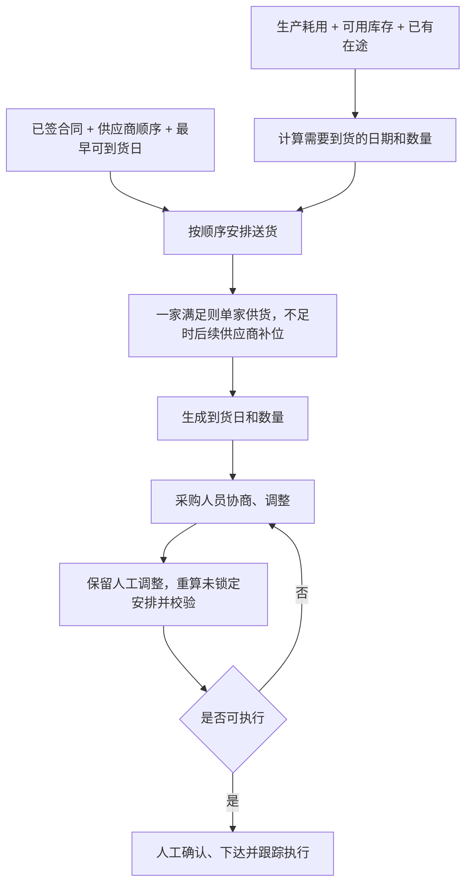

# 要货计划模块技术方案

## 1. 方案概述

大宗原材料采购合同签订后，到货安排通常可以协商。要货计划根据生产耗用、库存和已有在途，安排已签约供应商的送货先后顺序，再落实为每次送货的日期和数量。

核心回答三个问题：

1. 谁先送、谁后送；
2. 每次送多少；
3. 哪天到货。

**一家能满足需求时，由一家供货；一家无法满足时，才由后续供应商补位，允许交叉送货。** 系统先给出建议，采购人员协商调整并确认后下达。

## 2. 业务范围

- 在有效的已签合同范围内安排送货，计划明细关联到具体合同和订单。
- 读取生产计划、库存和预计到货信息，用于保障生产、保留必要缓冲并避免过早到货。
- 支持调整供应商顺序、单次送货日期和数量，调整后重新计算库存和执行可行性。
- 合同不足或供应商不能按时到货时，明确提示缺口和需要协调的事项。

## 3. 业务流程

## 4. 核心规则

### 4.1 计算补货需求

优先使用生产端已发布的每日原材料需求；如只有成品生产计划，则按有效 BOM 单耗和得率换算，两种来源不重复计入。

| 数据 | 计算口径 |
|---|---|
| 当前库存 | 质检合格、未冻结的可用实物量 |
| 已有在途 | 按明确的预计到货日期计入；没有日期的暂不计入 |
| 合同未执行量 | 可安排送货的额度，不直接计入库存 |
| 安全缓冲（Buffer） | 未来若干天的预计耗用量，可叠加固定安全库存 |

逐日库存按下式计算：

$$
I_d=I_{d-1}+\sum_jF_{jd}+\sum_jx_{jd}-R_d
$$

当日需要补充的数量为：

$$
Q_d^{\mathrm{need}}=\max\left(0,\ B_d+R_d-I_{d-1}-\sum_jF_{jd}\right)
$$

其中，$I_d$ 为日末预计库存，$F_{jd}$ 为固定到货量，$x_{jd}$ 为本次计划到货量，$R_d$ 为生产耗用量，$B_d$ 为安全缓冲量。

每天计算时纳入前面已安排的到货，避免重复补货。计划期末仍需读取缓冲天数内的后续耗用；数据缺失时提示补充，不能直接按零耗用处理。

### 4.2 确定送货顺序

- 默认按合同签订时间先后安排，先签先送。
- 采购人员可根据合同成本和实际协商结果调整顺序，系统保留调整理由。
- 同一供应商有多个合同时，明确各合同的执行先后及剩余可安排量。
- 合同最晚交期、供货能力和最早可到货日用于检查顺序是否可行；需要调整时说明原因。
- 禁运供应商及失效、暂停的合同不参与新增安排。

### 4.3 按顺序安排，必要时交叉送货

系统按当前顺序优先安排前面的供应商，在所需时间内能满足数量和安全缓冲时，不拆给多家。

只有前面的供应商受合同余量、可供量、最早可到货日或合同交期等限制，无法独立形成可执行计划时，才由后续供应商补位。补位后，后续需求仍按原顺序判断，不要求上一家合同全部执行完才能安排下一家。

例如，顺序为 $A\rightarrow B\rightarrow C$：

- 某次需要到货 300 吨，A 能按时提供 300 吨，则全部安排 A。
- A 只能按时提供 200 吨，则安排 A 送 200 吨、B 补 100 吨。
- A 无法及时到货，则由 B 补位；后续 A 恢复可供时，仍按原顺序优先安排 A。

供应商顺序表示供货优先级，实际到货可因补位出现交叉。系统应显示交叉原因，不为平均分配或均衡合同执行而主动拆单。

### 4.4 确定到货日

- 到货日用于计算库存。在保障生产和安全缓冲的前提下，尽量接近实际需要日。
- 系统根据供应商运输提前期计算最早可到货日，只判断计划是否可行，不安排具体发货和运输过程。
- 计划到货日早于最早可到货日，或遇到禁运、不可收货日期时，检查提前到货或后续供应商补位方案；仍无法满足则提示协调处理。
- 货物发出后，以 TMS 或供应商反馈的预计到货日更新库存投影和未锁定计划。

### 4.5 执行校验

| 检查项 | 要求 |
|---|---|
| 库存 | 每日预计库存满足生产耗用和安全缓冲 |
| 合同数量 | 新增安排不超过扣除已占用数量后的可安排余量；已下达和在途不重复扣减 |
| 合同期限 | 按合同约定检查有效期和最晚到货日期 |
| 供货与收货能力 | 按供应商、日期汇总供货量，按工厂、日期汇总收货量；均纳入已有安排和新增计划 |
| 到货可行性 | 计划到货日不早于供应商最早可到货日 |
| 禁运 | 禁运供应商不新增安排；已有在途单独标识并交由业务协调 |

最小要货量、整车量、固定送货日等仅在业务明确要求时启用，默认不设置。准时率和风险分可供人工参考，不作为默认排序依据。

## 5. 数学模型

模型按天安排各供应商的到货量，可采用混合整数规划求解。

### 5.1 参数与变量

设日期为 $d$，供应商为 $j$。供应商已按业务顺序排列，$r_j$ 为顺序号，数值越小越优先。

| 符号 | 含义 |
|---|---|
| $R_d$ | 第 $d$ 天的生产耗用量 |
| $B_d$ | 第 $d$ 天要求保留的安全缓冲量 |
| $F_{jd}$ | 已确认、已下达或已有在途的固定到货量 |
| $C_j$ | 扣除固定安排后，供应商 $j$ 的合同可安排余量 |
| $U_{jd}$ | 供应商 $j$ 第 $d$ 天还可增加的到货量 |
| $G_{jd}$ | 当天是否允许该供应商新增到货，$G_{jd}\in\{0,1\}$ |
| $H_d$ | 工厂第 $d$ 天的收货上限 |
| $x_{jd}$ | 本次计划安排供应商 $j$ 第 $d$ 天的到货量 |
| $I_d$ | 第 $d$ 天生产耗用后的预计库存 |
| $e_d$ | 第 $d$ 天低于安全缓冲的缺口量 |
| $y_j$ | 本次计划是否使用供应商 $j$，$y_j\in\{0,1\}$ |

$G_{jd}=1$ 需要同时满足：合同有效、未禁运、未超过最晚到货日期，且当天不早于最早可到货日。

### 5.2 约束

1. **逐日库存平衡**

   $$
   I_d=I_{d-1}+\sum_j(F_{jd}+x_{jd})-R_d
   $$

2. **安全缓冲约束**

   $$
   I_d+e_d\geq B_d,\qquad e_d\geq0
   $$

3. **合同余量约束**

   $$
   \sum_dx_{jd}\leq C_j,\quad\forall j
   $$

4. **供应商到货能力与可用状态约束**

   $$
   0\leq x_{jd}\leq U_{jd}G_{jd},\quad\forall j,d
   $$

5. **工厂收货能力约束**

   $$
   \sum_j(F_{jd}+x_{jd})\leq H_d,\quad\forall d
   $$

6. **供应商是否启用**

   $$
   x_{jd}\leq My_j,\quad\forall j,d
   $$

其中，$M$ 为足够大的计划数量上限。人工锁定的安排计入 $F_{jd}$，重算时不再改变。

### 5.3 求解目标

模型按以下顺序逐层优化，前一层达到最优后再优化下一层。

**目标 1：最小化安全缓冲缺口**

$$
\min \sum_d e_d
$$

**目标 2：最小化新增到货总量，避免多要货**

$$
\min \sum_{j,d} x_{jd}
$$

**目标 3：最小化顺序成本，优先使用排在前面的供应商**

$$
\min \sum_{j,d} r_jx_{jd}
$$

**目标 4：最小化启用供应商数量，一家能满足时不拆给多家**

$$
\min \sum_j y_j
$$

**目标 5：最小化计划期库存总量，使到货尽量接近实际需要日**

$$
\min \sum_d I_d
$$

这样既保证生产和安全缓冲，也能体现“按顺序安排、一家优先、不足时后续供应商补位”的业务规则。若第一个目标仍存在缺口，系统输出缺口日期和数量，不强行生成不可执行计划。

## 6. 人工协同与滚动调整

页面以“供应商顺序 + 送货日历 + 预计库存”展示结果。采购人员可拖动供应商顺序，也可修改、移除或锁定单次送货安排。

| 状态 | 重算处理 |
|---|---|
| 系统建议 | 按最新需求和顺序重新安排 |
| 人工调整 | 保留人工顺序和已锁定的日期、数量，重算其他安排 |
| 人工确认 | 冻结；需要修改时先撤回确认，再协商调整并重新确认 |
| 已下达或已有在途 | 作为固定安排；预计到货日以执行系统更新为准 |

调整供应商顺序时，仅重排未锁定安排；修改单次日期、数量或供应商后，该安排默认锁定。移除安排时保留移除记录，重算不直接恢复同一安排，仍有缺口则提示或安排替代方案。

每次调整即时更新预计库存、合同余额和风险日期。有冲突时保留人工方案并说明原因，存在库存低于安全缓冲、合同超量、禁运或交期不满足等阻断性冲突时，不能下达。

“重新生成系统方案”可重置未确认的人工顺序和安排，但保留已确认、已下达和已有在途安排，历史调整记录继续留存。

## 7. 输入与输出

### 7.1 输入

| 来源 | 主要数据 |
|---|---|
| APS / 生产计划 | 已发布的每日原材料需求，或成品计划及有效 BOM、得率 |
| WMS / SAP | 可用库存、质检及冻结状态、数据时间 |
| SAP / E采 / TMS | 已下达安排、在途数量、预计到货日期、执行状态 |
| 合同管理 | 合同与订单关联、供应商、签订日期、剩余量、已占用量、价格、有效期及最晚交期 |
| 供应商协同 / 人工维护 | 送货顺序、日期可供量、运输提前期、最早可到货日、禁运状态及原因 |
| 业务参数 | 安全缓冲天数、固定安全库存、规划周期、收货能力及实际启用的送货规则 |

运输提前期和最早可到货日缺少现成数据时，提供人工维护入口。供应商禁运和解除记录需包含原因、操作人和时间。

### 7.2 输出

- **送货顺序**：供应商及合同的优先顺序、调整理由和必要交叉送货的原因。
- **送货计划**：供应商、合同及订单、到货日、到货数量和计划状态。
- **校验结果**：逐日耗用、预计库存、安全缓冲、合同余额、风险日期和未覆盖数量。

确认后的计划提供给 E采 / SAP 或供应商协同平台，计划及执行风险同步至供应链驾驶舱。

## 8. 运行要求与异常处理

- 每日滚动计算；生产、库存、预计到货日、合同或禁运状态变化时，更新未锁定安排。
- 缺少有效需求、必要 BOM、及时库存或运输提前期时，提示补充数据，不输出缺乏依据的确定性安排。
- 合同量不足、供应商不能及时供货或当前库存低于安全缓冲时，列出风险日期、缺口数量及协调原因。
- 运输异常导致预计到货日变化时，重新计算库存和未锁定计划，并提示需要协调的缺口。
- 保存输入版本、供应商顺序、系统建议、人工调整、校验结果和确认版本，记录调整人、时间及理由。
- 常规计算目标为 3 秒内完成；计划经人工确认后下达。
