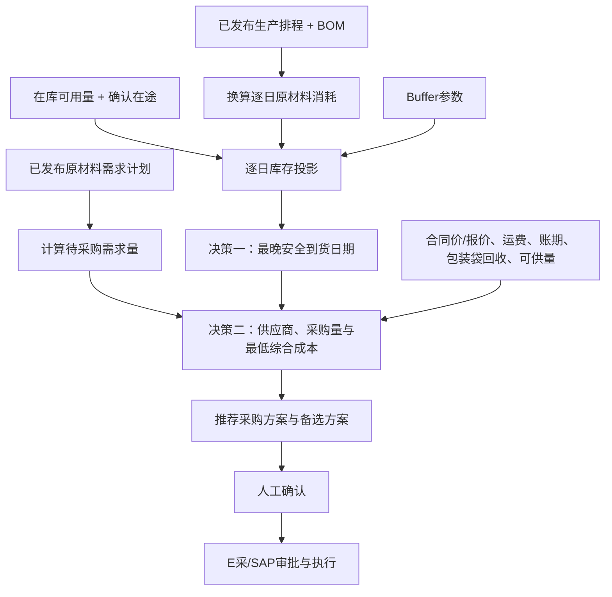

# 采购优化模块技术方案

## 1. 方案概述

采购优化模块面向原材料采购业务，在上游已经形成采购需求的基础上，进一步回答两个核心问题：

1. **最晚应在什么时间到货**：根据已发布生产排程、当前可用库存、已确认在途和采购缓冲，计算预计断料日期和最晚安全到货日期；
2. **形成什么采购方案**：在满足最晚到货时间和采购需求量的前提下，决定向哪个供应商采购、每个供应商采购多少、每个供应商最晚什么时候到货，并给出对应合同价、报价及综合成本。

这两部分不是两个互不相关的优化模型，而是前后衔接的两阶段决策：

```text
原材料采购需求
        ↓
生产排程 + 在库库存 + 已确认在途 + Buffer
        ↓
决策一：最晚安全到货日期
        ↓
按到货日期筛选可行供应商
        ↓
决策二：供应商、采购量与最低综合成本
        ↓
人工确认 → 采购审批与执行
```

到货时间变化会改变可选供应商范围和最低成本方案；如果没有足够供应商能够按期到货，系统应返回到货不可行提示，由业务人员决定是否加急采购、调整生产安排或调整缓冲参数，系统不自动修改生产排程。

## 2. 业务目标与模块边界

### 2.1 业务目标

- 避免采购到货过早造成库存和资金占用；
- 避免采购到货过晚导致原材料断料和生产中断；
- 在满足生产连续性和到货时间要求的前提下，降低采购综合成本；
- 统一比较合同价、当前报价、运费、账期和包装袋回收价值；
- 清晰展示推荐结果、约束条件和形成理由，最终由业务人员确认。

### 2.2 模块边界

- 采购总需求量来自上游已发布的原材料需求计划；
- 模块读取已发布生产排程，只用于计算逐日原材料消耗和采购到货时间，不编制或优化生产排程；
- 模块读取库存可用量，不维护库存台账，不替代库存管理模块；
- 模块读取已有采购订单、在途和合同数据，不直接生成正式采购订单；
- 模块不进行原材料需求预测和价格预测；
- 质量合格率、准时率和风险分供业务人员参考，不进入成本目标函数；
- 所有推荐方案都需要业务人员确认后，才能进入采购审批和执行。

## 3. 总体业务流程

### 3.1 公共数据准备

公共数据准备是两大决策模块的共同支撑，不作为独立的采购决策模块。

1. 获取已发布的原材料需求计划，形成待采购需求量；
2. 获取已发布生产排程及其版本；
3. 获取生效BOM、原材料单耗和生产得率；
4. 获取当前在库可用量；
5. 获取已有采购订单、确认在途数量和确认到货日期；
6. 获取生效合同、合同剩余未执行量和合同价；
7. 获取供应商当前报价、可供量、最早可到货日期、运费和账期；
8. 获取包装袋回收参数和供应商评价信息。

待采购需求量的基本口径为：

$$
待采购需求=\max\left(0,原材料计划需求-需求日期前可到货的已生效采购数量\right)
$$

### 3.2 两阶段决策流程



## 4. 两大核心决策模块

### 4.1 决策模块一：最晚到货时间

#### 4.1.1 决策目标

在不影响生产并保留业务设定Buffer的前提下，使采购尽量晚到货，降低库存提前占用。

该模块主要输出：

- 未来逐日原材料消耗；
- 未来逐日预计库存；
- 预计断料日期；
- 动态缓冲量；
- 本次采购的最晚安全到货日期；
- 无法按期到货时的缺口和风险日期。

#### 4.1.2 逐日排程耗用

成品生产排程按BOM单耗和生产得率转换为原材料逐日消耗：

$$
R_{id}=\sum_p S_{pd}\times\frac{u_{ip}}{\eta_{ip}}
$$

其中：

- \(S_{pd}\)：成品 \(p\) 在日期 \(d\) 的已发布排程产量；
- \(u_{ip}\)：物料 \(i\) 对成品 \(p\) 的标准单耗；
- \(\eta_{ip}\)：对应生产得率；
- \(R_{id}\)：物料 \(i\) 在日期 \(d\) 的预计消耗量。

#### 4.1.3 逐日库存投影

不加入新采购建议时，物料逐日预计库存为：

$$
I_{id}=I_{i,d-1}+A_{id}-R_{id}
$$

其中：

- \(I_{i0}\)：当前在库可用量；
- \(A_{id}\)：已有采购订单中确认在日期 \(d\) 到货的在途数量；
- \(I_{id}\)：日期 \(d\) 生产消耗后的预计库存。

只有具有明确到货日期的在途采购订单才能加入逐日库存投影。在手未执行合同没有确定到货日期，不能直接作为未来库存，只能作为采购方案中的合同价额度。

#### 4.1.4 Buffer折算

Buffer采用“未来若干天排程消耗量”的动态方式折算：

$$
B_{id}=\sum_{h=d+1}^{d+b_i}R_{ih}+SS_i
$$

其中：

- \(b_i\)：物料采购缓冲天数；
- \(SS_i\)：可选固定安全库存，未启用时取0；
- \(B_{id}\)：日期 \(d\) 对应的动态缓冲量。

相较固定吨数，按未来排程折算Buffer可以反映不同生产负荷下的真实风险。排程增加时缓冲量自动增加，排程下降时缓冲量相应下降。

#### 4.1.5 最晚安全到货日期

预计断料日期为：

$$
预计断料日期_i=\min\{d\mid I_{id}<0\}
$$

最晚安全到货日期为：

$$
最晚安全到货日期_i=\min\{d\mid I_{id}<B_{id}\}
$$

最晚安全到货日期通常早于预计断料日期。新采购建议必须在该日期或之前到货，才能保留设定的生产缓冲。

如果当前库存已经低于动态缓冲量，系统应提示立即到货或加急采购，不输出过去日期。如果投影周期内库存始终高于动态缓冲量，则输出“投影周期内无需新增到货”，而不是将投影期末误认为确定的最晚到货日期。

#### 4.1.6 到货时间技术约束

加入本次推荐采购到货量后，逐日库存按下式校验：

$$
I_{id}=I_{i,d-1}+A_{id}+X_{id}-R_{id}
$$

$$
I_{id}\geq B_{id},\quad\forall i,d
$$

其中，\(X_{id}\) 为本次推荐采购中在日期 \(d\) 到货的数量。供应商采购量必须在最晚安全到货日期或之前到货，并保证规划周期内预计库存不低于动态缓冲量。无法满足时，系统必须输出缺口数量和风险日期，不能通过自动降低Buffer或修改生产排程生成表面可行的方案。

### 4.2 决策模块二：采购组合与最低综合成本

#### 4.2.1 决策目标

在满足待采购需求量、供应能力和决策模块一给出的最晚安全到货日期的前提下，决定：

- 向哪个供应商采购；
- 每个供应商采购多少；
- 每个供应商最晚什么时候到货；
- 各供应商对应的合同价、报价及综合成本。

合同剩余额度、合同价与报价的数量拆分，以及运费、账期和包装袋回收价值的折算，均属于第四项综合成本的计算明细，不作为额外的采购决策结果。

#### 4.2.2 供应商到货可行性

供应商最早可到货日期不得晚于本次采购的最晚安全到货日期：

$$
供应商最早可到货日期_{ij}\leq 最晚安全到货日期_i
$$

不满足到货要求的供应商不进入成本求解，并在结果中说明剔除原因。每个入选供应商均输出“最晚到货日期”字段；在当前模型中，该日期采用该原材料的最晚安全到货日期。

如果可按期到货的供应商数量或可供量不足，系统输出：

- 无法按期覆盖的数量；
- 最早发生风险的日期；
- 可按期到货的供应商数量；
- 加急采购、调整Buffer或协调生产安排的业务提示。

#### 4.2.3 可执行采购价格

同一供应商的采购数量可以拆为两段：

1. 有效合同剩余量以内使用合同价；
2. 超出合同剩余量的部分使用当前报价。

合同量已经转为发货在途后，必须从合同未执行量中扣除，避免合同量和在途数量重复计算。

#### 4.2.4 包装袋回收成本

包装袋回收净收益按每吨原材料折算：

$$
b_{ij}=n_{ij}\times r_{ij}\times\max(0,v_{ij}-k_{ij})
$$

$$
g_{ij}=e_{ij}-b_{ij}
$$

其中：

- \(n_{ij}\)：每吨原材料使用的包装袋数量；
- \(r_{ij}\)：预计回收率；
- \(v_{ij}\)：单袋返还、残值或复用价值；
- \(k_{ij}\)：单袋收集、运输、清洗和分拣等处理成本；
- \(e_{ij}\)：未包含在合同价或报价中的包装袋原始成本；
- \(b_{ij}\)：每吨原材料包装袋回收净收益；
- \(g_{ij}\)：每吨原材料包装袋净成本。

如果合同价或报价已经包含包装袋成本，则 \(e_{ij}=0\)。如果供应商价格已经抵减回收返款，则 \(b_{ij}=0\)，避免重复计算。

#### 4.2.5 账期资金成本

账期带来的单位资金成本节省为：

$$
a_{ij}=p_{ij}\times资金成本率\times\frac{账期天数_{ij}}{365}
$$

其中，\(p_{ij}\) 为对应采购数量实际采用的合同价或当前报价。

#### 4.2.6 综合成本目标

采购综合成本目标为：

$$
\min Z=\sum_{i,j}\left(p_{ij}+f_{ij}-a_{ij}+g_{ij}\right)x_{ij}
$$

其中：

- \(x_{ij}\)：物料 \(i\) 向供应商 \(j\) 采购的数量；
- \(p_{ij}\)：可执行采购单价；
- \(f_{ij}\)：单位运输费用；
- \(a_{ij}\)：账期资金成本节省；
- \(g_{ij}\)：包装袋净成本。

求解优先级为：

1. 满足生产连续性和Buffer要求；
2. 满足采购需求量和供应能力约束；
3. 综合成本最低；
4. 对综合成本相同或在业务允许容差内的方案，优先选择更晚到货的方案。

质量合格率、准时率和风险分不进入目标函数，由业务人员在确认推荐方案时参考。

#### 4.2.7 采购组合技术约束

采购组合求解采用以下约束：

1. **采购需求约束**

   $$
   \sum_jx_{ij}\geq Q_i,\quad\forall i
   $$

   各供应商采购量合计不得低于待采购需求量 \(Q_i\)。

2. **供应能力约束**

   $$
   0\leq x_{ij}\leq U_{ij},\quad\forall i,j
   $$

   采购数量不能超过供应商最大可供量 \(U_{ij}\)，且采购数量不得为负。

3. **到货时间约束**

   只有供应商最早可到货日期不晚于该原材料最晚安全到货日期时，\(x_{ij}\) 才允许取正值。每个入选供应商的最晚到货日期不得晚于决策模块一计算的最晚安全到货日期。

## 5. 两大决策模块的衔接关系

| 决策一输出 | 对决策二的作用 |
|---|---|
| 最晚安全到货日期 | 作为供应商到货可行性筛选条件 |
| 最早风险日期和缺口 | 在采购组合不可行时用于解释原因 |
| Buffer参数 | 影响到货日期，进而影响供应商范围和成本 |

决策二如果无法找到满足日期和数量要求的采购组合，应将不可行结果返回决策一展示，但不能自动降低Buffer或修改生产排程。

## 6. 功能与技术架构

### 6.1 功能组成

| 功能层 | 主要功能 |
|---|---|
| 数据准备层 | 获取需求计划、生产排程、BOM、库存、在途、合同、供应商和价格数据 |
| 到货时间决策引擎 | 排程耗用换算、逐日库存投影、Buffer计算、断料日期和最晚安全到货日期计算 |
| 采购组合优化引擎 | 供应商筛选、合同价额度拆分、采购量分配和综合成本求解 |
| 方案解释层 | 展示库存曲线、到货日期、供应商分配、成本拆解、缺口及形成理由 |
| 业务确认层 | 支持业务人员调整参数、确认最终数量和到货日期，并提交审批 |

### 6.2 运行顺序

1. 校验需求计划、生产排程、BOM、库存和在途数据是否有效；
2. 计算待采购需求量；
3. 逐日换算排程耗用并形成库存投影；
4. 计算预计断料日、动态Buffer和最晚安全到货日；
5. 按最晚到货日筛选供应商；
6. 计算合同价额度、当前报价额度及包装袋回收净收益；
7. 求解最低综合成本采购组合；
8. 输出推荐方案、备选方案和不可行原因；
9. 业务人员确认后进入采购审批和执行。

## 7. 输入与输出

### 7.1 输入数据

| 数据来源 | 输入内容 | 用途 |
|---|---|---|
| 原材料需求计划 | 原材料、周期、需求数量、版本、发布状态 | 计算待采购需求量 |
| APS/生产排程 | 成品、生产日期、排程数量、版本、发布状态 | 换算逐日原材料消耗 |
| BOM/工艺数据 | 原材料单耗、生产得率、生效日期 | 支撑排程耗用换算 |
| WMS/SAP | 在库实物、冻结量、质检状态、可用量、数据时间 | 形成库存投影期初量 |
| SAP/E采/TMS | 采购订单、已发货量、在途量、确认到货日期、状态 | 扣减已有采购承诺并加入库存投影 |
| 合同管理/E采 | 合同价、有效期、合同总量、已执行量、剩余未执行量 | 形成合同价采购额度 |
| 供应商数据 | 当前报价、有效期、最大可供量、最早可到货日期、运费、账期 | 供应商筛选和成本优化 |
| 包装回收数据 | 是否可回收、每吨袋数、回收率、单袋价值、处理成本 | 计算包装袋回收净收益 |
| 供应商评价 | 质量合格率、准时率、风险分 | 供人工确认参考 |
| 业务参数 | Buffer天数、可选固定安全库存、投影周期、成本容差 | 到货时间和分层求解 |
| 市场行情 | 当前期货价格、已锁价数量 | 辅助采购和锁价判断 |
| 财务参数 | 资金成本率 | 折算账期资金成本 |

### 7.2 输出结果

| 采购方案结果 | 输出内容 |
|---|---|
| 1. 供应商选择 | 向哪个供应商采购 |
| 2. 供应商采购量 | 每个供应商采购多少 |
| 3. 供应商最晚到货日期 | 每个供应商最晚什么时候到货 |
| 4. 价格与综合成本 | 各供应商对应的合同价、报价、合同价量与报价量，以及采购成本、运费、账期节省、包装袋成本、回收净收益和综合成本 |

逐日库存投影、预计断料日期、Buffer、风险缺口、备选方案及形成理由作为采购人员判断和解释上述四项结果的辅助信息，不扩展为新的采购方案决策项。

## 8. 运行与接口要求

### 8.1 运行机制

- 每月根据已发布原材料需求计划形成月度采购需求和合同/锁价建议；
- 每日滚动读取生产排程、库存和确认在途，重新计算最晚安全到货日期；
- 生产排程、库存、在途日期、供应商最早到货日期或Buffer变化时，重新计算尚未执行的采购方案；
- 支持业务人员人工触发重新求解；
- 每次计算保存输入版本、参数、结果和人工调整记录；
- 常规采购方案求解应在3秒内完成。

### 8.2 核心接口

- 从需求计划服务获取已发布原材料需求计划；
- 从APS获取已发布逐日生产排程和版本状态；
- 从BOM/工艺数据服务获取原材料单耗、生产得率和生效日期；
- 从WMS/SAP获取在库可用量和数据时间；
- 从SAP/E采/TMS获取采购订单、发货、在途和确认到货日期；
- 从合同管理/E采获取合同价、有效期和剩余未执行量；
- 从统一数据服务层获取供应商报价、可供量、最早可到货日期、运费、账期、包装袋参数和评价数据；
- 从财务系统获取资金成本率；
- 获取当前期货价格和已确认锁价信息；
- 向E采/SAP提供人工确认后的供应商、采购数量、各供应商最晚到货日期及执行价格依据；
- 向供应链驾驶舱推送采购方案、到货风险和执行状态。

## 9. 异常与业务提示

- 生产排程未发布或版本失效时，不输出确定性最晚到货日期；
- BOM缺失或失效时，提示无法将成品排程换算为原材料消耗；
- 库存数据超过业务设定时效时，暂停到货时间决策并提示刷新；
- 在途订单没有确认到货日期时，不计入逐日库存投影，并提示人工确认；
- 当前库存已经低于动态Buffer时，提示立即到货或加急采购；
- 没有供应商能够满足最晚安全到货日期时，提示到货缺口，不自动修改生产排程；
- 可按期到货的供应商总供货能力不足时，输出缺口数量和最早风险日期；
- 生产排程、库存、在途或供应商条件变化时，保留原方案并生成差异和调整建议；
- 所有采购建议均需人工确认，不自动生成正式合同或采购订单。
