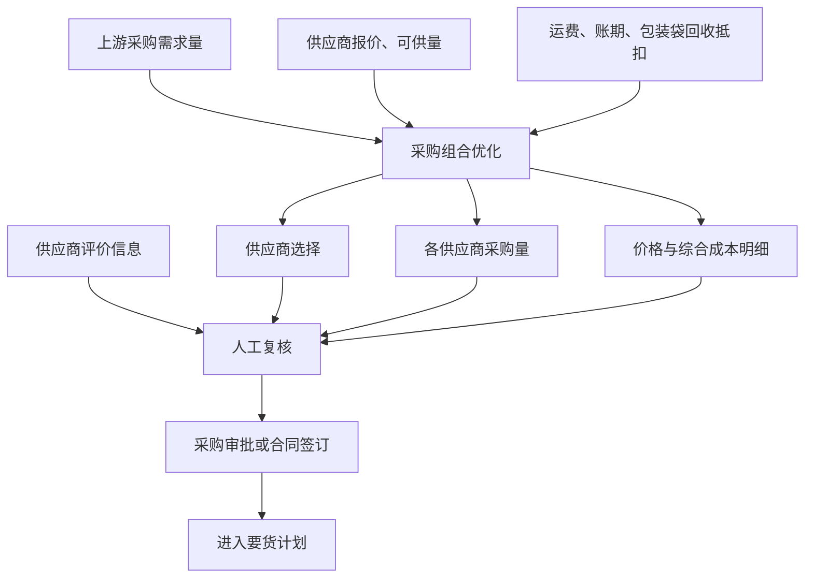

# 采购优化模块技术方案

## 1. 方案概述

采购优化模块面向原材料采购决策，在上游已经给出采购需求量的基础上，只回答两个问题：

1. 向哪些供应商采购；
2. 每个供应商采购多少。

系统比较供应商报价、运费、账期和包装袋回收抵扣，在满足采购数量、供应能力和供应商数量等要求的前提下，形成综合成本较低的采购组合。

```text
上游采购需求量
        ↓
供应商范围 + 报价 + 可供量 + 成本参数
        ↓
采购组合优化
        ↓
供应商选择 + 各供应商采购量 + 综合成本
        ↓
人工确认 → 采购审批/合同签订
```

采购优化模块不读取库存和生产排程，不计算供货日期。采购合同签订后，具体由哪个已签约供应商供货、供货多少和什么时候供货，由独立的要货计划模块决策。

## 2. 业务目标与模块边界

### 2.1 业务目标

- 从合格供应商中选择采购供应商；
- 合理分配各供应商采购数量；
- 统一比较供应商报价、运费、账期和包装袋回收抵扣；
- 在业务约束内降低采购综合成本；
- 展示推荐方案、备选方案和成本形成依据，供采购人员确认。

### 2.2 模块边界

- 采购需求量由上游需求计划提供，本模块不预测需求；
- 本模块不读取或维护原材料库存；
- 本模块不读取、编制或优化生产排程；
- 本模块不计算最晚到货时间和具体供货安排；
- 已签合同的供货数量与供货日期由要货计划模块负责；
- 本模块处于供应商选择和采购量决策阶段，只使用供应商有效报价，不读取或拆分已签合同价格额度；
- 市场价格趋势仅辅助判断供应商报价所处水平，不作为确定性价格预测；
- 质量合格率、准时率和风险分供采购人员参考，不直接进入成本目标函数；
- 模型不计算包装袋数量、回收率、残值和处理成本，只接收业务或财务已经核定的“包装袋回收抵扣（元/吨）”；
- 推荐方案经人工确认后才能进入采购审批或合同签订流程。

## 3. 总体业务流程



## 4. 核心决策逻辑与技术方案

### 4.1 决策变量

设：

- \(x_{ij}\)：物料 \(i\) 向供应商 \(j\) 的采购数量；
- \(y_{ij}\)：是否选择供应商 \(j\)，选择为1，否则为0。

最终业务结果展示供应商选择和各供应商采购量，成本统一按供应商当前有效报价计算。

### 4.2 有效供应商报价

每个候选供应商只使用一个当前有效报价 \(p_{ij}\)：

1. 报价必须在采购决策日有效；
2. 报价应与本次物料、数量口径和贸易条件一致；
3. 报价失效或口径不一致时，不进入求解并提示业务人员更新。

### 4.3 账期资金成本

账期带来的单位资金成本节省为：

$$
a_{ij}=p_{ij}\times资金成本率\times\frac{账期天数_{ij}}{365}
$$

其中，\(p_{ij}\) 为供应商当前有效报价。

### 4.4 包装袋回收抵扣

包装袋回收不在模型内拆分计算，业务或财务根据实际回收政策，直接为每个供应商维护一个单位抵扣金额 \(b_{ij}\)，单位为元/吨：

- 可以回收且有明确抵扣标准时，填写核定的元/吨抵扣金额；
- 不可回收或暂时没有核定标准时，填写0；
- 袋数、回收率、单袋价值和处理成本等明细留在包装物或财务台账中，不作为模型输入。

采购数量为 \(x_{ij}\) 时，包装袋回收抵扣合计为 \(b_{ij}x_{ij}\)。

### 4.5 综合成本目标

采购综合成本目标为：

$$
\min Z=\sum_{i,j}\left[
(p_{ij}+f_{ij}-a_{ij}-b_{ij})x_{ij}
\right]
$$

其中：

- \(p_{ij}\)：供应商当前有效报价；
- \(f_{ij}\)：单位运输费用；
- \(a_{ij}\)：报价对应的账期资金成本节省；
- \(b_{ij}\)：业务或财务核定的包装袋回收抵扣，单位为元/吨。

模型不推导包装袋回收过程，只将单位抵扣金额直接从综合单价中扣减：

$$
综合单价=采购价格+运费-账期资金节省-包装袋回收抵扣
$$

### 4.6 求解约束

约束与采购组合技术方案一起求解，不单独形成业务模块。

1. **采购需求量约束**

   $$
   \sum_jx_{ij}=Q_i,\quad\forall i
   $$

   各供应商采购量合计等于上游给出的采购需求量 \(Q_i\)。

2. **供应能力约束**

   $$
   0\leq x_{ij}\leq U_{ij}y_{ij},\quad\forall i,j
   $$

   采购数量不能超过供应商最大可供量 \(U_{ij}\)。

3. **最少供应商数约束**

   $$
   \sum_jy_{ij}\geq N_i^{min}
   $$

   入选供应商数量不少于业务人员设置的最少供应商数 \(N_i^{min}\)。默认值为1；存在供应风险分散要求时，可人工调整为至少2家或更多。即使最少供应商数为1，当单一供应商可供量或最高采购占比不足时，模型也应自动增加供应商，直至覆盖采购需求。

4. **供应商占比约束**

   $$
   L_iQ_iy_{ij}\leq x_{ij}\leq H_iQ_iy_{ij}
   $$

   入选供应商采购量满足最低占比 \(L_i\) 和最高占比 \(H_i\)。

5. **非负与整数约束**

   所有采购数量不得为负；如业务要求按整车、整托或整吨采购，可增加采购数量步长约束。

### 4.7 求解优先级

1. 完整覆盖采购需求量；
2. 满足供应能力、最少供应商数和采购占比约束；
3. 综合成本最低；
4. 成本相同或在业务允许容差内时，优先使用更少的供应商，避免无必要的拆单；
5. 供应商数量也相同时，优先选择质量合格率和准时率较高、风险分较低的方案供人工确认。

## 5. 功能与技术架构

| 功能层 | 主要功能 |
|---|---|
| 数据准备层 | 获取采购需求、供应商报价、可供量和成本参数 |
| 市场辅助判断层 | 展示价格K线、均线和趋势判断，辅助判断供应商报价 |
| 采购组合优化引擎 | 供应商选择、采购量分配和成本求解 |
| 方案解释层 | 展示供应商、报价、采购量、综合成本、备选方案和理由 |
| 业务确认层 | 支持采购人员调整参数、确认方案并提交审批 |

运行顺序如下：

1. 获取上游采购需求量；
2. 校验供应商、报价和成本参数；
3. 计算各供应商可执行综合单价；
4. 按约束求解供应商组合和采购量；
5. 输出推荐方案、备选方案及不可行原因；
6. 采购人员确认后进入采购审批或合同签订。

## 6. 输入与输出

### 6.1 输入数据

| 数据来源 | 输入内容 | 用途 |
|---|---|---|
| 采购需求计划 | 原材料、需求周期、采购需求量、版本 | 确定本次需要分配的采购总量 |
| 供应商主数据 | 合格供应商范围、最大可供量 | 确定候选供应商和供应能力 |
| 供应商报价 | 当前报价、报价有效期 | 计算报价采购成本 |
| 物流参数 | 单位运费 | 计算运输成本 |
| 财务参数 | 账期、资金成本率 | 折算资金成本 |
| 包装袋回收参数 | 各供应商包装袋回收抵扣（元/吨） | 直接抵减综合单价；不在模型中拆分计算 |
| 供应商评价 | 质量合格率、准时率、风险分 | 供采购人员复核 |
| 求解参数 | 最少供应商数、最低/最高采购占比、成本容差 | 控制采购组合求解；最少供应商数默认1，单一供应商最高占比默认100% |
| 市场行情 | 历史价格、当前价格 | 辅助判断供应商报价及采购时点 |

### 6.2 输出结果

| 输出结果 | 输出内容 |
|---|---|
| 1. 供应商选择 | 向哪些供应商采购 |
| 2. 供应商采购量 | 每个供应商采购多少 |

同时展示各供应商报价、采购数量、采购金额、运费、账期节省、包装袋回收抵扣和综合成本，作为上述两个决策结果的成本依据。

## 7. 运行与接口要求

### 7.1 运行机制

- 根据已发布采购需求计划按月或按需运行；
- 采购需求量、供应商报价、可供量或成本参数变化时重新求解；
- 支持采购人员调整最少供应商数、采购占比、资金成本率和包装袋回收抵扣后重新求解；
- 每次计算保存输入版本、参数、推荐结果和人工调整记录；
- 常规采购组合求解应在3秒内完成。

### 7.2 核心接口

- 从采购需求服务获取已发布采购需求量；
- 从供应商管理获取合格供应商范围和最大可供量；
- 从采购平台获取供应商报价和报价有效期；
- 从物流和财务系统获取运费、账期和资金成本率；
- 获取各供应商核定的包装袋回收抵扣金额；
- 获取供应商评价和市场行情；
- 向采购审批或合同管理提供人工确认后的供应商和采购数量；
- 将人工确认并完成审批后的供应商、采购数量及新签合同提供给要货计划模块。

## 8. 异常与业务提示

- 采购需求量未发布或版本失效时，不启动求解；
- 供应商报价失效时，不使用该报价并提示更新；
- 候选供应商总可供量不足时，输出采购缺口；
- 最少供应商数、最低占比和最高占比相互冲突时，输出约束冲突原因；
- 包装袋回收抵扣未维护时默认按0计算，不阻塞采购求解；
- 所有采购建议均需人工确认，不自动签订合同或生成正式采购订单。
