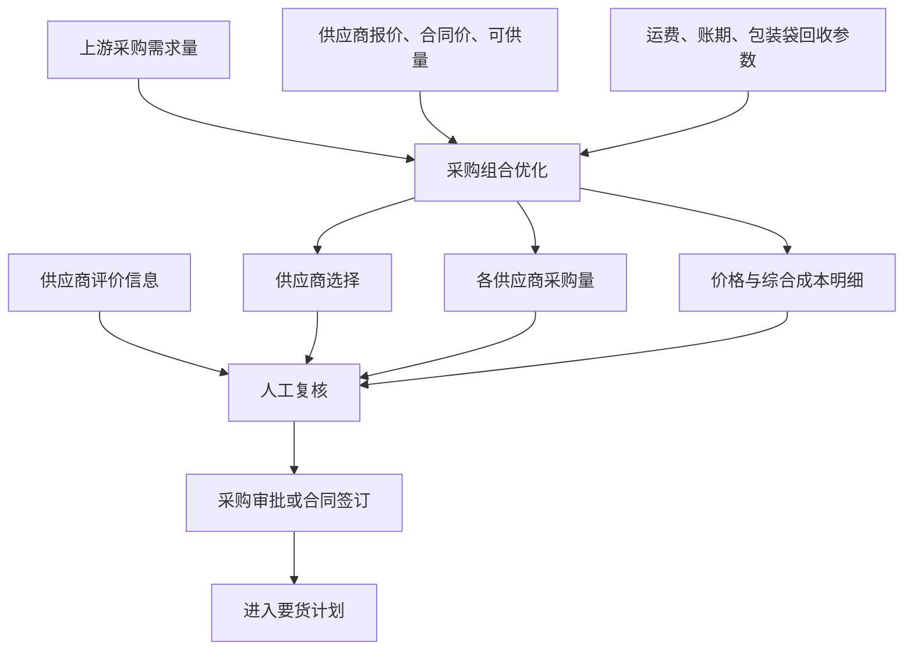

# 采购优化模块技术方案

## 1. 方案概述

采购优化模块面向原材料采购决策，在上游已经给出采购需求量的基础上，只回答两个问题：

1. 向哪些供应商采购；
2. 每个供应商采购多少。

系统比较供应商报价、合同价、运费、账期和包装袋回收价值，在满足采购数量、供应能力和供应商数量等要求的前提下，形成综合成本较低的采购组合。

```text
上游采购需求量
        ↓
供应商范围 + 报价/合同价 + 可供量 + 成本参数
        ↓
采购组合优化
        ↓
供应商选择 + 各供应商采购量 + 综合成本
        ↓
人工确认 → 采购审批/合同签订
```

采购优化模块不读取库存和生产排程，不计算供货日期。采购合同签订后，具体由哪个已签约供应商供货、供货多少和什么时候供货，由独立的要货计划模块决策。

## 2. 业务目标与模块边界

### 2.1 业务目标

- 从合格供应商中选择采购供应商；
- 合理分配各供应商采购数量；
- 统一比较合同价、当前报价、运费、账期和包装袋回收价值；
- 在业务约束内降低采购综合成本；
- 展示推荐方案、备选方案和成本形成依据，供采购人员确认。

### 2.2 模块边界

- 采购需求量由上游需求计划提供，本模块不预测需求；
- 本模块不读取或维护原材料库存；
- 本模块不读取、编制或优化生产排程；
- 本模块不计算最晚到货时间和具体供货安排；
- 已签合同的供货数量与供货日期由要货计划模块负责；
- 市场价格趋势仅辅助采购与锁价判断，不作为确定性价格预测；
- 质量合格率、准时率和风险分供采购人员参考，不直接进入成本目标函数；
- 推荐方案经人工确认后才能进入采购审批或合同签订流程。

## 3. 总体业务流程



## 4. 核心决策逻辑与技术方案

### 4.1 决策变量

设：

- \(x_{ij}^{c}\)：物料 \(i\) 向供应商 \(j\) 按合同价采购的数量；
- \(x_{ij}^{q}\)：物料 \(i\) 向供应商 \(j\) 按当前报价采购的数量；
- \(x_{ij}=x_{ij}^{c}+x_{ij}^{q}\)：物料 \(i\) 向供应商 \(j\) 的总采购数量；
- \(y_{ij}\)：是否选择供应商 \(j\)，选择为1，否则为0。

最终业务结果只展示供应商选择和各供应商总采购量；合同价量与报价量作为价格和成本明细展示。

### 4.2 可执行采购价格

同一供应商的采购数量可按价格来源拆分：

1. 有效合同剩余额度以内使用合同价；
2. 超出合同剩余额度的部分使用当前报价；
3. 合同失效或没有剩余额度时，全部使用当前有效报价。

需要保证合同未执行量与已转为采购订单的数量不重复计算。

### 4.3 包装袋回收成本

包装袋回收净收益按每吨原材料折算：

$$
b_{ij}=n_{ij}\times r_{ij}\times\max(0,v_{ij}-k_{ij})
$$

$$
g_{ij}=e_{ij}-b_{ij}
$$

其中：

- \(n_{ij}\)：每吨原材料使用的包装袋数量；
- \(r_{ij}\)：预计回收率；
- \(v_{ij}\)：单袋返还、残值或复用价值；
- \(k_{ij}\)：单袋收集、运输、清洗和分拣成本；
- \(e_{ij}\)：未包含在采购价格中的包装袋原始成本；
- \(b_{ij}\)：每吨包装袋回收净收益；
- \(g_{ij}\)：每吨包装袋净成本。

如果采购价格已经包含包装袋成本，则 \(e_{ij}=0\)；如果价格已经抵减回收返款，则 \(b_{ij}=0\)，避免重复计算。

### 4.4 账期资金成本

账期带来的单位资金成本节省为：

$$
a_{ij}=p_{ij}\times资金成本率\times\frac{账期天数_{ij}}{365}
$$

其中，\(p_{ij}\) 为对应数量采用的合同价或当前报价。

### 4.5 综合成本目标

采购综合成本目标为：

$$
\min Z=\sum_{i,j}\left[
(p_{ij}^{c}+f_{ij}-a_{ij}^{c}+g_{ij})x_{ij}^{c}
+(p_{ij}^{q}+f_{ij}-a_{ij}^{q}+g_{ij})x_{ij}^{q}
\right]
$$

其中：

- \(p_{ij}^{c}\)：合同价；
- \(p_{ij}^{q}\)：当前报价；
- \(f_{ij}\)：单位运输费用；
- \(a_{ij}^{c},a_{ij}^{q}\)：对应价格口径的账期资金成本节省；
- \(g_{ij}\)：包装袋净成本。

### 4.6 求解约束

约束与采购组合技术方案一起求解，不单独形成业务模块。

1. **采购需求量约束**

   $$
   \sum_jx_{ij}=Q_i,\quad\forall i
   $$

   各供应商采购量合计等于上游给出的采购需求量 \(Q_i\)。

2. **供应能力约束**

   $$
   0\leq x_{ij}\leq U_{ij}y_{ij},\quad\forall i,j
   $$

   采购数量不能超过供应商最大可供量 \(U_{ij}\)。

3. **合同价额度约束**

   $$
   0\leq x_{ij}^{c}\leq C_{ij}
   $$

   合同价采购量不能超过有效合同剩余额度 \(C_{ij}\)。

4. **供应商数量约束**

   $$
   \sum_jy_{ij}=N_i
   $$

   入选供应商数量等于业务人员设置的目标供应商数量 \(N_i\)。

5. **供应商占比约束**

   $$
   L_iQ_iy_{ij}\leq x_{ij}\leq H_iQ_iy_{ij}
   $$

   入选供应商采购量满足最低占比 \(L_i\) 和最高占比 \(H_i\)。

6. **非负与整数约束**

   所有采购数量不得为负；如业务要求按整车、整托或整吨采购，可增加采购数量步长约束。

### 4.7 求解优先级

1. 完整覆盖采购需求量；
2. 满足供应能力、供应商数量和采购占比约束；
3. 综合成本最低；
4. 成本相同或在业务允许容差内时，优先选择质量合格率和准时率较高、风险分较低的方案供人工确认。

## 5. 功能与技术架构

| 功能层 | 主要功能 |
|---|---|
| 数据准备层 | 获取采购需求、供应商、价格、合同额度和成本参数 |
| 市场辅助判断层 | 展示价格K线、均线和趋势判断，辅助采购与锁价 |
| 采购组合优化引擎 | 供应商选择、合同价/报价额度拆分、采购量分配和成本求解 |
| 方案解释层 | 展示供应商、采购量、价格来源、综合成本、备选方案和理由 |
| 业务确认层 | 支持采购人员调整参数、确认方案并提交审批 |

运行顺序如下：

1. 获取上游采购需求量；
2. 校验供应商、报价、合同和成本参数；
3. 计算各供应商可执行综合单价；
4. 按约束求解供应商组合和采购量；
5. 输出推荐方案、备选方案及不可行原因；
6. 采购人员确认后进入采购审批或合同签订。

## 6. 输入与输出

### 6.1 输入数据

| 数据来源 | 输入内容 | 用途 |
|---|---|---|
| 采购需求计划 | 原材料、需求周期、采购需求量、版本 | 确定本次需要分配的采购总量 |
| 供应商主数据 | 合格供应商范围、最大可供量 | 确定候选供应商和供应能力 |
| 供应商报价 | 当前报价、报价有效期 | 计算报价采购成本 |
| 合同管理 | 合同价、有效期、剩余可用额度 | 计算合同价采购额度 |
| 物流参数 | 单位运费 | 计算运输成本 |
| 财务参数 | 账期、资金成本率 | 折算资金成本 |
| 包装回收数据 | 每吨袋数、回收率、回收价值、处理成本 | 计算包装袋净成本 |
| 供应商评价 | 质量合格率、准时率、风险分 | 供采购人员复核 |
| 求解参数 | 目标供应商数量、最低/最高采购占比、成本容差 | 控制采购组合求解 |
| 市场行情 | 历史价格、当前价格、已锁价量 | 辅助采购与锁价判断 |

### 6.2 输出结果

| 输出结果 | 输出内容 |
|---|---|
| 1. 供应商选择 | 向哪些供应商采购 |
| 2. 供应商采购量 | 每个供应商采购多少 |

同时展示各供应商合同价、报价、合同价量、报价量、采购成本、运费、账期节省、包装袋成本、回收净收益和综合成本，作为上述两个决策结果的成本依据。

## 7. 运行与接口要求

### 7.1 运行机制

- 根据已发布采购需求计划按月或按需运行；
- 采购需求量、供应商报价、合同额度或成本参数变化时重新求解；
- 支持采购人员调整供应商数量、采购占比和资金成本率后重新求解；
- 每次计算保存输入版本、参数、推荐结果和人工调整记录；
- 常规采购组合求解应在3秒内完成。

### 7.2 核心接口

- 从采购需求服务获取已发布采购需求量；
- 从供应商管理获取合格供应商范围和最大可供量；
- 从采购平台获取供应商报价和报价有效期；
- 从合同管理获取合同价、有效期和剩余可用额度；
- 从物流和财务系统获取运费、账期和资金成本率；
- 获取包装袋回收参数、供应商评价和市场行情；
- 向采购审批或合同管理提供人工确认后的供应商和采购数量；
- 将已签合同及供应商承诺量提供给要货计划模块。

## 8. 异常与业务提示

- 采购需求量未发布或版本失效时，不启动求解；
- 供应商报价失效时，不使用该报价并提示更新；
- 合同已失效或剩余额度不足时，超出部分按有效报价计算；
- 候选供应商总可供量不足时，输出采购缺口；
- 目标供应商数量、最低占比和最高占比相互冲突时，输出约束冲突原因；
- 包装袋回收参数缺失时，按不抵减回收收益计算并提示补充；
- 所有采购建议均需人工确认，不自动签订合同或生成正式采购订单。
