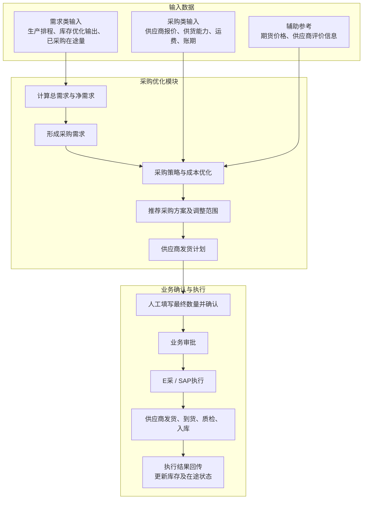

# 采购优化模块技术方案

## 1. 模块目标与边界

采购优化模块解决四个问题：需要采购多少、向哪些供应商采购、各采购多少、如何安排发货。

模块根据生产排程形成的物料消耗计划，结合现有库存和已采购在途量计算净需求。当库存达到或预计达到危险水位时进行预警，并生成采购建议。

采购建议经业务人员确认后进入采购审批和执行流程。

## 2. 主要业务问题

- **采购需求算不清**：消耗计划、现有库存和已采购在途量未统一计算。
- **供应商选择依赖经验**：价格、质量合格率、准时率和风险分没有统一比较。
- **采购数量不好分配**：多个供应商同时可供货时，人工难以快速形成成本较低的组合。
- **合同锁价缺少依据**：采购需求与当前期货价格没有结合，锁价决策主要依赖经验。
- **发货计划不够及时**：生产排程变化后，供应商发货计划不能及时调整。

## 3. 总体技术方案

### 3.1 采购需求计算

1. 根据生产排程对应的物料消耗计划计算各物料总需求；
2. 获取当前可用库存；
3. 统计已采购在途量；
4. 计算净需求；
5. 接收库存优化模块输出的：未来库存水位，危险水位预警，预期采购需求量，期望到货时间

净需求的基本计算口径为：

$$
净需求=消耗计划总需求-现有可用库存-已采购在途量
$$

当预计库存低于或等于库存优化模块给出的危险水位时，触发库存预警并形成最低补货需求：

$$
预计库存\leq危险水位\quad\Rightarrow\quad触发预警和补货
$$

已采购在途量是指已经下单但尚未完成入库的数量，包括尚未发货、运输途中、到厂待检等状态。系统内部按订单状态管理，并按预计可用日期分期计入，避免晚于生产消耗时间到货的物料被提前视为可用库存。

### 3.2 供应商评价

供应商评价主要展示历史及当前采购价格、质量合格率、准时交付率和风险分，供业务人员参考。优化模型不使用供应商评分，只根据成本计算推荐采购数量。

### 3.4 采购策略与方案输出

- 根据净需求和当前期货价格，辅助判断是否签订采购合同锁定价格；
- 根据供应商报价、供货能力、运输费用和账期计算成本较低的采购数量范围；
- 输出推荐方案和备选方案，展示供应商、采购数量、综合成本和建议到货日期；
- 推荐数量允许业务人员调整，最终采购数量由业务人员填写并确认；
- 根据生产排程制定并调整供应商发货计划。

财务提供统一的资金成本率，如年化利率，用于计算不同账期节省的资金成本。其他条件相同时，账期越长，资金成本越低。

### 3.5 采购模块总图

## 4. 优化模型

### 4.1 模型选型

采购优化采用线性规划模型，按照“物料—供应商—到货周期”计算推荐采购量，在满足最低补货需求、供应能力和到货时间要求的前提下，使采购综合成本最低。

### 4.2 符号与变量

**索引**

| 符号 | 含义 |
|---|---|
| \(i\) | 物料 |
| \(j\) | 供应商 |
| \(t\) | 到货周期，根据生产排程的管理粒度按周或按日 |

**主要参数**

| 符号 | 含义 |
|---|---|
| \(Q_{it}\) | 物料 \(i\) 在周期 \(t\) 的最低补货需求 |
| \(c_{ij}\) | 供应商 \(j\) 对物料 \(i\) 的报价单价 |
| \(f_{ij}\) | 从供应商 \(j\) 采购物料 \(i\) 的单位运输费用 |
| \(a_{ij}\) | 根据供应商账期和资金成本率折算的单位资金成本节省 |
| \(h_i\) | 物料 \(i\) 的单位库存成本，保留接口，默认值为0 |
| \(U_{ijt}\) | 供应商在周期 \(t\) 的最大可供数量 |
| \(L_{ij}\) | 供应商备货、运输和质检总提前期 |

**决策变量**

| 变量 | 含义 |
|---|---|
| \(x_{ijt}\) | 供应商 \(j\) 在周期 \(t\) 到货的物料 \(i\) 数量 |

### 4.3 优化目标

模型以采购综合成本最低为目标：

$$
\min Z=
\sum_{i,j,t}
\left(c_{ij}+f_{ij}+h_i-a_{ij}\right)x_{ijt}
$$

其中，\(c_{ij}\) 为供应商报价，\(f_{ij}\) 为运输成本，\(h_i\) 为预留库存成本且默认值为0，\(a_{ij}\) 为账期带来的资金成本节省，因此从总成本中扣减。

- 模型只比较采购相关成本；
- 质量合格率、准时率、风险分等供应商评价指标不进入目标函数，仅供业务人员参考。

账期资金成本节省可按以下方式折算：

$$
a_{ij}=c_{ij}\times 资金成本率\times\frac{账期天数_{ij}}{365}
$$

### 4.4 约束条件

#### 4.4.1 补货量约束

$$
\sum_jx_{ijt}\geq Q_{it},\quad \forall i,t
$$

各供应商推荐采购量之和不得低于库存模块计算的最低补货需求。模型在成本最小的目标下给出推荐值，每个供应商的可调整范围为0至最大可供量，最终采购数量由业务人员填写确认。

#### 4.4.2 供应能力约束

$$
0\leq x_{ijt}\leq U_{ijt},\quad \forall i,j,t
$$

采购数量不能超过供应商在对应周期内的最大可供数量。

#### 4.4.3 到货时间约束

供应商发货时间和到货时间应满足其备货、运输和质检提前期：

$$
建议下单日期_{ijt}=计划到货日期_t-L_{ij}
$$

如果按供应商提前期已经无法满足计划到货日期，系统进行提示，由业务人员决定是否仍向该供应商采购。

#### 4.4.4 变量约束

$$
x_{ijt}\geq0
$$

采购量为非负数。

## 5. 模型输入

| 数据来源分类 | 输入内容 | 说明 |
|---|---|---|
| 库存优化模块 | 当前可用库存、未来库存水位、危险水位预警、预期采购需求量、期望到货时间 | 作为采购需求和到货时间要求 |
| 生产排程 | 物料、计划周期、计划消耗量 | 用于计算物料总需求 |
| SAP/E采、WMS、TMS | 已采购在途量、订单状态、预计可用日期 | 已采购在途量包括尚未发货、运输中和到厂待检数量 |
| SAP/E采、LIMS/QMS | 供应商历史价格、质量合格率、准时交付率、风险分 | 仅供业务人员查看和选择供应商，不进入成本模型 |
| 数据服务层获取 | 各供应商本次报价、报价有效期、最大可供数量 | 作为本次采购优化的主要输入 |
| 数据服务层获取 | 备货、运输、卸货、质检时间及运输费用 | 用于判断到货时间和计算运输成本 |
| 外部行情或人工输入 | 当前期货价格、已确认合同锁价及有效期 | 用于辅助合同锁价判断，不进行价格预测 |
| 财务提供 | 付款方式、账期、资金成本率 | 用于计算账期带来的资金成本节省 |
| 系统配置 | 库存持有成本 | 预留模型参数，默认值为0 |

系统已有数据原则上通过统一数据服务层获取；暂时无法从业务系统取得的数据由业务人员维护。

## 6. 模型输出

| 输出 | 内容 |
|---|---|
| 采购需求 | 各物料分周期的总需求、可用量和净需求 |
| 库存预警 | 预计达到危险水位的物料、时间和数量缺口 |
| 采购策略 | 是否建议签订合同锁价及对应需求数量 |
| 推荐采购方案 | 各供应商的推荐采购数量 |
| 推荐采购范围 | 各供应商可在0至最大可供量之间调整，但合计不得低于最低补货需求，最终由人工填写 |
| 备选采购方案 | 可供业务人员比较选择的备选组合 |
| 供应商发货计划 | 根据生产排程形成并调整的分期发货数量和时间 |
| 建议下单日期 | 根据计划到货日期和供应商提前期反推 |
| 综合成本 | 采购成本、运输成本、账期节省和预留库存成本 |
| 不可行提示 | 无法满足危险水位或到货时间时的缺口和原因 |

## 7. 运行与接口要求

### 7.1 运行机制

- 系统每周根据生产排程自动运行一次，形成采购建议和供应商发货计划；
- 生产排程更新后，可由业务人员人工触发并调整发货计划；
- 库存达到危险水位时进行预警，业务人员可人工触发采购优化；
- 每次计算保存输入数据、参数和结果，便于查询和复核；
- 常规采购方案优化计算应在3秒内完成。

### 7.2 核心接口

- 从生产排程获取物料消耗计划；
- 从库存模块获取现有可用库存和危险库存水位；
- 从 SAP/E采、WMS、TMS 获取已采购、在途及到货数据；
- 从统一数据服务层获取供应商、报价、供货能力和评价数据；
- 从财务相关系统获取账期和资金成本率；
- 获取当前期货价格和已确认合同锁价信息；
- 向 E采/SAP 提供业务确认后的采购建议和发货计划；
- 向库存模块回传预计到货计划和实际执行结果；
- 向供应链驾驶舱推送库存预警和采购方案。

## 8. 异常与预警

采购优化不进行需求预测和价格预测。生产物料需求来自生产排程对应的消耗计划，期货价格使用当前市场数据。

- 库存达到或预计达到危险水位时，系统进行预警；
- 输入数据缺失或异常时，系统预警并提示人工处理；
- 没有供应商能够满足需求数量或到货时间时，系统提示缺口和原因；
- 生产排程发生变化时，系统保留原计划并生成调整建议；
- 所有采购建议和合同锁价建议均需业务人员确认，不自动生成正式合同或采购订单。
