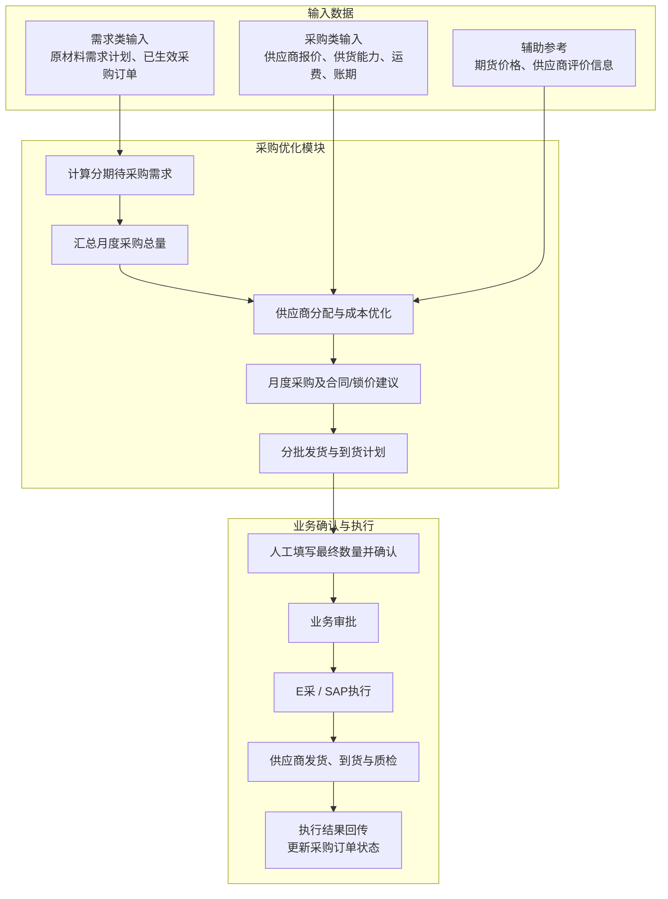

# 采购优化模块技术方案

## 1. 模块目标与边界

采购优化模块解决四个问题：需要采购多少、向哪些供应商采购、各采购多少、如何安排发货。

模块以上游已发布的原材料需求计划为唯一需求输入，结合已生效但尚未完成的采购订单，计算待采购需求。系统按月形成采购总量、供应商分配及合同/锁价策略，并按周滚动生成或调整分批发货计划。

本模块不负责原材料库存数量计算、库存水位监控、安全库存计算或库存预警。

采购建议经业务人员确认后进入采购审批和执行流程。

## 2. 主要业务问题

- **采购需求算不清**：原材料需求计划与已生效采购订单的覆盖关系不清，容易重复下单或遗漏采购。
- **供应商选择依赖经验**：价格、质量合格率、准时率和风险分没有统一比较。
- **采购数量不好分配**：多个供应商同时可供货时，人工难以快速形成成本较低的组合。
- **合同锁价缺少依据**：采购需求与当前期货价格没有结合，锁价决策主要依赖经验。
- **发货计划不够及时**：原材料需求计划变化后，供应商分批发货计划不能及时调整。

## 3. 总体技术方案

### 3.1 采购需求计算

1. 获取上游已发布的分周期原材料需求量和需求日期；
2. 统计已生效但尚未完成的采购订单及其计划到货日期；
3. 按原材料和周期扣减能够在需求日期前到货的已生效采购数量；
4. 计算待采购需求量和要求到货日期。

待采购需求的基本计算口径为：

$$
待采购需求=\max\left(0,原材料计划需求-需求日期前可到货的已生效采购数量\right)
$$

已生效采购数量包括尚未发货、运输途中和到厂待检的采购订单数量。该数据仅用于识别未完成的采购承诺、避免重复下单，不用于计算或管理原材料库存。

### 3.2 供应商评价

供应商评价主要展示历史及当前采购价格、质量合格率、准时交付率和风险分，供业务人员参考。优化模型不使用供应商评分，只根据成本计算推荐采购数量。

### 3.3 采购策略与方案输出

- 根据待采购需求和当前期货价格，辅助判断是否签订采购合同锁定价格；
- 按月汇总待采购需求，形成月度采购总量、供应商分配和合同/锁价建议；
- 根据供应商报价、供货能力、运输费用和账期计算成本较低的采购数量范围；
- 输出推荐方案和备选方案，展示供应商、采购数量、综合成本和建议到货日期；
- 推荐数量允许业务人员调整，最终采购数量由业务人员填写并确认；
- 根据原材料需求日期和供应商提前期，将月度采购总量拆分为分批发货与到货计划；
- 按周检查原材料需求计划和采购执行状态，对未执行的发货安排给出调整建议。

财务提供统一的资金成本率，如年化利率，用于计算不同账期节省的资金成本。其他条件相同时，账期越长，资金成本越低。

### 3.4 采购模块总图

## 4. 优化模型

### 4.1 模型选型

采购优化采用线性规划模型，按照“物料—供应商—到货周期”计算推荐采购量，在满足待采购需求、供应能力和到货时间要求的前提下，使采购综合成本最低。

### 4.2 符号与变量

**索引**

| 符号 | 含义 |
|---|---|
| \(i\) | 物料 |
| \(j\) | 供应商 |
| \(t\) | 到货周期，根据原材料需求计划的管理粒度按周或按日 |

**主要参数**

| 符号 | 含义 |
|---|---|
| \(Q_{it}\) | 原材料 \(i\) 在周期 \(t\) 的待采购需求 |
| \(c_{ij}\) | 供应商 \(j\) 对物料 \(i\) 的报价单价 |
| \(f_{ij}\) | 从供应商 \(j\) 采购物料 \(i\) 的单位运输费用 |
| \(a_{ij}\) | 根据供应商账期和资金成本率折算的单位资金成本节省 |
| \(U_{ijt}\) | 供应商在周期 \(t\) 的最大可供数量 |
| \(L_{ij}\) | 供应商备货、运输和质检总提前期 |

**决策变量**

| 变量 | 含义 |
|---|---|
| \(x_{ijt}\) | 供应商 \(j\) 在周期 \(t\) 到货的物料 \(i\) 数量 |

### 4.3 优化目标

模型以采购综合成本最低为目标：

$$
\min Z=
\sum_{i,j,t}
\left(c_{ij}+f_{ij}-a_{ij}\right)x_{ijt}
$$

其中，\(c_{ij}\) 为供应商报价，\(f_{ij}\) 为运输成本，\(a_{ij}\) 为账期带来的资金成本节省，因此从总成本中扣减。

- 模型只比较采购相关成本；
- 质量合格率、准时率、风险分等供应商评价指标不进入目标函数，仅供业务人员参考。

账期资金成本节省可按以下方式折算：

$$
a_{ij}=c_{ij}\times 资金成本率\times\frac{账期天数_{ij}}{365}
$$

### 4.4 约束条件

#### 4.4.1 采购需求约束

$$
\sum_jx_{ijt}\geq Q_{it},\quad \forall i,t
$$

各供应商推荐采购量之和不得低于原材料需求计划驱动的待采购需求。模型在成本最小的目标下给出推荐值，每个供应商的可调整范围为0至最大可供量，最终采购数量由业务人员填写确认。

#### 4.4.2 供应能力约束

$$
0\leq x_{ijt}\leq U_{ijt},\quad \forall i,j,t
$$

采购数量不能超过供应商在对应周期内的最大可供数量。

#### 4.4.3 到货时间约束（只作前端建议，不做模型约束）

供应商发货时间和到货时间应满足其备货、运输和质检提前期：

$$
建议下单日期_{ijt}=计划到货日期_t-L_{ij}
$$

如果按供应商提前期已经无法满足计划到货日期，系统进行提示，由业务人员决定是否仍向该供应商采购。

#### 4.4.4 变量约束

$$
x_{ijt}\geq0
$$

采购量为非负数。

## 5. 模型输入

| 数据来源分类 | 输入内容 | 说明 |
|---|---|---|
| 原材料需求计划 | 原材料、需求周期、需求数量、要求到货日期、计划版本及发布状态 | 作为采购需求的唯一业务来源 |
| SAP/E采、TMS | 已生效采购订单、未完成数量、订单状态、计划到货日期 | 用于扣减已有采购承诺，避免重复下单 |
| SAP/E采、LIMS/QMS | 供应商历史价格、质量合格率、准时交付率、风险分 | 仅供业务人员查看和选择供应商，不进入成本模型 |
| 数据服务层获取 | 各供应商本次报价、报价有效期、最大可供数量 | 作为本次采购优化的主要输入 |
| 数据服务层获取 | 备货、运输、卸货、质检时间及运输费用 | 用于判断到货时间和计算运输成本 |
| 外部行情或人工输入 | 当前期货价格、已确认合同锁价及有效期 | 用于辅助合同锁价判断，不进行价格预测 |
| 财务提供 | 付款方式、账期、资金成本率 | 用于计算账期带来的资金成本节省 |

系统已有数据原则上通过统一数据服务层获取；暂时无法从业务系统取得的数据由业务人员维护。

## 6. 模型输出

| 输出 | 内容 |
|---|---|
| 采购需求 | 各原材料分周期的计划需求、已有采购承诺和待采购需求 |
| 采购策略 | 是否建议签订合同锁价及对应需求数量 |
| 推荐采购方案 | 各供应商的推荐采购数量 |
| 推荐采购范围 | 各供应商可在0至最大可供量之间调整，但合计不得低于待采购需求，最终由人工填写 |
| 备选采购方案 | 可供业务人员比较选择的备选组合 |
| 月度采购方案 | 分原材料的月度采购总量、供应商分配及合同/锁价建议 |
| 供应商发货计划 | 根据原材料需求日期将月度采购总量拆分形成的分批发货数量和时间 |
| 建议下单日期 | 根据计划到货日期和供应商提前期反推 |
| 综合成本 | 采购成本、运输成本和账期节省 |
| 不可行提示 | 无法满足采购需求量或要求到货时间时的缺口和原因 |

## 7. 运行与接口要求

### 7.1 运行机制

- 系统每月根据已发布的原材料需求计划，计算月度采购总量、供应商分配及合同/锁价建议；
- 系统按周滚动检查原材料需求计划和采购执行状态；发生变化时，重新计算未执行部分的供应商发货计划并提示影响；
- 原材料需求计划更新后，业务人员也可在页面人工触发采购计算并调整未执行的发货计划；
- 每次计算保存输入数据、参数和结果，便于查询和复核；
- 常规采购方案优化计算应在3秒内完成。

### 7.2 核心接口

- 从上游需求计划服务获取已发布的原材料需求计划；
- 从 SAP/E采、TMS 获取已生效采购订单、发货、在途及到货状态；
- 从统一数据服务层获取供应商、报价、供货能力和评价数据；
- 从财务相关系统获取账期和资金成本率；
- 获取当前期货价格和已确认合同锁价信息；
- 向 E采/SAP 提供业务确认后的采购建议和发货计划；
- 向供应链驾驶舱推送采购方案和采购执行状态。

## 8. 异常与预警

采购优化不进行需求预测，不解析生产排程，也不负责将生产计划转换为原材料需求。采购需求仅来自上游已发布的原材料需求计划。模块不进行价格预测，期货价格使用当前市场数据。

- 输入数据缺失或异常时，系统预警并提示人工处理；
- 没有供应商能够满足需求数量或到货时间时，系统提示缺口和原因；
- 原材料需求计划版本发生变化时，系统保留原采购方案并对未执行部分生成调整建议；
- 所有采购建议和合同锁价建议均需业务人员确认，不自动生成正式合同或采购订单。
