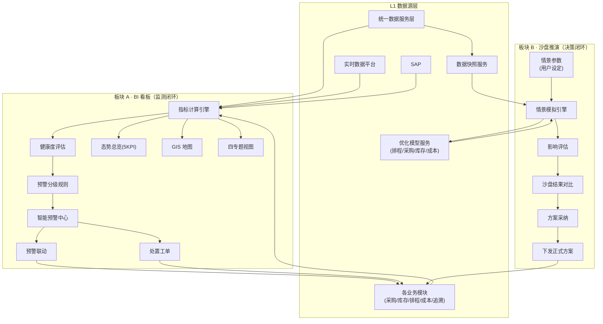

# 供应链驾驶舱 业务逻辑梳理（业务总图思路沉淀）

> 用途：为绘制「驾驶舱业务总图」梳理业务要素。本文档只沉淀**业务逻辑**，不含技术实现。
> 配套文档：[供应链驾驶舱模块PRD.md](./供应链驾驶舱模块PRD.md)（功能与非功能需求）、[index.html](./vccz292v.mule.page/index.html)（演示原型）。

---

## 一、一句话定位

驾驶舱是 SCOS 的**战略决策与指挥中枢**，是「产销—储运—环保—资金」四大业务域实时状态的统一呈现与异常处置入口。

**关键边界（决定总图怎么画）**：驾驶舱是**消费层**，只消费各业务模块的「数据与运算结果」，自身不采集数据、不维护主数据。业务总图上，驾驶舱是"承上（接数据）启下（发指令）"的中间节点。

---

## 二、核心：驾驶舱 = 两大业务板块，不是"一套看板"

这是驾驶舱业务逻辑的**第一层切分**。标书的功能清单里，其实藏着两类性质完全不同的东西：

| 维度 | 板块 A：态势监测（BI 看板） | 板块 B：沙盘推演（决策支持） |
|---|---|---|
| 对应标书功能 | 全局态势总览、GIS 地图、专题视图、智能预警 | 情景模拟与决策支持 |
| 业务本质 | **被动读**、实时监测、只读展示 | **主动算**、交互推理、假设分析 |
| 触发方式 | 数据驱动（自动/定时刷新） | 用户驱动（手动设定情景参数） |
| 数据方向 | 单向：上游 → 展示 | 双向：输入假设 → 调用模型 → 返回结果 |
| 是否调用优化模型 | **否**（只读各模块已算好的指标） | **是**（调用排程/采购/库存/成本模块的优化模型做 what-if） |
| 是否影响真实业务 | 否（纯只读） | 沙盒内不影响；**采纳后**才下发为正式方案 |
| 输出物 | 态势、健康度、预警、钻取 | 模拟对比、影响评估、可采纳方案 |
| 主要受众 | 全角色（含调度员日常监控） | 管理层（总监/总经理/上级领导） |

**一句话结论**：BI 看板回答"**现在怎么样、哪里出了问题**"；沙盘推演回答"**如果这么变、会怎么样、该怎么选**"。前者是监测，后者是决策。

### 两者如何衔接（业务总图必须画的"桥"）

1. **共享数据基线**：沙盘的"当前基线"取自 BI 看板同一份实时数据快照（同一数据服务层）。
2. **方案采纳回流**：沙盘推演出的方案若被采纳，会**下发为正式方案**到对应业务模块（如重排程、调整采购），随后又进入 BI 看板的监测闭环——这是"决策→执行→再监测"的大闭环。

---

## 三、两条业务闭环（业务总图的主轴线）

驾驶舱跑的是**两条**闭环，不是一条：

### 闭环 1：监测闭环（BI 看板）

```
感知 → 研判 → 展示 → 异常处置 → 跟踪回验
数据汇聚  指标/健康度/预警  钻取定位  联动下发  闭环
```

| 环节 | 业务动作 |
|---|---|
| 感知 | 从数据服务层/实时平台/SAP/各模块取数，自动算 KPI（杜绝手工） |
| 研判 | KPI → 阈值 → 红黄绿健康度；越界 → 分级预警（一级紧急/二级警告） |
| 展示 | 态势总览（5 KPI）、GIS 地图、四专题视图，按角色裁剪 |
| 异常处置 | 预警一键联动到对应模块（排程/采购/库存/追溯），下发处置工单 |
| 跟踪回验 | 跟踪处置结果，回写验证 |

### 闭环 2：决策闭环（沙盘推演）

```
设定情景 → 调用模型 → 影响评估 → 方案采纳 → 下发执行
用户假设   排程/采购/库存/成本  对比"当前vs模拟"  管理层决策  正式方案
```

| 环节 | 业务动作 |
|---|---|
| 设定情景 | 修改关键参数（订单+20%、供应商延迟 7 天、原料价+15%） |
| 调用模型 | 调用各业务模块的优化模型做 what-if 推理 |
| 影响评估 | 输出对产能/库存/交期/成本的影响对比 |
| 方案采纳 | 管理层评估模拟结果，决定是否采纳 |
| 下发执行 | 采纳方案下发为正式方案，回到监测闭环继续跟踪 |

> 两条闭环的汇合点：**决策闭环的"下发执行"出口，接入监测闭环的"异常处置"入口**，构成"监测→决策→执行→再监测"的总循环。

---

## 四、业务总图的分层框架（画图骨架）

纵向 **四层 × 两大板块**，横向 **四域**。

### 4.1 纵向四层

| 层 | 名称 | 板块 A（BI） | 板块 B（沙盘） |
|---|---|---|---|
| L1 | 数据源层 | 统一数据服务层、实时数据平台、SAP、各业务模块 | （同上，取数据快照）+ 各模块的**优化模型服务** |
| L2 | 处理层 | 指标计算引擎、健康度评估、预警分级规则 | 情景模拟引擎（调模型 + 影响评估） |
| L3 | 展示层 | 态势总览、GIS 地图、四专题视图、预警中心 | 沙盘推演界面（参数 + 结果对比） |
| L4 | 处置/采纳层 | 预警联动、处置工单、移动推送、报告导出 | 方案采纳、下发正式方案 |

### 4.2 横向四域（贯穿两块）

| 域 | 核心命题 |
|---|---|
| 产销 | 需求与产能的平衡 |
| 储运 | 库存与物流的平衡 |
| 环保 | 合规与成本的平衡 |
| 资金 | 资金效率与盈利 |

---

## 五、节点清单（业务总图要画的"方块"）

### 板块 A：BI 看板（监测线）

| 层 | 节点 | 职责 |
|---|---|---|
| L1 | 统一数据服务层 | 主数据/交易/聚合数据（标准化 API） |
| L1 | 实时数据平台 | 产量/发货/储罐液位/产线状态/车辆位置（实时） |
| L1 | SAP | 财务/资金/成本指标（权威源） |
| L1 | 各业务模块 | 采购/库存/排程/成本/追溯的运算结果与预警 |
| L2 | 指标计算引擎 | 按预置公式算 KPI |
| L2 | 健康度评估 | 指标 vs 阈值 → 红黄绿 |
| L2 | 预警分级规则 | 一级（红/紧急）、二级（黄/警告） |
| L3 | 全局态势总览 | 5 张核心 KPI 卡片 |
| L3 | GIS 地图 | 供应商/工厂/仓库/客户 + 在途车辆 + 节点状态 |
| L3 | 四专题视图 | 产销/储运/环保/资金 |
| L3 | 智能预警中心 | 统一预警面板 + 分级 + 联动 |
| L4 | 预警联动 | 一键根因分析 |
| L4 | 处置工单 | 下发 + 跟踪闭环 |
| L4 | 移动推送 / 报告导出 | 推送预警、导出态势报告 |

### 板块 B：沙盘推演（决策线）

| 层 | 节点 | 职责 |
|---|---|---|
| L1 | 数据快照服务 | 打包某时点完整数据快照（沙盘基线） |
| L1 | 各模块优化模型服务 | 排程/采购/库存/成本模型的 what-if 计算能力 |
| L2 | 情景模拟引擎 | 接收假设参数 → 调度模型 → 汇总影响 |
| L2 | 影响评估 | 对比"当前 vs 模拟"多指标 |
| L3 | 沙盘推演界面 | 参数滑杆 + 快捷情景 + 结果雷达/对比图 |
| L4 | 方案采纳 | 管理层确认模拟方案 |
| L4 | 下发正式方案 | 采纳 → 下发排程/采购/库存等模块 |

---

## 六、连线清单（业务总图要画的"箭头"）

### 6.1 监测线数据流（实线）

- 数据服务层 / 实时平台 / SAP / 各模块 → 指标计算引擎
- 指标计算引擎 → 健康度评估 → 预警分级规则
- 指标计算引擎 / 健康度评估 → 五大展示视图
- 预警中心 → 预警联动 → 各模块（根因）
- 预警中心 → 处置工单 → 各模块（执行 + 回写）
- 预警中心 → 移动推送；视图 → 报告导出

### 6.2 决策线数据流（实线）

- 数据快照服务 → 情景模拟引擎（当前基线）
- 沙盘推演界面 →（用户参数）→ 情景模拟引擎
- 情景模拟引擎 → 各模块优化模型服务（调用）
- 各模块优化模型服务 → 情景模拟引擎（返回结果）
- 情景模拟引擎 → 影响评估 → 沙盘推演界面

### 6.3 两条线的桥（关键，用醒目线）

- **数据快照服务 ← 数据服务层**（沙盘基线取自监测线同一份数据）
- **方案采纳 → 下发正式方案 → 各业务模块**（决策结果回流到执行，再进入监测闭环）

### 6.4 角色适配（L3 横向）

- 上级领导 / 总经理 / 总监 / 调度员 → 各自裁剪后的视图；沙盘推演主要面向决策层。

---

## 七、四大业务域的闭环逻辑

每个域都是「看什么指标 → 什么算异常 → 联动到哪个模块」的小闭环（主要落在 BI 看板；沙盘则对每个域提供对应的 what-if 情景）。

| 域 | 看什么 | 异常 | 联动模块 | 典型沙盘情景 |
|---|---|---|---|---|
| 产销 | 需求 vs 产量、产线进度、瓶颈、原料匹配 | 达成率低、停机、缺料 | 生产排程、采购 | 大客户订单 +20% / 设备停机 8h |
| 储运 | 全网库存与库龄、仓库利用率、车辆满载率/时效 | 库存超界、爆仓、车辆延迟 | 安全库存、WMS/TMS | 供应商延迟 7 天 |
| 环保 | 吨产品水/电/汽、废水/COD/SS/氨氮 vs 国标 | 单耗超标、接近限值 | EMS、生产排程 | 能耗目标收紧 |
| 资金 | 应收/应付账龄、库存资金、边际贡献 | 账期恶化、占用高、负利润 | 成本核算、SAP | 原料价 +15% |

---

## 八、角色分层视图

| 角色 | 默认关注 | 板块 A（BI） | 板块 B（沙盘） | 数据粒度 |
|---|---|---|---|---|
| 上级管理公司领导 | 全局 KPI、资金、合规、趋势 | ✅ | ✅（决策） | 汇总级 |
| 总经理 | 产销达成、总成本、现金循环、重大风险 | ✅ | ✅（决策） | 工厂级汇总 |
| 供应链/运营总监 | 产销协同、库存健康、物流效能、预警处置 | ✅ | ✅（决策） | 部门级 |
| 计划员/调度员 | 明细指标、瓶颈、预警联动、根因 | ✅ | ❌ | 明细级 |

---

## 九、业务总图绘制建议

1. **先画两块，再画四层**：顶层先标出「BI 看板」和「沙盘推演」两个大板块，避免观图者误以为驾驶舱只是一堆图表。
2. **两条闭环并排**：监测闭环（左）与决策闭环（右）各自成环，用醒目的"桥"（数据快照、方案采纳）连接。
3. **四域贯穿**：产销/储运/环保/资金四列并排，各列挂"指标→异常→联动"小闭环，沙盘侧挂对应情景。
4. **闭环要闭环**：处置/采纳的箭头必须回到 L1 业务模块，体现"监测→决策→执行→再监测"，而非单向展示。

---

## 十、待确认的业务口径

1. **沙盘引擎归属**：情景模拟的 what-if 计算，是驾驶舱自带轻量引擎，还是完全复用各模块的优化模型服务？这决定总图上"情景模拟引擎"与"优化模型服务"之间的连线画实线还是虚线、是否画一个独立沙盘求解器。
2. **方案采纳的流转**：沙盘采纳后"下发正式方案"是否需要走审批流、写回哪些系统，需确认闭环的终点。
3. **资金域数据口径**：CCC（DSO/DPO）、供应链总运营成本归集口径与 SAP 映射关系。
4. **地图与数字孪生边界**：GIS 是轻量二维还是复用数字孪生三维。
5. **预警分级阈值**：一级/二级的具体业务阈值。
6. **移动端推送渠道**：APP/短信/邮件的组合。

---

## 附：业务总图概念草图（mermaid）


