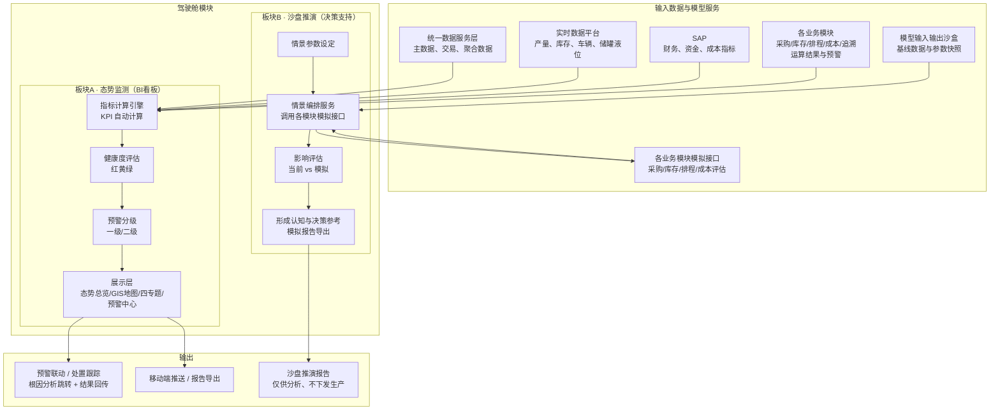
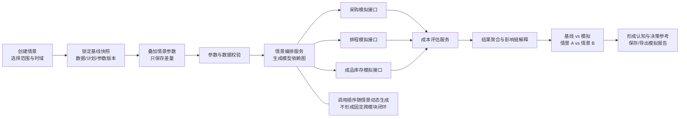

# 驾驶舱模块技术方案

## 1. 模块目标与边界

驾驶舱模块是 SCOS 的战略决策与指挥中枢，通过多层级、可配置、可视化的方式，为管理层至执行层提供「产销—储运—环保—资金」全局供应链状态的"一站式"视图，实现态势感知透明化、决策支持数据化、异常响应实时化。

模块由**两大业务板块**构成：

- **态势监测（BI 看板）**：被动读、实时监测、只读展示，回答"现在怎么样、哪里出了问题"。
- **沙盘推演（决策支持）**：主动交互、假设分析，调用各业务模块优化模型做 what-if，回答"如果这么变会怎样、该怎么选"。

本模块是**消费层/展示层**，只消费统一数据服务层、实时数据平台、SAP 及各业务模块的**数据和运算结果**，自身不采集数据、不维护主数据、不包含优化求解器（沙盘推演通过调用各模块优化模型服务完成 what-if 计算）。

## 2. 主要业务问题

- **信息孤岛**：产销、储运、环保、资金数据分散在 MES、WMS、TMS、SAP 等系统中，管理层难以快速获得全局视图。
- **态势不清**：缺乏实时全局态势，异常靠事后发现、人工汇总，响应滞后。
- **异常无分级**：预警散落各系统，无统一的紧急/警告分级，无法快速判断轻重缓急。
- **根因难定位**：看到 KPI 异常后，需要跨系统人工核对才能定位根因，链路长、易遗漏。
- **决策无量化依据**：情景分析依赖经验或手工测算，无法快速量化"如果需求波动/供应中断/成本变化会怎样"。
- **指标口径不一**：关键指标存在手工录入，口径混乱，难以支撑可信决策。

## 3. 总体技术方案与模块总图

### 3.1 驾驶舱模块总图

### 3.2 两大业务板块

| 维度 | 态势监测（BI 看板） | 沙盘推演（决策支持） |
|---|---|---|
| 业务本质 | 被动读、实时监测、只读展示 | 主动交互、假设分析、调用模型推理 |
| 触发方式 | 数据驱动（自动/定时刷新） | 用户驱动（手动设定情景参数） |
| 是否调用优化模型 | 否（只读各模块已算好的指标） | 是（调用排程/采购/成品库存模拟接口，并调用成本服务做影响评估） |
| 是否影响真实业务 | 否（纯只读） | 否；模拟结果不采纳、不下发、不写回正式业务数据 |
| 主要受众 | 全角色（含调度员日常监控） | 管理层（总监/总经理/上级领导） |

两块通过数据基线衔接：沙盘基线取自 BI 看板同一时点的数据快照，推演结束后只形成认知、方案对比和决策参考。若业务人员需要调整采购、库存或排程，应退出沙盘后进入相应业务模块，按照该模块自身的确认、审批和执行流程处理；驾驶舱不把模拟结果转换为正式方案。

### 3.3 数据获取与指标计算

驾驶舱通过统一数据服务层和实时数据平台的标准 API 获取数据，不直接连接业务系统或生产数据库。

1. 通过统一数据服务层获取主数据、交易数据和聚合分析数据；
2. 通过实时数据平台订阅产量、发货量、储罐液位、产线状态、车辆位置等实时指标；
3. 通过 SAP 获取财务、资金、成本类指标；
4. 通过各业务模块接口获取运算结果与预警事件。

所有指标由指标计算引擎按预置公式**自动计算**，杜绝手工录入。指标计算逻辑见第 4 章。

### 3.4 健康度评估与预警分级

指标计算后，按预置阈值评估节点/指标健康度，映射为红黄绿三色；越界指标触发分级预警。

- **健康度评估**：指标与阈值比较，绿色=正常、黄色=预警、红色=紧急。
- **预警分级**：一级（红色/紧急，如产线故障停机、关键原料断供、重大质量事故）；二级（黄色/警告，如库存低于安全库存、订单交付即将延迟、能耗超标）。

### 3.5 钻取溯源

支持从 KPI 总览到明细业务数据的逐层钻取，快速定位问题根源。钻取链路为「KPI 总览 → 专题视图 → 明细清单 → 源单据/工单」，钻取响应时间不超过 2 秒。

### 3.6 情景模拟与决策支持

提供"沙盘推演"，允许用户基于同一数据快照修改关键参数，调用采购优化、成品库存优化、生产排程等模块的模拟接口，并通过成本核算服务汇总全局影响。系统至少预置需求波动、供应风险和成本优化三类标书要求的情景，并扩展库存策略、生产扰动和组合压力测试。模拟在隔离沙盒内运行，不修改正式数据、不触发业务审批、不生成生产工单或采购订单。详细技术方案见第 5 章。

## 4. 指标与评估模型

### 4.1 核心 KPI 计算

| KPI | 计算逻辑 | 数据源 | 更新频率 |
|---|---|---|---|
| 今日产销达成率 | 今日实际产量 ÷ 今日计划产量 × 100% | MES / 生产排程 | ≤ 5 秒 |
| 成品库存周转天数 | 平均成品库存数量 ÷ 日均出库量（近 30 日滚动） | WMS / SAP | ≤ 5 秒 |
| 订单准时交付率（OTD） | 按期交付订单数 ÷ 应交付订单总数 × 100%（按期=实际交付日 ≤ 承诺交付日） | SAP / TMS | ≤ 5 秒 |
| 供应链总运营成本 | 采购成本 + 生产成本 + 库存持有成本 + 物流成本 + 环保/能源成本 + 资金占用成本（当日/当月累计） | 成本核算模块 / SAP | ≤ 5 秒（当日）/ ≤ 1 小时（累计） |
| 现金循环周期（CCC） | DIO + DSO − DPO | SAP | ≤ 1 小时 |

现金循环周期：

$$
CCC = DIO + DSO - DPO
$$

其中 DIO 为存货周转天数、DSO 为应收账款周转天数、DPO 为应付账款周转天数。

### 4.2 专题视图指标

**产销协同视图**

| 指标 | 计算逻辑 |
|---|---|
| 需求预测 vs 实际产量 | 每日/每周需求预测值与实际产量对比 |
| 产线排产计划 vs 实际进度 | 各产线计划量、完成量、完成率 |
| 原料库存匹配度 | 玉米淀粉等原料可用库存 ÷ 未来 7 天生产消耗需求 |

**储运效率视图**

| 指标 | 计算逻辑 |
|---|---|
| 全网库存量与库龄 | 原料库/在制品库/成品库库存量，按库龄区间分层 |
| 仓库利用率 | 实际占用 ÷ 有效库容 |
| 车辆满载率 | 实际装载量 ÷ 额定装载量 |
| 平均在途时效 | 在途订单平均运输时长 |

**环保合规视图**

| 指标 | 计算逻辑 |
|---|---|
| 吨产品耗水/耗电/耗汽 | 单耗 = 消耗量 ÷ 产品产量 |
| 废水排放量 / COD / SS / 氨氮 | 实测值，与国家标准限值对比 |

**资金效率视图**

| 指标 | 计算逻辑 |
|---|---|
| 应收/应付账龄 | 按账龄区间（0-30/31-60/61-90/90+ 天）分层 |
| 库存资金占用 | 各物料品类库存量 × 单价 |
| 产品边际贡献率 | （收入 − 变动成本）÷ 收入 |

### 4.3 健康度评估（红黄绿）

对指标/节点按阈值区间映射三色状态：

$$
状态 =
\begin{cases}
红色（紧急）, & 指标达到或超过紧急阈值\\
黄色（预警）, & 指标达到或超过预警阈值、未达紧急阈值\\
绿色（正常）, & 指标在正常区间
\end{cases}
$$

阈值通过管理界面配置（见 8.4），可针对不同指标、不同角色差异化设置。

### 4.4 预警分级规则

| 级别 | 颜色 | 定义 | 典型场景 |
|---|---|---|---|
| 一级 | 红色 | 紧急 | 产线故障停机、关键原料断供、重大质量事故 |
| 二级 | 黄色 | 警告 | 库存低于安全库存、订单交付即将延迟、能耗超标 |

三级及以下提示信息作为辅助提示，不进入紧急预警面板首屏。

### 4.5 情景模拟影响评估

沙盘推演通过调用各业务模块的模拟接口完成 what-if 计算，不在驾驶舱内重复实现优化求解。影响评估至少支持「基线 vs 模拟」「模拟方案 A vs 模拟方案 B」两种比较，并同时展示绝对变化量、相对变化率、可行性状态和主要传导原因。

| 情景 | 可调参数 | 调用模型 | 输出影响 |
|---|---|---|---|
| 需求波动 | 大客户订单增减比例、交付日期 | 排程、成品库存、采购、成本评估 | 产能负荷、成品库存、原料缺口、交付日期、总成本 |
| 供应风险 | 供应商延迟天数、可供量、停供周期 | 采购、排程、成品库存、成本评估 | 备选采购组合、到货风险、受影响订单、缺货风险、总成本 |
| 成本优化 | 原料价格、运费、账期/资金成本率 | 采购、成本评估 | 供应商分配、采购综合成本、资金占用、运营总成本 |
| 库存策略 | 服务水平、生产补充周期、储罐可用状态 | 成品库存、成本评估 | 安全库存、再订货点、目标库存、未来 7 天库存、库存资金占用 |
| 生产扰动 | 设备停机时长、产能变化、紧急订单 | 排程、成品库存、采购、成本评估 | 排程可行性、延迟订单、库存风险、原料需求变化、成本变化 |

影响评估以指标卡、趋势图、对比表和影响链展示。雷达图仅用于指标量纲已标准化的综合比较，不作为唯一输出。模拟结果只保存在沙盘结果库并带有"模拟"标识，不修改正式数据。详细的模块范围、编排顺序、参数模型、接口契约和安全控制见第 5 章。

## 5. 沙盘推演专项技术方案

### 5.1 建设定位与设计原则

沙盘推演用于回答"在某项假设发生时，全局供应链可能受到什么影响"。它不是正式计划编制入口，也不是采购、排程或库存策略的审批入口。驾驶舱负责情景管理、数据快照引用、参数覆盖、模型调用编排、结果汇总和可视化；优化计算仍由各业务模块负责。

沙盘推演遵循以下原则：

1. **只推演、不执行**：模拟结果不采纳、不下发，不生成采购订单、生产工单、库存策略或其他正式业务数据；需要采取行动时，由业务人员进入相应业务模块重新发起正式计算和审批。
2. **同源基线**：基线与驾驶舱展示使用同一时点、同一版本的数据快照，避免因取数时间不同造成不可比。
3. **增量覆盖**：用户输入只作为基线快照上的情景增量，不直接修改源数据和正式参数。
4. **模型复用**：驾驶舱不复制采购、库存和排程算法，通过标准模拟接口调用各模块已有模型。
5. **可解释、可复现**：保存数据快照、情景参数、模型版本、参数版本、求解状态和结果，可按相同条件复算。
6. **松耦合编排**：按情景需要选择模型并根据依赖关系组织调用，不要求每次推演都运行全部模块。
7. **结果有边界**：对数据缺失、模型未接入、约束不可行和部分模块失败进行显著标识，不把不完整结果包装成全局最优方案。

### 5.2 推演模块范围与职责

| 模块/服务 | 在沙盘中的职责 | 主要情景输入 | 主要模拟输出 | 边界说明 |
|---|---|---|---|---|
| 采购决策优化模块 | 计算待采购需求、供应商分配和采购综合成本 | 模拟原材料需求计划、供应商报价、可供量、运费、账期、供应中断或延期 | 供应商采购量、综合成本、建议到货日期、需求缺口、到货风险 | 复用采购线性规划模型；供应商评分仅供展示，不进入成本目标；模拟结果不进入采购审批或 E采/SAP |
| 成品库存优化模块 | 计算成品库存策略和未来库存风险 | 模拟订单/出货计划、服务水平、生产补充周期、计划入库、储罐可用状态 | 安全库存、再订货点、目标库存、未来 7 天库存轨迹、补充量范围、缺货与容量风险 | 当前技术方案只覆盖**成品库存**，不负责原材料库存；模拟结果不修改已发布库存策略 |
| 精益生产排程模块 | 评估订单、设备、原料变化对排产可行性和交付的影响 | 订单变化、设备停机、产能日历、原料到货变化、优先级 | 模拟排程、产能负荷、瓶颈、受影响订单、预计完工时间、模拟原料需求 | 需由排程模块提供只读模拟接口；不生成或下发 MES 工单 |
| 统计与成本核算分析模块 | 汇总各模块结果并按统一口径评估成本影响 | 采购结果、库存结果、排程结果及价格/费率假设 | 采购成本、库存持有成本、生产/物流/能源成本、资金占用及总成本差异 | 原则上作为评估服务，不在驾驶舱内另建跨模块全局求解器；实际可计算项目以成本模块已提供口径为准 |
| 全程追溯、质量及环保数据服务 | 提供冻结、召回、质量异常和环保限制等约束或风险事件 | 批次冻结、质量放行状态、环保限值、设备/区域不可用 | 受限对象、风险提示、可用性约束 | 不作为优化求解器，不允许通过沙盘解除正式质量冻结或环保约束 |
| 统一数据服务层/模型输入输出沙盒 | 提供基线数据与模型参数快照 | 快照时间、组织范围、计划版本、数据版本 | 不可变快照引用、数据质量状态、来源追溯信息 | 驾驶舱只引用快照，不自行建设重复的数据采集、清洗和主数据能力 |

原材料影响与成品库存影响必须分开处理：需求波动产生的**模拟原材料需求**应由上游原材料需求计算服务生成；若排程模块本身包含并对外提供物料需求计算能力，也可由排程模拟接口一并返回。该结果再以“模拟、未发布”标识传给采购模型。成品库存模型只计算成品的安全库存、目标库存和补充风险，不得代替原材料库存管理。若项目尚未提供模拟原材料需求能力，需求波动情景不得强行调用采购模型，应将采购影响标记为“未评估”。

### 5.3 预置推演场景

| 场景 | 优先级 | 典型参数 | 模型编排链路 | 核心输出 |
|---|---|---|---|---|
| 需求波动 | P0（标书要求） | 客户、成品、订单增减量/比例、要求交付日期 | 排程 → 成品库存；原材料需求计算服务（接入后）→ 采购；最后进行成本评估 | 产能负荷、订单交付变化、成品库存最低点、原料需求缺口、采购增量、总成本变化 |
| 供应风险 | P0（标书要求） | 供应商、受影响物料、延迟天数、停供周期、可供量下降比例 | 采购 → 排程 → 成品库存 → 成本评估 | 备选供应商组合、缺口与到货风险、受影响生产计划和订单、缺货风险、成本增量 |
| 成本优化/价格波动 | P0（标书要求） | 原料价格、运费、账期、资金成本率、能源价格 | 采购 → 成本评估；仅在供货量或到货期变化时再联动排程和库存 | 供应商分配变化、采购综合成本、资金占用和供应链总运营成本变化 |
| 库存策略 | P1 | 成品服务水平、生产补充周期、需求波动、储罐停用、最大库存天数 | 成品库存 → 成本评估 | 安全库存、再订货点、目标库存、未来 7 天风险、库存资金占用、服务水平影响 |
| 生产扰动 | P1 | 设备停机时长、产能变化、检修窗口、紧急插单、订单优先级 | 排程 → 成品库存；原料需求变化时 → 采购；最后进行成本评估 | 新瓶颈、延迟订单、库存风险、原料需求变化、生产与运营成本变化 |
| 组合压力测试 | P1 | 同时设置需求、供应、设备和价格多项变化 | 情景编排服务按依赖图调用相关模块 | 最坏指标、关键约束、风险传导链、各情景横向比较 |

每个预置场景提供参数模板，用户可以复制为自定义情景。自定义情景只能组合已接入并通过校验的参数和模型，不能通过自由脚本直接访问生产系统。

### 5.4 跨模块传导与编排逻辑

情景编排不是把同一组参数同时广播给所有模型，而是将上游模型输出转换为下游模型可识别的**模拟输入**，按依赖顺序执行。典型流程如下：

上图中的依赖连线按情景动态启用，并非每次全部执行：

- **需求波动**：先将订单变化传给排程模型，得到模拟生产计划和完工时间；成品库存模型使用模拟订单和模拟计划入库测算库存轨迹。若排程或上游原材料需求计算服务能够输出模拟原材料需求计划，再调用采购模型计算采购缺口和供应商分配；否则采购影响标记为“未评估”，结果不得显示为完整的全局影响。
- **供应风险**：供应商延期不直接作为采购模型中不存在的约束。系统应将受影响周期内的最大可供量 $U_{ijt}$ 调低或置零，并把可供期移至延迟后的周期；采购模型重新分配后，将模拟到货数量与日期作为排程的原料可用约束，再传导至成品库存和交付结果。
- **库存策略**：只需调用成品库存和成本评估服务，不应无条件触发采购或排程。只有当用户另行选择“联动评估生产补充可行性”时，才把模拟补充量和期望入库时间传给排程模型。
- **价格变化**：只改变报价、运费、账期或资金成本率时，优先调用采购和成本评估服务；若供应商分配导致可供量或到货期变化，再继续调用排程与库存模型。
- **生产扰动**：排程先计算模拟生产计划；成品库存使用新的计划入库时间重新测算未来库存；排程输出的模拟原料需求变化可继续触发采购评估。
- **组合情景**：编排服务根据模型依赖关系进行拓扑排序；互不依赖的调用允许并行执行，存在依赖的调用必须等待上游结果，禁止使用旧结果与新结果混算。

### 5.5 情景参数体系与校验

| 参数域 | 典型参数 | 粒度/单位 | 主要校验 |
|---|---|---|---|
| 通用范围 | 组织、工厂、成品/物料、客户/供应商、模拟起止时间 | 组织/对象/日或周 | 用户数据权限、对象有效性、时域不早于快照时点、粒度一致 |
| 需求参数 | 订单增减量、增减比例、交付日期、订单优先级 | 吨、%、日期、等级 | 数量非负、调整后订单有效、交付日期在模拟时域内 |
| 采购参数 | 供应商可供量、报价、运费、账期、资金成本率、延迟天数、停供周期 | 吨、元/吨、天、% | 报价有效期、可供量非负、停供周期与到货周期映射、单位币种统一 |
| 成品库存参数 | 服务水平、安全系数、生产补充周期、需求波动、储罐可用状态、最大库存天数 | %、天、状态 | 服务水平范围、成品—储罐映射、有效容量、策略参数上下限 |
| 排程参数 | 设备可用状态、停机时长、产能、班次日历、原料到货、工艺/切换约束 | 状态、小时、吨/时 | 设备与产线映射、工艺约束不可绕过、时间窗口无冲突 |
| 成本参数 | 原料/能源价格、库存持有成本、缺货成本、资金成本率 | 元/单位、% | 口径版本一致、币种和含税口径一致、成本项不得重复归集 |

参数配置需要同时保存默认值、模拟值、变化量、来源、单位、适用对象、有效时域和修改人。系统按“硬校验”和“提示校验”区分处理：违反数据类型、权限和不可绕过约束时禁止运行；超出业务建议范围但仍可计算时允许继续，并在结果页显著标注“超范围假设”。

### 5.6 基线快照、版本与可复现性

每次运行必须绑定不可变的基线快照，至少记录以下元数据：

| 元数据 | 说明 |
|---|---|
| `scenario_id` / `run_id` | 情景标识与每次运行标识，同一情景允许多次运行 |
| `baseline_snapshot_id` | 模型输入输出沙盒生成的完整基线快照引用 |
| `snapshot_time` / `data_as_of` | 快照生成时间和各类数据的业务截止时间 |
| `organization_scope` / `time_horizon` | 组织数据范围和模拟时域 |
| `plan_versions` | 销售、采购、排程、库存策略等基线计划版本 |
| `model_versions` | 实际调用的采购、库存、排程和成本模型版本 |
| `parameter_versions` | 各模型正式参数版本及情景覆盖参数版本 |
| `data_quality_status` | 完整性、及时性、异常数据项及处理方式 |
| `random_seed` | 模型含随机过程时记录随机种子；确定性模型可为空 |

情景参数采用“快照 + 差量覆盖”方式保存。任何正式数据更新都不会自动改变已创建情景的基线；用户需要使用新数据时，应执行“基于最新快照复制情景”，生成新的运行版本并保留前后对比关系。

### 5.7 技术组件

| 组件 | 主要职责 | 是否包含优化算法 |
|---|---|---|
| 情景管理服务 | 创建、复制、保存、归档情景，维护范围、参数和运行记录 | 否 |
| 快照引用服务 | 向统一数据平台的模型输入输出沙盒申请快照并校验就绪状态 | 否 |
| 参数覆盖与校验服务 | 将用户差量参数映射为各模型输入，完成单位、范围、权限和依赖校验 | 否 |
| 情景编排服务 | 按场景模板生成模型依赖图，控制串行/并行、超时、重试和取消 | 否 |
| 模型适配器 | 屏蔽采购、库存、排程、成本服务的接口差异，统一传递情景上下文 | 否 |
| 结果聚合与影响评估服务 | 汇总跨模块 KPI、计算差异、识别不可行状态和风险传导链 | 仅做指标计算，不做业务优化求解 |
| 沙盘结果库 | 保存参数差量、结果引用、指标、日志和报告，和正式业务库隔离 | 否 |
| 可视化与报告服务 | 展示基线/情景对比、趋势、约束、解释信息并导出模拟报告 | 否 |

驾驶舱不得建设与统一数据服务层重复的 ETL、主数据、交易数据存储，也不得在模型适配器内悄然复制业务模型。

### 5.8 推演运行流程与状态

1. 用户选择预置场景或复制历史场景，确定组织范围、对象和模拟时域；
2. 系统申请基线快照，显示各数据的截止时间、计划版本和质量状态；
3. 用户调整参数，系统保存差量并实时执行格式、权限和业务范围校验；
4. 用户点击“运行模拟”，情景编排服务生成本次 `run_id` 和模型依赖图；
5. 编排服务以 `simulation` 模式调用各模块，传递快照引用和参数差量，不传递正式发布指令；
6. 各模型返回结果、可行性、约束冲突、警告和版本信息；
7. 结果聚合服务计算全局指标、变化量和影响链，生成基线/情景对比；
8. 用户查看、比较、保存或导出模拟报告，推演结束。需要业务调整时，用户离开沙盘，进入对应模块按正式流程处理。

运行状态统一为：`草稿`、`快照准备中`、`待校验`、`运行中`、`成功`、`部分成功`、`失败`、`已取消`、`已归档`。状态中不得设置“已采纳”“已发布”“已下发”等可能与正式业务混淆的状态。

### 5.9 结果指标与影响解释

| 评估维度 | 主要指标 |
|---|---|
| 交付与服务 | OTD、延迟订单数/数量、最大延迟天数、订单满足率、预计缺货日期 |
| 生产 | 产能负荷率、计划达成率、瓶颈设备、停机影响量、预计完工时间、排程可行性 |
| 采购与供应 | 待采购需求、供应商分配、需求缺口、建议到货日期、采购综合成本、供应商集中度提示 |
| 成品库存 | 安全库存、再订货点、目标库存、未来 7 天最低库存、缺货天数、库容利用率、库存周转天数 |
| 成本与资金 | 采购、库存持有、生产、物流、能源、缺货和资金占用成本，以及供应链总运营成本 |
| 风险与数据质量 | 不可行约束数、关键约束、未接入模块、过期数据、缺失数据、超范围参数 |

结果页至少包含：基线值、模拟值、绝对变化、相对变化、改善/恶化方向、数据截止时间、模型版本和结果完整性。跨模块情景还应给出可解释的影响链，例如“供应商延迟 7 天 → 对应周期可供量下降 → 原料可用时间后移 → 排程完工延迟 → 成品库存跌破安全库存 → OTD 下降”。该影响链用于帮助用户理解，不等同于自动生成的业务处置建议。

### 5.10 接口契约

驾驶舱侧建议提供以下沙盘接口，实际路径可按项目 API 规范调整：

| 接口 | 方法 | 用途 |
|---|---|---|
| `/api/v1/sandbox/scenarios` | POST/GET | 创建情景、查询本人或授权范围内的情景 |
| `/api/v1/sandbox/scenarios/{id}` | GET/PUT | 查询或修改草稿情景的范围与参数差量 |
| `/api/v1/sandbox/scenarios/{id}/snapshot` | POST | 申请并绑定基线快照 |
| `/api/v1/sandbox/scenarios/{id}/runs` | POST | 创建一次模拟运行，立即返回 `run_id` |
| `/api/v1/sandbox/runs/{run_id}` | GET | 查询状态、进度、模型调用和错误信息 |
| `/api/v1/sandbox/runs/{run_id}/results` | GET | 获取汇总指标、明细结果、影响链和完整性状态 |
| `/api/v1/sandbox/comparisons` | POST | 比较基线与情景或多个情景运行结果 |
| `/api/v1/sandbox/runs/{run_id}/report` | GET | 导出带“模拟”水印的报告 |

驾驶舱调用业务模型时使用统一模拟契约：请求至少包含 `scenario_id`、`run_id`、`baseline_snapshot_id`、`time_horizon`、`input_overrides`、`upstream_result_refs` 和 `mode=simulation`；响应至少包含 `status`、`model_version`、`result_ref`、`metrics`、`constraints`、`warnings`、`data_quality` 和 `runtime`。各模块必须校验 `mode=simulation`，并确保该模式下不调用发布、审批、订单、工单或执行接口。

沙盘 API 不提供“应用结果”“发布方案”“生成订单”“下发工单”等接口。正式业务模块的操作链接只用于导航，且不得自动携带可直接提交的模拟方案。

### 5.11 性能、可靠性与异常处理

- 页面提交运行后应快速返回 `run_id`，跨模块计算采用异步任务，不长时间阻塞前端请求；
- 单模块调用沿用原模块服务等级：常规采购计算目标不超过 3 秒，复杂采购情景不超过 1 分钟；成品库存全库重新计算不超过 1 分钟；排程模拟按排程模块约定的模型规模和时限执行；
- 跨模块总时长由依赖链决定，界面持续显示当前步骤、已完成模块、预计剩余步骤和已用时间；具体总时限在联调后按典型数据规模确定；
- 编排服务以 `run_id + 模块编码 + 输入版本` 作为幂等键，网络超时可按配置重试，但不得重复产生模型运行记录；
- 用户取消运行后，不再启动新的下游模型；已完成结果保留并标识“已取消/结果不完整”；
- 必需数据缺失或快照未就绪时禁止运行；非关键数据过期时允许用户在看到明确提示后运行，并在结果中持续显示数据质量标识；
- 单个模型失败时，不使用历史结果冒充本次结果。若剩余结果仍可独立解释，状态记为“部分成功”并列明缺失影响；否则整次运行失败；
- 模型返回不可行时，展示冲突约束、影响对象和参数范围，不自动放宽硬约束；
- 运行日志应覆盖快照准备、参数转换、每次模型调用、重试、取消、结果聚合和报告导出。

### 5.12 安全隔离与审计

- **存储隔离**：情景参数、模拟中间结果和报告存放在独立沙盘命名空间或结果库，不写入正式计划表、订单表、工单表和库存策略表；
- **账号隔离**：模型调用使用沙盘专用服务身份，对正式业务数据只读，且无 SAP、E采、MES 等交易系统的写权限；
- **接口隔离**：模拟编排只允许访问各模块的模拟接口和只读查询接口，网关策略禁止访问发布、审批和执行接口；
- **标识隔离**：页面、下载文件、接口响应和截图区域持续显示“模拟结果，仅供分析，不下发生产”标识；
- **权限控制**：按角色和组织控制情景创建、敏感参数修改、成本明细查看、运行、导出和历史情景查看权限；
- **参数防护**：管理员配置可调范围和敏感参数白名单，用户不能通过自定义字段绕开工艺、质量、安全和环保硬约束；
- **审计追溯**：记录创建人、运行人、快照、参数差量、模型版本、结果、导出和删除/归档操作，审计日志保留不少于 2 年；
- **保留策略**：模拟结果保留时长和归档规则可配置，删除结果不影响正式业务数据，重要情景可按权限归档为认知案例。

### 5.13 验收要点

1. 需求波动、供应风险、成本优化三类标书典型情景能够基于指定快照完成推演，并显示全局影响；
2. 采购、成品库存和排程模型的输入输出边界清晰，原材料需求与成品库存不混用；
3. 同一快照、同一参数、同一模型版本可复现同一确定性结果，所有版本可追溯；
4. 支持基线与模拟、多个模拟情景之间的指标和影响链比较；
5. 模型不可行、数据过期、模块未接入或部分失败均有明确标识，不输出误导性全局结论；
6. 沙盘运行全过程不修改正式数据，不生成审批、订单或工单，不调用生产执行接口；
7. 页面与导出报告均带模拟标识，权限、日志和审计满足本方案要求。

## 6. 数据输入

| 数据来源分类 | 输入内容 | 说明 |
|---|---|---|
| 统一数据服务层 | 主数据（物料、客户、供应商）、交易数据（销售订单、生产工单、库存状态）、聚合分析数据 | 指标计算的基础数据，标准化 API |
| 实时数据平台 | 产量、发货量、储罐液位、产线状态、车辆位置 | 实时指标，消息订阅 |
| SAP | 财务、资金、成本类指标 | 资金类指标权威数据源 |
| 采购决策优化模块 | 采购方案、采购执行状态 | 用于产销/资金视图与预警 |
| 成品库存优化模块 | 成品安全库存、再订货点、库存预警 | 用于储运视图与预警 |
| 精益生产排程模块 | 排产计划、实际进度、工单状态 | 用于产销视图与预警 |
| 统计与成本核算模块 | 成本结构、盈利分析 | 用于资金视图 |
| 全程追溯协同模块 | 质量追溯、质量警报 | 用于预警联动 |
| 数字孪生/厂区管理平台 | 空间元数据、业务态势流 | 三维可视化联动（可选） |
| 模型输入输出沙盒 | 指定时点的数据快照、计划版本、模型参数版本和数据质量状态 | 沙盘推演基线，只读引用 |
| 各业务模块优化模型服务 | what-if 计算结果 | 沙盘推演调用 |

系统已有数据原则上通过统一数据服务层获取；暂时无法从业务系统取得的数据由业务人员维护。

## 7. 数据输出

| 输出 | 内容 |
|---|---|
| 核心 KPI | 5 个核心 KPI 及环比变化、更新频率 |
| 专题视图指标 | 产销/储运/环保/资金四域指标与图表 |
| 健康度状态 | 各节点/指标的红黄绿状态 |
| 分级预警 | 一级/二级预警清单及触发原因 |
| 钻取链路 | KPI/预警到明细单据的下钻路径 |
| 情景模拟结果 | 当前 vs 模拟、情景间对比、影响链、完整性状态和模拟报告；仅供分析 |
| 处置跟踪 | 关联业务模块返回的处置动作、责任人、处理进度和闭环状态 |
| 态势报告 | 可导出的驾驶舱态势报告 |

## 8. 运行与接口要求

### 8.1 运行机制

- 关键运营类 KPI（产量、发货量、库存、在途状态）数据延迟不超过 5 秒；
- 战略分析类数据（成本、资金、账龄）更新频率不超过 1 小时；
- 主要视图首次加载不超过 3 秒，数据钻取响应不超过 2 秒；
- 支持至少 50 个并发用户在线操作；
- 指标、健康度阈值、预警规则通过管理界面配置，无需代码修改；
- 驾驶舱只读展示业务数据，不产生业务事务数据（沙盘推演在沙盒内进行）。

### 8.2 数据实时性与性能

| 指标 | 要求 |
|---|---|
| 关键运营类 KPI 延迟 | ≤ 5 秒 |
| 战略分析类数据更新 | ≤ 1 小时 |
| 主要视图首次加载 | ≤ 3 秒 |
| 数据钻取响应 | ≤ 2 秒 |
| 并发用户 | ≥ 50 |
| 数据规模 | 支持 5 年内累计 TB 级业务数据，性能无明显衰减 |

### 8.3 核心接口

- 通过 RESTful API 与统一数据服务层、实时数据平台、SAP 及各业务模块交互；
- 通过实时数据平台消息接口订阅关键实时指标；
- 通过各业务模块优化模型服务接口完成沙盘推演 what-if 计算；
- 通过带业务上下文的导航链接跳转至相关模块进行预警根因分析；处置、确认、审批和执行均由相关业务模块承接；
- 接收各业务模块的预警事件与处置结果回写；
- 通过数字孪生/厂区管理平台专用 API 获取空间元数据与业务态势流（可选）。

### 8.4 权限与安全

- 基于角色与组织的精细化访问控制，支持到功能菜单、操作按钮及数据行/字段级别；
- 支持与中粮上级管理公司统一身份认证系统集成；
- 成本、资金类敏感数据实现行级、列级权限控制；
- 沙盘推演按角色、组织、参数域控制创建、运行、成本明细查看和报告导出权限；
- 所有操作留痕，审计日志不可篡改，保留不少于 2 年；
- 移动端提供核心 KPI 监控与预警推送的友好访问。

## 9. 异常与预警

- 指标达到预警/紧急阈值时，系统触发相应级别预警，并在驾驶舱集中展示；
- 一级预警（产线故障停机、关键原料断供、重大质量事故）优先置顶展示；
- 二级预警（库存低于安全库存、订单交付延迟、能耗超标）按时间排序展示；
- 点击预警可一键关联至相关模块（全程追溯/生产排程/采购/库存）进行根因分析；
- 预警可跳转至相关业务模块发起处置，并在驾驶舱跟踪相关模块回传的闭环状态；
- 数据源缺失、过期或状态异常时，驾驶舱以明确占位提示，不展示误导性数据；
- 与部分外部系统（供应商门户、第三方地图服务）连接中断时，核心监控与预警降级运行，基于最新缓存数据继续工作，地图服务中断时保留节点列表与预警展示；
- 情景模拟中模型服务不可用或数据缺失时，提示模拟失败原因，不影响正式业务数据。
