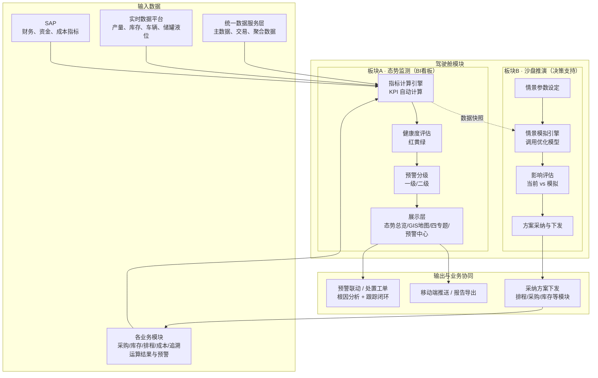

# 驾驶舱模块技术方案

## 1. 模块目标与边界

驾驶舱模块是 SCOS 的战略决策与指挥中枢，通过多层级、可配置、可视化的方式，为管理层至执行层提供「产销—储运—环保—资金」全局供应链状态的"一站式"视图，实现态势感知透明化、决策支持数据化、异常响应实时化。

模块由**两大业务板块**构成：

- **态势监测（BI 看板）**：被动读、实时监测、只读展示，回答"现在怎么样、哪里出了问题"。
- **沙盘推演（决策支持）**：主动交互、假设分析，调用各业务模块优化模型做 what-if，回答"如果这么变会怎样、该怎么选"。

本模块是**消费层/展示层**，只消费统一数据服务层、实时数据平台、SAP 及各业务模块的**数据和运算结果**，自身不采集数据、不维护主数据、不包含优化求解器（沙盘推演通过调用各模块优化模型服务完成 what-if 计算）。

## 2. 主要业务问题

- **信息孤岛**：产销、储运、环保、资金数据分散在 MES、WMS、TMS、SAP 等系统中，管理层难以快速获得全局视图。
- **态势不清**：缺乏实时全局态势，异常靠事后发现、人工汇总，响应滞后。
- **异常无分级**：预警散落各系统，无统一的紧急/警告分级，无法快速判断轻重缓急。
- **根因难定位**：看到 KPI 异常后，需要跨系统人工核对才能定位根因，链路长、易遗漏。
- **决策无量化依据**：情景分析依赖经验或手工测算，无法快速量化"如果需求波动/供应中断/成本变化会怎样"。
- **指标口径不一**：关键指标存在手工录入，口径混乱，难以支撑可信决策。

## 3. 总体技术方案与模块总图

### 3.1 驾驶舱模块总图

### 3.2 两大业务板块

| 维度 | 态势监测（BI 看板） | 沙盘推演（决策支持） |
|---|---|---|
| 业务本质 | 被动读、实时监测、只读展示 | 主动交互、假设分析、调用模型推理 |
| 触发方式 | 数据驱动（自动/定时刷新） | 用户驱动（手动设定情景参数） |
| 是否调用优化模型 | 否（只读各模块已算好的指标） | 是（调用排程/采购/库存/成本模型做 what-if） |
| 是否影响真实业务 | 否（纯只读） | 沙盒内不影响，采纳后才下发 |
| 主要受众 | 全角色（含调度员日常监控） | 管理层（总监/总经理/上级领导） |

两块通过两条"桥"衔接：沙盘基线取自 BI 看板同一份数据快照；沙盘采纳的方案下发为正式方案后，重新进入 BI 看板的监测闭环，构成「监测→决策→执行→再监测」的总循环。

### 3.3 数据获取与指标计算

驾驶舱通过统一数据服务层和实时数据平台的标准 API 获取数据，不直接连接业务系统或生产数据库。

1. 通过统一数据服务层获取主数据、交易数据和聚合分析数据；
2. 通过实时数据平台订阅产量、发货量、储罐液位、产线状态、车辆位置等实时指标；
3. 通过 SAP 获取财务、资金、成本类指标；
4. 通过各业务模块接口获取运算结果与预警事件。

所有指标由指标计算引擎按预置公式**自动计算**，杜绝手工录入。指标计算逻辑见第 4 章。

### 3.4 健康度评估与预警分级

指标计算后，按预置阈值评估节点/指标健康度，映射为红黄绿三色；越界指标触发分级预警。

- **健康度评估**：指标与阈值比较，绿色=正常、黄色=预警、红色=紧急。
- **预警分级**：一级（红色/紧急，如产线故障停机、关键原料断供、重大质量事故）；二级（黄色/警告，如库存低于安全库存、订单交付即将延迟、能耗超标）。

### 3.5 钻取溯源

支持从 KPI 总览到明细业务数据的逐层钻取，快速定位问题根源。钻取链路为「KPI 总览 → 专题视图 → 明细清单 → 源单据/工单」，钻取响应时间不超过 2 秒。

### 3.6 情景模拟与决策支持

提供"沙盘推演"，允许用户修改关键参数并快速看到对全局的影响。预置三类典型情景：需求波动（大客户订单 ±比例）、供应风险（供应商延迟天数）、成本优化（原料价格 ±比例）。模拟在沙盒内进行，不修改正式数据。

## 4. 指标与评估模型

### 4.1 核心 KPI 计算

| KPI | 计算逻辑 | 数据源 | 更新频率 |
|---|---|---|---|
| 今日产销达成率 | 今日实际产量 ÷ 今日计划产量 × 100% | MES / 生产排程 | ≤ 5 秒 |
| 成品库存周转天数 | 平均成品库存数量 ÷ 日均出库量（近 30 日滚动） | WMS / SAP | ≤ 5 秒 |
| 订单准时交付率（OTD） | 按期交付订单数 ÷ 应交付订单总数 × 100%（按期=实际交付日 ≤ 承诺交付日） | SAP / TMS | ≤ 5 秒 |
| 供应链总运营成本 | 采购成本 + 生产成本 + 库存持有成本 + 物流成本 + 环保/能源成本 + 资金占用成本（当日/当月累计） | 成本核算模块 / SAP | ≤ 5 秒（当日）/ ≤ 1 小时（累计） |
| 现金循环周期（CCC） | DIO + DSO − DPO | SAP | ≤ 1 小时 |

现金循环周期：

$$
CCC = DIO + DSO - DPO
$$

其中 DIO 为存货周转天数、DSO 为应收账款周转天数、DPO 为应付账款周转天数。

### 4.2 专题视图指标

**产销协同视图**

| 指标 | 计算逻辑 |
|---|---|
| 需求预测 vs 实际产量 | 每日/每周需求预测值与实际产量对比 |
| 产线排产计划 vs 实际进度 | 各产线计划量、完成量、完成率 |
| 原料库存匹配度 | 玉米淀粉等原料可用库存 ÷ 未来 7 天生产消耗需求 |

**储运效率视图**

| 指标 | 计算逻辑 |
|---|---|
| 全网库存量与库龄 | 原料库/在制品库/成品库库存量，按库龄区间分层 |
| 仓库利用率 | 实际占用 ÷ 有效库容 |
| 车辆满载率 | 实际装载量 ÷ 额定装载量 |
| 平均在途时效 | 在途订单平均运输时长 |

**环保合规视图**

| 指标 | 计算逻辑 |
|---|---|
| 吨产品耗水/耗电/耗汽 | 单耗 = 消耗量 ÷ 产品产量 |
| 废水排放量 / COD / SS / 氨氮 | 实测值，与国家标准限值对比 |

**资金效率视图**

| 指标 | 计算逻辑 |
|---|---|
| 应收/应付账龄 | 按账龄区间（0-30/31-60/61-90/90+ 天）分层 |
| 库存资金占用 | 各物料品类库存量 × 单价 |
| 产品边际贡献率 | （收入 − 变动成本）÷ 收入 |

### 4.3 健康度评估（红黄绿）

对指标/节点按阈值区间映射三色状态：

$$
状态 =
\begin{cases}
红色（紧急）, & 指标达到或超过紧急阈值\\
黄色（预警）, & 指标达到或超过预警阈值、未达紧急阈值\\
绿色（正常）, & 指标在正常区间
\end{cases}
$$

阈值通过管理界面配置（见 7.4），可针对不同指标、不同角色差异化设置。

### 4.4 预警分级规则

| 级别 | 颜色 | 定义 | 典型场景 |
|---|---|---|---|
| 一级 | 红色 | 紧急 | 产线故障停机、关键原料断供、重大质量事故 |
| 二级 | 黄色 | 警告 | 库存低于安全库存、订单交付即将延迟、能耗超标 |

三级及以下提示信息作为辅助提示，不进入紧急预警面板首屏。

### 4.5 情景模拟影响评估

沙盘推演通过调用各业务模块的优化模型服务完成 what-if 计算，不在驾驶舱内重复实现优化求解。模拟流程为：用户设定参数变化 → 调用对应模块模型 → 返回调整后的指标 → 与当前基线对比。

| 情景 | 可调参数 | 调用模型 | 输出影响 |
|---|---|---|---|
| 需求波动 | 大客户订单 ±比例 | 精益生产排程 | 产能、原料库存、交付日期 |
| 供应风险 | 供应商延迟天数 | 采购/排程 | 生产计划调整、是否启动备用供应商 |
| 成本优化 | 原料价格 ±比例 | 采购/成本 | 采购/运营总成本 |

影响评估以「当前 vs 模拟」雷达图/对比图展示，模拟结果不修改正式数据。

## 5. 数据输入

| 数据来源分类 | 输入内容 | 说明 |
|---|---|---|
| 统一数据服务层 | 主数据（物料、客户、供应商）、交易数据（销售订单、生产工单、库存状态）、聚合分析数据 | 指标计算的基础数据，标准化 API |
| 实时数据平台 | 产量、发货量、储罐液位、产线状态、车辆位置 | 实时指标，消息订阅 |
| SAP | 财务、资金、成本类指标 | 资金类指标权威数据源 |
| 采购决策优化模块 | 采购方案、采购执行状态 | 用于产销/资金视图与预警 |
| 安全库存优化模块 | 安全库存、再订货点、库存预警 | 用于储运视图与预警 |
| 精益生产排程模块 | 排产计划、实际进度、工单状态 | 用于产销视图与预警 |
| 统计与成本核算模块 | 成本结构、盈利分析 | 用于资金视图 |
| 全程追溯协同模块 | 质量追溯、质量警报 | 用于预警联动 |
| 数字孪生/厂区管理平台 | 空间元数据、业务态势流 | 三维可视化联动（可选） |
| 各业务模块优化模型服务 | what-if 计算结果 | 沙盘推演调用 |

系统已有数据原则上通过统一数据服务层获取；暂时无法从业务系统取得的数据由业务人员维护。

## 6. 数据输出

| 输出 | 内容 |
|---|---|
| 核心 KPI | 5 个核心 KPI 及环比变化、更新频率 |
| 专题视图指标 | 产销/储运/环保/资金四域指标与图表 |
| 健康度状态 | 各节点/指标的红黄绿状态 |
| 分级预警 | 一级/二级预警清单及触发原因 |
| 钻取链路 | KPI/预警到明细单据的下钻路径 |
| 情景模拟结果 | 当前 vs 模拟的影响对比 |
| 处置工单 | 预警联动的处置动作及闭环状态 |
| 态势报告 | 可导出的驾驶舱态势报告 |

## 7. 运行与接口要求

### 7.1 运行机制

- 关键运营类 KPI（产量、发货量、库存、在途状态）数据延迟不超过 5 秒；
- 战略分析类数据（成本、资金、账龄）更新频率不超过 1 小时；
- 主要视图首次加载不超过 3 秒，数据钻取响应不超过 2 秒；
- 支持至少 50 个并发用户在线操作；
- 指标、健康度阈值、预警规则通过管理界面配置，无需代码修改；
- 驾驶舱只读展示业务数据，不产生业务事务数据（沙盘推演在沙盒内进行）。

### 7.2 数据实时性与性能

| 指标 | 要求 |
|---|---|
| 关键运营类 KPI 延迟 | ≤ 5 秒 |
| 战略分析类数据更新 | ≤ 1 小时 |
| 主要视图首次加载 | ≤ 3 秒 |
| 数据钻取响应 | ≤ 2 秒 |
| 并发用户 | ≥ 50 |
| 数据规模 | 支持 5 年内累计 TB 级业务数据，性能无明显衰减 |

### 7.3 核心接口

- 通过 RESTful API 与统一数据服务层、实时数据平台、SAP 及各业务模块交互；
- 通过实时数据平台消息接口订阅关键实时指标；
- 通过各业务模块优化模型服务接口完成沙盘推演 what-if 计算；
- 向各业务模块下发预警联动与处置工单指令；
- 接收各业务模块的预警事件与处置结果回写；
- 通过数字孪生/厂区管理平台专用 API 获取空间元数据与业务态势流（可选）。

### 7.4 权限与安全

- 基于角色与组织的精细化访问控制，支持到功能菜单、操作按钮及数据行/字段级别；
- 支持与中粮上级管理公司统一身份认证系统集成；
- 成本、资金类敏感数据实现行级、列级权限控制；
- 所有操作留痕，审计日志不可篡改，保留不少于 2 年；
- 移动端提供核心 KPI 监控与预警推送的友好访问。

## 8. 异常与预警

- 指标达到预警/紧急阈值时，系统触发相应级别预警，并在驾驶舱集中展示；
- 一级预警（产线故障停机、关键原料断供、重大质量事故）优先置顶展示；
- 二级预警（库存低于安全库存、订单交付延迟、能耗超标）按时间排序展示；
- 点击预警可一键关联至相关模块（全程追溯/生产排程/采购/库存）进行根因分析；
- 预警可下发处置工单，跟踪处置闭环状态；
- 数据源缺失、过期或状态异常时，驾驶舱以明确占位提示，不展示误导性数据；
- 与部分外部系统（供应商门户、第三方地图服务）连接中断时，核心监控与预警降级运行，基于最新缓存数据继续工作，地图服务中断时保留节点列表与预警展示；
- 情景模拟中模型服务不可用或数据缺失时，提示模拟失败原因，不影响正式业务数据。
