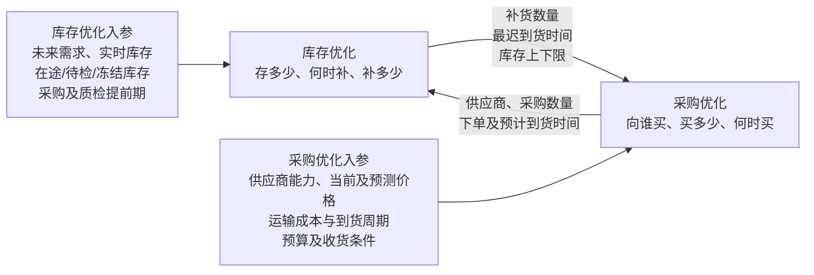
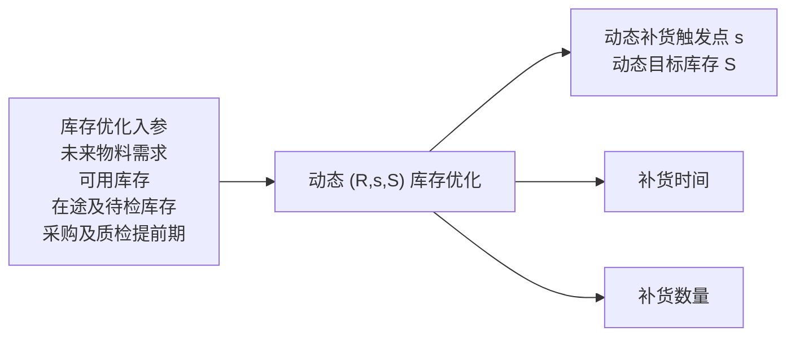
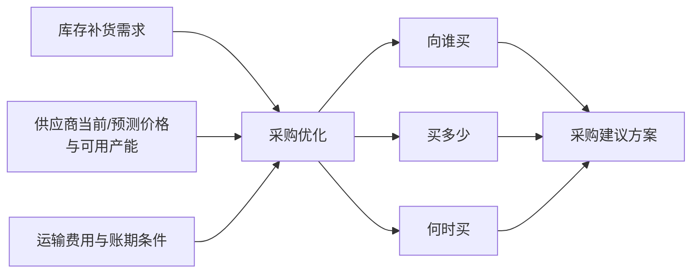

# 糖厂采购与库存优化业务蓝图

## 目录

1. [总体蓝图](#一总体蓝图)
2. [库存优化模块蓝图](#二库存优化模块蓝图)
   - [订单驱动的库存优化逻辑](#22-订单驱动的库存优化逻辑)
   - [库存优化核心模型](#24-库存优化核心模型)
   - [业务视角总结](#28-业务视角总结)
3. [采购优化模块蓝图](#三采购优化模块蓝图)
   - [采购优化核心模型](#33-采购优化核心模型)
   - [大宗商品价格预测](#34-大宗商品价格预测)
   - [双触发与择时采购](#35-双触发与择时采购)
   - [业务视角总结](#37-业务视角总结)
4. [算法数据需求](#四算法数据需求)
5. [建设原则](#五建设原则)

## 一、总体蓝图

围绕糖厂原料、辅料、包装材料等物资，建设相互独立、双向联动的库存优化与采购优化能力。系统以生产物料需求为牵引，由库存优化确定合理库存及补货需求，再由采购优化形成供应商、采购数量和下单时间方案，采购结果返回库存侧进行保障能力复核。

> 在保障连续生产和订单交付的前提下，合理控制库存水平，优化供应商及采购数量分配，降低采购综合成本和库存资金占用。

### 1.1 模块定位

| 模块 | 核心决策 | 主要输出 |
|---|---|---|
| 库存优化 | 应该存多少、何时补、补多少 | 安全水位、补货时点、补货数量、最迟到货时间及库存风险 |
| 采购优化 | 向谁买、买多少、何时买 | 供应商组合、采购分配数量、下单时间及低价择时建议 |
| 联动校验 | 采购方案能否满足库存和生产要求 | 缺料、延期、超储、临期及库容风险 |

库存优化负责确定库存策略和补货需求，不选择供应商；采购优化在库存边界内形成常规补货或低价择时采购方案，不重新计算安全库存。采购到货计划返回库存模块复核，构成业务闭环。

### 1.2 库存与采购联动图

### 1.3 联动运行逻辑

1. **库存决策**：库存模块根据未来需求、实时库存、有效在途和提前期，计算合理库存水平、补货时间和补货数量；
2. **采购决策**：采购模块根据补货需求、价格预测以及供应商能力和成本条件，确定向谁买、买多少、何时买；
3. **结果回传**：采购模块将下单及预计到货计划返回库存模块，更新未来库存；
4. **闭环校验**：库存模块校验是否存在缺料、超储或延期风险，存在冲突时反馈采购模块调整方案。

### 1.4 日滚动机制

系统每天在完成数据完整性和一致性校验后，根据最新业务数据进行滚动计算：

- 校验未来需求、实际库存、在途和待检数据是否完整、及时、可信；
- 更新销售订单和生产排程；
- 更新实际库存、在途、待检和冻结库存；
- 更新物料实际单耗；
- 重新计算未来物料需求和库存曲线；
- 识别需要补货的物料；
- 生成或调整采购建议；
- 对采购到货计划进行库存复核。

对未来 1～3 天已经确认或发运的采购订单设置冻结期，原则上不自动调整，避免日滚动计算造成采购订单频繁变化。

---

## 二、库存优化模块蓝图

### 2.1 模块定位

库存优化模块以销售订单和生产计划为需求来源，结合产品 BOM、实际单耗、当前库存、在途库存和采购提前期，动态计算各类物料合理的库存水平和补货需求。

模块重点回答三个问题：

1. 应该存多少；
2. 什么时候需要补；
3. 每次需要补多少。

库存优化的主要对象包括：

- 玉米、商品淀粉等主原料；
- 酶制剂、活性炭、助滤剂、离子交换树脂、酸碱等辅料；
- 包装袋、标签、托盘等包装材料；
- 影响连续生产的关键备品备件。

对于生产物料，需求主要来自销售订单对应的生产计划，不以独立市场预测作为主要计算依据。

### 2.2 订单驱动的库存优化逻辑

基本计算过程为：

1. 将销售订单转换为生产计划；
2. 根据产品 BOM 和实际单耗展开物料需求；
3. 扣除当前可用库存和有效在途库存；
4. 考虑采购、运输和质检所需时间；
5. 计算未来每日库存变化；
6. 判断库存何时低于安全水平；
7. 形成补货数量和最迟到货时间；
8. 将补货需求传递给采购优化模块。

### 2.3 库存数量口径

库存优化不能只使用账面库存，应区分：

- 账面库存；
- 实物库存；
- 可用库存；
- 已分配库存；
- 质检冻结库存；
- 质量异常库存；
- 在途库存；
- 已确认但尚未到货的采购量。

可用库存可表示为：

$$
可用库存
=
现有库存
-已分配库存
-质检冻结库存
-质量异常库存
$$

预计可用量为：

$$
预计可用量
=
可用库存
+有效在途库存
$$

其中，有效在途库存需要考虑预计到货时间、供应商履约情况以及到货质检状态。

### 2.4 库存优化核心模型

库存优化采用按日复核的 **动态 \((R,s,S)\) 策略**。该策略能够直接回答“什么时候检查、什么时候补、补到多少”，与本项目按日滚动、订单驱动的业务方式相匹配。

#### 2.4.1 选择动态 \((R,s,S)\) 策略的原因

糖厂生产物料具有消耗连续、停线影响大、采购及质检存在提前期等特点。与此同时，本项目以订单和生产计划驱动物料需求，需求量具有较好的计划基础，但实际单耗、到货时间和质检结果仍存在波动。

动态 \((R,s,S)\) 策略能够把确定的计划需求与必要的安全缓冲结合起来，在每日滚动中同时解决库存水位、补货时点和补货数量问题，适合作为库存优化模块的主体策略。

选择该策略的主要原因如下：

| 对比维度 | 固定安全库存或人工上下限 | 动态 \((R,s,S)\) 策略 |
|---|---|---|
| 与生产需求联动 | 参数长期固定，容易滞后 | 根据未来订单和生产计划每日更新 |
| 补货时点 | 依赖人工判断 | 库存位置达到 \(s\) 时自动触发 |
| 补货数量 | 通常按经验确定 | 按目标水位 \(S\) 自动计算 |
| 在途库存处理 | 容易遗漏或重复计算 | 统一纳入库存位置 |
| 风险缓冲 | 难以反映供应和单耗变化 | 通过安全库存动态吸收波动 |
| 业务解释性 | 依赖个人经验 | 参数含义清晰，便于维护和验收 |

其核心原理可以概括为：

> 每天复核一次库存；当库存位置下降到补货触发点 \(s\) 时，提出补货建议，将库存恢复到目标水平 \(S\)。

其中，\(s\) 保障采购提前期内不断料，\(S\) 在此基础上覆盖下一复核周期的需求。三项参数随着生产计划、实际库存、在途和提前期动态更新，因此比固定安全库存更贴近糖厂实际运行。

#### 2.4.2 策略定义

- **\(R\)：复核周期**。本项目按日滚动，设置 \(R=1\) 天；
- **\(s\)：补货触发点**。库存位置低于或等于 \(s\) 时触发补货；
- **\(S\)：目标库存水平**。触发补货后，将库存补充到 \(S\) 对应的水平。

库存位置综合考虑当前可用库存、有效在途和已经占用的需求：

$$
库存位置
=
可用库存
+有效在途库存
-已分配及待满足需求
$$

系统每日复核库存位置：

$$
当\ 库存位置 \leq s\ 时，触发补货
$$

$$
建议补货量
=
S
-库存位置
$$

因此，\(s\) 决定“何时补”，\(S\) 决定“补多少”。

#### 2.4.3 补货触发点 \(s\)——何时补

补货触发点应覆盖采购总提前期内的确定生产需求，并保留必要的安全缓冲：

$$
s
=
采购提前期内的计划物料需求
+安全库存
$$

采购总提前期包括内部审批、供应商备货、运输、到厂卸货和质检放行时间。

安全库存主要用于应对：

- 实际单耗高于计划；
- 正常生产损耗变化；
- 供应商到货时间波动；
- 到货质检不合格；
- 生产计划小幅调整。

安全库存可概念化表示为：

$$
安全库存
=
保障系数
\times
单耗及供应波动
$$

当库存位置预计在采购提前期内下降至 \(s\) 时，系统生成补货需求，并反向计算最迟下单时间：

$$
最迟下单时间
=
物料需要日期
-采购总提前期
$$

#### 2.4.4 目标库存水平 \(S\)——存多少

目标库存水平应覆盖“采购提前期 + 下一复核周期”内的计划需求，并包含安全库存：

$$
S
=
提前期及复核周期内的计划物料需求
+安全库存
$$

由于本项目按日复核，\(R=1\) 天。\(S\) 不是长期固定值，而是根据未来订单、生产计划、实际单耗和采购提前期每日更新。

同时，\(S\) 不能突破以下边界：

- 仓库、筒仓或储罐容量；
- 物料保质期内的预计消耗能力；
- 库存资金控制要求；
- 物料最大库存天数；
- 已确认采购订单形成的未来到货量。

不同物料采用差异化参数：

| 物料类型 | \((R,s,S)\) 策略侧重点 |
|---|---|
| 缺货会造成停线的关键物料 | 提高安全缓冲，优先保障连续生产 |
| 稳定消耗的主原料 | 按生产计划和采购提前期动态设置 \(s\) 与 \(S\) |
| 可替代的一般辅料 | 结合替代能力适度降低安全缓冲 |
| 高价值物料 | 控制 \(S\)，降低库存资金占用 |
| 易过期物料 | 根据保质期和未来消耗限制 \(S\) |
| 专用包装材料 | 按对应订单和生产计划设置需求覆盖范围 |

#### 2.4.5 建议补货量——补多少

当库存位置达到补货触发点 \(s\) 时：

$$
建议补货量
=
S
-库存位置
$$

库存模块向采购模块输出：

- 最小补货量：保证生产不发生缺料；
- 建议补货量：按照 \((R,s,S)\) 策略补充至目标库存；
- 最大补货量：受库容、保质期和库存资金限制的上限；
- 最迟到货时间：补货必须完成并通过质检的日期。

采购模块可以在该数量区间内，结合供应商供货能力、最低起订量和运输批量确定最终采购数量。采购结果返回后，库存模块按未来到货计划重新计算库存位置和库存轨迹。

#### 2.4.6 模型选型说明

常规库存决策不需要使用 MILP。动态 \((R,s,S)\) 策略即可完成单物料的合理库存、补货触发和补货数量计算，规则清晰、易于解释，也便于甲方业务人员维护和验收。

以下少数强耦合场景，可进入库存与采购的联合协调模型：

- 多种物料共同占用有限仓储容量；
- 多种关键物料共同受到采购预算限制；
- 物料之间存在复杂替代关系；
- 最低起订量或运输批量与库存上限发生冲突；
- 需要在缺料风险、库存成本和采购成本之间进行整体权衡。

在这些例外场景中，MILP 用于协调共享约束；日常库存策略仍由动态 \((R,s,S)\) 模型负责。采购模块则可使用 MILP 完成供应商选择、采购数量分配和下单时间优化。

### 2.5 库存优化目标

库存优化的第一目标是保障订单对应的生产计划能够正常执行，第二目标是在满足生产的前提下控制库存。

库存优化目标可表示为：

$$
库存综合成本
=
库存持有成本
+缺料损失
+紧急补货成本
+积压及过期成本
$$

具体目标包括：

- 保证关键物料不断料；
- 满足销售订单对应的生产需求；
- 降低库存资金占用；
- 降低超储、呆滞和过期；
- 减少紧急采购；
- 减少因库存不足造成的排程调整；
- 保持库存策略相对稳定。

### 2.6 库存优化主要约束

库存模型主要考虑：

- 销售订单和生产计划；
- 产品 BOM 及实际单耗；
- 当前可用库存；
- 在途及待检库存；
- 安全库存要求；
- 采购、运输和质检提前期；
- 仓库、筒仓和储罐容量；
- 物料保质期；
- 物料替代关系；
- 已确认采购订单；
- 库存资金限制；
- 冻结期内生产计划和采购订单。

### 2.7 库存模块主要输出

| 输出 | 内容 |
|---|---|
| 合理库存水平 | 每种物料当前应保持的合理库存 |
| 安全库存 | 应对单耗、损耗和供应波动的缓冲量 |
| 库存可支撑天数 | 当前库存能够支持生产的天数 |
| 补货触发日期 | 预计需要启动补货的日期 |
| 最迟下单日期 | 为保障生产必须下单的最晚日期 |
| 最迟到货日期 | 物料必须到厂并完成质检的日期 |
| 最小补货量 | 避免生产缺料所需的最低数量 |
| 建议补货量 | 综合保供和库存成本后的推荐数量 |
| 最大补货量 | 受库容和保质期限制的最大数量 |
| 风险预警 | 缺料、延期、超储、临期及冻结风险 |

### 2.8 业务视角总结

| 业务视角 | 内容 |
|---|---|
| 业务提供 | 未来物料需求、当前可用库存、在途及待检库存、采购提前期和仓储限制 |
| 系统决策 | 动态计算补货触发点 \(s\)、目标库存 \(S\)、补货时间和补货数量 |
| 业务获得 | 看清库存还能支撑多久、何时可能缺料，以及应该在什么时间补充多少物料 |
| 后续衔接 | 将建议补货量、库存上下限和时间要求传递给采购优化模块 |

---

## 三、采购优化模块蓝图

### 3.1 模块定位

采购优化模块以库存优化模块输出的补货需求、库存边界以及大宗商品价格机会信号为输入，结合供应商价格、可用产能、运输费用及账期条件，建立混合整数线性规划（MILP）模型，形成总成本最低的采购方案。

采购优化重点回答三个问题：

1. 向谁买；
2. 买多少；
3. 何时买。

采购模块不重新计算安全库存，也不改变生产物料需求，而是在库存模块给出的库存上下限内，统一确定供应商、采购数量和采购日期。

### 3.2 采购优化业务逻辑

采购模块运行过程为：

1. 接收未来需求、当前库存、库存上下限、供应商采购条件及价格预测信号；
2. 通过 MILP 统一优化供应商选择、采购数量和采购日期；
3. 输出最低成本采购方案及每日库存变化；
4. 将采购计划返回库存模块进行库存边界复核。

### 3.3 采购优化核心模型

#### 3.3.1 建模范围

模型按“物料—供应商—日期”进行采购决策，以库存优化模块给出的未来需求和库存边界为基础，在供应商可用产能范围内选择总成本最低的采购组合。

到货时间不作为核心硬约束，也不设置延期惩罚成本。模型仅使用供应商标准提前期，将采购日期换算为预计入库日期，供库存平衡计算和业务人员参考。

#### 3.3.2 符号定义

**集合与索引**

| 符号 | 含义 |
|---|---|
| \(i\) | 物料 |
| \(j\) | 供应商 |
| \(t\) | 计划日期 |

**主要参数**

| 符号 | 含义 |
|---|---|
| \(d_{it}\) | 物料 \(i\) 在日期 \(t\) 的计划需求量 |
| \(c_{ijt}\) | 供应商 \(j\) 在日期 \(t\) 的当期或预测采购单价 |
| \(f_{ijt}\) | 单位采购量对应的运输费用 |
| \(F_{ijt}\) | 启动一次采购或运输的固定费用 |
| \(a_{ijt}\) | 不同付款账期折算的单位账期成本 |
| \(h_i\) | 物料单位库存持有成本 |
| \(U_{ijt}\) | 供应商在当日可提供的最大数量 |
| \(M_{ij}\) | 供应商最低起订量 |
| \(L_{ij}\) | 供应商标准采购提前期 |
| \(I^{min}_{it}\) | 库存优化模块给出的最低库存边界 |
| \(I^{max}_{it}\) | 库存优化模块给出的最高库存边界 |

**决策变量**

| 符号 | 含义 |
|---|---|
| \(x_{ijt}\) | 日期 \(t\) 向供应商 \(j\) 采购物料 \(i\) 的数量 |
| \(y_{ijt}\) | 日期 \(t\) 是否向供应商 \(j\) 采购物料 \(i\)，取 0 或 1 |
| \(I_{it}\) | 日期 \(t\) 结束时物料 \(i\) 的预计库存 |

#### 3.3.3 目标函数

模型目标为采购计划期内的综合成本最小：

$$
\min Z
=
采购成本
+库存持有成本
+运输成本
+账期成本
$$

数学表达为：

$$
\min Z
=
\sum_{i,j,t} c_{ijt}x_{ijt}
+\sum_{i,t} h_i I_{it}
+\sum_{i,j,t}\left(f_{ijt}x_{ijt}+F_{ijt}y_{ijt}\right)
+\sum_{i,j,t} a_{ijt}x_{ijt}
$$

其中，账期成本用于将不同付款条件折算到同一成本口径；运输成本同时考虑随采购数量变化的运费和整车、整批采购产生的固定费用。

#### 3.3.4 主要约束

**1. 库存平衡约束**

每日库存由上期库存、当期采购量和当期需求共同决定：

$$
I_{it}
=
I_{i,t-1}
+\sum_j x_{ij,t-L_{ij}}
-d_{it}
$$

其中，日期 \(t-L_{ij}\) 下达的采购量，按照标准提前期在日期 \(t\) 进入可用库存。该约束保证采购数量与未来物料需求在时间上保持一致，但不额外考虑到货延期惩罚。

**2. 供应商可用产能约束**

$$
0
\leq
x_{ijt}
\leq
U_{ijt}y_{ijt}
$$

采购数量不得超过供应商在对应日期可提供的数量；未选择该供应商时，采购量为零。

**3. 最低起订量约束**

$$
M_{ij}y_{ijt}
\leq
x_{ijt}
$$

一旦选择某供应商，采购数量应满足其最低起订量要求。

**4. 库存边界约束**

$$
I^{min}_{it}
\leq
I_{it}
\leq
I^{max}_{it}
$$

其中，最低库存边界用于保障生产连续性，最高库存边界用于控制仓储容量、库存资金占用和物料积压风险。该边界由库存优化模块基于动态 \((R,s,S)\) 策略提供。

**5. 供应商准入约束**

只有通过物料供应资质和质量认证的供应商才能进入候选范围；未通过准入的供应商，其采购量固定为零。

**6. 变量约束**

$$
x_{ijt}\geq0,\qquad I_{it}\geq0,\qquad y_{ijt}\in\{0,1\}
$$

由于模型同时包含连续采购量和是否采购的 0—1 决策变量，因此属于混合整数线性规划（MILP）模型。

### 3.4 大宗商品价格预测

对于玉米、商品淀粉等价格波动较大的物料，建设大宗商品价格预测能力，为采购时点选择提供参考。

**主要输入**

- 历史采购价格和市场现货价格；
- 期货价格及基差；
- 季节性供需变化；
- 与价格相关的主要市场因素。

**预测方法**

价格预测可采用组合模型：ARIMA-GARCH用于识别价格趋势和波动特征，LightGBM/XGBoost用于融合期货、基差及其他市场因素。不同模型的结果进行组合，降低依赖单一模型带来的偏差。

**主要输出**

- 未来价格预测区间；
- 价格上涨、下跌或震荡趋势；
- 当前价格所处的相对位置；
- 预测结果的置信度；
- 供采购MILP使用的分日期预测价格 \(c_{ijt}\)。

价格预测只提供决策信号，不直接生成采购订单。预测结果进入采购优化模型后，与库存持有成本、资金成本及库存边界共同计算。

### 3.5 双触发与择时采购

对于价格波动较大的物料，可在库存水位触发之外增加“价格机会触发”。

采购模块采用双触发机制：

1. **库存触发**：当库存位置达到补货触发点 \(s\) 时，为保障生产发起采购建议；
2. **价格触发**：即使库存尚未达到 \(s\)，当当前价格明显低于未来预测价格，且提前采购具有净收益时，也可以发起择时采购建议。

择时采购的判断原则为：

$$
择时采购收益
=
未来预测价格
-当前采购价格
-提前持有成本
-提前资金成本
-预测风险缓冲
$$

当价格预测达到设定置信要求，且择时采购收益高于阈值时，MILP 可以选择提前采购。由于目标函数已经同时考虑分日期采购价格、库存持有成本和账期成本，模型会自动比较“现在低价采购”与“以后按需采购”的总成本差异。

价格机会触发不等于无上限囤货，仍应满足：

- 采购后库存不超过库存上限和仓储容量；
- 采购数量能够在合理周期内被生产消耗；
- 不突破保质期和库存资金控制要求；
- 不超过供应商可用产能；
- 最终采购建议由业务人员确认后执行。

通过该机制，采购模块既能在库存不足前保障生产，也能在价格相对低位时形成提前采购建议。

### 3.6 采购模块主要输出

| 输出 | 内容 |
|---|---|
| 推荐供应商 | 建议采购的供应商及推荐理由 |
| 供应商采购分配 | 各供应商分别采购多少 |
| 建议下单日期 | 应在何时启动采购 |
| 预计到货日期 | 根据采购日期和供应商提前期推算的参考日期 |
| 预计库存 | 采购方案执行后的每日库存变化 |
| 采购综合成本 | 采购、库存持有、运输及账期成本 |
| 择时采购建议 | 当前价格处于相对低位时的提前采购数量及成本收益 |
| 备选方案 | 在供应商产能变化情况下的替代采购组合 |

### 3.7 业务视角总结

| 业务视角 | 内容 |
|---|---|
| 业务提供 | 库存补货需求、当前及预测价格、供应商可用产能、最低起订量、运输费用和账期条件 |
| 系统决策 | 在库存边界和供应商产能约束下，确定向谁买、买多少、何时买，并识别低价提前采购机会 |
| 业务获得 | 总成本最低的采购组合、建议下单日期、采购后的预计库存及择时采购建议 |
| 业务使用 | 作为采购计划编制和采购审批的量化决策依据，并返回库存模块复核 |

---

## 四、算法数据需求

本阶段只梳理库存优化和采购优化直接需要的核心数据，具体字段及接口在后续详细设计阶段确定。

### 4.1 库存优化所需数据

| 数据主题 | 主要数据 |
|---|---|
| 未来物料需求 | 物料、需求日期、每日需求量 |
| 库存状态 | 现有库存、可用库存、已分配库存、冻结及待检库存 |
| 在途库存 | 在途数量、预计到货日期、订单状态 |
| 提前期 | 采购、运输和质检放行所需时间 |
| 策略参数 | 复核周期 \(R\)、服务水平或保障系数、单耗及提前期波动 |
| 库存限制 | 仓储容量、管理规定的最低/最高库存、最大库存天数、保质期和库存持有成本 |
| 历史数据 | 历史消耗、实际单耗、历史到货时间和缺料记录 |

未来物料需求应按“物料—日期”形成每日需求量；历史数据用于校准安全库存和采购提前期。

### 4.2 采购优化所需数据

| 数据主题 | 主要数据 |
|---|---|
| 库存侧输入 | 未来需求、期初库存、最低库存和最高库存 |
| 供应商信息 | 供应商、可供物料、准入状态 |
| 采购价格 | 物料、供应商、当前采购单价及有效期 |
| 市场价格数据 | 历史现货、期货、基差及未来预测价格 |
| 可用产能 | 各供应商每日或周期最大可供数量 |
| 采购批量 | 最低起订量、订单倍数 |
| 运输成本 | 单位运费和固定车次或批次费用 |
| 账期条件 | 付款方式、账期天数和资金成本率 |
| 标准提前期 | 供应商备货、运输和质检时间 |
| 已有订单 | 已下单数量、预计到货时间和订单状态 |

价格、运费、账期和计量单位需要统一口径，保证不同供应商方案可以直接比较。

### 4.3 数据来源与基本要求

相关数据主要来自 ERP/SAP、MES、WMS、LIMS/QMS、TMS、SRM、财务系统及外部大宗商品行情数据。

数据准备重点保证：

- 物料、供应商和计量单位编码一致；
- 可用、冻结、待检和在途库存口径清晰；
- 采购价格、运费、账期成本口径统一；
- 库存、订单和到货状态能够满足每日滚动计算要求。

---

## 五、建设原则

1. **模块独立**：库存优化和采购优化分别建设、分别运行、分别验收；
2. **数据联动**：库存补货需求进入采购模块，采购到货计划返回库存模块；
3. **订单驱动**：以销售订单、生产计划和实际单耗作为生产物料需求的主要来源；
4. **日度滚动**：每日根据最新业务数据更新库存和采购建议；
5. **业务可解释**：所有建议均说明计算依据、约束条件和风险原因；
6. **人工确认**：采购申请、采购订单及订单变更由业务人员审批后执行；
7. **异常可降级**：当部分数据缺失时，使用已确认计划和业务规则形成保守建议，避免影响生产。

最终形成以下管理模式：

> 库存优化根据销售订单和生产计划，决定“应该存多少、何时补、补多少”；采购优化在库存要求下，决定“向谁买、买多少、何时买”；采购结果返回库存模块进行库存轨迹和生产保障复核。
